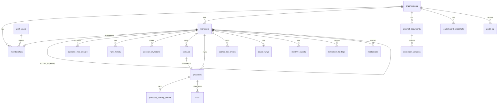

# 01 — Complete Database Schema (Canonical Foundation)

> **Status:** Architecture-validation phase. No application code. This document is the
> single source of truth for all table names, column names, enum values, constraints,
> and relationships. Every other architecture document (RLS policies, API surface,
> analytics engine, frontend data contracts) references the exact identifiers defined here.
>
> **Platform:** Supabase — Postgres 15, Supabase Auth (`auth.users`), Row-Level Security,
> Edge Functions, Realtime, `pg_cron`.
>
> **Multi-tenancy:** every tenant table carries `org_id uuid`. Isolation is enforced by RLS
> keyed on the JWT claim `org_id`. No cross-org access is possible at the database layer.
>
> **Genealogy:** TRUE binary tree. Each marketer has at most one `LEFT` and one `RIGHT`
> placement child. Subtree aggregation backed by a **closure table** + an **ltree
> materialized path**.

---

## 0. Conventions (applied consistently across every table)

| Convention | Rule |
|---|---|
| Table names | `snake_case`, **plural** (`marketers`, `contacts`, `calls`). |
| Column names | `snake_case`. |
| Primary keys | `id uuid PRIMARY KEY DEFAULT gen_random_uuid()` unless the table is a pure junction with a composite PK. |
| Timestamps | `created_at timestamptz NOT NULL DEFAULT now()`, `updated_at timestamptz NOT NULL DEFAULT now()` (refreshed by trigger `set_updated_at`). |
| Soft delete | `deleted_at timestamptz NULL` on tables where history must survive deletion. Active rows = `deleted_at IS NULL`. |
| Tenant key | `org_id uuid NOT NULL REFERENCES organizations(id)` on every tenant table. |
| Fixed value sets | Postgres `ENUM` types for stable canonical domains (ranks, stages, statuses); `CHECK` constraints for small booleans-with-meaning. |
| Domain values | **Canonical Italian** snake_case where the business defines them (prospect stages, why-categories). System-level enums (`LEFT`/`RIGHT`, statuses) stay English for code clarity but render in Italian via `next-intl`. |
| Money | `numeric(14,2)` (never float). |
| Audit columns | `created_by uuid`, `updated_by uuid` reference `marketers(id)` (the acting profile), nullable for system actions. |

### Required extensions

```sql
CREATE EXTENSION IF NOT EXISTS pgcrypto;   -- gen_random_uuid()
CREATE EXTENSION IF NOT EXISTS ltree;      -- materialized genealogy path
CREATE EXTENSION IF NOT EXISTS btree_gist; -- exclusion / composite gist indexes
CREATE EXTENSION IF NOT EXISTS pg_trgm;    -- fuzzy contact/marketer search
CREATE EXTENSION IF NOT EXISTS pg_cron;    -- scheduled rollups & monthly reports
```

### Entity-group map



---

## GROUP 1 — Tenancy & Identity

### Enum types (Group 1)

```sql
CREATE TYPE membership_role AS ENUM (
  'owner',     -- org founder / billing owner
  'admin',     -- full org visibility + management
  'manager',   -- elevated, can manage assigned subtrees (reserved)
  'member'     -- standard marketer user; visibility limited to own subtree
);

CREATE TYPE membership_status AS ENUM (
  'active',
  'invited',
  'suspended',
  'disabled'
);
```

### 1.1 `organizations`

**Purpose:** the tenant root. Every other tenant row points here. One organization = one network-marketing company instance.

| Column | Type | Null | Default | Notes |
|---|---|---|---|---|
| `id` | uuid | NO | `gen_random_uuid()` | **PK** |
| `name` | text | NO | | Legal/display name |
| `slug` | text | NO | | URL-safe, **UNIQUE** |
| `locale` | text | NO | `'it'` | Default UI locale |
| `timezone` | text | NO | `'Europe/Rome'` | For report windows / cron |
| `settings` | jsonb | NO | `'{}'` | Feature flags, branding, rank thresholds |
| `created_at` | timestamptz | NO | `now()` | |
| `updated_at` | timestamptz | NO | `now()` | |
| `deleted_at` | timestamptz | YES | | Soft delete |

Constraints: `PK(id)`, `UNIQUE(slug)`, `CHECK (char_length(slug) BETWEEN 2 AND 63)`.

### 1.2 `memberships`

**Purpose:** the **account link** — binds a Supabase `auth.users` row to ONE `marketers` profile within an org, and carries the org-level role. This is the only place identity (login) and profile meet. Activating CRM access creates/activates this row; it **never** duplicates the marketer profile.

| Column | Type | Null | Default | Notes |
|---|---|---|---|---|
| `id` | uuid | NO | `gen_random_uuid()` | **PK** |
| `org_id` | uuid | NO | | **FK** → `organizations(id)` |
| `user_id` | uuid | YES | | **FK** → `auth.users(id)`. NULL while invited-but-not-yet-signed-up |
| `marketer_id` | uuid | NO | | **FK** → `marketers(id)`. The profile this account controls |
| `role` | membership_role | NO | `'member'` | Org-level RBAC |
| `status` | membership_status | NO | `'invited'` | |
| `permissions` | jsonb | NO | `'{}'` | Fine-grained overrides (e.g. `{"crm_access": true}` for an admin-enabled Executive) |
| `last_login_at` | timestamptz | YES | | |
| `created_at` | timestamptz | NO | `now()` | |
| `updated_at` | timestamptz | NO | `now()` | |
| `deleted_at` | timestamptz | YES | | |

Constraints:
- `PK(id)`
- `UNIQUE(org_id, marketer_id)` — one account link per profile.
- `UNIQUE(org_id, user_id)` — a given login maps to exactly one profile per org (partial: `WHERE user_id IS NOT NULL`).
- `FK(org_id)`, `FK(marketer_id)`, `FK(user_id → auth.users)`.

**RLS keys on:** `org_id` (tenant), plus `user_id = auth.uid()` for "is this my own membership". The membership row is also how we resolve, on login, the caller's `marketer_id` for closure-based visibility checks.

> **JWT note:** `org_id`, `marketer_id`, and `role` are stamped into the JWT via a custom access-token hook (Supabase Auth Hook) reading from `memberships`. RLS policies read these from `auth.jwt()` rather than re-joining on every query.

---

## GROUP 2 — Marketer Core (profiles, binary genealogy, ranks)

### Enum types (Group 2)

```sql
-- Ordered rank ladder. Order is defined explicitly in ranks_meta, not by enum
-- physical order, but the enum guarantees only valid values are stored.
CREATE TYPE marketer_rank AS ENUM (
  'executive',              -- Executive          (no CRM access by default)
  'consultant',             -- Consultant
  'team_leader',            -- Team Leader
  'senior_team_leader',     -- Senior Team Leader
  'executive_team_leader',  -- Executive Team Leader
  'vice_president'          -- Vice President
);

CREATE TYPE marketer_status AS ENUM (
  'active',
  'inactive',
  'pending',     -- pre-registered profile, not yet onboarded
  'suspended'
);

CREATE TYPE placement_leg AS ENUM ('LEFT', 'RIGHT');
```

### 2.0 `ranks_meta` (reference / ordering table)

**Purpose:** gives each rank a numeric order and the canonical Italian label + CRM-eligibility flag, so application code never hard-codes the ladder. Seeded once per deployment (global, not tenant-scoped) but may be overridden per org via `organizations.settings`.

| Column | Type | Null | Default | Notes |
|---|---|---|---|---|
| `rank` | marketer_rank | NO | | **PK** |
| `sort_order` | smallint | NO | | 1=executive … 6=vice_president |
| `label_it` | text | NO | | Italian display label |
| `crm_eligible` | boolean | NO | `false` | true for consultant..vice_president; false for executive |

```sql
INSERT INTO ranks_meta (rank, sort_order, label_it, crm_eligible) VALUES
  ('executive',             1, 'Executive',              false),
  ('consultant',            2, 'Consultant',             true),
  ('team_leader',           3, 'Team Leader',            true),
  ('senior_team_leader',    4, 'Senior Team Leader',     true),
  ('executive_team_leader', 5, 'Executive Team Leader',  true),
  ('vice_president',        6, 'Vice President',          true);
```

### 2.1 `marketers` — the profile entity (core of the model)

**Purpose:** the **marketer profile**. Exists independently of any login (pre-registration). Carries hierarchy (placement + sponsorship), rank, status, contacts/documents/notes ownership. A `memberships` row later attaches an `auth.users` account WITHOUT recreating this profile — preserving `id`, genealogy, history, and all owned data.

#### Full DDL

```sql
CREATE TABLE marketers (
  id                 uuid PRIMARY KEY DEFAULT gen_random_uuid(),
  org_id             uuid NOT NULL REFERENCES organizations(id) ON DELETE CASCADE,

  -- Identity (profile-level; login lives in memberships/auth.users)
  first_name         text NOT NULL,
  last_name          text NOT NULL,
  display_name       text GENERATED ALWAYS AS (first_name || ' ' || last_name) STORED,
  email              text,            -- contact email on the profile; NOT the login credential
  phone              text,
  external_code      text,            -- the company's own marketer/affiliate code

  -- Binary placement genealogy
  parent_id          uuid REFERENCES marketers(id) ON DELETE RESTRICT, -- placement upline; NULL only for org root
  leg                placement_leg,   -- which leg of parent this node occupies; NULL only for org root
  sponsor_id         uuid REFERENCES marketers(id) ON DELETE SET NULL, -- who actually recruited (may differ from parent_id due to spillover)

  -- Materialized path for O(index) subtree/branch queries
  path               ltree NOT NULL,  -- e.g. 'root.<uuid_label>.<uuid_label>' ; maintained by trigger

  -- Rank & status
  rank               marketer_rank   NOT NULL DEFAULT 'executive',
  status             marketer_status NOT NULL DEFAULT 'pending',

  -- Profile metadata
  registration_date  date NOT NULL DEFAULT current_date,
  notes              text,
  avatar_url         text,

  -- Audit
  created_by         uuid REFERENCES marketers(id),
  updated_by         uuid REFERENCES marketers(id),
  created_at         timestamptz NOT NULL DEFAULT now(),
  updated_at         timestamptz NOT NULL DEFAULT now(),
  deleted_at         timestamptz,

  -- Binary-tree integrity
  CONSTRAINT marketers_leg_requires_parent
    CHECK ((parent_id IS NULL AND leg IS NULL) OR (parent_id IS NOT NULL AND leg IS NOT NULL)),
  CONSTRAINT marketers_no_self_parent
    CHECK (parent_id IS NULL OR parent_id <> id),
  CONSTRAINT marketers_no_self_sponsor
    CHECK (sponsor_id IS NULL OR sponsor_id <> id)
);

-- ONE LEFT + ONE RIGHT child per parent, scoped to org. This is the binary constraint.
CREATE UNIQUE INDEX marketers_one_child_per_leg
  ON marketers (org_id, parent_id, leg)
  WHERE parent_id IS NOT NULL AND deleted_at IS NULL;

-- Exactly one root per org (the only row with NULL parent_id)
CREATE UNIQUE INDEX marketers_single_root_per_org
  ON marketers (org_id)
  WHERE parent_id IS NULL AND deleted_at IS NULL;

CREATE UNIQUE INDEX marketers_external_code_uq
  ON marketers (org_id, external_code)
  WHERE external_code IS NOT NULL AND deleted_at IS NULL;

-- Genealogy access indexes
CREATE INDEX marketers_path_gist     ON marketers USING gist (path);
CREATE INDEX marketers_parent_idx    ON marketers (org_id, parent_id);
CREATE INDEX marketers_sponsor_idx   ON marketers (org_id, sponsor_id);
CREATE INDEX marketers_rank_status   ON marketers (org_id, rank, status);
CREATE INDEX marketers_name_trgm     ON marketers USING gin (display_name gin_trgm_ops);
```

**Key columns explained**

| Column | Why it exists |
|---|---|
| `parent_id` + `leg` | Define the **true binary placement tree**. `leg` says whether this node sits in the parent's LEFT or RIGHT leg. |
| `sponsor_id` | The recruiter. Separate from `parent_id` because **spillover** places a recruit under a different upline than the one who recruited them. |
| `path` (ltree) | Materialized root-to-node label path. A node's whole subtree = `path <@ <node.path>`. Left Branch of node N = subtree of N's LEFT child; Right Branch = subtree of N's RIGHT child. |
| `rank` / `status` | Drive CRM eligibility, dashboards, and team/branch analytics. |

**RLS keys on:** `org_id` (tenant) + closure-table membership (`marketer_tree_closure` where `ancestor_id = caller_marketer_id`) for own-subtree visibility. Admins/owners bypass the subtree filter (see Group on RLS notes).

### 2.2 `marketer_tree_closure` — closure table

**Purpose:** every (ancestor, descendant, depth) pair in the placement tree, including the self-row (depth 0). This is what RLS uses for visibility ("can caller see marketer X?" = does a row exist with `ancestor_id = caller, descendant_id = X`) and what analytics uses for fast subtree counts/aggregations without recursive CTEs.

```sql
CREATE TABLE marketer_tree_closure (
  org_id        uuid NOT NULL REFERENCES organizations(id) ON DELETE CASCADE,
  ancestor_id   uuid NOT NULL REFERENCES marketers(id) ON DELETE CASCADE,
  descendant_id uuid NOT NULL REFERENCES marketers(id) ON DELETE CASCADE,
  depth         int  NOT NULL CHECK (depth >= 0),
  -- The leg through which the descendant hangs off THIS ancestor's immediate
  -- child; lets us answer "is X in N's Left Branch or Right Branch?" in O(1).
  branch_leg    placement_leg,  -- NULL on the self-row (depth 0)
  PRIMARY KEY (ancestor_id, descendant_id),
  CONSTRAINT closure_branch_leg_rule
    CHECK ((depth = 0 AND branch_leg IS NULL) OR (depth > 0 AND branch_leg IS NOT NULL))
);

CREATE INDEX closure_descendant_idx ON marketer_tree_closure (descendant_id);
CREATE INDEX closure_ancestor_depth ON marketer_tree_closure (ancestor_id, depth);
CREATE INDEX closure_branch_idx     ON marketer_tree_closure (ancestor_id, branch_leg);
```

> **`branch_leg` design note:** for any ancestor N and descendant X (depth ≥ 1), `branch_leg`
> records whether X descends from N's LEFT child or N's RIGHT child. This makes
> "Left Branch analytics for N" a single indexed predicate
> (`ancestor_id = N AND branch_leg = 'LEFT'`) instead of a path comparison.

#### Closure-table maintenance strategy

Maintained by triggers on `marketers`. Three operations:

1. **INSERT of a new node `C` under parent `P` on leg `L`:**
   - Insert self-row `(C, C, 0, NULL)`.
   - Insert, for every ancestor row `(A, P, d)` of `P` (including `P` itself at d=0):
     `(A, C, d+1, branch_leg)` where `branch_leg` = `L` for the row coming from `P`
     itself, and = the existing `branch_leg` of `(A, P)` for higher ancestors. Concretely:
     ```sql
     INSERT INTO marketer_tree_closure (org_id, ancestor_id, descendant_id, depth, branch_leg)
     SELECT NEW.org_id, c.ancestor_id, NEW.id, c.depth + 1,
            CASE WHEN c.depth = 0 THEN NEW.leg ELSE c.branch_leg END
     FROM marketer_tree_closure c
     WHERE c.descendant_id = NEW.parent_id;
     INSERT INTO marketer_tree_closure (org_id, ancestor_id, descendant_id, depth, branch_leg)
     VALUES (NEW.org_id, NEW.id, NEW.id, 0, NULL);
     ```
   - Set `NEW.path = parent.path || text2ltree(uuid_label(NEW.id))` (root node: `path = uuid_label(id)`).

2. **MOVE (re-placement) of node `C` to new parent `P'`/leg `L'`** (rare; admin-only, e.g. correcting a placement):
   - Delete all closure rows linking any **proper ancestor** of `C` to any node in `C`'s subtree:
     ```sql
     DELETE FROM marketer_tree_closure
     WHERE descendant_id IN (SELECT descendant_id FROM marketer_tree_closure WHERE ancestor_id = C)
       AND ancestor_id   IN (SELECT ancestor_id   FROM marketer_tree_closure
                             WHERE descendant_id = C AND ancestor_id <> C);
     ```
   - Re-insert the cross-product of `P'`'s ancestor set × `C`'s subtree set with recomputed depths and `branch_leg`.
   - Recompute `path` for `C` and **every descendant** (ltree subtree rewrite: replace the prefix up to `C`).
   - Guard: a move is rejected if `P'` is inside `C`'s own subtree (would create a cycle) and if `(org_id, P', L')` already occupied.

3. **SOFT DELETE** sets `deleted_at`; closure rows are retained (so historical analytics still resolve) but the node is excluded from active views and from the `marketers_one_child_per_leg` unique index (which is partial on `deleted_at IS NULL`), freeing the leg for re-placement.

> A cycle-prevention trigger additionally raises if an INSERT/UPDATE would set
> `parent_id` to any node already in the new child's subtree.

### 2.3 `rank_history`

**Purpose:** immutable audit of every rank change (promotions/demotions/admin overrides).

| Column | Type | Null | Default | Notes |
|---|---|---|---|---|
| `id` | uuid | NO | `gen_random_uuid()` | **PK** |
| `org_id` | uuid | NO | | **FK** → organizations |
| `marketer_id` | uuid | NO | | **FK** → marketers |
| `previous_rank` | marketer_rank | YES | | NULL on first assignment |
| `new_rank` | marketer_rank | NO | | |
| `changed_at` | timestamptz | NO | `now()` | |
| `changed_by` | uuid | YES | | **FK** → marketers (admin/system) |
| `notes` | text | YES | | |
| `created_at` | timestamptz | NO | `now()` | |

Constraints: `PK(id)`, FKs, `CHECK (previous_rank IS DISTINCT FROM new_rank)`. Index `(org_id, marketer_id, changed_at DESC)`. A trigger on `marketers` writes a row here whenever `rank` changes.

**RLS keys on:** `org_id` + subtree visibility of `marketer_id`.

---

## GROUP 3 — Account Lifecycle (activation)

### Enum types (Group 3)

```sql
CREATE TYPE invitation_status AS ENUM (
  'pending',    -- created, email sent
  'accepted',   -- user signed up & membership activated
  'expired',
  'revoked'
);
```

### 3.1 `account_invitations`

**Purpose:** drives the **"Activate CRM Access"** workflow. An admin (or eligible upline) issues an invitation tied to an EXISTING `marketers` profile. On acceptance, a `memberships` row is activated linking that profile to the newly created `auth.users` — the profile is preserved, never recreated.

| Column | Type | Null | Default | Notes |
|---|---|---|---|---|
| `id` | uuid | NO | `gen_random_uuid()` | **PK** |
| `org_id` | uuid | NO | | **FK** → organizations |
| `marketer_id` | uuid | NO | | **FK** → marketers (profile being activated) |
| `email` | text | NO | | Invitee login email |
| `token_hash` | text | NO | | SHA-256 of the single-use token (raw token never stored) |
| `role` | membership_role | NO | `'member'` | Role to grant on acceptance |
| `permissions` | jsonb | NO | `'{}'` | E.g. `{"crm_access": true}` to override an Executive's default |
| `status` | invitation_status | NO | `'pending'` | |
| `invited_by` | uuid | YES | | **FK** → marketers |
| `expires_at` | timestamptz | NO | `now() + interval '7 days'` | |
| `accepted_at` | timestamptz | YES | | |
| `accepted_user_id` | uuid | YES | | **FK** → auth.users (set on accept) |
| `created_at` | timestamptz | NO | `now()` | |
| `updated_at` | timestamptz | NO | `now()` | |

Constraints: `PK(id)`, `UNIQUE(token_hash)`, FKs, partial `UNIQUE(org_id, marketer_id) WHERE status = 'pending'` (one live invite per profile).

**Eligibility guard (enforced in the Edge Function + a `BEFORE INSERT` trigger):**
an invitation may only be created if the target marketer's `rank` is `crm_eligible = true`
in `ranks_meta`, **or** `permissions->>'crm_access' = 'true'` is set (admin override for an
Executive). This encodes the rule: *Executive → no CRM access unless explicitly enabled.*

**RLS keys on:** `org_id`; create/manage restricted to admins/owners (role check on JWT).

---

## GROUP 4 — CRM Data (contacts, lists, whys, documents)

### Enum types (Group 4)

```sql
CREATE TYPE contact_status AS ENUM (
  'nuovo',          -- new
  'in_lavorazione', -- in progress
  'qualificato',    -- qualified
  'non_qualificato',-- disqualified
  'cliente',        -- converted to client
  'perso'           -- lost
);

CREATE TYPE contact_source AS ENUM (
  'centos_list',    -- from the "Centos" (100) list
  'referral',
  'social',
  'evento',
  'cold',
  'altro'
);

CREATE TYPE document_category AS ENUM (
  'formazione',     -- training
  'script',
  'procedura',
  'marketing',
  'onboarding',
  'altro'
);

CREATE TYPE document_status AS ENUM (
  'draft',
  'published',
  'archived'
);
```

### 4.1 `contacts`

**Purpose:** the CRM contact book owned by a marketer. Search / filter / sort / tag / bulk-action target. Feeds the prospect funnel (a contact can be promoted to a `prospect`).

```sql
CREATE TABLE contacts (
  id                  uuid PRIMARY KEY DEFAULT gen_random_uuid(),
  org_id              uuid NOT NULL REFERENCES organizations(id) ON DELETE CASCADE,
  owner_marketer_id   uuid NOT NULL REFERENCES marketers(id) ON DELETE RESTRICT,

  first_name          text NOT NULL,
  last_name           text,
  email               text,
  phone               text,
  city                text,

  status              contact_status NOT NULL DEFAULT 'nuovo',
  source              contact_source NOT NULL DEFAULT 'altro',
  tags                text[]  NOT NULL DEFAULT '{}',   -- free-form labels; GIN-indexed

  next_follow_up_at   timestamptz,                     -- drives the follow-up queue
  last_interaction_at timestamptz,                     -- updated by calls/journey events
  notes               text,

  created_by          uuid REFERENCES marketers(id),
  updated_by          uuid REFERENCES marketers(id),
  created_at          timestamptz NOT NULL DEFAULT now(),
  updated_at          timestamptz NOT NULL DEFAULT now(),
  deleted_at          timestamptz
);

CREATE INDEX contacts_owner_idx        ON contacts (org_id, owner_marketer_id) WHERE deleted_at IS NULL;
CREATE INDEX contacts_status_idx       ON contacts (org_id, status);
CREATE INDEX contacts_followup_idx     ON contacts (org_id, next_follow_up_at) WHERE next_follow_up_at IS NOT NULL AND deleted_at IS NULL;
CREATE INDEX contacts_tags_gin         ON contacts USING gin (tags);
CREATE INDEX contacts_name_trgm        ON contacts USING gin ((coalesce(first_name,'') || ' ' || coalesce(last_name,'')) gin_trgm_ops);
```

**RLS keys on:** `org_id` + visibility of `owner_marketer_id` through the closure table (caller sees contacts owned by self or any downline).

### 4.2 `centos_list_entries`

**Purpose:** the **"Centos List"** — the foundational "list of 100" prospecting exercise. Each marketer maintains an ordered list of names they could approach. Distinct from `contacts` (which is the working CRM) — a Centos entry can be *promoted* into a contact.

| Column | Type | Null | Default | Notes |
|---|---|---|---|---|
| `id` | uuid | NO | `gen_random_uuid()` | **PK** |
| `org_id` | uuid | NO | | **FK** → organizations |
| `owner_marketer_id` | uuid | NO | | **FK** → marketers |
| `position` | smallint | NO | | 1..N ordering slot |
| `full_name` | text | NO | | |
| `phone` | text | YES | | |
| `relationship` | text | YES | | How the marketer knows them |
| `rating` | smallint | YES | | 1–5 prospect-quality score, `CHECK 1..5` |
| `contacted` | boolean | NO | `false` | |
| `promoted_contact_id` | uuid | YES | | **FK** → contacts (set when promoted) |
| `notes` | text | YES | | |
| `created_at` | timestamptz | NO | `now()` | |
| `updated_at` | timestamptz | NO | `now()` | |
| `deleted_at` | timestamptz | YES | | |

Constraints: `PK(id)`, FKs, `UNIQUE(org_id, owner_marketer_id, position) WHERE deleted_at IS NULL`, `CHECK (rating BETWEEN 1 AND 5)`.

**RLS keys on:** `org_id` + subtree visibility of `owner_marketer_id`.

### 4.3 `seven_whys` (Sette Perché)

**Purpose:** the **"Sette Perché"** motivation exercise — one record per marketer capturing their seven reasons ("why") for building the business. Used in coaching and surfaced on the profile.

| Column | Type | Null | Default | Notes |
|---|---|---|---|---|
| `id` | uuid | NO | `gen_random_uuid()` | **PK** |
| `org_id` | uuid | NO | | **FK** → organizations |
| `marketer_id` | uuid | NO | | **FK** → marketers, **UNIQUE** (one per marketer) |
| `why_1` | text | YES | | Primo perché |
| `why_2` | text | YES | | Secondo perché |
| `why_3` | text | YES | | Terzo perché |
| `why_4` | text | YES | | Quarto perché |
| `why_5` | text | YES | | Quinto perché |
| `why_6` | text | YES | | Sesto perché |
| `why_7` | text | YES | | Settimo perché |
| `primary_why_index` | smallint | YES | | Which of 1–7 is the core driver, `CHECK 1..7` |
| `created_at` | timestamptz | NO | `now()` | |
| `updated_at` | timestamptz | NO | `now()` | |

Constraints: `PK(id)`, `UNIQUE(org_id, marketer_id)`, FKs, `CHECK (primary_why_index BETWEEN 1 AND 7)`.

**RLS keys on:** `org_id` + subtree visibility of `marketer_id`.

### 4.4 `internal_documents` + `document_versions`

**Purpose:** internal structured knowledge base. **Rich-text only — NO file uploads.** Categories, status (draft/published/archived), full version history, duplicate support. The current rendered body lives on the document; immutable snapshots live in `document_versions`.

```sql
CREATE TABLE internal_documents (
  id                 uuid PRIMARY KEY DEFAULT gen_random_uuid(),
  org_id             uuid NOT NULL REFERENCES organizations(id) ON DELETE CASCADE,
  title              text NOT NULL,
  category           document_category NOT NULL DEFAULT 'altro',
  status             document_status   NOT NULL DEFAULT 'draft',
  body              jsonb NOT NULL DEFAULT '{}'::jsonb,  -- rich-text doc model (e.g. Tiptap/ProseMirror JSON)
  current_version    int  NOT NULL DEFAULT 1,
  duplicated_from_id uuid REFERENCES internal_documents(id),  -- provenance for "Duplicate"
  tags               text[] NOT NULL DEFAULT '{}',
  created_by         uuid REFERENCES marketers(id),
  updated_by         uuid REFERENCES marketers(id),
  created_at         timestamptz NOT NULL DEFAULT now(),
  updated_at         timestamptz NOT NULL DEFAULT now(),
  archived_at        timestamptz,
  deleted_at         timestamptz
);

CREATE TABLE document_versions (
  id            uuid PRIMARY KEY DEFAULT gen_random_uuid(),
  org_id        uuid NOT NULL REFERENCES organizations(id) ON DELETE CASCADE,
  document_id   uuid NOT NULL REFERENCES internal_documents(id) ON DELETE CASCADE,
  version_no    int  NOT NULL,
  title         text NOT NULL,
  body         jsonb NOT NULL,
  change_note   text,
  created_by    uuid REFERENCES marketers(id),
  created_at    timestamptz NOT NULL DEFAULT now(),
  UNIQUE (document_id, version_no)
);

CREATE INDEX internal_documents_cat_idx  ON internal_documents (org_id, category, status) WHERE deleted_at IS NULL;
CREATE INDEX internal_documents_tags_gin ON internal_documents USING gin (tags);
CREATE INDEX document_versions_doc_idx   ON document_versions (document_id, version_no DESC);
```

A `BEFORE UPDATE` trigger on `internal_documents` snapshots the prior body into `document_versions` and increments `current_version` whenever `body` or `title` changes.

**RLS keys on:** `org_id` (documents are org-wide knowledge; read for all CRM-eligible members; write restricted by `role`/permissions). Versions inherit the parent document's visibility.

---

## GROUP 5 — Funnel & Activity (prospects, journey, calls)

### Enum types (Group 5)

```sql
-- THE 6 CANONICAL PROSPECT JOURNEY STAGES, ordered. Italian snake_case, LOCKED.
CREATE TYPE prospect_stage AS ENUM (
  'conoscitiva',   -- 1 introductory / discovery
  'business_info', -- 2 presenting the business
  'follow_up',     -- 3 follow-up
  'closing',       -- 4 closing
  'check_soldi',   -- 5 money check
  'iscrizione'     -- 6 enrollment
);

CREATE TYPE prospect_outcome AS ENUM (
  'open',          -- still in funnel
  'enrolled',      -- reached iscrizione successfully
  'lost',          -- dropped out
  'on_hold'
);

CREATE TYPE call_type AS ENUM (
  'inbound',
  'outbound',
  'video',
  'whatsapp'
);

CREATE TYPE call_outcome AS ENUM (
  'connesso',        -- connected
  'no_risposta',     -- no answer
  'richiamare',      -- callback requested
  'appuntamento',    -- appointment set
  'non_interessato', -- not interested
  'iscritto'         -- enrolled on the call
);
```

### 5.1 `prospects`

**Purpose:** a contact actively moving through the 6-stage journey. Holds the **current** stage denormalized (for fast funnel queries) while `prospect_journey_events` holds the full history. Each prospect belongs to a responsible marketer.

```sql
CREATE TABLE prospects (
  id                    uuid PRIMARY KEY DEFAULT gen_random_uuid(),
  org_id                uuid NOT NULL REFERENCES organizations(id) ON DELETE CASCADE,
  owner_marketer_id     uuid NOT NULL REFERENCES marketers(id) ON DELETE RESTRICT,
  contact_id            uuid REFERENCES contacts(id) ON DELETE SET NULL,  -- source contact (optional)

  full_name             text NOT NULL,            -- denormalized for prospects created directly
  current_stage         prospect_stage NOT NULL DEFAULT 'conoscitiva',
  outcome               prospect_outcome NOT NULL DEFAULT 'open',

  current_stage_since   timestamptz NOT NULL DEFAULT now(), -- entry time of current stage (time-in-stage base)
  entered_funnel_at     timestamptz NOT NULL DEFAULT now(),
  closed_at             timestamptz,               -- when outcome left 'open'
  expected_value        numeric(14,2),             -- optional deal value
  notes                 text,

  created_by            uuid REFERENCES marketers(id),
  updated_by            uuid REFERENCES marketers(id),
  created_at            timestamptz NOT NULL DEFAULT now(),
  updated_at            timestamptz NOT NULL DEFAULT now(),
  deleted_at            timestamptz,

  CONSTRAINT prospects_closed_consistency
    CHECK ((outcome = 'open' AND closed_at IS NULL) OR (outcome <> 'open' AND closed_at IS NOT NULL))
);

CREATE INDEX prospects_owner_stage_idx ON prospects (org_id, owner_marketer_id, current_stage) WHERE deleted_at IS NULL;
CREATE INDEX prospects_stage_idx       ON prospects (org_id, current_stage, outcome);
CREATE INDEX prospects_contact_idx     ON prospects (contact_id);
CREATE INDEX prospects_closed_idx      ON prospects (org_id, closed_at);
```

**RLS keys on:** `org_id` + subtree visibility of `owner_marketer_id`.

### 5.2 `prospect_journey_events` — stage history

**Purpose:** the **historical record of every stage transition**. Captures entry, exit, computed time-in-stage, the responsible marketer, and notes — the raw material for conversion analytics and bottleneck detection.

```sql
CREATE TABLE prospect_journey_events (
  id                  uuid PRIMARY KEY DEFAULT gen_random_uuid(),
  org_id              uuid NOT NULL REFERENCES organizations(id) ON DELETE CASCADE,
  prospect_id         uuid NOT NULL REFERENCES prospects(id) ON DELETE CASCADE,
  responsible_marketer_id uuid NOT NULL REFERENCES marketers(id) ON DELETE RESTRICT,

  from_stage          prospect_stage,             -- NULL on funnel entry
  to_stage            prospect_stage NOT NULL,
  entered_at          timestamptz NOT NULL DEFAULT now(),
  exited_at           timestamptz,                -- NULL while this is the current stage
  -- generated time-in-stage in seconds; NULL until exited
  time_in_stage_secs  bigint GENERATED ALWAYS AS (
                        CASE WHEN exited_at IS NOT NULL
                             THEN EXTRACT(EPOCH FROM (exited_at - entered_at))::bigint END
                      ) STORED,
  notes               text,
  created_at          timestamptz NOT NULL DEFAULT now(),

  CONSTRAINT pje_stage_progression CHECK (from_stage IS DISTINCT FROM to_stage)
);

CREATE INDEX pje_prospect_idx   ON prospect_journey_events (prospect_id, entered_at);
CREATE INDEX pje_stage_window   ON prospect_journey_events (org_id, to_stage, entered_at);
CREATE INDEX pje_responsible_idx ON prospect_journey_events (org_id, responsible_marketer_id, entered_at);
CREATE INDEX pje_open_stage_idx  ON prospect_journey_events (prospect_id) WHERE exited_at IS NULL;
```

**Transition mechanics:** a `change_prospect_stage()` function (called by the API / Edge Function) atomically (a) stamps `exited_at = now()` on the currently-open event, (b) inserts a new event with `from_stage`/`to_stage`, (c) updates `prospects.current_stage` and `current_stage_since`. A trigger guarantees only one event per prospect has `exited_at IS NULL`.

**RLS keys on:** `org_id` + subtree visibility of `responsible_marketer_id` (and equivalently the parent prospect's owner).

### 5.3 `calls`

**Purpose:** call tracking — type, duration, outcome, the prospect/contact involved, notes. Feeds activity analytics, leaderboards, and `last_interaction_at` updates.

```sql
CREATE TABLE calls (
  id                  uuid PRIMARY KEY DEFAULT gen_random_uuid(),
  org_id              uuid NOT NULL REFERENCES organizations(id) ON DELETE CASCADE,
  marketer_id         uuid NOT NULL REFERENCES marketers(id) ON DELETE RESTRICT, -- who made/took the call
  prospect_id         uuid REFERENCES prospects(id) ON DELETE SET NULL,
  contact_id          uuid REFERENCES contacts(id) ON DELETE SET NULL,

  call_type           call_type    NOT NULL,
  outcome             call_outcome NOT NULL,
  duration_secs       int          NOT NULL DEFAULT 0 CHECK (duration_secs >= 0),
  occurred_at         timestamptz  NOT NULL DEFAULT now(),
  notes               text,

  created_by          uuid REFERENCES marketers(id),
  created_at          timestamptz  NOT NULL DEFAULT now(),
  updated_at          timestamptz  NOT NULL DEFAULT now(),
  deleted_at          timestamptz,

  CONSTRAINT calls_has_target CHECK (prospect_id IS NOT NULL OR contact_id IS NOT NULL)
);

CREATE INDEX calls_marketer_time_idx ON calls (org_id, marketer_id, occurred_at);
CREATE INDEX calls_prospect_idx      ON calls (prospect_id);
CREATE INDEX calls_contact_idx       ON calls (contact_id);
CREATE INDEX calls_outcome_idx       ON calls (org_id, outcome, occurred_at);
```

**RLS keys on:** `org_id` + subtree visibility of `marketer_id`.

---

## GROUP 6 — Analytics, Reporting, Ops

This group is split into **derived/rollup structures** (kept fresh by `pg_cron` + triggers) and **operational tables** (notifications, audit, leaderboard snapshots, bottleneck findings, monthly reports). Live dashboards read rollups; raw tables remain the source of truth.

### Enum types (Group 6)

```sql
CREATE TYPE report_period AS ENUM ('monthly', 'quarterly');

CREATE TYPE leaderboard_metric AS ENUM (
  'calls',
  'new_prospects',
  'conversion_rate',
  'enrollments',
  'team_growth'
);

CREATE TYPE leaderboard_scope AS ENUM ('org', 'team', 'branch');

CREATE TYPE bottleneck_type AS ENUM (
  'weak_conversion',   -- stage-to-stage % below threshold
  'stage_delay',       -- avg time-in-stage above threshold
  'inactivity',        -- no calls / no stage movement in window
  'followup_overdue'   -- next_follow_up_at past due in bulk
);

CREATE TYPE bottleneck_severity AS ENUM ('info', 'warning', 'critical');

CREATE TYPE notification_type AS ENUM (
  'follow_up_due',
  'rank_changed',
  'bottleneck_alert',
  'monthly_report_ready',
  'invitation',
  'system'
);

CREATE TYPE branch_side AS ENUM ('GLOBAL', 'LEFT', 'RIGHT');
```

### 6.1 `daily_marketer_metrics` — base rollup (per marketer, per day)

**Purpose:** the **atomic analytics fact table**. One row per (marketer, day) holding that marketer's *own* activity counts. All higher-level analytics (team, branch, monthly reports, leaderboards, conversion) are aggregations over this table joined to `marketer_tree_closure`. Recomputed for the affected days by triggers/`pg_cron`.

```sql
CREATE TABLE daily_marketer_metrics (
  org_id                uuid NOT NULL REFERENCES organizations(id) ON DELETE CASCADE,
  marketer_id           uuid NOT NULL REFERENCES marketers(id) ON DELETE CASCADE,
  metric_date           date NOT NULL,

  -- Activity
  calls_total           int NOT NULL DEFAULT 0,
  calls_connected       int NOT NULL DEFAULT 0,
  calls_duration_secs   bigint NOT NULL DEFAULT 0,

  -- Funnel volume (events entering each stage on this day)
  new_prospects         int NOT NULL DEFAULT 0,    -- entered_funnel_at on this day
  stage_conoscitiva     int NOT NULL DEFAULT 0,
  stage_business_info   int NOT NULL DEFAULT 0,
  stage_follow_up       int NOT NULL DEFAULT 0,
  stage_closing         int NOT NULL DEFAULT 0,
  stage_check_soldi     int NOT NULL DEFAULT 0,
  stage_iscrizione      int NOT NULL DEFAULT 0,    -- enrollments

  -- Recruiting
  new_recruits          int NOT NULL DEFAULT 0,    -- marketers sponsored on this day

  created_at            timestamptz NOT NULL DEFAULT now(),
  updated_at            timestamptz NOT NULL DEFAULT now(),

  PRIMARY KEY (marketer_id, metric_date)
);

CREATE INDEX dmm_org_date_idx ON daily_marketer_metrics (org_id, metric_date);
```

> **Why per-marketer-per-day, not per-subtree:** storing only *own* activity keeps the fact
> table small and write-cheap. Subtree/team/branch totals are computed on read by joining
> `marketer_tree_closure` (`ancestor_id = N`) to `daily_marketer_metrics` and filtering by
> `branch_leg` for Left/Right views — O(index) thanks to the closure indexes.

### 6.2 `mv_funnel_totals` — performance analytics (materialized view)

**Purpose:** totals per funnel stage per marketer (and, via closure join, per team/branch). Backs the "performance analytics (totals per funnel stage)" surface and the Global/Left/Right summary cards.

```sql
CREATE MATERIALIZED VIEW mv_funnel_totals AS
SELECT
  p.org_id,
  p.owner_marketer_id          AS marketer_id,
  p.current_stage,
  p.outcome,
  count(*)                     AS prospects_count,
  count(*) FILTER (WHERE p.outcome = 'enrolled') AS enrolled_count
FROM prospects p
WHERE p.deleted_at IS NULL
GROUP BY p.org_id, p.owner_marketer_id, p.current_stage, p.outcome;

CREATE UNIQUE INDEX mv_funnel_totals_uq
  ON mv_funnel_totals (org_id, marketer_id, current_stage, outcome);
```

Refreshed `CONCURRENTLY` by `pg_cron` (e.g. every 15 min) and on-demand after bulk stage changes.

### 6.3 `mv_stage_conversion` — conversion analytics (materialized view)

**Purpose:** stage-to-stage conversion **counts and rates** plus average time-in-stage, computed from `prospect_journey_events`. Supports stage-to-stage %, and (sliced by month/quarter) historical/monthly/quarterly trend.

```sql
CREATE MATERIALIZED VIEW mv_stage_conversion AS
SELECT
  e.org_id,
  e.responsible_marketer_id              AS marketer_id,
  date_trunc('month', e.entered_at)::date AS period_month,
  e.to_stage,
  count(*)                               AS entered_count,
  count(*) FILTER (WHERE e.exited_at IS NOT NULL) AS exited_count,
  avg(e.time_in_stage_secs) FILTER (WHERE e.time_in_stage_secs IS NOT NULL) AS avg_time_in_stage_secs
FROM prospect_journey_events e
GROUP BY e.org_id, e.responsible_marketer_id, date_trunc('month', e.entered_at), e.to_stage;

CREATE UNIQUE INDEX mv_stage_conversion_uq
  ON mv_stage_conversion (org_id, marketer_id, period_month, to_stage);
```

> Stage-to-stage conversion % for the ordered ladder is computed in the query/Edge Function
> as `entered_count(stage n+1) / entered_count(stage n)` using `ranks_meta`-style stage
> ordering held in app config (the canonical order is the `prospect_stage` enum sequence).

### 6.4 `monthly_reports`

**Purpose:** **automatic monthly performance reports** with month-over-month diff and %. Generated on the 1st of each month by a `pg_cron` job per marketer (and an org-level roll-up row). Stored so reports are immutable snapshots and exportable.

```sql
CREATE TABLE monthly_reports (
  id                    uuid PRIMARY KEY DEFAULT gen_random_uuid(),
  org_id                uuid NOT NULL REFERENCES organizations(id) ON DELETE CASCADE,
  marketer_id           uuid REFERENCES marketers(id) ON DELETE CASCADE, -- NULL = org-level report
  period                report_period NOT NULL DEFAULT 'monthly',
  period_start          date NOT NULL,   -- first day of month/quarter
  period_end            date NOT NULL,

  -- Current-period metrics (subtree-inclusive snapshot)
  metrics               jsonb NOT NULL,  -- {calls, connected, new_prospects, enrollments, conversion_rate, team_size, ...}
  -- Previous-period metrics + deltas
  previous_metrics      jsonb,
  deltas                jsonb,           -- absolute MoM diff per metric
  delta_pct             jsonb,           -- % MoM change per metric

  generated_at          timestamptz NOT NULL DEFAULT now(),
  created_at            timestamptz NOT NULL DEFAULT now(),

  UNIQUE (org_id, marketer_id, period, period_start)
);

CREATE INDEX monthly_reports_marketer_idx ON monthly_reports (org_id, marketer_id, period_start DESC);
```

**RLS keys on:** `org_id` + subtree visibility of `marketer_id` (org-level row visible to admins).

### 6.5 `leaderboard_snapshots`

**Purpose:** materialized leaderboard rankings per metric, period, and scope (org/team/branch). Precomputed so leaderboards load instantly and rankings are stable within a period. Filterable by month/year/team/branch/org per the feature surface.

```sql
CREATE TABLE leaderboard_snapshots (
  id               uuid PRIMARY KEY DEFAULT gen_random_uuid(),
  org_id           uuid NOT NULL REFERENCES organizations(id) ON DELETE CASCADE,
  metric           leaderboard_metric NOT NULL,
  scope            leaderboard_scope  NOT NULL,
  scope_ref_id     uuid,              -- root marketer for 'team'/'branch' scope; NULL for 'org'
  branch_side      branch_side,       -- LEFT/RIGHT for branch scope; GLOBAL otherwise
  period_start     date NOT NULL,
  period_end       date NOT NULL,

  marketer_id      uuid NOT NULL REFERENCES marketers(id) ON DELETE CASCADE,
  rank_position    int  NOT NULL,
  value            numeric(18,4) NOT NULL,

  generated_at     timestamptz NOT NULL DEFAULT now(),

  UNIQUE (org_id, metric, scope, scope_ref_id, branch_side, period_start, marketer_id)
);

CREATE INDEX leaderboard_lookup_idx
  ON leaderboard_snapshots (org_id, metric, scope, scope_ref_id, branch_side, period_start, rank_position);
```

**RLS keys on:** `org_id`; a member sees leaderboard rows whose `marketer_id` is in their subtree, or team/branch scopes rooted at themselves/a downline (admins see all).

### 6.6 `bottleneck_findings`

**Purpose:** output of the **bottleneck detection engine**. A `pg_cron` job runs rule sets (weak conversion %, excessive stage delay, inactivity, overdue follow-ups) over the rollups/journey events and writes findings with a recommendation. Surfaced as alerts.

```sql
CREATE TABLE bottleneck_findings (
  id                 uuid PRIMARY KEY DEFAULT gen_random_uuid(),
  org_id             uuid NOT NULL REFERENCES organizations(id) ON DELETE CASCADE,
  marketer_id        uuid NOT NULL REFERENCES marketers(id) ON DELETE CASCADE, -- the affected marketer/subtree root
  type               bottleneck_type     NOT NULL,
  severity           bottleneck_severity NOT NULL DEFAULT 'warning',
  stage              prospect_stage,     -- relevant stage when applicable
  metric_value       numeric(18,4),      -- e.g. the measured conversion % or delay days
  threshold_value    numeric(18,4),      -- the rule threshold breached
  title_it           text NOT NULL,      -- Italian short title
  recommendation_it  text NOT NULL,      -- Italian actionable recommendation
  detected_at        timestamptz NOT NULL DEFAULT now(),
  period_start       date NOT NULL,
  period_end         date NOT NULL,
  resolved_at        timestamptz,        -- set when condition clears / user dismisses

  created_at         timestamptz NOT NULL DEFAULT now(),

  UNIQUE (org_id, marketer_id, type, stage, period_start)
);

CREATE INDEX bottleneck_open_idx
  ON bottleneck_findings (org_id, marketer_id, severity) WHERE resolved_at IS NULL;
```

**RLS keys on:** `org_id` + subtree visibility of `marketer_id`.

### 6.7 `notifications`

**Purpose:** in-app notifications (follow-up due, rank changed, bottleneck alert, monthly report ready, invitation, system). Realtime-subscribed by the frontend.

| Column | Type | Null | Default | Notes |
|---|---|---|---|---|
| `id` | uuid | NO | `gen_random_uuid()` | **PK** |
| `org_id` | uuid | NO | | **FK** → organizations |
| `recipient_marketer_id` | uuid | NO | | **FK** → marketers (the addressee) |
| `type` | notification_type | NO | | |
| `title_it` | text | NO | | |
| `body_it` | text | YES | | |
| `payload` | jsonb | NO | `'{}'` | Deep-link refs (prospect_id, report_id, …) |
| `read_at` | timestamptz | YES | | NULL = unread |
| `created_at` | timestamptz | NO | `now()` | |
| `deleted_at` | timestamptz | YES | | |

Constraints: `PK(id)`, FKs. Index `(org_id, recipient_marketer_id, read_at, created_at DESC)`.

**RLS keys on:** `org_id` + `recipient_marketer_id = caller_marketer_id` (you only see your own notifications; admins may broadcast but recipients are explicit rows).

### 6.8 `audit_log`

**Purpose:** append-only audit trail of every sensitive action (profile create/move, rank change, invitation, activation, bulk contact ops, document publish, permission change). Immutable.

| Column | Type | Null | Default | Notes |
|---|---|---|---|---|
| `id` | uuid | NO | `gen_random_uuid()` | **PK** |
| `org_id` | uuid | NO | | **FK** → organizations |
| `actor_marketer_id` | uuid | YES | | **FK** → marketers (NULL for system) |
| `actor_user_id` | uuid | YES | | **FK** → auth.users |
| `action` | text | NO | | e.g. `marketer.move`, `rank.change`, `invitation.create` |
| `entity_type` | text | NO | | Table/entity affected |
| `entity_id` | uuid | YES | | |
| `before` | jsonb | YES | | Pre-change snapshot |
| `after` | jsonb | YES | | Post-change snapshot |
| `ip_address` | inet | YES | | |
| `created_at` | timestamptz | NO | `now()` | |

Constraints: `PK(id)`, FKs. Indexes `(org_id, created_at DESC)`, `(org_id, entity_type, entity_id)`. No `updated_at`/`deleted_at` — append-only (enforced by revoking UPDATE/DELETE and a guard trigger).

**RLS keys on:** `org_id`; readable by admins/owners only (members do not read the raw audit log).

---

## 7. Binary-Tree Integrity Rules (consolidated)

| Rule | Enforcement |
|---|---|
| At most one `LEFT` and one `RIGHT` child per parent | Partial unique index `marketers_one_child_per_leg (org_id, parent_id, leg) WHERE parent_id IS NOT NULL AND deleted_at IS NULL`. |
| `leg` present iff `parent_id` present | `CHECK marketers_leg_requires_parent`. |
| Exactly one root per org | Partial unique index `marketers_single_root_per_org (org_id) WHERE parent_id IS NULL AND deleted_at IS NULL`. |
| No self-placement / self-sponsor | `CHECK marketers_no_self_parent`, `CHECK marketers_no_self_sponsor`. |
| No cycles on insert/move | `BEFORE INSERT/UPDATE` trigger rejects setting `parent_id` to any node within the child's own subtree (checked via closure: reject if `EXISTS (closure WHERE ancestor_id = NEW.id AND descendant_id = NEW.parent_id)`). |
| Closure stays consistent | `AFTER INSERT` maintains closure (ancestor cross-product); `AFTER UPDATE OF parent_id/leg` performs the delete+reinsert move and ltree `path` subtree rewrite. |
| Soft-deleted node frees its leg | Unique indexes are partial on `deleted_at IS NULL`, so a deleted node's leg can be reused. |
| `path` ltree mirrors closure | Maintained in the same triggers; `path` rebuilt for the whole moved subtree on re-placement. |

---

## 8. RLS Policy Keys (summary — full policies in doc #02)

Every tenant table gets `ENABLE ROW LEVEL SECURITY` + `FORCE ROW LEVEL SECURITY`. Policies read three values from `auth.jwt()`: `org_id`, `marketer_id` (caller's profile), `role`.

| Table(s) | Tenant key | Visibility predicate |
|---|---|---|
| `organizations` | `id = jwt.org_id` | self only |
| `memberships` | `org_id = jwt.org_id` | own row (`user_id = auth.uid()`) or admin/owner |
| `marketers`, `rank_history`, `seven_whys` | `org_id = jwt.org_id` | `EXISTS (closure WHERE ancestor_id = jwt.marketer_id AND descendant_id = <row>.marketer_id)` OR `role IN ('admin','owner')` |
| `contacts`, `prospects`, `prospect_journey_events`, `calls`, `centos_list_entries`, `daily_marketer_metrics`, `monthly_reports`, `bottleneck_findings` | `org_id = jwt.org_id` | same closure-based subtree check on the row's `owner_marketer_id` / `marketer_id` / `responsible_marketer_id` (admins bypass) |
| `account_invitations` | `org_id = jwt.org_id` | admins/owners; or the invited marketer's upline |
| `internal_documents`, `document_versions` | `org_id = jwt.org_id` | read: any CRM-eligible member; write: `role`/`permissions` gated |
| `notifications` | `org_id = jwt.org_id` | `recipient_marketer_id = jwt.marketer_id` |
| `leaderboard_snapshots` | `org_id = jwt.org_id` | subtree of `marketer_id` or admin |
| `audit_log` | `org_id = jwt.org_id` | `role IN ('admin','owner')` only |

> The closure-table check is the single visibility primitive: **"caller can see X" ⇔ a row
> exists in `marketer_tree_closure` with `ancestor_id = caller's marketer_id` and
> `descendant_id = X` (depth 0 = self).** Wrapped in a `SECURITY DEFINER` helper
> `can_see_marketer(target uuid) RETURNS boolean` to keep policy expressions terse and
> index-friendly.

---

## 9. Maintenance & Scheduling (pg_cron)

| Job | Cadence | Action |
|---|---|---|
| `refresh_funnel_mvs` | every 15 min | `REFRESH MATERIALIZED VIEW CONCURRENTLY mv_funnel_totals, mv_stage_conversion`. |
| `rebuild_daily_metrics` | hourly (rolling 48h) | Recompute `daily_marketer_metrics` for recently-touched marketer/day pairs (trigger-driven dirty set as primary path; cron as backstop). |
| `generate_monthly_reports` | 1st of month 02:00 org-tz | Build `monthly_reports` (current + previous + deltas) per marketer & org. |
| `generate_quarterly_reports` | 1st of quarter 02:30 | Same for quarterly period. |
| `refresh_leaderboards` | nightly + on-demand | Recompute `leaderboard_snapshots` for all metric/scope combos. |
| `run_bottleneck_rules` | nightly 03:00 | Evaluate rule sets → upsert `bottleneck_findings`, emit `notifications`. |
| `enqueue_followups` | every 30 min | Find `contacts.next_follow_up_at <= now()` → `notifications(type='follow_up_due')`. |

---

## 10. Open Questions / Decisions Needing Sign-off

1. **JWT custom claims vs. per-query lookup.** This design assumes `org_id`, `marketer_id`,
   and `role` are stamped into the JWT via a Supabase Auth access-token hook, so RLS reads
   them from `auth.jwt()`. Confirm we will run the auth hook (vs. resolving `marketer_id`
   from `memberships` inside a `SECURITY DEFINER` function on every request — correct but
   slower). **Recommended: auth hook.**

2. **Closure-table cost of placement moves.** Re-placements (`marketers.parent_id` change)
   are O(ancestors × subtree) for closure rewrite + an ltree subtree rewrite. Acceptable if
   moves are rare/admin-only. Confirm moves are not a routine end-user action; if they are,
   we should batch them and reconsider triggers vs. an async maintenance worker.

3. **One membership per marketer per org.** We enforce `UNIQUE(org_id, marketer_id)` on
   `memberships` (one login per profile). Confirm a single person never needs two profiles
   in the same org (e.g. holding two positions in the binary tree). If they do, the
   "profile ≠ account" model still holds but we need a person-level identity above marketer.

4. **Spillover automation.** `sponsor_id` ≠ `parent_id` supports spillover, but the schema
   does not encode the *placement algorithm* (where spillover lands: weak-leg, balanced,
   manual). Confirm placement is operator-driven for now (we store the result) vs. needing
   an automated placement engine in scope.

5. **Compensation / volume.** No commission, points, or business-volume (PV/CV) tables are
   included — the brief is CRM + BI, not payout. `prospects.expected_value` is the only
   money field. Confirm comp-plan calculation is explicitly out of scope (recommended:
   out of scope for v1; add a `volume_events` table later if needed).

6. **Prospect ↔ contact cardinality.** We allow a prospect to optionally reference one
   source `contact_id`, and a contact can spawn multiple prospects over time. Confirm we
   never need many-to-many (e.g. a couple counted once). Current 1-contact→N-prospects is
   assumed sufficient.

7. **Document body model.** `internal_documents.body` is `jsonb` (ProseMirror/Tiptap doc).
   Confirm the chosen rich-text editor so the JSON schema is fixed; export-to-PDF will
   render from this model. (No file uploads per locked decision.)

8. **Time-in-stage for the open stage.** `prospect_journey_events.time_in_stage_secs` is
   NULL while a stage is open; "current time-in-stage" is computed live as
   `now() - current_stage_since`. Confirm analytics should treat open stages as live-elapsed
   (recommended) rather than excluding them.

9. **Daily metrics timezone.** `daily_marketer_metrics.metric_date` bucketing uses the
   organization's `timezone`. Confirm reports/leaderboards bucket on org-local days (vs.
   UTC). **Recommended: org-local.**

10. **Soft-deleted marketers in genealogy.** Soft delete frees the leg (partial unique
    index). Confirm whether a soft-deleted node's children should be auto-reparented to its
    parent (tree compaction) or whether deletion is blocked while a node has active
    children. **Recommended: block hard structural delete while children exist; allow
    status='suspended' instead.**
