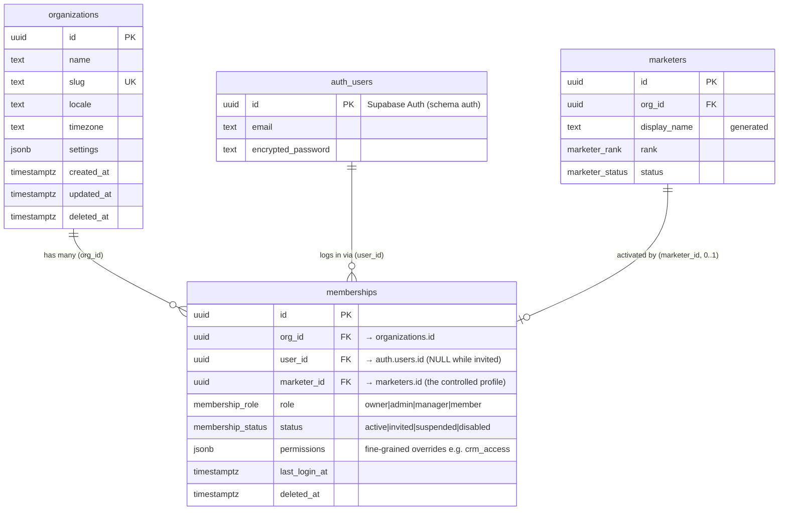
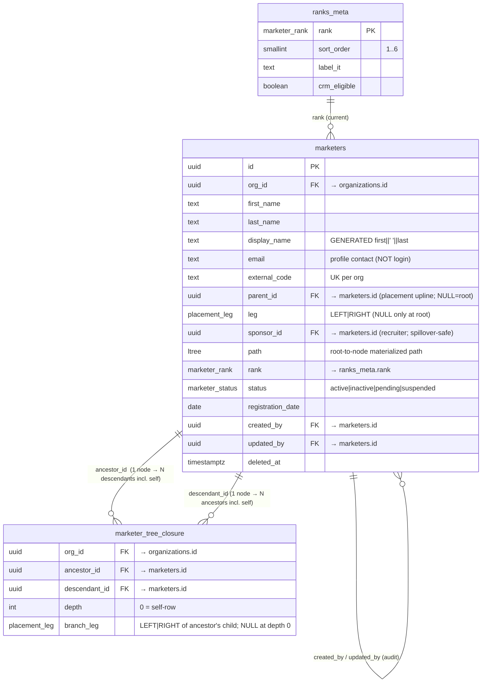
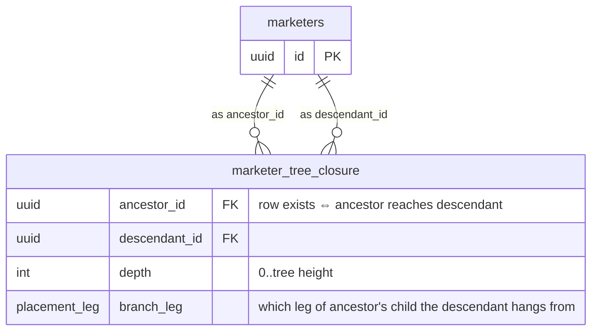
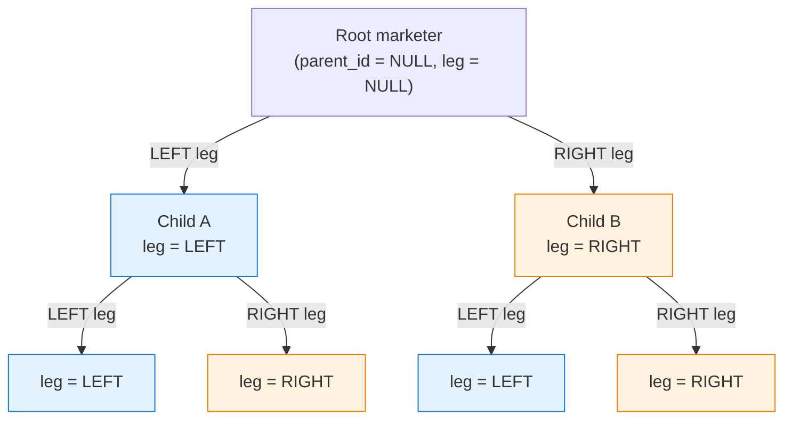
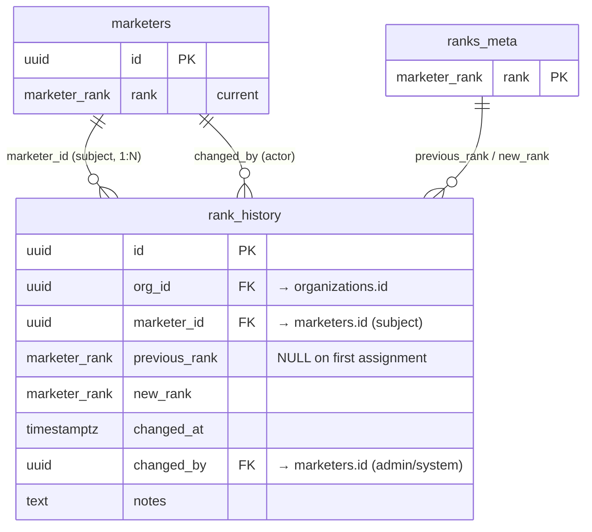
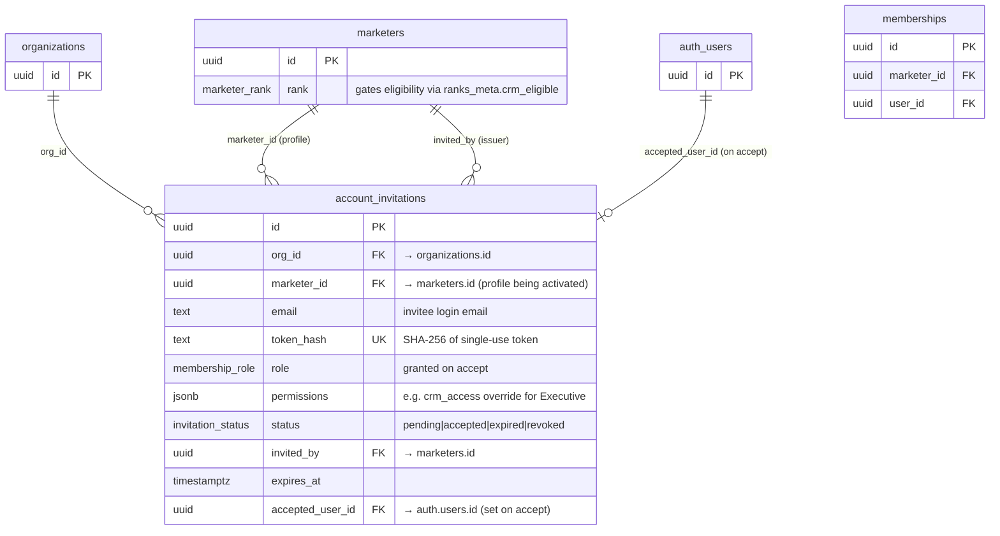
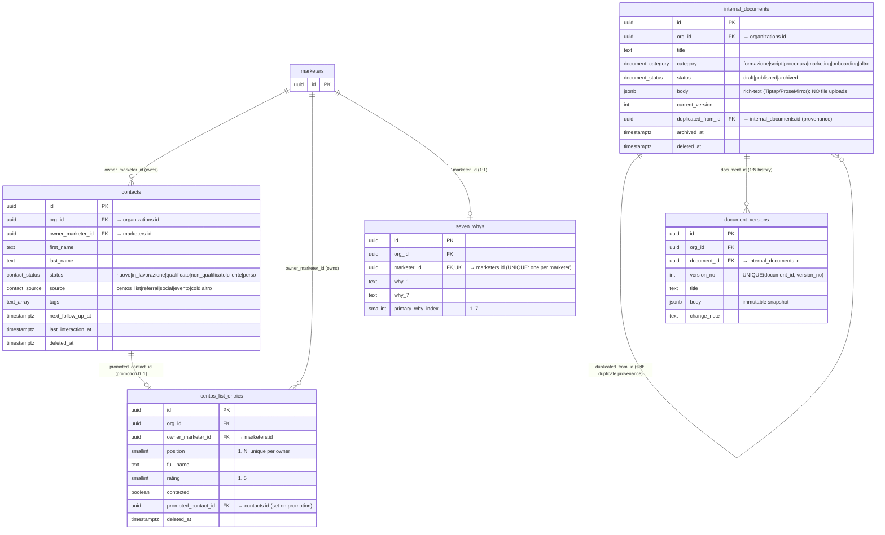
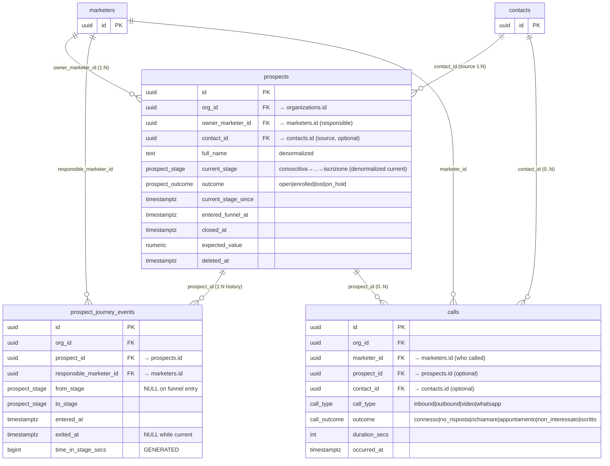

# 02 — Entity Relationship Diagram (ERD)

> **Status:** Architecture-validation phase. No application code.
> **Source of truth:** This document is strictly derived from
> [`01-database-schema.md`](./01-database-schema.md). Every table name, column name,
> enum value, FK direction and constraint here matches that canonical schema exactly.
> If anything diverges, the schema document wins — open an issue.
>
> **Scope:** Complete ERD of all 22 relations (20 base tables + 2 materialized views,
> plus `auth.users` from Supabase Auth shown as an external entity) across the six
> functional groups: Tenancy & Identity, Marketer Core (profiles + binary genealogy +
> closure + ranks), Account Lifecycle, CRM Data, Funnel & Activity, and Analytics/Reporting/Ops.

---

## 0. How to read this document

- **Notation:** Mermaid `erDiagram`. Crow's-foot cardinalities:
  - `||--||` = 1:1 (exactly one ↔ exactly one)
  - `||--o|` = 1:0..1 (one ↔ zero-or-one — optional 1:1)
  - `||--o{` = 1:0..N (one ↔ zero-or-many)
  - `}o--o{` = N:M (many-to-many, always via a junction table here)
- **`PK` / `FK` / `UK`** mark primary keys, foreign keys and unique keys on attributes.
- Mermaid does not render self-referential FKs as separate visual edges cleanly, so the
  three genealogy self-joins on `marketers` (`parent_id`, `sponsor_id`) and the closure
  table's dual FK into `marketers` (`ancestor_id`, `descendant_id`) are drawn explicitly
  in **§3 Genealogy Detail** and narrated in **§9**.
- Relationship **labels** name the FK column that backs the edge, so the diagram doubles
  as an FK map.
- `auth.users` is Supabase-managed (schema `auth`); it is referenced as `auth_users` in the
  diagrams because Mermaid identifiers cannot contain a dot.

### Relation inventory (what the ERD must cover)

| # | Relation | Group | Kind |
|---|---|---|---|
| 1 | `organizations` | Tenancy & Identity | table |
| 2 | `memberships` | Tenancy & Identity | table (account link) |
| 3 | `auth.users` | Tenancy & Identity | external (Supabase Auth) |
| 4 | `ranks_meta` | Marketer Core | reference table (global) |
| 5 | `marketers` | Marketer Core | table (profile, self-referential ×3) |
| 6 | `marketer_tree_closure` | Marketer Core | closure table (dual self-FK) |
| 7 | `rank_history` | Marketer Core | table |
| 8 | `account_invitations` | Account Lifecycle | table |
| 9 | `contacts` | CRM Data | table |
| 10 | `centos_list_entries` | CRM Data | table |
| 11 | `seven_whys` | CRM Data | table (1:1 with marketer) |
| 12 | `internal_documents` | CRM Data | table (self-referential `duplicated_from_id`) |
| 13 | `document_versions` | CRM Data | table |
| 14 | `prospects` | Funnel & Activity | table |
| 15 | `prospect_journey_events` | Funnel & Activity | table (stage history) |
| 16 | `calls` | Funnel & Activity | table |
| 17 | `daily_marketer_metrics` | Analytics/Ops | rollup table |
| 18 | `mv_funnel_totals` | Analytics/Ops | materialized view |
| 19 | `mv_stage_conversion` | Analytics/Ops | materialized view |
| 20 | `monthly_reports` | Analytics/Ops | table |
| 21 | `leaderboard_snapshots` | Analytics/Ops | table |
| 22 | `bottleneck_findings` | Analytics/Ops | table |
| 23 | `notifications` | Analytics/Ops | table |
| 24 | `audit_log` | Analytics/Ops | table (append-only) |

---

## 1. Master ERD (full platform, condensed attributes)

The single big picture. To keep it legible, only key/structural columns are shown per
entity; full column lists live in the per-cluster diagrams (§2–§7) and in the canonical
schema. Every tenant table carries `org_id uuid` (FK → `organizations`) even where the
edge is omitted to reduce clutter; those tenant edges are summarized in §8.

```mermaid
erDiagram
    %% ===== TENANCY & IDENTITY =====
    organizations {
        uuid id PK
        text name
        text slug UK
        text locale
        text timezone
        jsonb settings
        timestamptz deleted_at
    }
    auth_users {
        uuid id PK
        text email
    }
    memberships {
        uuid id PK
        uuid org_id FK
        uuid user_id FK
        uuid marketer_id FK
        membership_role role
        membership_status status
        jsonb permissions
    }

    %% ===== MARKETER CORE =====
    ranks_meta {
        marketer_rank rank PK
        smallint sort_order
        text label_it
        boolean crm_eligible
    }
    marketers {
        uuid id PK
        uuid org_id FK
        uuid parent_id FK
        placement_leg leg
        uuid sponsor_id FK
        ltree path
        marketer_rank rank
        marketer_status status
        text display_name
    }
    marketer_tree_closure {
        uuid org_id FK
        uuid ancestor_id FK
        uuid descendant_id FK
        int depth
        placement_leg branch_leg
    }
    rank_history {
        uuid id PK
        uuid org_id FK
        uuid marketer_id FK
        marketer_rank previous_rank
        marketer_rank new_rank
        uuid changed_by FK
    }

    %% ===== ACCOUNT LIFECYCLE =====
    account_invitations {
        uuid id PK
        uuid org_id FK
        uuid marketer_id FK
        text email
        text token_hash UK
        invitation_status status
        uuid accepted_user_id FK
    }

    %% ===== CRM DATA =====
    contacts {
        uuid id PK
        uuid org_id FK
        uuid owner_marketer_id FK
        contact_status status
        contact_source source
        timestamptz next_follow_up_at
    }
    centos_list_entries {
        uuid id PK
        uuid org_id FK
        uuid owner_marketer_id FK
        smallint position
        uuid promoted_contact_id FK
    }
    seven_whys {
        uuid id PK
        uuid org_id FK
        uuid marketer_id FK,UK
        smallint primary_why_index
    }
    internal_documents {
        uuid id PK
        uuid org_id FK
        document_category category
        document_status status
        int current_version
        uuid duplicated_from_id FK
    }
    document_versions {
        uuid id PK
        uuid org_id FK
        uuid document_id FK
        int version_no
    }

    %% ===== FUNNEL & ACTIVITY =====
    prospects {
        uuid id PK
        uuid org_id FK
        uuid owner_marketer_id FK
        uuid contact_id FK
        prospect_stage current_stage
        prospect_outcome outcome
    }
    prospect_journey_events {
        uuid id PK
        uuid org_id FK
        uuid prospect_id FK
        uuid responsible_marketer_id FK
        prospect_stage from_stage
        prospect_stage to_stage
        bigint time_in_stage_secs
    }
    calls {
        uuid id PK
        uuid org_id FK
        uuid marketer_id FK
        uuid prospect_id FK
        uuid contact_id FK
        call_type call_type
        call_outcome outcome
    }

    %% ===== ANALYTICS / REPORTING / OPS =====
    daily_marketer_metrics {
        uuid org_id FK
        uuid marketer_id FK
        date metric_date
        int calls_total
        int new_prospects
        int new_recruits
    }
    mv_funnel_totals {
        uuid org_id
        uuid marketer_id
        prospect_stage current_stage
        prospect_outcome outcome
        bigint prospects_count
    }
    mv_stage_conversion {
        uuid org_id
        uuid marketer_id
        date period_month
        prospect_stage to_stage
        bigint entered_count
    }
    monthly_reports {
        uuid id PK
        uuid org_id FK
        uuid marketer_id FK
        report_period period
        date period_start
        jsonb metrics
    }
    leaderboard_snapshots {
        uuid id PK
        uuid org_id FK
        leaderboard_metric metric
        leaderboard_scope scope
        branch_side branch_side
        uuid marketer_id FK
        int rank_position
    }
    bottleneck_findings {
        uuid id PK
        uuid org_id FK
        uuid marketer_id FK
        bottleneck_type type
        bottleneck_severity severity
        prospect_stage stage
    }
    notifications {
        uuid id PK
        uuid org_id FK
        uuid recipient_marketer_id FK
        notification_type type
        timestamptz read_at
    }
    audit_log {
        uuid id PK
        uuid org_id FK
        uuid actor_marketer_id FK
        uuid actor_user_id FK
        text action
        text entity_type
    }

    %% ============ RELATIONSHIPS ============
    %% Tenancy & Identity
    organizations ||--o{ memberships          : "org_id"
    organizations ||--o{ marketers            : "org_id"
    auth_users    ||--o{ memberships          : "user_id"
    marketers     ||--o| memberships          : "marketer_id (account link)"

    %% Marketer Core (genealogy self-joins drawn in detail in §3)
    ranks_meta    ||--o{ marketers            : "rank"
    ranks_meta    ||--o{ rank_history          : "new_rank / previous_rank"
    marketers     ||--o{ marketers            : "parent_id (placement upline)"
    marketers     ||--o{ marketers            : "sponsor_id (recruiter)"
    marketers     ||--o{ marketer_tree_closure : "ancestor_id"
    marketers     ||--o{ marketer_tree_closure : "descendant_id"
    organizations ||--o{ marketer_tree_closure : "org_id"
    marketers     ||--o{ rank_history          : "marketer_id"

    %% Account Lifecycle
    organizations ||--o{ account_invitations   : "org_id"
    marketers     ||--o{ account_invitations   : "marketer_id (profile activated)"
    auth_users    ||--o{ account_invitations   : "accepted_user_id"

    %% CRM Data
    organizations ||--o{ contacts             : "org_id"
    marketers     ||--o{ contacts             : "owner_marketer_id"
    marketers     ||--o{ centos_list_entries  : "owner_marketer_id"
    contacts      ||--o| centos_list_entries  : "promoted_contact_id"
    marketers     ||--o| seven_whys           : "marketer_id (1:1)"
    organizations ||--o{ internal_documents   : "org_id"
    internal_documents ||--o{ internal_documents : "duplicated_from_id"
    internal_documents ||--o{ document_versions  : "document_id"

    %% Funnel & Activity
    marketers     ||--o{ prospects            : "owner_marketer_id"
    contacts      ||--o{ prospects            : "contact_id (source)"
    prospects     ||--o{ prospect_journey_events : "prospect_id"
    marketers     ||--o{ prospect_journey_events : "responsible_marketer_id"
    marketers     ||--o{ calls                : "marketer_id"
    prospects     ||--o{ calls                : "prospect_id"
    contacts      ||--o{ calls                : "contact_id"

    %% Analytics / Reporting / Ops
    marketers     ||--o{ daily_marketer_metrics : "marketer_id"
    marketers     ||--o{ monthly_reports       : "marketer_id (NULL = org-level)"
    marketers     ||--o{ leaderboard_snapshots : "marketer_id"
    marketers     ||--o{ bottleneck_findings   : "marketer_id"
    marketers     ||--o{ notifications         : "recipient_marketer_id"
    marketers     ||--o{ audit_log             : "actor_marketer_id"
    auth_users    ||--o{ audit_log             : "actor_user_id"
```

> **Note on the materialized views** (`mv_funnel_totals`, `mv_stage_conversion`): they have
> no enforced FKs (a MV cannot declare foreign keys). Their `org_id` / `marketer_id` columns
> are *logical* references derived from `prospects` and `prospect_journey_events`
> respectively. They are drawn without FK edges in the master diagram and explained in §7.

---

## 2. Cluster A — Tenancy & Identity (the account-link triangle)

This cluster encodes the **mandatory profile ≠ account separation**. A `marketers`
**profile** can exist with no login. A `memberships` row is the *account link* that binds an
existing profile to a Supabase `auth.users` login within an org — it never recreates the
profile.

**Cardinalities & rules**

| Edge | Cardinality | Backing constraint | Meaning |
|---|---|---|---|
| `organizations` → `memberships` | 1:N | `memberships.org_id` FK | All accounts in a tenant. |
| `auth.users` → `memberships` | 1:N | `memberships.user_id` FK, partial `UNIQUE(org_id, user_id) WHERE user_id IS NOT NULL` | One login → exactly one profile **per org** (may have memberships in other orgs). `user_id` is NULL while `status='invited'`. |
| `marketers` → `memberships` | **1:0..1** | `UNIQUE(org_id, marketer_id)` | A profile has **at most one** account link. Pre-registered profiles have **zero**. This is the "activate CRM access never duplicates the profile" guarantee. |

> **Activation flow (read with §4):** `account_invitations` (pending) → user signs up →
> `auth.users` row created → a `memberships` row is activated (`status` `invited`→`active`,
> `user_id` set). The `marketers.id` is preserved throughout; genealogy, contacts, history all
> stay attached because they reference `marketers.id`, never `auth.users.id` or `memberships.id`.

---

## 3. Cluster B — Marketer Core: the binary genealogy (self-joins + closure)

The heart of the model. `marketers` is **self-referential three ways** and is mirrored by the
`marketer_tree_closure` table (which itself holds **two** FKs back into `marketers`).

### 3.1 The three `marketers` self-joins explained

| Self-FK column | Semantics | Cardinality | Constraints enforcing the binary tree |
|---|---|---|---|
| `parent_id` (+ `leg`) | **Placement upline.** The node physically sits in `parent_id`'s `LEFT` or `RIGHT` leg. | A parent has **0, 1 or 2** placement children — **at most one LEFT and one RIGHT**. | Partial unique index `marketers_one_child_per_leg (org_id, parent_id, leg) WHERE parent_id IS NOT NULL AND deleted_at IS NULL`; `CHECK marketers_leg_requires_parent` (leg present iff parent present); `CHECK marketers_no_self_parent`; partial unique `marketers_single_root_per_org` (exactly one NULL-parent root per org); cycle-prevention trigger. |
| `sponsor_id` | **Recruiter.** The person who actually enrolled this marketer. Decoupled from placement because **spillover** can place a recruit under a *different* upline than the recruiter. | A sponsor has **0..N** recruits (no binary cap — this is genealogy of *who recruited whom*, not placement). | `FK sponsor_id → marketers(id) ON DELETE SET NULL`; `CHECK marketers_no_self_sponsor`. |
| `created_by` / `updated_by` | **Audit pointers** to the acting marketer profile. | 0..N rows authored by a given marketer. | `FK → marketers(id)`, nullable for system actions. |

> **Why two separate hierarchies?** The **placement tree** (`parent_id`/`leg`) drives
> Left/Right branch analytics, binary balance and visibility. The **sponsorship graph**
> (`sponsor_id`) drives "direct recruits" / "new recruits" team metrics. They coincide only
> when no spillover occurs. The closure table is built over the **placement tree** only.

### 3.2 The closure table's dual FK into `marketers`

`marketer_tree_closure` materializes **every (ancestor, descendant, depth) pair** of the
placement tree, including the depth-0 self-row for each node. It carries **two** foreign keys
into `marketers`:

| Property | Value |
|---|---|
| **PK** | `(ancestor_id, descendant_id)` — composite, no surrogate. |
| **Self-row** | `(X, X, depth=0, branch_leg=NULL)` exists for every node. |
| **`branch_leg`** | For `depth ≥ 1`, records whether the descendant descends from the ancestor's **LEFT** or **RIGHT** child → makes "Left Branch of N" the single predicate `ancestor_id = N AND branch_leg = 'LEFT'`. `CHECK closure_branch_leg_rule`: `branch_leg` NULL iff `depth = 0`. |
| **Cardinality (logical)** | Effectively **N:M between `marketers` and itself**, resolved by this junction. A node is ancestor of all its descendants and descendant of all its ancestors. |
| **Indexes** | `closure_descendant_idx (descendant_id)`, `closure_ancestor_depth (ancestor_id, depth)`, `closure_branch_idx (ancestor_id, branch_leg)`. |

> **Visibility primitive (used by RLS everywhere):** *"caller can see marketer X"* ⇔
> *a row exists in `marketer_tree_closure` with `ancestor_id = caller.marketer_id` and
> `descendant_id = X`."* Depth 0 = self. This single rule powers own-subtree visibility for
> `marketers`, `contacts`, `prospects`, `calls`, etc.

### 3.3 Conceptual binary-tree shape (illustrative, not an ERD)

For node `R`: **Left Branch** = subtree rooted at Child A (closure rows `ancestor_id=R,
branch_leg='LEFT'`); **Right Branch** = subtree rooted at Child B (`branch_leg='RIGHT'`).
The dashed `sponsor_id` edges (recruiter) are not shown — they may point anywhere within the
org and need not follow placement.

### 3.4 `rank_history` (rank audit trail)

A trigger on `marketers` writes a `rank_history` row whenever `marketers.rank` changes
(`CHECK (previous_rank IS DISTINCT FROM new_rank)`). Cardinality `marketers` 1 → N
`rank_history`.

---

## 4. Cluster C — Account Lifecycle (activation workflow)

| Edge | Cardinality | Constraint |
|---|---|---|
| `marketers` → `account_invitations` (`marketer_id`) | 1:N over time, but **only one live** | Partial `UNIQUE(org_id, marketer_id) WHERE status='pending'`. |
| `account_invitations.token_hash` | unique | `UNIQUE(token_hash)`. |
| Eligibility gate | — | Insert allowed only if target marketer's rank has `ranks_meta.crm_eligible = true` **or** `permissions->>'crm_access' = 'true'` (Executive override). Enforced in Edge Function + `BEFORE INSERT` trigger. |

**Lifecycle bridge to Cluster A:** acceptance creates the `auth.users` row, sets
`account_invitations.accepted_user_id` + `accepted_at`, flips `status` → `accepted`, and
activates the `memberships` row (`user_id` set, `status` → `active`) for the **same**
`marketer_id`. No new `marketers` row is ever created.

---

## 5. Cluster D — CRM Data (contacts, Centos list, Sette Perché, documents)

| Edge | Cardinality | Notes |
|---|---|---|
| `marketers` → `contacts` | 1:N | `owner_marketer_id ON DELETE RESTRICT` — a marketer's contact book. |
| `marketers` → `centos_list_entries` | 1:N | The "list of 100"; `UNIQUE(org_id, owner_marketer_id, position)`. |
| `contacts` → `centos_list_entries` | **1:0..1** | A Centos entry, once promoted, points to the created `contact` via `promoted_contact_id`. Direction: the entry references the contact. |
| `marketers` → `seven_whys` | **1:1** (0..1) | `UNIQUE(org_id, marketer_id)` — exactly one Sette Perché record per marketer (optional until filled). |
| `internal_documents` → `internal_documents` | 1:N self | `duplicated_from_id` records "Duplicate" provenance (one source → many duplicates). Org-wide, not marketer-owned. |
| `internal_documents` → `document_versions` | 1:N | Immutable version snapshots; `UNIQUE(document_id, version_no)`. `BEFORE UPDATE` trigger snapshots prior body on title/body change. |

> **Promotion path:** `centos_list_entries.promoted_contact_id` → `contacts.id`, and a
> `contact` later seeds `prospects` (Cluster E) via `prospects.contact_id`. So the canonical
> funnel ingress is **Centos entry → contact → prospect**.

---

## 6. Cluster E — Funnel & Activity (prospects, journey history, calls)

| Edge | Cardinality | Constraint / behavior |
|---|---|---|
| `marketers` → `prospects` | 1:N | `owner_marketer_id ON DELETE RESTRICT`. |
| `contacts` → `prospects` | 1:N (0..N) | `contact_id ON DELETE SET NULL` — one contact can spawn multiple prospects over time; a prospect may have no source contact (created directly). |
| `prospects` → `prospect_journey_events` | 1:N | `ON DELETE CASCADE`. **Invariant:** exactly one event per prospect has `exited_at IS NULL` (the open/current stage), enforced by trigger; partial index `pje_open_stage_idx`. |
| `marketers` → `prospect_journey_events` | 1:N | `responsible_marketer_id ON DELETE RESTRICT` (who owned the transition). |
| `marketers` → `calls` | 1:N | `marketer_id ON DELETE RESTRICT`. |
| `prospects`/`contacts` → `calls` | 1:N each, **at least one required** | Both FKs `ON DELETE SET NULL`; `CHECK calls_has_target (prospect_id IS NOT NULL OR contact_id IS NOT NULL)` — a call must reference a prospect or a contact (or both). |

> **Denormalization note:** `prospects.current_stage` mirrors the latest
> `prospect_journey_events.to_stage` (open event) for fast funnel queries; the events table is
> the historical source of truth that feeds `mv_stage_conversion`, time-in-stage and bottleneck
> rules. `time_in_stage_secs` is a STORED generated column (`exited_at - entered_at`), NULL
> while the stage is open.

---

## 7. Cluster F — Analytics, Reporting & Ops

Two layers: **derived analytics** (`daily_marketer_metrics` rollup + the two MVs) and
**operational tables** (`monthly_reports`, `leaderboard_snapshots`, `bottleneck_findings`,
`notifications`, `audit_log`). All aggregation across a subtree/branch is done by joining the
analytics rows on `marketer_id` to `marketer_tree_closure` (`ancestor_id = N`, optional
`branch_leg` filter) — the closure table from Cluster B is the analytics backbone.

```mermaid
erDiagram
    organizations {
        uuid id PK
    }
    marketers {
        uuid id PK
    }
    auth_users {
        uuid id PK
    }
    marketer_tree_closure {
        uuid ancestor_id FK
        uuid descendant_id FK
        placement_leg branch_leg
    }
    daily_marketer_metrics {
        uuid org_id FK "→ organizations.id"
        uuid marketer_id FK "→ marketers.id"
        date metric_date "PK part (marketer_id, metric_date)"
        int calls_total
        int calls_connected
        bigint calls_duration_secs
        int new_prospects
        int stage_iscrizione "enrollments"
        int new_recruits
    }
    mv_funnel_totals {
        uuid org_id "logical → organizations"
        uuid marketer_id "logical → marketers"
        prospect_stage current_stage
        prospect_outcome outcome
        bigint prospects_count
        bigint enrolled_count
    }
    mv_stage_conversion {
        uuid org_id "logical → organizations"
        uuid marketer_id "logical → marketers"
        date period_month
        prospect_stage to_stage
        bigint entered_count
        bigint exited_count
        numeric avg_time_in_stage_secs
    }
    monthly_reports {
        uuid id PK
        uuid org_id FK
        uuid marketer_id FK "→ marketers.id (NULL = org-level)"
        report_period period "monthly|quarterly"
        date period_start
        date period_end
        jsonb metrics
        jsonb previous_metrics
        jsonb deltas
        jsonb delta_pct
    }
    leaderboard_snapshots {
        uuid id PK
        uuid org_id FK
        leaderboard_metric metric "calls|new_prospects|conversion_rate|enrollments|team_growth"
        leaderboard_scope scope "org|team|branch"
        uuid scope_ref_id "root marketer for team/branch"
        branch_side branch_side "GLOBAL|LEFT|RIGHT"
        date period_start
        uuid marketer_id FK "→ marketers.id"
        int rank_position
        numeric value
    }
    bottleneck_findings {
        uuid id PK
        uuid org_id FK
        uuid marketer_id FK "→ marketers.id (affected subtree root)"
        bottleneck_type type "weak_conversion|stage_delay|inactivity|followup_overdue"
        bottleneck_severity severity "info|warning|critical"
        prospect_stage stage
        numeric metric_value
        numeric threshold_value
        text title_it
        text recommendation_it
        timestamptz resolved_at
    }
    notifications {
        uuid id PK
        uuid org_id FK
        uuid recipient_marketer_id FK "→ marketers.id"
        notification_type type "follow_up_due|rank_changed|bottleneck_alert|monthly_report_ready|invitation|system"
        text title_it
        jsonb payload
        timestamptz read_at
    }
    audit_log {
        uuid id PK
        uuid org_id FK
        uuid actor_marketer_id FK "→ marketers.id (NULL=system)"
        uuid actor_user_id FK "→ auth.users.id"
        text action
        text entity_type
        uuid entity_id
        jsonb before
        jsonb after
        inet ip_address
    }

    organizations ||--o{ daily_marketer_metrics : "org_id"
    marketers     ||--o{ daily_marketer_metrics : "marketer_id (own activity, 1 row/day)"
    marketers     ||--o{ marketer_tree_closure  : "ancestor_id (subtree rollup join)"

    organizations ||--o{ monthly_reports        : "org_id"
    marketers     ||--o{ monthly_reports        : "marketer_id (NULL=org-level)"
    organizations ||--o{ leaderboard_snapshots  : "org_id"
    marketers     ||--o{ leaderboard_snapshots  : "marketer_id (ranked)"
    organizations ||--o{ bottleneck_findings    : "org_id"
    marketers     ||--o{ bottleneck_findings    : "marketer_id (affected)"
    organizations ||--o{ notifications          : "org_id"
    marketers     ||--o{ notifications          : "recipient_marketer_id"
    organizations ||--o{ audit_log              : "org_id"
    marketers     ||--o{ audit_log              : "actor_marketer_id"
    auth_users    ||--o{ audit_log              : "actor_user_id"
```

| Relation | Grain / PK | Key cardinalities | Notes |
|---|---|---|---|
| `daily_marketer_metrics` | **PK `(marketer_id, metric_date)`** | `marketers` 1:N | One row per marketer per day of that marketer's **own** activity. Subtree totals computed on read via closure join. |
| `mv_funnel_totals` | unique `(org_id, marketer_id, current_stage, outcome)` | logical N:1 to `marketers` | Derived from `prospects`. No physical FK (MV). |
| `mv_stage_conversion` | unique `(org_id, marketer_id, period_month, to_stage)` | logical N:1 to `marketers` | Derived from `prospect_journey_events`. No physical FK (MV). |
| `monthly_reports` | PK `id`, unique `(org_id, marketer_id, period, period_start)` | `marketers` 1:N | `marketer_id` NULL ⇒ org-level roll-up row. |
| `leaderboard_snapshots` | PK `id`, unique `(org_id, metric, scope, scope_ref_id, branch_side, period_start, marketer_id)` | `marketers` 1:N | `scope_ref_id` is the root marketer for `team`/`branch` scope; `branch_side` selects GLOBAL/LEFT/RIGHT. |
| `bottleneck_findings` | PK `id`, unique `(org_id, marketer_id, type, stage, period_start)` | `marketers` 1:N | Engine output; `resolved_at` NULL = open. |
| `notifications` | PK `id` | `marketers` 1:N | Addressed to `recipient_marketer_id`; `read_at` NULL = unread. |
| `audit_log` | PK `id`, append-only | `marketers` 1:N, `auth.users` 1:N | Dual actor refs; no `updated_at`/`deleted_at`. |

> **Closure-as-backbone:** none of these analytics tables store subtree aggregates. The
> `marketers ||--o{ marketer_tree_closure : ancestor_id` edge shown here is the **read-time
> join** that turns per-marketer facts into team/branch/Left/Right analytics:
> `daily_marketer_metrics dm JOIN marketer_tree_closure c ON c.descendant_id = dm.marketer_id
> WHERE c.ancestor_id = :N [AND c.branch_leg = :side]`.

---

## 8. Tenant-edge summary (`org_id`) and FK reference map

Every tenant relation carries `org_id uuid NOT NULL REFERENCES organizations(id)` (the two MVs
carry `org_id` as a projected column, not an enforced FK). To keep the cluster diagrams legible,
the `organizations ||--o{ <table> : org_id` edges are consolidated here.

| Table | `org_id` FK | Other FKs (column → target) |
|---|---|---|
| `memberships` | ✔ ON DELETE (org) | `user_id → auth.users`, `marketer_id → marketers` |
| `marketers` | ✔ ON DELETE CASCADE | `parent_id → marketers` (RESTRICT), `sponsor_id → marketers` (SET NULL), `created_by → marketers`, `updated_by → marketers` |
| `marketer_tree_closure` | ✔ CASCADE | `ancestor_id → marketers` (CASCADE), `descendant_id → marketers` (CASCADE) |
| `rank_history` | ✔ | `marketer_id → marketers`, `changed_by → marketers` |
| `account_invitations` | ✔ | `marketer_id → marketers`, `invited_by → marketers`, `accepted_user_id → auth.users` |
| `contacts` | ✔ CASCADE | `owner_marketer_id → marketers` (RESTRICT), `created_by`, `updated_by → marketers` |
| `centos_list_entries` | ✔ | `owner_marketer_id → marketers`, `promoted_contact_id → contacts` |
| `seven_whys` | ✔ | `marketer_id → marketers` (UNIQUE) |
| `internal_documents` | ✔ CASCADE | `duplicated_from_id → internal_documents`, `created_by`, `updated_by → marketers` |
| `document_versions` | ✔ CASCADE | `document_id → internal_documents` (CASCADE), `created_by → marketers` |
| `prospects` | ✔ CASCADE | `owner_marketer_id → marketers` (RESTRICT), `contact_id → contacts` (SET NULL), `created_by`, `updated_by` |
| `prospect_journey_events` | ✔ CASCADE | `prospect_id → prospects` (CASCADE), `responsible_marketer_id → marketers` (RESTRICT) |
| `calls` | ✔ CASCADE | `marketer_id → marketers` (RESTRICT), `prospect_id → prospects` (SET NULL), `contact_id → contacts` (SET NULL), `created_by` |
| `daily_marketer_metrics` | ✔ CASCADE | `marketer_id → marketers` (CASCADE) |
| `mv_funnel_totals` | (projected) | — (no enforced FKs; logical refs to `prospects`) |
| `mv_stage_conversion` | (projected) | — (no enforced FKs; logical refs to `prospect_journey_events`) |
| `monthly_reports` | ✔ CASCADE | `marketer_id → marketers` (CASCADE, nullable for org-level) |
| `leaderboard_snapshots` | ✔ CASCADE | `marketer_id → marketers` (CASCADE) |
| `bottleneck_findings` | ✔ CASCADE | `marketer_id → marketers` (CASCADE) |
| `notifications` | ✔ | `recipient_marketer_id → marketers` |
| `audit_log` | ✔ | `actor_marketer_id → marketers`, `actor_user_id → auth.users` |

---

## 9. Narrative — clusters and the genealogy self-joins

**Cluster A — Tenancy & Identity.** `organizations` is the tenant root; everything fans out
from it via `org_id`. The defining structure is the **account-link triangle**:
`auth.users` (login) — `memberships` (the link, carrying `role`/`status`/`permissions`) —
`marketers` (profile). The `marketers ||--o| memberships` (1:0..1) edge is the load-bearing
expression of *profile ≠ account*: a profile can exist with **zero** memberships
(pre-registration), and activation attaches **one** without recreating the profile. `auth.users`
is external (Supabase Auth, schema `auth`) and only ever reached through `memberships.user_id`,
`account_invitations.accepted_user_id`, or `audit_log.actor_user_id`.

**Cluster B — Marketer Core.** `marketers` is the spine of the whole platform and is
**self-referential three ways**: `parent_id` (binary placement upline, paired with `leg ∈
{LEFT,RIGHT}`), `sponsor_id` (the recruiter, decoupled to support spillover), and the audit
pair `created_by`/`updated_by`. The binary tree is constrained so each parent has at most one
LEFT and one RIGHT child (partial unique index on `(org_id, parent_id, leg)`), exactly one root
per org, no self-parenting and no cycles. The **placement** tree is mirrored into
`marketer_tree_closure`, which holds **two** FKs back into `marketers` (`ancestor_id`,
`descendant_id`) and so resolves the otherwise-N:M "ancestor-of/descendant-of" relation,
including a depth-0 self-row per node and a `branch_leg` tag that makes Left/Right branch
queries O(index). The **sponsorship** graph (`sponsor_id`) is intentionally *not* closured — it
is a separate, unconstrained "who recruited whom" relation feeding recruiting metrics, whereas
placement drives visibility and branch analytics. `ranks_meta` is the global ordered reference
for the rank ladder and CRM eligibility, referenced by `marketers.rank` and both rank columns of
`rank_history`, which captures every promotion/demotion.

**Cluster C — Account Lifecycle.** `account_invitations` operationalizes "Activate CRM Access".
Each invitation targets an **existing** `marketers` profile (`marketer_id`), is gated by
`ranks_meta.crm_eligible` (or a `permissions.crm_access` override for Executives), and on
acceptance binds the new `auth.users` row (`accepted_user_id`) and activates the `memberships`
link — all while preserving the profile id and its attached genealogy, contacts, documents,
notes, stats and history.

**Cluster D — CRM Data.** Marketer-owned working data: `contacts` (the CRM book, owner =
`owner_marketer_id`), `centos_list_entries` (the list-of-100, promotable into a contact via
`promoted_contact_id`), `seven_whys` (a strict 1:1 motivation record per marketer), and the
org-wide knowledge base `internal_documents` (rich-text only, no file uploads) with immutable
`document_versions` and a self-referential `duplicated_from_id` for the "Duplicate" feature.

**Cluster E — Funnel & Activity.** `contacts` feed `prospects` (`contact_id`, optional), which
move through the six locked stages with `current_stage`/`outcome` denormalized for speed.
`prospect_journey_events` is the authoritative stage-transition history (exactly one open event
per prospect, generated `time_in_stage_secs`), and `calls` log activity against a prospect
and/or a contact (`CHECK calls_has_target` requires at least one). This cluster is the raw
material for all analytics.

**Cluster F — Analytics, Reporting & Ops.** The atomic fact table `daily_marketer_metrics` (PK
`(marketer_id, metric_date)`) stores each marketer's **own** daily activity; the two
materialized views (`mv_funnel_totals` from `prospects`, `mv_stage_conversion` from
`prospect_journey_events`) precompute funnel totals and stage-to-stage conversion. None of these
store subtree aggregates — instead, **the closure table from Cluster B is the analytics
backbone**: team/branch/Left/Right rollups are produced at read time by joining facts on
`marketer_id` to `marketer_tree_closure` (`ancestor_id = N`, optional `branch_leg`). The
operational tables — `monthly_reports` (MoM/QoQ deltas, `marketer_id` NULL = org-level),
`leaderboard_snapshots` (per metric/scope/branch_side), `bottleneck_findings` (engine output),
`notifications` (per recipient) and the append-only `audit_log` — all hang off `marketers`
and/or `organizations` and inherit subtree-based RLS via the same closure primitive.

**The single visibility primitive.** Across Clusters B–F, "caller can see row X" reduces to a
closure lookup: a row exists in `marketer_tree_closure` with `ancestor_id = caller.marketer_id`
and `descendant_id = X.<owner/marketer/responsible>_id`. That one self-join-backed junction is
why the binary tree, its closure, and the per-marketer fact grain were designed together.

---

## 10. Cardinality matrix (quick reference)

| From | To | Card. | FK column(s) | Special |
|---|---|---|---|---|
| `organizations` | `memberships` | 1:N | `org_id` | tenant |
| `organizations` | `marketers` | 1:N | `org_id` | tenant |
| `auth.users` | `memberships` | 1:N | `user_id` | NULL while invited |
| `marketers` | `memberships` | **1:0..1** | `marketer_id` | profile ≠ account |
| `marketers` | `marketers` | self 1:0..2 | `parent_id` (+`leg`) | **binary placement** (1 LEFT + 1 RIGHT) |
| `marketers` | `marketers` | self 1:0..N | `sponsor_id` | recruiter (spillover) |
| `marketers` | `marketers` | self 1:N | `created_by`,`updated_by` | audit |
| `marketers` | `marketer_tree_closure` | 1:N | `ancestor_id` | closure (dual FK) |
| `marketers` | `marketer_tree_closure` | 1:N | `descendant_id` | closure (dual FK) |
| `marketers`↔`marketers` | via closure | **N:M** | `ancestor_id`/`descendant_id` | resolved ancestor↔descendant |
| `ranks_meta` | `marketers` | 1:N | `rank` | reference |
| `ranks_meta` | `rank_history` | 1:N | `previous_rank`,`new_rank` | reference |
| `marketers` | `rank_history` | 1:N | `marketer_id` (+`changed_by`) | rank audit |
| `marketers` | `account_invitations` | 1:N (1 live) | `marketer_id` | partial unique pending |
| `auth.users` | `account_invitations` | 1:0..N | `accepted_user_id` | set on accept |
| `marketers` | `contacts` | 1:N | `owner_marketer_id` | RESTRICT |
| `marketers` | `centos_list_entries` | 1:N | `owner_marketer_id` | unique position |
| `contacts` | `centos_list_entries` | **1:0..1** | `promoted_contact_id` | promotion |
| `marketers` | `seven_whys` | **1:1 (0..1)** | `marketer_id` | UNIQUE |
| `internal_documents` | `internal_documents` | self 1:N | `duplicated_from_id` | duplicate provenance |
| `internal_documents` | `document_versions` | 1:N | `document_id` | version history |
| `marketers` | `prospects` | 1:N | `owner_marketer_id` | RESTRICT |
| `contacts` | `prospects` | 1:N (0..N) | `contact_id` | SET NULL |
| `prospects` | `prospect_journey_events` | 1:N | `prospect_id` | 1 open event |
| `marketers` | `prospect_journey_events` | 1:N | `responsible_marketer_id` | RESTRICT |
| `marketers` | `calls` | 1:N | `marketer_id` | RESTRICT |
| `prospects` | `calls` | 1:N (0..N) | `prospect_id` | SET NULL |
| `contacts` | `calls` | 1:N (0..N) | `contact_id` | SET NULL; ≥1 target |
| `marketers` | `daily_marketer_metrics` | 1:N | `marketer_id` | PK `(marketer_id,date)` |
| `marketers` | `mv_funnel_totals` | logical N:1 | `marketer_id` | MV, no FK |
| `marketers` | `mv_stage_conversion` | logical N:1 | `marketer_id` | MV, no FK |
| `marketers` | `monthly_reports` | 1:N | `marketer_id` | NULL = org-level |
| `marketers` | `leaderboard_snapshots` | 1:N | `marketer_id` | + `scope_ref_id` |
| `marketers` | `bottleneck_findings` | 1:N | `marketer_id` | engine output |
| `marketers` | `notifications` | 1:N | `recipient_marketer_id` | per addressee |
| `marketers` | `audit_log` | 1:N | `actor_marketer_id` | append-only |
| `auth.users` | `audit_log` | 1:N | `actor_user_id` | append-only |

---

## 11. Open Questions / Decisions Needing Sign-off

These are ERD-modeling questions surfaced while diagramming; the schema-level open questions in
[`01-database-schema.md` §10](./01-database-schema.md) remain authoritative and are not repeated.

1. **`scope_ref_id` has no declared FK.** In `leaderboard_snapshots`, `scope_ref_id` is the
   root marketer for `team`/`branch` scopes but is defined as a bare `uuid` (NULL for `org`
   scope). It is *logically* a self-reference to `marketers(id)`. Confirm whether to add a
   nullable `FK scope_ref_id → marketers(id)` (improves integrity, but the column is polymorphic
   in intent — NULL for org scope). **Recommended:** add the nullable FK; org-scope rows keep it
   NULL.

2. **Materialized views vs. logical references.** `mv_funnel_totals` and `mv_stage_conversion`
   expose `org_id`/`marketer_id` with no enforceable FK (Postgres MVs cannot). The ERD draws
   them without FK edges. Confirm this is acceptable for the design record, or whether these
   should instead be regular tables maintained by trigger/cron (which *could* carry FKs).
   **Recommended:** keep as MVs; document the logical refs (as done here).

3. **`auth.users` representation.** Shown as `auth_users` (external Supabase entity) because the
   ERD lives in the `public` schema's mental model. Confirm reviewers are comfortable treating
   `auth.users` as a read-only external entity referenced by three FKs (`memberships.user_id`,
   `account_invitations.accepted_user_id`, `audit_log.actor_user_id`) and never written by app
   migrations.

4. **Sponsorship graph not closured.** The ERD models `sponsor_id` as a plain self-FK with no
   closure/aggregate support, on the assumption that recruiting analytics only need *direct*
   recruits (`new_recruits` in `daily_marketer_metrics`) plus subtree counts via placement
   closure. Confirm we never need deep *sponsorship-line* (as opposed to placement-line)
   subtree analytics; if we do, a second closure over `sponsor_id` would be required.

5. **`memberships.user_id` cross-org uniqueness.** The ERD reflects one login → one profile
   **per org** (partial `UNIQUE(org_id, user_id)`), allowing the same `auth.users` to hold
   memberships in multiple orgs. Confirm this multi-org-per-login behavior is intended (it
   matches a single person consulting for two networks); otherwise tighten to global uniqueness.
