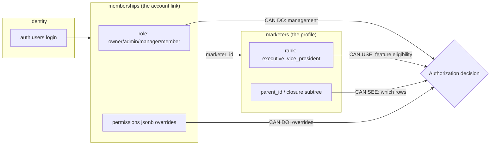
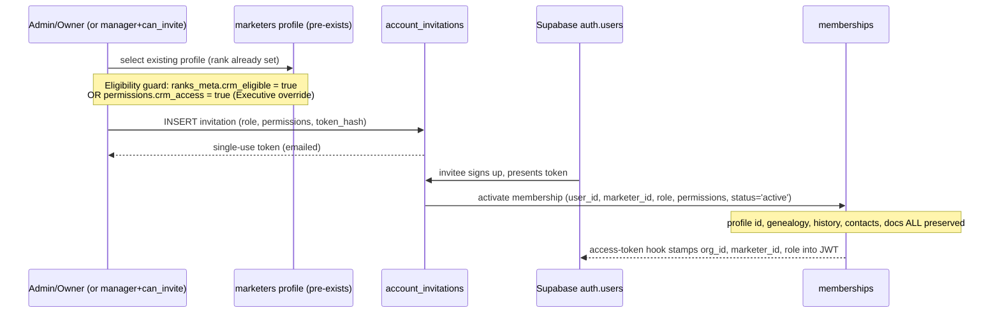

# 03 — Roles Matrix (Authorization Model)

> **Status:** Architecture-validation phase. No application code. This document is the
> single source of truth for the authorization model: the three orthogonal axes that
> together decide what a caller can *do* (platform/org role) and what they can *see*
> (genealogy subtree + rank-derived application role). It binds directly to the canonical
> schema in [`01-database-schema.md`](./01-database-schema.md) and uses its exact table and
> column identifiers. RLS policy implementations live in [`04-permissions-matrix.md`](./04-permissions-matrix.md) §5 and [`10-security-architecture.md`](./10-security-architecture.md) §3; this document
> defines the *semantics* those policies enforce.
>
> **Platform:** Supabase — Postgres 15, Supabase Auth (`auth.users`), Row-Level Security.
> Authorization values (`org_id`, `marketer_id`, `role`) are stamped into the JWT via the
> Supabase Auth access-token hook and read in policies via `auth.jwt()`.

---

## 0. The central idea: THREE orthogonal axes, never collapsed into one

A common mistake is to model "what a person can do" as a single role column. This platform
deliberately separates **three independent dimensions**. Every authorization decision is a
function of all three. They must never be conflated.

| Axis | Stored in | Question it answers | Value space |
|---|---|---|---|
| **1. Platform / org role** | `memberships.role` (`membership_role` enum) + a global super-admin flag outside the org | *What administrative actions may this login perform?* | `super_admin` (platform), `owner`, `admin`, `manager`, `member` |
| **2. Rank (application role)** | `marketers.rank` (`marketer_rank` enum) | *What is this person's position in the business ladder, and is their feature set CRM-eligible?* | `executive`, `consultant`, `team_leader`, `senior_team_leader`, `executive_team_leader`, `vice_president` |
| **3. Per-account permission flags** | `memberships.permissions` (jsonb) | *What explicit grants/overrides apply to this specific account, beyond what role + rank imply?* | e.g. `{"crm_access": true}`, `{"export_enabled": true}` |

Plus a **fourth, structural** dimension that is not a "role" but governs *scope of visibility*:

| Axis | Stored in | Question it answers |
|---|---|---|
| **4. Genealogy position (visibility scope)** | `marketers.parent_id` / `marketer_tree_closure` | *Which rows may this person see?* (own subtree only, unless an admin) |

> **Why orthogonal:** a `vice_president` (high rank) who is **not** an admin still only sees
> their own subtree — rank does not grant administrative reach. Conversely an `admin`
> membership grants org-wide management regardless of the underlying profile's rank. And an
> `executive` (lowest rank, normally no CRM) can be handed CRM access purely through a
> per-account permission flag, without changing their rank. Collapsing these into one column
> would make every one of those combinations impossible to express.



---

## 1. Platform / org roles (the "CAN DO" axis)

These come from `memberships.role` (the `membership_role` enum defined in Group 1 of the
schema) plus one platform-level role that lives **above** any single org.

### 1.1 `super_admin` — platform role (cross-org)

**Not** a `membership_role` value. The super-admin is the platform operator (us / the SaaS
vendor), able to act across **all** organizations for support, provisioning, and incident
response. Because multi-tenancy forbids cross-org access at the database layer, super-admin is
modelled as a **platform-level claim independent of `org_id`**, not as a row inside any single
tenant.

**Representation (decided here, to be reflected in [`04-permissions-matrix.md`](./04-permissions-matrix.md) §5 / [`10-security-architecture.md`](./10-security-architecture.md) §3):**

- A dedicated table outside the tenant boundary:

  ```sql
  CREATE TABLE platform_admins (
    user_id     uuid PRIMARY KEY REFERENCES auth.users(id) ON DELETE CASCADE,
    granted_by  uuid REFERENCES auth.users(id),
    note        text,
    created_at  timestamptz NOT NULL DEFAULT now(),
    deleted_at  timestamptz
  );
  ```

- The access-token hook stamps `is_platform_admin: true` into the JWT when `auth.uid()` has a
  live `platform_admins` row. RLS policies grant a global bypass when
  `(auth.jwt() ->> 'is_platform_admin')::boolean IS TRUE`.
- Super-admin access is **org-scoped at runtime**: to operate inside an org the super-admin
  "impersonates" by selecting an `org_id` context (logged in `audit_log` as
  `action = 'platform.impersonate'`). They never silently see two orgs' data merged in one
  query result.

**Capabilities:** provision/suspend organizations, manage `platform_admins`, run cross-org
support queries (scoped to one org at a time), read any org's `audit_log`. They do **not**
have a `marketers` profile or a position in any genealogy.

### 1.2 `owner` — org founder / billing owner (`membership_role = 'owner'`)

The top org-level role inside a single tenant. Exactly one (or few) per org. Full management
**within their own `org_id`**. Differs from `admin` only in that an owner additionally controls
billing, org settings (`organizations.settings`), and the ability to grant/revoke `admin`
memberships. An owner is bound to one org; they cannot see other orgs.

### 1.3 `admin` — org administrator (`membership_role = 'admin'`)

Full visibility and management **within their `org_id`**. Bypasses the closure-table subtree
filter (sees every `marketers` row and all owned data in the org). Manages profiles, ranks,
invitations/activations, documents, and reads the `audit_log`. Cannot touch billing/org
deletion (owner-only). This is the role that powers the **Executive (CEO) dashboard** and
org-wide analytics.

### 1.4 `manager` — elevated subtree manager (`membership_role = 'manager'`, reserved)

Schema-reserved (see Group 1 enum). Intended for a future delegated-admin who can manage an
**assigned subtree** (not the whole org) — e.g. a regional leader who can issue invitations and
edit profiles for their own downline but is not a full org admin. For v1, `manager` behaves
exactly like `member` (same visibility scope) until the delegated-admin feature is built. It is
listed in the matrix with its **target** semantics, flagged as *reserved / not active in v1*.

### 1.5 `member` — standard marketer user (`membership_role = 'member'`)

The default for an activated marketer account. Visibility is **strictly their own subtree** via
the closure table — own profile + all direct/indirect downlines and everything those downlines
own. No upline, no parallel-branch, no org-wide access. The bulk of users are `member`. What an
individual `member` can *do with features* is then further shaped by their **rank** (axis 2).

> **Mapping note:** `memberships.role` is the authoritative "CAN DO" value. The genealogy
> subtree (axis 4) is the authoritative "CAN SEE" scope. `owner`/`admin` are the only roles
> that override the subtree scope to org-wide.

---

## 2. Rank-derived application roles (the "CAN USE" axis)

Rank is **not** an administrative role — it is the person's position on the business ladder,
stored on the profile (`marketers.rank`, enum `marketer_rank`) and ordered/labelled by
`ranks_meta`. Rank governs **feature eligibility and dashboard shape**, not management power or
visibility reach.

| `marketer_rank` | `ranks_meta.sort_order` | `ranks_meta.label_it` | `ranks_meta.crm_eligible` | CRM access default |
|---|---|---|---|---|
| `executive` | 1 | Executive | `false` | **NO** — excluded unless admin-enabled |
| `consultant` | 2 | Consultant | `true` | YES |
| `team_leader` | 3 | Team Leader | `true` | YES |
| `senior_team_leader` | 4 | Senior Team Leader | `true` | YES |
| `executive_team_leader` | 5 | Executive Team Leader | `true` | YES |
| `vice_president` | 6 | Vice President | `true` | YES |

### 2.1 How rank derives the "application role"

The application role is **derived, never stored separately**. It is computed as the tuple
`(marketers.rank, effective_crm_access)`:

```
effective_crm_access(marketer m, membership ms) :=
     ranks_meta[m.rank].crm_eligible = true
  OR (ms.permissions ->> 'crm_access')::boolean = true        -- admin override
```

- If `effective_crm_access` is **false** (only possible for `executive` with no override), the
  account has a profile and can be seen in the genealogy by its upline, but **cannot open the
  CRM** — login is permitted only to a minimal "no-CRM" landing state (or login is withheld
  entirely if no membership was ever activated).
- If **true**, the rank still tunes the experience: rank-adaptive dashboards, which leaderboard
  scopes are emphasised, and whether org-wide/branch-comparison surfaces are even shown
  (those remain admin-gated, but higher ranks get richer *own-subtree* analytics).

> **Important:** higher rank does **not** widen visibility. A `vice_president` member sees only
> their own subtree exactly like a `consultant` — they simply tend to *have* a larger subtree.
> Org-wide reach is an admin (axis 1) capability, full stop.

### 2.2 Rank changes are audited

Every transition writes `rank_history (previous_rank, new_rank, changed_at, changed_by, notes)`
via the trigger on `marketers` (schema §2.3). Changing a profile from `executive` to any
CRM-eligible rank **automatically** makes them CRM-eligible (no permission flag needed);
demoting back to `executive` removes default eligibility (a still-present
`permissions.crm_access = true` override would keep them in, which is the intended escape hatch
and is itself audited).

---

## 3. Per-account permission flags (the "OVERRIDE" axis)

`memberships.permissions` (jsonb, default `'{}'`) holds **explicit, per-account grants** that
adjust the defaults implied by role + rank. Flags are additive overrides; absence of a flag
means "fall back to role/rank default". This is the mechanism the locked decisions require for
"*Executive gets no CRM unless an admin explicitly enables it*".

### 3.1 Canonical permission flags (v1)

| Flag (jsonb key) | Type | Default when absent | Meaning |
|---|---|---|---|
| `crm_access` | boolean | derived from `ranks_meta.crm_eligible` for the profile's rank | **Force-enable** CRM access for an otherwise-ineligible profile (the Executive override). Setting `false` could also be used to *suspend* CRM for an eligible rank without changing rank. |
| `export_enabled` | boolean | `true` for admin/owner, `false` for member | Allow PDF/Excel/CSV export of reports (`monthly_reports`, leaderboards). Export is sensitive (data exfiltration), so it is a separate, auditable grant. |
| `manage_documents` | boolean | `true` for admin/owner, `false` for member | Write access to `internal_documents` / `document_versions` (create/edit/publish/archive). Read remains open to all CRM-eligible members per schema §4.4. |
| `view_branch_comparison` | boolean | `true` for admin/owner; for members follows rank (≥ `team_leader`) | Show the Global / Left Branch / Right Branch comparison analytics for the caller's **own** subtree. |
| `can_invite` | boolean | `true` for admin/owner/manager; `false` for member | Permission to issue `account_invitations` for downline profiles (see §6, the activation workflow). |

> Flags are intentionally few and coarse. Fine-grained per-table ACLs are **out of scope** —
> RLS already enforces row visibility; these flags only toggle a handful of capability gates
> that are not naturally expressed by role + rank + subtree.

### 3.2 Precedence rules (deterministic)

When axes disagree, resolve in this fixed order:

1. **Hard tenant isolation** (org_id mismatch) → always deny. No flag can cross orgs.
2. **Platform `super_admin`** → allow (within the single impersonated org context), audited.
3. **Explicit `permissions` flag** present on the membership → honoured (the override exists
   precisely to win over the default).
4. **Org role default** (`owner`/`admin` grant; `manager` reserved; `member` minimal).
5. **Rank default** (`ranks_meta.crm_eligible`, rank-adaptive UI affordances).
6. Otherwise → **deny** (closed by default).

This ordering means: an Executive (`rank` default = no CRM) **with** `permissions.crm_access =
true` gets in (step 3 beats step 5); a CRM-eligible Consultant **with**
`permissions.crm_access = false` is locked out (admin suspended them without a rank change,
step 3 beats step 5); and no flag ever lets a `member` see outside their subtree (visibility is
governed by axis 4 / RLS, which the capability flags do not touch).

---

## 4. The full Roles × Capabilities matrix

Columns are the high-level capabilities across the feature surface. Rows are the **org/platform
roles** (axis 1). Where a capability also depends on rank or a permission flag, the cell notes
it. Legend:

- **Yes** = allowed by the role itself.
- **Own subtree** = allowed but scoped by the closure table to the caller's downline only.
- **Flag** = gated by a `memberships.permissions` flag (named).
- **Rank** = additionally requires CRM eligibility / a minimum rank (named).
- **No** = denied.
- **n/a** = not applicable to this role (e.g. super-admin has no genealogy).

| Capability | `super_admin` (platform) | `owner` | `admin` | `manager` *(reserved)* | `member` |
|---|---|---|---|---|---|
| **Manage organizations** (create / suspend / delete org, edit `organizations.settings`) | Yes (any org) | Yes (own org) | No (settings: read; not delete) | No | No |
| **Manage billing** | Yes | Yes | No | No | No |
| **Grant / revoke `admin` & `owner` memberships** | Yes | Yes | No | No | No |
| **Manage user accounts** (suspend/disable `memberships`, reset, change `role` ≤ admin) | Yes | Yes | Yes | Own subtree *(v1: No)* | No |
| **Create marketer profiles (pre-registration)** | Yes | Yes | Yes | Own subtree (Flag `can_invite`) | No |
| **Activate CRM access** (issue `account_invitations`, run "Activate CRM Access") | Yes | Yes | Yes | Own subtree (Flag `can_invite`) | No |
| **Set `permissions` overrides** (e.g. enable Executive CRM via `crm_access`) | Yes | Yes | Yes | No | No |
| **Manage ranks** (change `marketers.rank`, write `rank_history`) | Yes | Yes | Yes | No | No |
| **View own profile + own subtree** (profiles, contacts, prospects, calls, etc.) | Yes (impersonated org) | Yes (org-wide) | Yes (org-wide) | Own subtree | Own subtree (Rank: CRM-eligible) |
| **View org-wide analytics** (every marketer, all branches) | Yes | Yes | Yes | No | No |
| **View own-subtree analytics** (funnel totals, conversion, team/branch) | Yes | Yes | Yes | Own subtree | Own subtree (Rank: CRM-eligible) |
| **See Global / Left / Right branch comparison** | Yes | Yes | Yes | Own subtree (Flag `view_branch_comparison`) | Own subtree (Flag `view_branch_comparison`, Rank ≥ team_leader) |
| **Leaderboards** (filter month/year/team/branch/org) | Yes (org/team/branch) | Yes (all scopes) | Yes (all scopes) | Team/branch within subtree | Team/branch within own subtree |
| **Executive (CEO) dashboard** | Yes | Yes | Yes | No | No |
| **Rank-adaptive personal dashboard** | n/a | Yes | Yes | Yes | Yes (shape varies by rank) |
| **Manage internal documents** (create/edit/publish/archive/duplicate) | Yes | Yes | Yes | Flag `manage_documents` | Flag `manage_documents` |
| **Read internal documents** | Yes | Yes | Yes | Yes (Rank: CRM-eligible) | Yes (Rank: CRM-eligible) |
| **Bottleneck findings & recommendations** | Yes (org-wide) | Yes (org-wide) | Yes (org-wide) | Own subtree | Own subtree |
| **Notifications** (receive own) | n/a | Yes | Yes | Yes | Yes |
| **Export reports** (PDF / Excel / CSV) | Yes | Yes | Yes | Flag `export_enabled` | Flag `export_enabled` |
| **Read `audit_log`** | Yes (any org) | Yes (own org) | Yes (own org) | No | No |
| **Manage CRM data for downline** (contacts, prospects, journey, calls, Centos, Sette Perché) | Yes | Yes (org-wide) | Yes (org-wide) | Own subtree | Own subtree (Rank: CRM-eligible) |

### 4.1 Reading the matrix together with rank — worked combinations

| Person | `memberships.role` | `marketers.rank` | `permissions` | Net effect |
|---|---|---|---|---|
| Founder/CEO | `owner` | `vice_president` | `{}` | Org-wide everything; CEO dashboard; manages ranks, invitations, billing. |
| Back-office admin | `admin` | `executive` | `{"crm_access": true}` | Full org-wide management *(from role)*; can also use the CRM personally *(flag overrides the Executive default)*. Note: admin power comes from `role`, **not** rank. |
| Top leader, not staff | `member` | `vice_president` | `{"view_branch_comparison": true}` | Sees only own (large) subtree; rich own-subtree + Global/Left/Right analytics; **cannot** see org-wide or other branches; cannot manage ranks. |
| Standard rep | `member` | `consultant` | `{}` | Own-subtree CRM; personal rank-adaptive dashboard; no exports (flag absent), no branch comparison until `team_leader` or flag. |
| Pre-registered recruit | *(no membership row yet)* | `executive` | n/a | Profile exists in genealogy, visible to upline; **no login**, no CRM. Awaits "Activate CRM Access". |
| Executive, CRM withheld | `member` | `executive` | `{}` | Has a login but `effective_crm_access = false` → blocked from CRM; minimal landing only. |
| Suspended eligible rep | `member` | `team_leader` | `{"crm_access": false}` | CRM-eligible by rank but **explicitly suspended** via flag without demotion; locked out until flag removed. |
| Regional manager (future) | `manager` | `senior_team_leader` | `{"can_invite": true}` | *(v1: behaves as member.)* Target: manage + invite within assigned subtree, no org-wide reach. |

---

## 5. Platform role vs. rank vs. permission flag — the precise distinction

This is the single most important conceptual point for sign-off, restated explicitly:

| | **Platform / org role** | **Rank** | **Per-account permission flag** |
|---|---|---|---|
| **Stored in** | `memberships.role` (`+ platform_admins` for super_admin) | `marketers.rank` | `memberships.permissions` (jsonb) |
| **Lives on the** | account link (login ↔ profile) | **profile** | account link |
| **Exists without a login?** | No (it's part of the membership) | **Yes** — rank is on the profile, which can be pre-registered with no account | No |
| **Governs** | administrative power + whether you bypass the subtree filter | feature/CRM eligibility + dashboard shape | targeted capability overrides |
| **Changes how often** | rarely (promotion to admin) | periodically (business promotions/demotions) | occasionally (specific grants) |
| **Audited via** | `audit_log` (`permission.change`, role changes) | `rank_history` (mandatory) + `audit_log` | `audit_log` (`permission.change`) |
| **Affects visibility scope?** | Yes (`owner`/`admin` → org-wide; else subtree) | **No** (rank never widens what you see) | **No** (flags toggle capabilities, not row visibility) |
| **Affects who you can manage?** | Yes | No | Partially (`can_invite`, `manage_documents`) |
| **Survives account activation?** | The role is set/preserved on the membership | **Yes** — preserved, never recreated | The flags are set on the membership |

**One-sentence summary:** *Role says what you may administer, rank says what features you are
eligible to use, permission flags grant or revoke specific capabilities case-by-case, and your
genealogy position (not any of these) decides which rows you may see.*

---

## 6. Activation workflow ↔ role assignment (how roles get set)

The "Activate CRM Access" flow is where axes 1 and 3 are written, while axis 2 (rank) and axis 4
(genealogy) were already established on the pre-registered `marketers` profile. Sequence
(consistent with schema §3.1 `account_invitations` and §1.2 `memberships`):



Key rules enforced here:

1. **Eligibility guard** (Edge Function + `BEFORE INSERT` trigger on `account_invitations`):
   an invitation is allowed only if the target `marketers.rank` is `crm_eligible = true` in
   `ranks_meta`, **or** the invitation's `permissions ->> 'crm_access' = 'true'` (the Executive
   override). This is the database-level encoding of "Executive → no CRM unless explicitly
   enabled".
2. **Role granted on acceptance** comes from `account_invitations.role` (default `'member'`),
   copied to `memberships.role`. Promoting someone to `admin` is a deliberate, audited action.
3. **Permission overrides** flow from `account_invitations.permissions` into
   `memberships.permissions` verbatim, so an Executive can be activated *with* `crm_access`
   already set.
4. **Profile preservation:** activation only inserts/updates the `memberships` row and sets
   `auth.users` linkage. It **never** creates or duplicates the `marketers` profile — `id`,
   `parent_id`/`leg`, `sponsor_id`, `path`, `rank`, `rank_history`, contacts, documents, notes,
   and stats all survive (locked decision).
5. **Who may issue invitations:** `owner`/`admin` for any profile in the org; (future) `manager`
   with `can_invite` for profiles in their own subtree only. A plain `member` cannot invite.

---

## 7. How the model lands in RLS (semantics for doc #02)

This document defines *intent*; [`04-permissions-matrix.md`](./04-permissions-matrix.md) §5 and [`10-security-architecture.md`](./10-security-architecture.md) §3 write the SQL. The binding contract:

| Decision dimension | RLS mechanism |
|---|---|
| Tenant isolation | `org_id = (auth.jwt() ->> 'org_id')::uuid` on every tenant table. Non-negotiable, first predicate. |
| Org-wide vs. subtree | `(auth.jwt() ->> 'role') IN ('admin','owner')` bypasses the subtree filter; otherwise the closure check applies. |
| Subtree visibility | `can_see_marketer(<row>.<marketer column>)` — `SECURITY DEFINER` helper that tests `EXISTS (marketer_tree_closure WHERE ancestor_id = (auth.jwt()->>'marketer_id')::uuid AND descendant_id = <target>)`. Same primitive for `marketers`, `contacts`, `prospects`, `calls`, etc. (schema §8). |
| Platform super-admin | global bypass when `(auth.jwt() ->> 'is_platform_admin')::boolean IS TRUE`, runtime-scoped to one impersonated `org_id`. |
| CRM access gate | enforced at the application/Edge-Function boundary and in the activation guard, using `effective_crm_access` (§2.1); rows of an ineligible Executive still exist but the app withholds CRM routes. |
| Capability flags | read from `memberships.permissions` in Edge Functions / route guards (export, document write, invite, branch comparison). RLS handles *row* access; these gate *actions* that RLS alone does not express. |

> **Why not put every capability in RLS?** RLS is excellent for *row visibility* (axis 4) and
> the org/subtree split (axis 1). It is awkward for *action gates* like "may export" or "may
> publish a document", which are better enforced where the action is invoked (Edge Function /
> Next.js route handler) reading `role` + `permissions` from the JWT/membership. The matrix in
> §4 is the contract both layers implement.

---

## 8. Open Questions / Decisions Needing Sign-off

1. **`super_admin` representation.** This doc proposes a `platform_admins` table outside the
   tenant boundary + an `is_platform_admin` JWT claim, with runtime org-impersonation logged in
   `audit_log`. Confirm this over the alternative (a reserved bootstrap org). **Recommended:
   `platform_admins` table.**

2. **`manager` role activation timing.** Schema reserves `membership_role = 'manager'` for a
   delegated-subtree admin. The matrix lists its target semantics but v1 treats it as `member`.
   Confirm `manager` is out of scope for v1 (recommended) or must ship with delegated
   invitation + profile management for an assigned subtree.

3. **Permission-flag catalogue.** §3.1 fixes five flags (`crm_access`, `export_enabled`,
   `manage_documents`, `view_branch_comparison`, `can_invite`). Confirm this is the complete v1
   set, and that finer-grained per-table ACLs remain out of scope (RLS covers row access).

4. **Default for `export_enabled`.** Proposed default: `true` for admin/owner, `false` for
   members (export is a data-exfiltration surface). Confirm members should need an explicit grant
   to export, or whether CRM-eligible members may export their own-subtree data by default.

5. **Branch-comparison gate for members.** Proposed: `view_branch_comparison` defaults on for
   rank ≥ `team_leader`, else requires the flag. Confirm the minimum rank (or make it always
   flag-gated for members).

6. **Executive with a login but no CRM.** When an `executive` has an activated `memberships` row
   but `effective_crm_access = false`, do we (a) allow login to a minimal no-CRM landing, or
   (b) refuse activation entirely until eligibility exists? This doc assumes (a). **Recommended:
   (a)** so the account can be upgraded without re-invitation.

7. **Admin power vs. own rank.** We assert administrative capability derives **only** from
   `memberships.role`, never from `marketers.rank`. Confirm there is no business case where a
   high rank (`vice_president`) should auto-confer any org-wide capability without an explicit
   `admin` membership. **Recommended: keep fully decoupled.**

8. **Self-service rank visibility.** Members can see their downlines' ranks (within subtree).
   Confirm members should **not** see their own upline's rank or any rank outside their subtree
   (consistent with the no-upline-visibility rule). **Recommended: no upline visibility.**
