# 04 — Permissions Matrix (CRUD × Roles × Hierarchy Visibility)

> **Status:** Architecture-validation phase. No application code. This document defines the
> **authorization model**: who can Create / Read / Update / Delete / Export each resource, and —
> crucially — the **hierarchy visibility scope** of every Read. It is the bridge between the
> canonical schema (doc #01) and the concrete RLS policy SQL (doc #02).
>
> **All table and column identifiers are taken verbatim from doc #01 — `01-database-schema.md`.**
> If a name here disagrees with the canonical schema, the schema wins and this doc is the bug.
>
> **Authorization layers (defense in depth):**
> 1. **Postgres RLS** — the *hard* boundary. `org_id` isolation + closure-table subtree
>    visibility. Nothing below the DB can widen what RLS allows. This is what this document
>    primarily specifies.
> 2. **Edge Function / API guards** — business-rule gating that RLS can't express cleanly
>    (e.g. "an invitation may only target a `crm_eligible` rank", placement-move validation).
> 3. **Frontend RBAC** — UI affordance hiding only. Never a security boundary; always backed
>    by 1 and 2.

---

## 1. Roles & Principals

### 1.1 Org-level role (`memberships.role` → enum `membership_role`)

| Role | Canonical meaning | Visibility baseline |
|---|---|---|
| `owner` | Org founder / billing owner. Superset of `admin`. | **Org-wide** (all `org_id` rows). |
| `admin` | Full org visibility + management. | **Org-wide**. |
| `manager` | Elevated; may manage assigned subtrees. **Reserved** (treated as `member` until a `manager` policy set ships). | Own subtree (same as `member`) for v1. |
| `member` | Standard marketer user. | **Own subtree only** (self + all downlines via closure). |

> `owner` and `admin` share identical RLS predicates (both satisfy `role IN ('admin','owner')`).
> `owner` differs only in API-layer rights: billing, deleting the organization, transferring
> ownership, and changing another user's role to/from `admin`. Those are **not** distinct RLS
> predicates — they are Edge-Function guards keyed on `jwt.role = 'owner'`.

### 1.2 The three JWT claims every policy reads

Stamped into the access token by the Supabase Auth access-token hook (doc #01 §1.2, Open
Question #1 — *recommended: auth hook*). RLS reads them from `auth.jwt()`, never re-joining
`memberships` on each query:

| Claim | Source column | Used for |
|---|---|---|
| `org_id` | `memberships.org_id` | Tenant isolation (every policy). |
| `marketer_id` | `memberships.marketer_id` | Closure-table subtree root (the caller's profile). |
| `role` | `memberships.role` | Admin/owner bypass + write gating. |

Helper accessors (used throughout the policy SQL below) — defined once, `STABLE`:

```sql
CREATE OR REPLACE FUNCTION auth_org_id() RETURNS uuid
  LANGUAGE sql STABLE AS $$ SELECT (auth.jwt() ->> 'org_id')::uuid $$;

CREATE OR REPLACE FUNCTION auth_marketer_id() RETURNS uuid
  LANGUAGE sql STABLE AS $$ SELECT (auth.jwt() ->> 'marketer_id')::uuid $$;

CREATE OR REPLACE FUNCTION auth_role() RETURNS text
  LANGUAGE sql STABLE AS $$ SELECT auth.jwt() ->> 'role' $$;

CREATE OR REPLACE FUNCTION is_org_admin() RETURNS boolean
  LANGUAGE sql STABLE AS $$ SELECT auth_role() IN ('admin','owner') $$;
```

### 1.3 The single visibility primitive: `can_see_marketer()`

Per doc #01 §8: *"caller can see X ⇔ a row exists in `marketer_tree_closure` with
`ancestor_id = caller's marketer_id` and `descendant_id = X` (depth 0 = self)."* Wrapped in a
`SECURITY DEFINER` helper so policy expressions stay terse and the closure indexes
(`closure_ancestor_depth`, PK `(ancestor_id, descendant_id)`) are used:

```sql
CREATE OR REPLACE FUNCTION can_see_marketer(target_marketer_id uuid)
RETURNS boolean
LANGUAGE sql
STABLE
SECURITY DEFINER
SET search_path = public
AS $$
  SELECT
    is_org_admin()                          -- admins/owners bypass the subtree filter
    OR EXISTS (
      SELECT 1
      FROM marketer_tree_closure c
      WHERE c.ancestor_id   = auth_marketer_id()
        AND c.descendant_id = target_marketer_id
        AND c.org_id        = auth_org_id()
    );
$$;
```

> **Why `SECURITY DEFINER`:** the function must read `marketer_tree_closure` regardless of the
> caller's own RLS on that table, and we want one canonical, index-friendly predicate. It is
> safe because it only returns a boolean derived from the caller's *own* JWT claims — it never
> leaks rows. `closure` rows for soft-deleted nodes are retained (doc #01 §2.2), so historical
> visibility resolves; active-row filtering (`deleted_at IS NULL`) is applied by each table's
> own policy, not here.

### 1.4 Branch-scoped helper: `can_see_marketer_in_branch()`

For Left/Right **branch** views (analytics, leaderboards, branch summaries) we additionally
constrain by `marketer_tree_closure.branch_leg`:

```sql
CREATE OR REPLACE FUNCTION can_see_marketer_in_branch(
  root_marketer_id   uuid,           -- the node whose branch we're scoping (self or a downline)
  target_marketer_id uuid,
  side               placement_leg   -- 'LEFT' or 'RIGHT'
)
RETURNS boolean
LANGUAGE sql STABLE SECURITY DEFINER SET search_path = public
AS $$
  SELECT
    can_see_marketer(root_marketer_id)          -- caller must be allowed to see the branch root
    AND EXISTS (
      SELECT 1
      FROM marketer_tree_closure c
      WHERE c.ancestor_id   = root_marketer_id
        AND c.descendant_id = target_marketer_id
        AND c.branch_leg    = side               -- O(1) via closure_branch_idx (ancestor_id, branch_leg)
        AND c.org_id        = auth_org_id()
    );
$$;
```

> `branch_leg` is `NULL` only on the depth-0 self-row, so the branch root itself is *excluded*
> from its own Left/Right branch (correct: a node's Left Branch = subtree of its LEFT child,
> doc #01 §2.1). Global view uses `can_see_marketer()`; Left/Right views add the `branch_leg`
> predicate.

---

## 2. Legend

**CRUD cells** use these tokens. The scope qualifier (in *italics*) is the **hierarchy
visibility / mutation boundary**, which is the load-bearing part of this matrix.

| Token | Meaning |
|---|---|
| **C** | Create allowed |
| **R** | Read allowed |
| **U** | Update allowed |
| **D** | Delete allowed (soft-delete via `deleted_at` unless stated; audit/journey are append-only) |
| **X** | Export allowed (PDF / Excel / CSV) — export can never exceed the Read scope |
| — | Not allowed |

**Scope qualifiers (the visibility taxonomy):**

| Qualifier | Definition | RLS expression core |
|---|---|---|
| ***own*** | Only rows whose subject marketer **is the caller** (`= auth_marketer_id()`). | `subject = auth_marketer_id()` |
| ***subtree*** | Caller's own row **+ all direct and indirect downlines** (closure, depth ≥ 0). | `can_see_marketer(subject)` |
| ***branch(L/R)*** | A subtree restricted to the LEFT or RIGHT branch of a chosen root. Read-time analytic slice, not a separate storage boundary. | `can_see_marketer_in_branch(root, subject, side)` |
| ***org*** | Every row in the caller's `org_id`. **Admin/owner only.** | `org_id = auth_org_id() AND is_org_admin()` |
| ***self-account*** | Only the caller's own `memberships` / `notifications` row(s). | `recipient/user = caller` |

> **Golden rule of scope:** for a `member`, ***subtree*** is the maximum read reach for any
> downline-owned resource. ***own*** is stricter (used where even downlines must not see a
> peer's private record, e.g. `seven_whys` write, `notifications`). ***org*** is unreachable
> for a `member` at the RLS layer — there is no policy branch that grants it.

---

## 3. Master CRUD × Role Matrix

Subject-marketer column = the column the closure check keys on for that table (from doc #01).
"Member" = `role = 'member'` (and `manager` in v1). "Admin" = `role IN ('admin','owner')`.

### 3.1 Identity & tenancy

| Resource (table) | Subject key | Member | Admin / Owner | Notes |
|---|---|---|---|---|
| `organizations` | `id` | **R** *(self org)* | **R**, **U** *(org)*; **D** owner-only | Members read their own org row (branding/locale). Only `owner` may soft-delete the org. |
| `memberships` | `user_id` / `marketer_id` | **R** *(self-account)*, **U** *(self: limited — `last_login_at`, profile prefs)* | **C R U D** *(org)* | Members cannot change their own `role`/`status`/`permissions`. Role changes are admin-only and audited. Changing someone **to/from `admin`** is owner-only (API guard on `jwt.role='owner'`). |

### 3.2 Marketer core & genealogy

| Resource (table) | Subject key | Member | Admin / Owner | Notes |
|---|---|---|---|---|
| `marketers` (profile) | `id` (self-row), `parent_id`/closure for downlines | **R** *(subtree)*; **C** *(subtree — pre-register a new downline under self/a downline)*; **U** *(subtree, field-restricted)*; **D** — | **C R U D** *(org)*; **X** *(org)* | Member create = **pre-registration** of a downline (status `pending`, no login). Member update is **field-restricted** (see §4.1): may edit `notes`, `phone`, `email`, `avatar_url`, tags-like metadata on downlines; may **not** edit `rank`, `parent_id`, `leg`, `sponsor_id`, `status`, `org_id`. Structural fields are admin-only. No member delete of profiles (genealogy integrity). |
| `marketer_tree_closure` | `ancestor_id` / `descendant_id` | **R** *(subtree — only rows where caller can see the descendant)* | **R** *(org)* | **No direct writes by anyone** — maintained exclusively by triggers on `marketers` (doc #01 §2.2). Even admins mutate it only via placement changes on `marketers`. |
| `rank_history` | `marketer_id` | **R** *(subtree)*; **X** *(subtree)* | **R** *(org)*; **X** *(org)* | Append-only; written by trigger on `marketers.rank` change. No manual C/U/D. The **act** of changing a rank is gated on `marketers` (admin-only) — see §3.6. |
| `ranks_meta` | (global reference) | **R** *(all — global)* | **R** *(all)*; **U** owner-only via org settings override | Global seed table; per-org overrides live in `organizations.settings`. Not tenant-scoped. |

### 3.3 CRM data owned by a marketer

| Resource (table) | Subject key | Member | Admin / Owner | Notes |
|---|---|---|---|---|
| `contacts` | `owner_marketer_id` | **C** *(subtree)*, **R** *(subtree)*, **U** *(subtree)*, **D** *(subtree, soft)*, **X** *(subtree)* | **C R U D X** *(org)* | Create allows setting `owner_marketer_id` to self or any visible downline (WITH CHECK). Bulk ops (tag, reassign, delete) run row-by-row under the same policy → each touched row must pass `can_see_marketer(owner_marketer_id)`. |
| `centos_list_entries` | `owner_marketer_id` | **C R U D X** *(subtree)* | **C R U D X** *(org)* | Promotion (`promoted_contact_id`) creates a `contacts` row under the same owner → both must be in scope. |
| `seven_whys` | `marketer_id` | **R** *(subtree)*; **C/U** *(own only)*; **D** — | **R** *(org)*; **C/U/D** *(org)* | Coaches (uplines) **read** a downline's Sette Perché but only the marketer themselves (***own***) edits their own — except admins. One row per marketer (`UNIQUE(org_id, marketer_id)`). |

### 3.4 Knowledge base (org-wide, not subtree-scoped)

| Resource (table) | Subject key | Member | Admin / Owner | Notes |
|---|---|---|---|---|
| `internal_documents` | *(org-wide; no owner subtree)* | **R** *(org — CRM-eligible only)*; **X** *(org)*; **C/U** only if `permissions->>'doc_author' = 'true'`; **D** — | **C R U D X** *(org)* | **Visibility is org-wide, NOT subtree** — knowledge base is shared. Read gated on **CRM eligibility** (rank `crm_eligible` OR `permissions.crm_access`). Authoring is role/permission-gated. "Duplicate" = Create (sets `duplicated_from_id`). Archive = Update (`status='archived'`, `archived_at`). |
| `document_versions` | *(inherits parent doc)* | **R** *(org — if parent readable)* | **R** *(org)* | Immutable snapshots; written only by the `BEFORE UPDATE` trigger on `internal_documents`. No manual writes. |

### 3.5 Funnel & activity

| Resource (table) | Subject key | Member | Admin / Owner | Notes |
|---|---|---|---|---|
| `prospects` | `owner_marketer_id` | **C R U D X** *(subtree)* | **C R U D X** *(org)* | Stage changes go through `change_prospect_stage()` (doc #01 §5.2), which writes `prospect_journey_events` — RLS still applies on the underlying rows. |
| `prospect_journey_events` | `responsible_marketer_id` | **R** *(subtree)*, **X** *(subtree)*; **C** only via `change_prospect_stage()`; **U/D** — | **R X** *(org)*; system writes | Effectively **append-only** to end users. The function stamps `exited_at` and inserts the next event; direct manual INSERT/UPDATE/DELETE is not exposed. |
| `calls` | `marketer_id` | **C R U D X** *(subtree)* | **C R U D X** *(org)* | Create allows `marketer_id` = self or visible downline. Logging a call on behalf of a downline is permitted (manager/coach pattern). |

### 3.6 Rank changes & account activation (privileged workflows)

| Workflow | Backing table(s) | Member | Admin / Owner | Notes |
|---|---|---|---|---|
| **Rank change** | `marketers.rank` → trigger → `rank_history` | — *(read history in subtree)* | **U** `marketers.rank` *(org)* → auto-writes `rank_history` | **Admin/owner only.** A `member` can never mutate `rank` (field-level RLS WITH CHECK forbids it, §4.1). Edge Function validates ladder transitions against `ranks_meta.sort_order` and writes `audit_log` (`action='rank.change'`). |
| **Account activation** ("Activate CRM Access") | `account_invitations` → `memberships` | **C** *(invite a downline)* **only if eligible upline** *(subtree)*; **R** *(subtree)* | **C R U D** *(org)* | Invitation create requires target marketer `crm_eligible` OR `permissions.crm_access=true` (BEFORE INSERT trigger + Edge Function, doc #01 §3.1). Members may invite **within their subtree** only; admins anywhere in org. Acceptance activates `memberships` — **never recreates the profile**. |
| **Grant Executive CRM override** | `memberships.permissions` / `account_invitations.permissions` | — | **U** *(org)* | Setting `{"crm_access": true}` on an Executive is **admin-only**, audited (`action='permission.change'`). Encodes "Executive → no CRM unless explicitly enabled." |

### 3.7 Analytics, reporting & ops

| Resource (table) | Subject key | Member | Admin / Owner | Notes |
|---|---|---|---|---|
| `daily_marketer_metrics` | `marketer_id` | **R** *(subtree)*; **X** *(subtree)* | **R X** *(org)* | Read-only fact table; written by triggers/`pg_cron`. Subtree/team/branch totals = join closure (`ancestor_id = N`) and optionally filter `branch_leg`. |
| `mv_funnel_totals` (perf analytics) | `marketer_id` | **R** *(subtree)* via secured view; **X** *(subtree)* | **R X** *(org)* | MVs can't carry RLS directly → exposed through a **`security_invoker` view or SQL function** that applies `can_see_marketer()` (see §6). |
| `mv_stage_conversion` (conversion analytics) | `marketer_id` | **R** *(subtree)*; **X** *(subtree)* | **R X** *(org)* | Same wrapper pattern. Stage-to-stage % computed in query from `entered_count`. Trend = slice by `period_month`. |
| `monthly_reports` | `marketer_id` (NULL = org-level) | **R** *(subtree)*; **X** *(subtree)* | **R X** *(org incl. org-level rows)* | Org-level row (`marketer_id IS NULL`) is **admin-only**. Generated by `pg_cron`; no manual C/U/D. |
| `leaderboard_snapshots` | `marketer_id` (+ `scope`,`scope_ref_id`,`branch_side`) | **R** *(subtree / self-rooted team or branch)*; **X** *(subtree)* | **R X** *(org)* | A member sees rows whose `marketer_id` is in their subtree, OR team/branch scopes rooted at self or a downline. See §5.3. |
| `bottleneck_findings` | `marketer_id` | **R** *(subtree)*; **U** *(subtree — dismiss: set `resolved_at`)*; **X** *(subtree)* | **R U X** *(org)* | Generated by `run_bottleneck_rules`. Users may **resolve/dismiss** (Update `resolved_at`) within scope; cannot create or delete. |
| `notifications` | `recipient_marketer_id` | **R** *(self-account)*, **U** *(self: `read_at`)*, **D** *(self, soft)* | **R U D** *(self)*; **C** *(org — broadcast)* | You only see **your own** notifications (`recipient_marketer_id = auth_marketer_id()`) — **not** downlines'. Admins broadcast by inserting explicit per-recipient rows (system/Edge Function). |
| `audit_log` | *(no subject visibility)* | — | **R** *(org)*; **X** *(org)* | **Admin/owner read only.** Append-only — UPDATE/DELETE revoked at the table level + guard trigger. Members never read the raw audit trail. |

> **Export (X) invariant:** export is a *projection of Read*. The export Edge Functions
> (`export_csv`, `export_xlsx`, `export_pdf`) run the **same SELECT under the caller's JWT**, so
> RLS guarantees an export can never include a row the caller couldn't read interactively. There
> is no separate "export everything" path.

---

## 4. Field-level mutation rules (where CRUD isn't enough)

RLS row policies decide *which rows*; some tables also need *which columns*. We express these
via `WITH CHECK` predicates and `BEFORE UPDATE` guard triggers (RLS alone can't diff old vs new).

### 4.1 `marketers` — member updates are field-restricted

A `member` may update a downline profile (`can_see_marketer(id)`), but **must not** change
structural/authority fields. Enforced by a guard trigger because RLS `WITH CHECK` cannot
reference `OLD`:

```sql
CREATE OR REPLACE FUNCTION guard_marketer_member_update()
RETURNS trigger LANGUAGE plpgsql AS $$
BEGIN
  IF is_org_admin() THEN
    RETURN NEW;  -- admins/owners may change anything
  END IF;
  -- Members: forbid changes to structural / authority columns
  IF NEW.rank        IS DISTINCT FROM OLD.rank
     OR NEW.status   IS DISTINCT FROM OLD.status
     OR NEW.parent_id IS DISTINCT FROM OLD.parent_id
     OR NEW.leg       IS DISTINCT FROM OLD.leg
     OR NEW.sponsor_id IS DISTINCT FROM OLD.sponsor_id
     OR NEW.org_id    IS DISTINCT FROM OLD.org_id
     OR NEW.external_code IS DISTINCT FROM OLD.external_code
  THEN
    RAISE EXCEPTION 'insufficient_privilege: structural marketer fields are admin-only';
  END IF;
  RETURN NEW;
END $$;

CREATE TRIGGER trg_guard_marketer_member_update
  BEFORE UPDATE ON marketers
  FOR EACH ROW EXECUTE FUNCTION guard_marketer_member_update();
```

| `marketers` column | Member (on visible downline) | Admin/Owner |
|---|---|---|
| `first_name`, `last_name`, `email`, `phone`, `avatar_url`, `notes`, `registration_date` | **U** | **U** |
| `rank` | — (admin-only → triggers `rank_history`) | **U** |
| `status` | — | **U** |
| `parent_id`, `leg`, `sponsor_id` (placement / sponsorship) | — (admin-only **move**; rewrites closure + `path`) | **U** |
| `external_code` | — | **U** |
| `org_id` | — (immutable in practice) | — (org transfer is a separate privileged op) |

### 4.2 `memberships` — self-service is narrow

| Column | Self (`user_id = auth.uid()`) | Admin/Owner |
|---|---|---|
| `last_login_at`, `permissions.ui_prefs` | **U** | **U** |
| `role` | — | **U** (to/from `admin` is **owner-only**) |
| `status` (`active`/`suspended`/`disabled`) | — | **U** |
| `permissions.crm_access`, other authority perms | — | **U** |
| `marketer_id`, `org_id`, `user_id` | — | — (immutable link; re-issue, don't mutate) |

### 4.3 `seven_whys` — coach reads, owner writes

Read is ***subtree*** (a coach/upline sees a downline's whys). Write (`C`/`U`) is ***own*** for
members — only the marketer edits their own motivation record — plus admin override:

```sql
-- WITH CHECK on INSERT/UPDATE: writer must be the subject, unless admin
( marketer_id = auth_marketer_id() OR is_org_admin() )
```

---

## 5. RLS policy expressions (the load-bearing examples)

All tenant tables: `ALTER TABLE <t> ENABLE ROW LEVEL SECURITY; ALTER TABLE <t> FORCE ROW LEVEL
SECURITY;`. Policies are written **per command** (`SELECT`/`INSERT`/`UPDATE`/`DELETE`) so the
`WITH CHECK` (write-side) can differ from `USING` (read/visibility-side). Every policy begins
with the **tenant gate** `org_id = auth_org_id()` so the closure check can never reach across
orgs even if a `marketer_id` collided.

### 5.1 `marketers` — org isolation + closure subtree

```sql
-- READ: own row + entire downline subtree (closure), or admin sees the whole org.
CREATE POLICY marketers_select ON marketers
FOR SELECT
USING (
      org_id = auth_org_id()                 -- tenant isolation (always first)
  AND deleted_at IS NULL                      -- active rows; admins use a separate “include archived” view
  AND can_see_marketer(id)                    -- self (depth 0) OR descendant OR admin-bypass
);

-- INSERT: pre-register a downline. New node’s PARENT must be visible to the caller,
-- so the node lands inside the caller’s subtree. Admins may place anywhere in org.
CREATE POLICY marketers_insert ON marketers
FOR INSERT
WITH CHECK (
      org_id = auth_org_id()
  AND (
        is_org_admin()
        -- member pre-registration: the placement parent must be in caller's subtree,
        -- and the new node must be created as a non-privileged pending profile.
        OR ( parent_id IS NOT NULL
             AND can_see_marketer(parent_id)
             AND rank   = 'executive'            -- new profiles start at the bottom of the ladder
             AND status = 'pending' )
      )
);

-- UPDATE: may target any visible node; field-level limits enforced by
-- guard_marketer_member_update() (see §4.1). WITH CHECK re-asserts the row stays visible
-- (prevents “moving a row out of your scope” by an admin-less caller).
CREATE POLICY marketers_update ON marketers
FOR UPDATE
USING      ( org_id = auth_org_id() AND can_see_marketer(id) )
WITH CHECK ( org_id = auth_org_id() AND can_see_marketer(id) );

-- DELETE: admins/owners only (structural integrity). Members never delete profiles.
CREATE POLICY marketers_delete ON marketers
FOR DELETE
USING ( org_id = auth_org_id() AND is_org_admin() );
```

> **Why `can_see_marketer(id)` and not a raw EXISTS:** the helper centralizes the admin bypass
> and the closure lookup, keeps the planner using `marketer_tree_closure` PK/`closure_ancestor_depth`,
> and guarantees every table uses *identical* visibility semantics. Changing the rule once
> changes it everywhere.

### 5.2 `contacts` — closure check on `owner_marketer_id`

```sql
-- READ: any contact owned by the caller or a visible downline.
CREATE POLICY contacts_select ON contacts
FOR SELECT
USING (
      org_id = auth_org_id()
  AND deleted_at IS NULL
  AND can_see_marketer(owner_marketer_id)
);

-- INSERT: you may create a contact for yourself or a visible downline only.
-- WITH CHECK validates the *proposed* owner is in scope (prevents assigning to an upline/peer).
CREATE POLICY contacts_insert ON contacts
FOR INSERT
WITH CHECK (
      org_id = auth_org_id()
  AND can_see_marketer(owner_marketer_id)
);

-- UPDATE: must currently own-or-see (USING) AND the post-image owner must still be in scope
-- (WITH CHECK) — so a member can reassign a contact only to another in-scope marketer,
-- never “out” of their subtree.
CREATE POLICY contacts_update ON contacts
FOR UPDATE
USING      ( org_id = auth_org_id() AND can_see_marketer(owner_marketer_id) )
WITH CHECK ( org_id = auth_org_id() AND can_see_marketer(owner_marketer_id) );

-- DELETE: soft-delete in app (set deleted_at via UPDATE). A hard DELETE is admin-only.
CREATE POLICY contacts_delete ON contacts
FOR DELETE
USING ( org_id = auth_org_id() AND is_org_admin() );
```

The same shape (swap the subject column) is reused verbatim for `prospects`
(`owner_marketer_id`), `calls` (`marketer_id`), `centos_list_entries` (`owner_marketer_id`),
`prospect_journey_events` (`responsible_marketer_id`), `rank_history` (`marketer_id`),
`bottleneck_findings` (`marketer_id`), and `monthly_reports` (`marketer_id`).

> **Bulk operations** (tag/reassign/delete N contacts; doc #01 §4.1) are *not* a special path:
> a single `UPDATE ... WHERE id = ANY($ids)` runs each affected row through `contacts_update`'s
> `USING` + `WITH CHECK`. If even one row is out of scope it is silently filtered (USING) or the
> statement errors (WITH CHECK on the post-image) — there is no way to bulk-mutate outside the
> subtree.

### 5.3 Analytics — `daily_marketer_metrics` + the MV wrapper

`daily_marketer_metrics` is a real table → it carries RLS directly:

```sql
CREATE POLICY dmm_select ON daily_marketer_metrics
FOR SELECT
USING (
      org_id = auth_org_id()
  AND can_see_marketer(marketer_id)
);
-- No member INSERT/UPDATE/DELETE policy → writes only via SECURITY DEFINER rollup functions
-- (triggers / pg_cron run as table owner, bypassing RLS by design).
```

**Materialized views can't have RLS.** `mv_funnel_totals` and `mv_stage_conversion` are
therefore never exposed directly to `authenticated`. Access goes through a
`security_invoker` view (Postgres 15+) or a SQL function that re-applies the closure check.
Two equivalent patterns — we standardize on the **function** for parameterized scope:

```sql
-- Pattern A: security_invoker view over the MV (simple, whole-subtree).
CREATE VIEW v_funnel_totals
WITH (security_invoker = true) AS
SELECT f.*
FROM mv_funnel_totals f
WHERE f.org_id = auth_org_id()
  AND can_see_marketer(f.marketer_id);
-- security_invoker makes can_see_marketer() evaluate with the *caller's* JWT, so the view
-- is itself scoped. GRANT SELECT ON v_funnel_totals TO authenticated; REVOKE on the MV.

-- Pattern B: parameterized analytics function for Global / Left / Right at a chosen root.
CREATE OR REPLACE FUNCTION funnel_totals_for(
  root_marketer_id uuid,
  branch           branch_side DEFAULT 'GLOBAL'   -- 'GLOBAL' | 'LEFT' | 'RIGHT'
)
RETURNS TABLE (current_stage prospect_stage, outcome prospect_outcome,
               prospects_count bigint, enrolled_count bigint)
LANGUAGE sql STABLE SECURITY INVOKER
AS $$
  SELECT f.current_stage, f.outcome,
         sum(f.prospects_count)::bigint, sum(f.enrolled_count)::bigint
  FROM mv_funnel_totals f
  JOIN marketer_tree_closure c
    ON c.descendant_id = f.marketer_id
   AND c.ancestor_id   = root_marketer_id
   AND c.org_id        = auth_org_id()
  WHERE f.org_id = auth_org_id()
    AND can_see_marketer(root_marketer_id)                 -- caller must be allowed to see the root
    AND (
          branch = 'GLOBAL'                                  -- whole subtree of root (depth >= 0)
       OR (branch = 'LEFT'  AND c.branch_leg = 'LEFT')       -- Left Branch only
       OR (branch = 'RIGHT' AND c.branch_leg = 'RIGHT')      -- Right Branch only
        )
  GROUP BY f.current_stage, f.outcome;
$$;
```

Because the function is `SECURITY INVOKER` and gates on `can_see_marketer(root_marketer_id)`,
a `member` can only request `root_marketer_id` = self or a visible downline; the `org_id` joins
keep it tenant-bound; the `branch_leg` predicate produces the Global / Left / Right slice. An
admin passes any `root_marketer_id` in their org.

---

## 6. Hierarchy visibility — how each scope is expressed in queries

### 6.1 The four read scopes, side by side

```mermaid
graph TD
    subgraph "Closure-table semantics (marketer_tree_closure)"
      A[caller = auth_marketer_id&#40;&#41;]
    end
    A -->|"depth = 0 (self-row)"| OWN["OWN: subject = caller"]
    A -->|"ancestor_id = caller, any depth"| SUB["SUBTREE: self + all downlines"]
    A -->|"ancestor_id = caller AND branch_leg = 'LEFT'"| LEFT["BRANCH(LEFT)"]
    A -->|"ancestor_id = caller AND branch_leg = 'RIGHT'"| RIGHT["BRANCH(RIGHT)"]
    ADMIN["role IN ('admin','owner')"] -->|"org_id = auth_org_id&#40;&#41;"| ORG["ORG-WIDE"]
```



| Scope | Closure predicate (`marketer_tree_closure c`) | Used by |
|---|---|---|
| **own** | `c.ancestor_id = caller AND c.descendant_id = subject AND c.depth = 0` (i.e. `subject = caller`) | `seven_whys` write, `notifications`, self profile. |
| **subtree** | `c.ancestor_id = caller AND c.descendant_id = subject` (depth ≥ 0) | `marketers`, `contacts`, `prospects`, `calls`, `rank_history`, `daily_marketer_metrics`, most reads. |
| **branch(LEFT)** | `c.ancestor_id = root AND c.descendant_id = subject AND c.branch_leg = 'LEFT'` | Left Branch analytics, branch summaries, branch leaderboards. |
| **branch(RIGHT)** | `c.ancestor_id = root AND c.descendant_id = subject AND c.branch_leg = 'RIGHT'` | Right Branch analytics. |
| **org** | `subject.org_id = auth_org_id()` + `is_org_admin()` (no closure filter) | Admin dashboards, CEO dashboard, audit, org-level reports. |

### 6.2 Left / Right branch scoping in practice

The schema pre-computes `branch_leg` on every closure edge (doc #01 §2.2): for ancestor *N* and
descendant *X* (depth ≥ 1), `branch_leg` records whether *X* hangs off *N*'s LEFT or RIGHT
immediate child. **That turns "Left Branch of N" into a single indexed equality predicate** —
no path math, no recursion:

```sql
-- "Everyone in N's RIGHT branch" (the subtree rooted at N's RIGHT child):
SELECT m.*
FROM marketers m
JOIN marketer_tree_closure c
  ON c.descendant_id = m.id
 AND c.ancestor_id   = :N            -- N = self or a visible downline
 AND c.branch_leg    = 'RIGHT'       -- uses closure_branch_idx (ancestor_id, branch_leg)
 AND c.org_id        = auth_org_id()
WHERE m.org_id = auth_org_id()
  AND m.deleted_at IS NULL;
-- RLS on `marketers` still applies on top → can_see_marketer(m.id) must also hold,
-- so a member can only point :N at a node they can already see.
```

The Global / Left Branch / Right Branch views demanded by the feature surface are therefore the
**same query with `branch` ∈ {GLOBAL, LEFT, RIGHT}** — see `funnel_totals_for()` (§5.3). Branch
leaderboards reuse `leaderboard_snapshots.scope = 'branch'` + `branch_side` (already
materialized), so the read path is a lookup, not a scan:

```sql
-- Branch leaderboard for "calls", N's LEFT branch, a given month:
SELECT marketer_id, rank_position, value
FROM leaderboard_snapshots
WHERE org_id      = auth_org_id()
  AND metric      = 'calls'
  AND scope       = 'branch'
  AND scope_ref_id = :N
  AND branch_side = 'LEFT'
  AND period_start = :month_start
ORDER BY rank_position;            -- uses leaderboard_lookup_idx
-- RLS: member may read only if can_see_marketer(:N) (scope_ref_id) is true (policy below).
```

### 6.3 `leaderboard_snapshots` scoped policy (subtree OR self/downline-rooted scope)

```sql
CREATE POLICY leaderboard_select ON leaderboard_snapshots
FOR SELECT
USING (
      org_id = auth_org_id()
  AND (
        is_org_admin()
        -- the ranked marketer is in my subtree …
        OR can_see_marketer(marketer_id)
        -- … or the whole board is rooted at me or a downline (team/branch scope).
        OR (scope <> 'org' AND scope_ref_id IS NOT NULL AND can_see_marketer(scope_ref_id))
      )
);
```

### 6.4 Visibility worked example

Tree fragment (placement): `ROOT → A → {B (LEFT), C (RIGHT)}`, `B → {D (LEFT), E (RIGHT)}`.

| Caller | own | subtree (sees) | branch(LEFT) of self | Cannot see |
|---|---|---|---|---|
| **A** (member) | A | A, B, C, D, E | B, D, E (everything under A's LEFT child B) | ROOT, and anything outside A's subtree |
| **B** (member) | B | B, D, E | D (B's LEFT child's subtree) | A, C, ROOT (uplines & parallel branch C) |
| **C** (member) | C | C | (none — C has no children yet) | A, B, D, E, ROOT |
| **admin** | — | (bypass) | any node's branch | nothing in-org |

This is exactly the locked rule: *a user sees their own profile + all direct and indirect
downlines and everything belonging to those downlines; cannot see uplines, parallel branches,
or anything outside their subtree; admins see everything in their org.*

---

## 7. Write-path gating that lives above RLS (Edge Functions / triggers)

Some authorization is business logic RLS can't express. These are enforced in Edge Functions
**and** mirrored by DB triggers so the DB is still the hard boundary.

| Action | Guard | Layer |
|---|---|---|
| Create `account_invitations` | Target marketer must be `crm_eligible` (`ranks_meta`) **or** `permissions->>'crm_access'='true'`; inviter must be admin **or** an eligible upline of the target (`can_see_marketer(marketer_id)` + own membership active). | BEFORE INSERT trigger + Edge Function (doc #01 §3.1). |
| Accept invitation → activate `memberships` | Token hash match + not expired/revoked; **must attach to the existing `marketers` profile** referenced by the invite — never insert a new profile. | Edge Function (SECURITY DEFINER), writes `audit_log` `account.activate`. |
| Change `marketers.rank` | `is_org_admin()`; transition validated vs `ranks_meta.sort_order`; auto-writes `rank_history` + `audit_log` `rank.change`. | Edge Function + `guard_marketer_member_update()` (blocks members) + rank-history trigger. |
| Move placement (`parent_id`/`leg`) | `is_org_admin()`; cycle check (target not inside moved subtree); destination leg free (`marketers_one_child_per_leg`); rewrites closure + `path`. | Trigger set (doc #01 §2.2, §7) + Edge Function; `audit_log` `marketer.move`. |
| Set `memberships.role`/`permissions` | `is_org_admin()`; to/from `admin` requires `jwt.role='owner'`. | Edge Function; `audit_log` `permission.change`. |
| Publish / archive `internal_documents` | Author permission (`permissions.doc_author`) or admin; status transition rules. | Edge Function; version trigger snapshots prior body. |
| Read `audit_log` | `is_org_admin()` only (RLS) — no member path. | RLS. |

---

## 8. Consolidated scope-by-resource reference

Quick lookup: the **maximum read scope** for a plain `member`, and the closure subject column.

| Resource | Subject column (closure key) | Member read scope | Member write? | Admin scope |
|---|---|---|---|---|
| `organizations` | (self org) | own org row | — (owner: U/D) | org |
| `memberships` | `user_id`/`marketer_id` | self-account | self (narrow, §4.2) | org |
| `marketers` | `id` / closure | subtree | C (pre-reg), U (field-restricted) | org |
| `marketer_tree_closure` | `ancestor_id`/`descendant_id` | subtree (descendant visible) | — (trigger-only) | org |
| `rank_history` | `marketer_id` | subtree | — (trigger-only) | org |
| `ranks_meta` | (global) | all (reference) | — | all |
| `contacts` | `owner_marketer_id` | subtree | C/U/D | org |
| `centos_list_entries` | `owner_marketer_id` | subtree | C/U/D | org |
| `seven_whys` | `marketer_id` | subtree (read) | C/U **own only** | org |
| `internal_documents` | (org-wide) | **org** (CRM-eligible) | C/U if `doc_author` | org |
| `document_versions` | (parent doc) | org (if parent readable) | — (trigger-only) | org |
| `prospects` | `owner_marketer_id` | subtree | C/U/D | org |
| `prospect_journey_events` | `responsible_marketer_id` | subtree | C via function only | org |
| `calls` | `marketer_id` | subtree | C/U/D | org |
| `daily_marketer_metrics` | `marketer_id` | subtree | — (rollup-only) | org |
| `mv_funnel_totals` (via view/fn) | `marketer_id` | subtree (+branch) | — | org |
| `mv_stage_conversion` (via view/fn) | `marketer_id` | subtree (+branch) | — | org |
| `monthly_reports` | `marketer_id` | subtree (org-row admin-only) | — (cron-only) | org |
| `leaderboard_snapshots` | `marketer_id` / `scope_ref_id` | subtree / self-rooted scope | — (cron-only) | org |
| `bottleneck_findings` | `marketer_id` | subtree | U (resolve only) | org |
| `notifications` | `recipient_marketer_id` | **self-account only** | U (`read_at`), D (soft) | self; C broadcast |
| `account_invitations` | `marketer_id` | subtree (eligible upline) | C (eligible upline) | org |
| `audit_log` | (none) | — | — | org (read only) |

---

## 9. Open Questions / Decisions Needing Sign-off

1. **`manager` role semantics.** Doc #01 defines `membership_role = 'manager'` as "reserved".
   This matrix treats `manager` ≡ `member` for v1 (own-subtree). **Confirm v1 ships no distinct
   `manager` policy set**, or specify its delta (e.g. read-write over an *assigned* subtree that
   is **not** the manager's own downline — which would need a new `manager_assignments` table,
   as the closure table only models placement, not delegated management).

2. **Member pre-registration default rank/status.** §5.1 `marketers_insert` forces member-created
   profiles to `rank='executive'`, `status='pending'`. **Confirm** new downlines must start at
   the bottom of the ladder and as pending (recommended), vs. allowing the creating member to set
   an initial non-executive rank (which would otherwise be an admin-only action via `rank_history`).

3. **Can a member invite (activate CRM) at all, or admin-only?** §3.6/§7 allow an *eligible upline*
   member to issue an `account_invitations` for a visible downline. The locked decisions say
   activation "only adds email/password/permissions" but don't fix **who** may initiate it.
   **Confirm**: member-upline self-service invites (recommended for scale) vs. admin-gated only.

4. **Member hard-delete vs soft-delete.** This matrix gives members **soft-delete only** (set
   `deleted_at` via UPDATE) for `contacts`/`prospects`/`calls`, reserving hard `DELETE` for
   admins. **Confirm** members never need true row removal (GDPR erasure would then be an
   admin/owner Edge-Function flow writing `audit_log`).

5. **Sette Perché editability by uplines.** §3.3/§4.3 make `seven_whys` **read-subtree but
   write-own** (only the marketer edits their own; admins override). **Confirm** a coach/upline
   should *not* be able to edit a downline's motivation record (recommended: read-only for
   uplines), vs. a "coach may co-edit" model.

6. **Knowledge-base read = CRM-eligible, org-wide.** §3.4 makes `internal_documents` visible to
   **all CRM-eligible members org-wide** (not subtree-scoped). **Confirm** the knowledge base is
   org-shared (recommended) rather than scoped by category/rank (which would need a
   `document_audiences` mapping). Executives without CRM access see nothing.

7. **Notifications are strictly self.** §3.7 scopes `notifications` to `recipient_marketer_id =
   auth_marketer_id()` — an upline does **not** see a downline's notifications. **Confirm** this
   is desired (recommended for privacy), vs. managers wanting a downline's alert feed (which the
   bottleneck/analytics surfaces already cover at subtree scope without exposing personal
   notifications).

8. **`leaderboard_snapshots` cross-subtree exposure.** A leaderboard inherently ranks peers.
   §6.3 lets a member see a board **rooted at self or a downline**, and individual rows only for
   in-subtree marketers — so a member never sees an upline/parallel competitor's standing.
   **Confirm** this is acceptable (it means members can't see an org-wide leaderboard); if an
   org-wide leaderboard must be visible to all, we need an explicit "public leaderboard" flag
   that deliberately relaxes RLS for that `scope='org'` board.

9. **Export parity.** §3 asserts export (X) never exceeds Read (same SELECT under caller JWT).
   **Confirm** there is no privileged "admin export of another member's view" requirement that
   would need impersonation; if so it must be an explicit, audited owner-only Edge Function.

10. **MV exposure pattern.** §5.3 standardizes analytics access through `security_invoker`
    views / SQL functions because materialized views can't carry RLS. **Confirm** Postgres 15
    `security_invoker` views are acceptable (they are GA in PG15) vs. wrapping every analytics
    read in a `SECURITY INVOKER` function (more boilerplate, identical safety).
