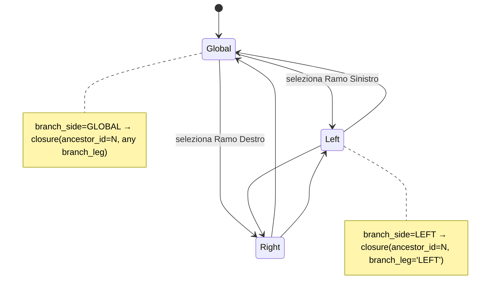
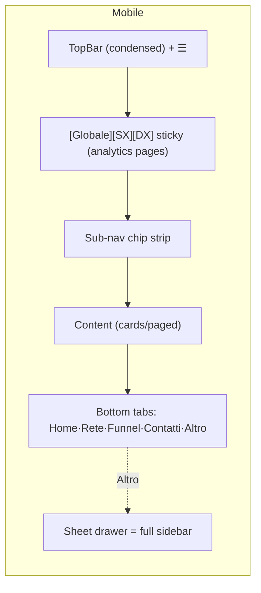

# 05 — Navigation Structure (Information Architecture & Shell)

> **Status:** Architecture-validation phase. No application code. This document is the single
> source of truth for the application **navigation / information architecture**: the primary
> sidebar, the top bar, contextual sub-navigation, and the **Global / Left Branch / Right Branch
> view switcher** that re-scopes the entire analytics surface. It defines how navigation
> **adapts by rank and role**, the Italian labels with their `next-intl` i18n keys, route paths,
> and mobile behaviour.
>
> **Binds to:** the canonical schema [`01-database-schema.md`](./01-database-schema.md) (exact
> table/column/enum identifiers) and the authorization model
> [`03-roles-matrix.md`](./03-roles-matrix.md) (the four orthogonal axes: org role, rank,
> permission flags, genealogy scope). Navigation **renders** the capabilities those documents
> define — it never grants anything the matrix denies. Every visibility/capability gate named
> here resolves to a value already specified there.
>
> **Stack context:** Next.js 14 App Router + TypeScript + Tailwind + shadcn/ui + Recharts;
> `next-intl` for i18n; routes under a locale segment (`/[locale]/...`, default `it`). The shell
> is **desktop-first**, fully responsive down to mobile.

---

## 0. Governing principles

The navigation is a **pure projection of the authorization model**. Four rules hold everywhere:

| # | Principle | Consequence in the nav |
|---|---|---|
| 1 | **The nav never widens reach.** Visibility is the genealogy subtree (axis 4 / RLS); rank (axis 2) only tunes *which analytics surfaces are shown*, role (axis 1) only unlocks *management/org-wide* surfaces. | A `vice_president` *member* sees the same nav *scope* as a `consultant` (own subtree) — just more analytics items inside it. Only `owner`/`admin` get the org-wide sections. |
| 2 | **CRM gate first.** A login whose `effective_crm_access = false` (only an `executive` with no `crm_access` override) never reaches the CRM shell. | Such users get a minimal **"Accesso CRM non attivo"** landing, not the sidebar. |
| 3 | **Capability flags gate items, not pages-by-luck.** Items requiring `export_enabled`, `manage_documents`, `view_branch_comparison`, `can_invite` are hidden when the flag is absent (per `memberships.permissions`), and the route is also guarded server-side. | Hiding ≠ securing: every gated route additionally re-checks the JWT/membership in its server component / Edge Function. |
| 4 | **One scope context, everywhere.** The Global / Left / Right switcher sets a single `branch_side` context (`GLOBAL` \| `LEFT` \| `RIGHT`, the schema enum) consumed by every analytics surface on the current node. | Switching branch re-scopes dashboard, funnel, conversion, team, leaderboards, bottlenecks — without changing route. |

> **Source-of-truth mapping.** Every "shown if…" condition below is one of:
> `role ∈ {owner,admin}` (axis 1), `effective_crm_access` (§2.1 of doc #03),
> a rank threshold via `ranks_meta.sort_order` (axis 2), or a `memberships.permissions` flag
> (axis 3). No new authorization concept is introduced here.

---

## 1. The application shell (desktop)

```
┌───────────────────────────────────────────────────────────────────────────────────────┐
│ TOP BAR                                                                                 │
│ [☰] [LOGO]   [ Global ▾ | Ramo SX | Ramo DX ]      [⌕ search] [🔔] [unread] [🌐 it] [👤]│
├───────────┬─────────────────────────────────────────────────────────────────────────────┤
│           │ BREADCRUMB  ›  CONTEXTUAL SUB-NAV (tabs)                                     │
│  PRIMARY  ├─────────────────────────────────────────────────────────────────────────────┤
│  SIDEBAR  │                                                                             │
│  (rank-   │                       MAIN CONTENT (route)                                  │
│  adaptive)│                                                                             │
│           │                                                                             │
│ [collapse]│                                                                             │
└───────────┴─────────────────────────────────────────────────────────────────────────────┘
```

Three persistent chrome regions plus the routed content:

| Region | Responsibility | Persists across routes? |
|---|---|---|
| **Top bar** | Global utilities + the **branch view switcher** (the single most important global control) | Yes |
| **Primary sidebar** | First-level destinations, filtered by role + rank + flags | Yes (collapsible) |
| **Contextual sub-nav** | Second-level tabs/sections *within* the active primary destination | Changes per primary item |
| **Main content** | The routed page; reads the active `branch_side` scope where analytics apply | — |

```mermaid
flowchart TB
    subgraph Shell["AppShell (/[locale]/(crm))"]
      TB[TopBar: branch switcher · search · notifications · locale · user]
      SB[Sidebar: primary nav, rank/role-filtered]
      SUB[ContextualSubNav: tabs for active section]
      MC[Main content / route outlet]
    end
    TB --> MC
    SB --> SUB --> MC
    Gate{effective_crm_access?}
    Gate -- false --> Landing[/[locale]/no-access landing/]
    Gate -- true --> Shell
```

---

## 2. Top bar

Left→right, with i18n keys (namespace `topbar`) and behaviour. Implemented as a shadcn/ui
header with `Sheet` (mobile drawer), `Command` (search palette), `DropdownMenu`, `Popover`.

| Element | Italian label | i18n key | Behaviour / gating |
|---|---|---|---|
| Sidebar toggle | *(icon)* | `topbar.toggle_sidebar` | Collapses/expands the primary sidebar (desktop); opens the drawer (mobile). |
| Logo / home | — | — | Links to the rank-adaptive dashboard `/[locale]/dashboard`. |
| **Branch view switcher** | **Globale · Ramo Sinistro · Ramo Destro** | `branch.global` / `branch.left` / `branch.right` | The cross-cutting scope control. See §6. Shown only where the active page is analytics-bearing; otherwise rendered disabled with tooltip `branch.not_applicable`. |
| Scope node indicator | "Vista: {nome}" | `topbar.scope_node` | Shows whose subtree is currently scoped (self by default; a downline when drilled in from the tree). Click → reset to self (`topbar.reset_scope`). |
| Global search | "Cerca…" | `topbar.search_placeholder` | `Command` palette (`⌘K`/`Ctrl K`). Searches marketers (`marketers.display_name`, trgm), contacts (`contacts` name trgm), prospects (`prospects.full_name`), documents (`internal_documents.title`). Results are **RLS-filtered** — only the caller's subtree + org-readable docs surface. |
| Notifications | "Notifiche" | `topbar.notifications` | Bell + unread count from `notifications WHERE recipient_marketer_id = jwt.marketer_id AND read_at IS NULL`. Realtime-subscribed. Opens a `Popover` list; deep-links via `notifications.payload`. |
| Locale switcher | "Lingua" | `topbar.locale` | `next-intl` locale switch (it default; i18n-ready for future locales). Persists to `organizations.locale` default + per-user preference. |
| User menu | "{display_name}" | `topbar.user_menu` | Avatar (`marketers.avatar_url`). Items: *Il mio profilo* (`topbar.my_profile` → `/profilo/me`), *Impostazioni account* (`topbar.account_settings`), *Esci* (`topbar.logout`). |

> **Search RLS note:** the palette calls a single RPC `global_search(q text)` that runs
> `can_see_marketer()`-gated queries (doc #03 §7) so results never leak outside the subtree;
> admins/owners get org-wide results because they bypass the closure filter.

---

## 3. Primary sidebar — the full nav tree (Italian + i18n keys + routes)

The sidebar is grouped into sections. Every leaf lists its **route**, **Italian label**,
**`next-intl` key** (namespace `nav`), and its **visibility gate** expressed in the doc-#03
vocabulary. Routes live under `/[locale]/(crm)/…`; the `[locale]` and `(crm)` route-group
segments are omitted from the path column for brevity.

> **Gate legend** — `crm` = requires `effective_crm_access` (all CRM-eligible members satisfy
> this; baseline for the whole shell); `rank≥X` = `ranks_meta.sort_order(rank) ≥ sort_order(X)`;
> `flag:NAME` = `memberships.permissions.NAME` truthy (with the doc-#03 default);
> `role:admin|owner` = axis-1 org role. Gates compose with AND.

### 3.1 Section — **Panoramica** (`nav.section.overview`)

| Route | Label (IT) | i18n key | Gate |
|---|---|---|---|
| `/dashboard` | Dashboard | `nav.dashboard` | `crm` (shape varies by rank — §5) |
| `/notifiche` | Notifiche | `nav.notifications` | `crm` |
| `/avvisi` | Avvisi & Colli di bottiglia | `nav.bottlenecks` | `crm` (reads `bottleneck_findings`, own subtree) |

### 3.2 Section — **Rete** (Genealogy) (`nav.section.network`)

| Route | Label (IT) | i18n key | Gate |
|---|---|---|---|
| `/rete/albero` | Albero genealogico | `nav.tree` | `crm` |
| `/rete/team` | Il mio team | `nav.team` | `crm` |
| `/rete/rami` | Confronto rami (SX / DX) | `nav.branches` | `crm` AND (`rank≥team_leader` OR `flag:view_branch_comparison`) |
| `/rete/sponsorizzazioni` | Sponsorizzazioni | `nav.sponsorships` | `crm` (`sponsor_id` view, distinct from placement) |
| `/rete/pre-registrazioni` | Pre-registrazioni | `nav.preregistrations` | `crm` (creates `marketers` profiles, status `pending`) |

### 3.3 Section — **CRM** (`nav.section.crm`)

| Route | Label (IT) | i18n key | Gate |
|---|---|---|---|
| `/crm/contatti` | Contatti | `nav.contacts` | `crm` |
| `/crm/centos` | Centos List | `nav.centos` | `crm` |
| `/crm/prospect` | Prospect (Funnel) | `nav.prospects` | `crm` |
| `/crm/chiamate` | Chiamate | `nav.calls` | `crm` |
| `/crm/follow-up` | Follow-up in scadenza | `nav.followups` | `crm` (queue on `contacts.next_follow_up_at`) |

### 3.4 Section — **Analisi** (Analytics) (`nav.section.analytics`)

| Route | Label (IT) | i18n key | Gate |
|---|---|---|---|
| `/analisi/performance` | Performance funnel | `nav.analytics_performance` | `crm` |
| `/analisi/conversioni` | Conversioni | `nav.analytics_conversion` | `crm` |
| `/analisi/team` | Analisi team | `nav.analytics_team` | `crm` AND `rank≥team_leader` |
| `/analisi/rami` | Analisi rami (SX vs DX) | `nav.analytics_branch` | `crm` AND (`rank≥team_leader` OR `flag:view_branch_comparison`) |
| `/analisi/avanzata` | Analisi avanzata | `nav.analytics_advanced` | `crm` AND `rank≥senior_team_leader` |
| `/analisi/classifiche` | Classifiche | `nav.leaderboards` | `crm` |
| `/analisi/report` | Report mensili | `nav.reports` | `crm` (`monthly_reports`; export item gated by `flag:export_enabled`) |

### 3.5 Section — **Risorse** (`nav.section.resources`)

| Route | Label (IT) | i18n key | Gate |
|---|---|---|---|
| `/risorse/documenti` | Documenti interni | `nav.documents` | `crm` (read: all CRM-eligible; create/edit gated by `flag:manage_documents`) |
| `/risorse/sette-perche` | Sette Perché | `nav.seven_whys` | `crm` (own `seven_whys`; downlines' within subtree) |

### 3.6 Section — **Direzione** (Executive) (`nav.section.executive`)

| Route | Label (IT) | i18n key | Gate |
|---|---|---|---|
| `/direzione/ceo` | Dashboard Direzione (CEO) | `nav.ceo_dashboard` | `role:admin\|owner` (org-wide; the "Executive (CEO) dashboard") |
| `/direzione/org-analytics` | Analisi organizzazione | `nav.org_analytics` | `role:admin\|owner` |
| `/direzione/classifiche-org` | Classifiche organizzazione | `nav.org_leaderboards` | `role:admin\|owner` (scope `org`) |

### 3.7 Section — **Amministrazione** (`nav.section.admin`)

| Route | Label (IT) | i18n key | Gate |
|---|---|---|---|
| `/admin/utenti` | Utenti & Account | `nav.admin_users` | `role:admin\|owner` (manage `memberships`) |
| `/admin/attivazioni` | Attivazioni CRM | `nav.admin_activations` | `role:admin\|owner` OR `flag:can_invite` (issue `account_invitations`) |
| `/admin/gradi` | Gradi & Storico | `nav.admin_ranks` | `role:admin\|owner` (change `marketers.rank`, read `rank_history`) |
| `/admin/permessi` | Permessi & Idoneità CRM | `nav.admin_permissions` | `role:admin\|owner` (set `memberships.permissions`, the Executive override) |
| `/admin/audit` | Registro attività (Audit) | `nav.admin_audit` | `role:admin\|owner` (read `audit_log`) |
| `/admin/organizzazione` | Impostazioni organizzazione | `nav.admin_org_settings` | `role:owner` (edit `organizations.settings`); `admin` read-only |
| `/admin/fatturazione` | Fatturazione | `nav.admin_billing` | `role:owner` |

### 3.8 Sidebar footer (always present)

| Route | Label (IT) | i18n key | Gate |
|---|---|---|---|
| `/profilo/me` | Il mio profilo | `nav.my_profile` | `crm` |
| `/impostazioni` | Impostazioni | `nav.settings` | `crm` |
| *(action)* | Comprimi menu | `nav.collapse` | always (collapses sidebar to icons) |

### 3.9 Visual tree (condensed)

```
PANORAMICA
 ├─ Dashboard                         /dashboard
 ├─ Notifiche                         /notifiche
 └─ Avvisi & Colli di bottiglia       /avvisi
RETE
 ├─ Albero genealogico                /rete/albero
 ├─ Il mio team                       /rete/team
 ├─ Confronto rami (SX/DX)            /rete/rami            [rank≥team_leader | flag]
 ├─ Sponsorizzazioni                  /rete/sponsorizzazioni
 └─ Pre-registrazioni                 /rete/pre-registrazioni
CRM
 ├─ Contatti                          /crm/contatti
 ├─ Centos List                       /crm/centos
 ├─ Prospect (Funnel)                 /crm/prospect
 ├─ Chiamate                          /crm/chiamate
 └─ Follow-up in scadenza             /crm/follow-up
ANALISI
 ├─ Performance funnel                /analisi/performance
 ├─ Conversioni                       /analisi/conversioni
 ├─ Analisi team                      /analisi/team        [rank≥team_leader]
 ├─ Analisi rami (SX vs DX)           /analisi/rami        [rank≥team_leader | flag]
 ├─ Analisi avanzata                  /analisi/avanzata    [rank≥senior_team_leader]
 ├─ Classifiche                       /analisi/classifiche
 └─ Report mensili                    /analisi/report
RISORSE
 ├─ Documenti interni                 /risorse/documenti
 └─ Sette Perché                      /risorse/sette-perche
DIREZIONE                                                  [admin|owner]
 ├─ Dashboard Direzione (CEO)         /direzione/ceo
 ├─ Analisi organizzazione            /direzione/org-analytics
 └─ Classifiche organizzazione        /direzione/classifiche-org
AMMINISTRAZIONE                                            [admin|owner]
 ├─ Utenti & Account                  /admin/utenti
 ├─ Attivazioni CRM                   /admin/attivazioni   [admin|owner | flag:can_invite]
 ├─ Gradi & Storico                   /admin/gradi
 ├─ Permessi & Idoneità CRM           /admin/permessi
 ├─ Registro attività (Audit)         /admin/audit
 ├─ Impostazioni organizzazione       /admin/organizzazione [owner; admin read-only]
 └─ Fatturazione                      /admin/fatturazione   [owner]
─────────────────────────────────────
 Il mio profilo · Impostazioni · Comprimi menu
```

---

## 4. Contextual sub-navigation (per primary destination)

Each primary destination has its own second-level navigation (shadcn/ui `Tabs` on desktop, a
horizontal scroll-snap strip on mobile). Sub-nav items inherit the active `branch_side` scope
where analytics apply. Namespace for keys below: `subnav`.

### 4.1 `/rete/albero` — Albero genealogico

| Tab | Label (IT) | i18n key | Notes |
|---|---|---|---|
| Tree canvas | Albero | `subnav.tree.canvas` | Binary tree: expand/collapse/zoom/drag, search, branch summaries. Each node card shows `display_name`, `ranks_meta.label_it`, `status`, team size (closure descendant count), KPIs (calls/new prospects/enrollments from `daily_marketer_metrics`). Activity/performance indicator badges. |
| Left branch | Ramo Sinistro | `subnav.tree.left` | Sets `branch_side = LEFT`; canvas roots at the node's LEFT child (`closure.branch_leg = 'LEFT'`). |
| Right branch | Ramo Destro | `subnav.tree.right` | Sets `branch_side = RIGHT`; roots at RIGHT child. |
| Statistics | Statistiche team | `subnav.tree.stats` | Team/branch summary cards for the scoped node. |

> **Node drill-in re-scopes the shell.** Selecting a downline node in the tree sets the
> **scope node** (top-bar "Vista: {nome}") to that descendant, so every analytics page now
> reports on that node's subtree — still bounded by RLS (you can only drill into nodes already in
> your subtree). Resetting returns scope to self.

### 4.2 `/crm/contatti` — Contatti

| Tab | Label (IT) | i18n key | Notes |
|---|---|---|---|
| All | Tutti | `subnav.contacts.all` | List with search (trgm), filter (`status`, `source`, `tags`), sort, bulk actions. |
| By status | Per stato | `subnav.contacts.by_status` | Grouped by `contact_status` (nuovo … perso). |
| Follow-up | Da ricontattare | `subnav.contacts.followups` | `next_follow_up_at <= now()` queue. |
| Tags | Etichette | `subnav.contacts.tags` | Tag management (`contacts.tags`). |

### 4.3 `/crm/prospect` — Prospect (Funnel)

| Tab | Label (IT) | i18n key | Notes |
|---|---|---|---|
| Funnel board | Funnel | `subnav.prospects.board` | Kanban by the 6 canonical `prospect_stage` columns: Conoscitiva · Business Info · Follow-up · Closing · Check Soldi · Iscrizione. Drag = `change_prospect_stage()`. |
| List | Elenco | `subnav.prospects.list` | Tabular, filter by `current_stage`/`outcome`. |
| Journey history | Storico percorso | `subnav.prospects.history` | `prospect_journey_events` timeline (entry/exit/time-in-stage/responsible/notes). |

> **Stage labels (canonical → IT):** `conoscitiva`→Conoscitiva, `business_info`→Business Info,
> `follow_up`→Follow-up, `closing`→Closing, `check_soldi`→Check Soldi, `iscrizione`→Iscrizione.
> Keys under namespace `stage.*`.

### 4.4 `/analisi/performance` — Performance funnel

| Tab | Label (IT) | i18n key | Notes |
|---|---|---|---|
| Totals | Totali per fase | `subnav.perf.totals` | Totals per funnel stage (`mv_funnel_totals`), scoped by current `branch_side`. |
| Trend | Andamento | `subnav.perf.trend` | Monthly/quarterly series. |
| Activity | Attività | `subnav.perf.activity` | Calls/duration/recruits from `daily_marketer_metrics`. |

### 4.5 `/analisi/conversioni` — Conversioni

| Tab | Label (IT) | i18n key | Notes |
|---|---|---|---|
| Stage-to-stage | Fase per fase | `subnav.conv.stage` | Stage-to-stage % from `mv_stage_conversion`. |
| Monthly | Mensile | `subnav.conv.monthly` | `period_month` slices. |
| Quarterly | Trimestrale | `subnav.conv.quarterly` | Quarterly trend. |
| Time-in-stage | Tempo per fase | `subnav.conv.time` | `avg_time_in_stage_secs`. |

### 4.6 `/analisi/classifiche` — Classifiche

| Tab | Label (IT) | i18n key | Notes |
|---|---|---|---|
| Calls | Chiamate | `subnav.lead.calls` | `leaderboard_metric = 'calls'`. |
| New prospects | Nuovi prospect | `subnav.lead.new_prospects` | `'new_prospects'`. |
| Conversion | Conversione | `subnav.lead.conversion` | `'conversion_rate'`. |
| Enrollments | Iscrizioni | `subnav.lead.enrollments` | `'enrollments'`. |
| Team growth | Crescita team | `subnav.lead.team_growth` | `'team_growth'`. |

Leaderboard **filters** (toolbar, not tabs): period (Mese/Anno → `subnav.lead.filter_period`),
scope (Team/Ramo/Org → from `leaderboard_scope`; `org` only for admin/owner), branch
(SX/DX/Globale → `branch_side`). Reads `leaderboard_snapshots` by
`(metric, scope, scope_ref_id, branch_side, period_start)`.

### 4.7 `/risorse/documenti` — Documenti interni

| Tab | Label (IT) | i18n key | Notes |
|---|---|---|---|
| All | Tutti | `subnav.docs.all` | Filter by `document_category` + `document_status`. |
| By category | Per categoria | `subnav.docs.by_category` | Formazione/Script/Procedura/Marketing/Onboarding/Altro. |
| Archive | Archivio | `subnav.docs.archive` | `status = 'archived'`. |
| Versions | Versioni | `subnav.docs.versions` | `document_versions` history (per-doc). Create/edit/duplicate gated by `flag:manage_documents`. |

### 4.8 `/profilo/[id]` — Marketer profile (self or downline)

| Tab | Label (IT) | i18n key | Notes |
|---|---|---|---|
| Overview | Panoramica | `subnav.profile.overview` | Identity, `ranks_meta.label_it`, `status`, team size, KPIs. |
| Genealogy | Genealogia | `subnav.profile.genealogy` | Placement (parent/leg) + sponsorship; mini-tree. |
| CRM | CRM | `subnav.profile.crm` | Owned contacts/prospects/calls/Centos. |
| Sette Perché | Sette Perché | `subnav.profile.seven_whys` | The `seven_whys` record. |
| Rank history | Storico gradi | `subnav.profile.rank_history` | `rank_history` rows. |
| Account | Account | `subnav.profile.account` | Activation state (`memberships`); **Attiva accesso CRM** action if no active membership and inviter is `role:admin\|owner` or `flag:can_invite`. |

### 4.9 `/admin/*` — Administration

| Section | Label (IT) | i18n key | Sub-tabs |
|---|---|---|---|
| Utenti | Utenti & Account | `subnav.admin.users` | Attivi / Invitati / Sospesi / Disabilitati (`membership_status`). |
| Attivazioni | Attivazioni CRM | `subnav.admin.activations` | In sospeso / Accettate / Scadute / Revocate (`invitation_status`). |
| Gradi | Gradi & Storico | `subnav.admin.ranks` | Gradi attuali / Storico cambi (`rank_history`). |
| Permessi | Permessi & Idoneità CRM | `subnav.admin.permissions` | Per-account `permissions` flags + Executive `crm_access` override. |

---

## 5. Rank-adaptive navigation & dashboards

Navigation **and** the dashboard composition adapt to the caller. Two independent dials:

- **Org role (axis 1)** decides whether the **Direzione** and **Amministrazione** sections exist
  at all (org-wide reach). Only `owner`/`admin` (and `flag:can_invite` for the single
  *Attivazioni* item) see them.
- **Rank (axis 2)** decides how many **Analisi** items appear and the **Dashboard** widget set —
  always within the caller's own subtree.

### 5.1 What each rank sees (member accounts, own subtree)

| Rank (`ranks_meta`) | `sort_order` | Dashboard focus | Sidebar items added at this rank (cumulative) |
|---|---|---|---|
| **Executive** *(no CRM by default)* | 1 | — | **No CRM shell.** If `crm_access` override is set, behaves as Consultant. |
| **Consultant** | 2 | Personal funnel + personal activity | Panoramica, Rete (tree/team/sponsorships/pre-reg), full CRM, **Performance funnel**, **Conversioni**, **Classifiche**, **Report mensili**, Risorse. *(Personal scope.)* |
| **Team Leader** | 3 | + Team performance | **adds** `Analisi team` (`/analisi/team`), `Confronto rami` + `Analisi rami` (branch SX/DX default-on at this rank), team-scoped leaderboard filters. |
| **Senior Team Leader** | 4 | + Advanced analytics | **adds** `Analisi avanzata` (`/analisi/avanzata`): deeper cohort/trend/bottleneck breakdowns across the subtree. |
| **Executive Team Leader** | 5 | + Advanced/org-style analytics on own large subtree | Same item set as Senior; dashboard surfaces richer multi-branch comparisons and subtree-wide bottleneck rollups (still own-subtree, not org). |
| **Vice President** | 6 | **Full executive-style dashboard + branch comparison** (own subtree) | Same item set; dashboard is the richest "executive view" of the **own** subtree: Global/Left/Right comparison front-and-centre, all leaderboard scopes within subtree, full bottleneck panel. **Org-wide remains admin-only.** |

> **Key invariant (from doc #03 §2.1):** higher rank never widens *visibility*. A `vice_president`
> member's "executive dashboard" reports on their **own subtree**; the org-wide **Direzione**
> CEO dashboard is a separate, `admin`/`owner`-gated surface. The two must not be confused.

### 5.2 Admin / owner overlay

When `role ∈ {admin, owner}` the entire **Direzione** and **Amministrazione** sections appear,
**and** the branch switcher / analytics pages can be scoped org-wide (every marketer, all
branches) because these roles bypass the closure subtree filter. The CEO dashboard
(`/direzione/ceo`) is the org-level "Executive (CEO) dashboard" from the feature surface —
distinct from the rank-driven personal dashboard at `/dashboard`. An `owner` additionally sees
*Impostazioni organizzazione* (write) and *Fatturazione*.

### 5.3 Dashboard widget matrix (`/dashboard`, rank-adaptive)

Widgets are toggled by the same gates; all data is own-subtree (or org-wide for admin/owner).

| Widget (IT label / key `dash.*`) | Consultant | Team Leader | Senior TL | Exec TL | VP | admin/owner |
|---|:--:|:--:|:--:|:--:|:--:|:--:|
| Funnel personale (`dash.personal_funnel`) | ✔ | ✔ | ✔ | ✔ | ✔ | ✔ |
| Attività & chiamate (`dash.activity`) | ✔ | ✔ | ✔ | ✔ | ✔ | ✔ |
| Follow-up in scadenza (`dash.followups`) | ✔ | ✔ | ✔ | ✔ | ✔ | ✔ |
| Conversioni (`dash.conversion`) | ✔ | ✔ | ✔ | ✔ | ✔ | ✔ |
| Performance team (`dash.team`) | — | ✔ | ✔ | ✔ | ✔ | ✔ |
| Confronto rami SX/DX (`dash.branch_compare`) | — | ✔ | ✔ | ✔ | ✔ | ✔ |
| Analisi avanzata / cohorts (`dash.advanced`) | — | — | ✔ | ✔ | ✔ | ✔ |
| Colli di bottiglia (`dash.bottlenecks`) | own | own | own | own | own | org |
| Classifiche (`dash.leaderboards`) | subtree | subtree | subtree | subtree | subtree | org |
| Report mensile (MoM) (`dash.monthly_report`) | ✔ | ✔ | ✔ | ✔ | ✔ | ✔ (org row) |
| Vista esecutiva organizzazione (`dash.executive_org`) | — | — | — | — | — | ✔ (CEO) |

> "own" = `bottleneck_findings`/`leaderboard_snapshots` scoped to the caller's subtree;
> "org" = org-wide (admin bypass). The VP's dashboard is "executive-styled" but still **subtree**;
> only admin/owner unlock the org row.

---

## 6. Global / Left Branch / Right Branch view switcher (the cross-cutting control)

The single most distinctive navigation element. It sets one **scope context** consumed by every
analytics-bearing surface without changing the route.

### 6.1 Semantics

The switcher writes `branch_side ∈ {GLOBAL, LEFT, RIGHT}` — exactly the schema enum
`branch_side` (Group 6). Combined with the **scope node** (self by default, or a drilled-in
downline), it determines which `marketer_tree_closure` rows feed every aggregation:

| Switcher value | Meaning relative to the scope node `N` | Closure predicate |
|---|---|---|
| **Globale** (`GLOBAL`) | Entire subtree of `N` (both branches + `N`'s own activity) | `closure WHERE ancestor_id = N` (all depths, any `branch_leg`) |
| **Ramo Sinistro** (`LEFT`) | Only descendants hanging off `N`'s LEFT child | `closure WHERE ancestor_id = N AND branch_leg = 'LEFT'` |
| **Ramo Destro** (`RIGHT`) | Only descendants hanging off `N`'s RIGHT child | `closure WHERE ancestor_id = N AND branch_leg = 'RIGHT'` |

This is **O(index)**: `branch_leg` is precomputed on the closure rows (schema §2.2 design note),
so Left/Right re-scoping is a single indexed predicate, never a path scan. The same predicate
feeds `daily_marketer_metrics` joins, `mv_funnel_totals`, `mv_stage_conversion`,
`leaderboard_snapshots` (`branch_side` column), and `bottleneck_findings`.

### 6.2 Which surfaces obey the switcher

| Surface | Re-scopes on switch? | How |
|---|---|---|
| Dashboard (`/dashboard`) analytics widgets | Yes | All subtree-aggregating widgets filter by `branch_side`. |
| `/rete/albero` | Yes | LEFT/RIGHT root the canvas at the corresponding child; GLOBAL shows full tree from `N`. |
| `/rete/rami`, `/analisi/rami` | Special | These pages show **all three side-by-side** (Global vs SX vs DX); the switcher highlights the focused column but the comparison always renders the pair. |
| `/analisi/performance`, `/analisi/conversioni`, `/analisi/team`, `/analisi/avanzata` | Yes | Closure join filtered by `branch_side`. |
| `/analisi/classifiche` | Yes | `leaderboard_snapshots.branch_side` filter. |
| `/avvisi` (bottlenecks) | Yes | `bottleneck_findings` filtered to the chosen branch's marketers. |
| `/crm/*` (contacts, prospects, calls, Centos) | No (record CRUD is per-owner) | The switcher is rendered disabled here with tooltip `branch.not_applicable`. |
| `/risorse/*`, `/admin/*`, `/profilo/*` | No | Non-analytics; switcher disabled. |

### 6.3 State & persistence

- Held in a client store (e.g. URL search param `?branch=GLOBAL|LEFT|RIGHT` + the `scope`
  node id), so a branch view is **shareable/bookmarkable** and survives reload.
- Default on entering any analytics surface: `GLOBAL`, scope = self.
- Switching branch or scope node **never** triggers a route change — only a data re-fetch with
  the new predicate (React Query key includes `{scope_node_id, branch_side}`).
- For admin/owner with org-wide scope, the switcher's `GLOBAL` means the whole org tree from the
  org root; LEFT/RIGHT mean the org root's two top-level branches.



---

## 7. Route map (Next.js App Router)

All routes are under the locale segment and a `(crm)` route group that mounts the
`AppShell` (top bar + sidebar) and enforces the CRM gate in its layout server component.
Pre-auth and no-access routes live outside the shell.

```
app/
  [locale]/
    (auth)/                         # no shell
      login/                        /[locale]/login                 → topbar/auth keys
      recupero-password/            /[locale]/recupero-password
      attiva/[token]/               /[locale]/attiva/[token]        # account activation landing
    (public)/
      no-access/                    /[locale]/no-access             # effective_crm_access=false landing
    (crm)/                          # AppShell + CRM gate (layout.tsx server guard)
      dashboard/                    /[locale]/dashboard
      notifiche/
      avvisi/
      rete/
        albero/  team/  rami/  sponsorizzazioni/  pre-registrazioni/
      crm/
        contatti/[id]?  centos/  prospect/[id]?  chiamate/  follow-up/
      analisi/
        performance/  conversioni/  team/  rami/  avanzata/  classifiche/  report/
      risorse/
        documenti/[id]?  sette-perche/
      profilo/
        me/  [id]/
      impostazioni/
      direzione/                    # layout guard: role ∈ {admin,owner}
        ceo/  org-analytics/  classifiche-org/
      admin/                        # layout guard: role ∈ {admin,owner} (owner-only leaves marked)
        utenti/  attivazioni/  gradi/  permessi/  audit/
        organizzazione/  fatturazione/
```

> **Layout-level guards.** `(crm)/layout.tsx` reads the JWT claims (`org_id`, `marketer_id`,
> `role`, plus membership `permissions`) server-side and (a) redirects to `/no-access` when
> `effective_crm_access` is false, (b) renders only the permitted sidebar items.
> `direzione/layout.tsx` and `admin/layout.tsx` add a `role ∈ {admin,owner}` check and 403 to a
> *"Non autorizzato"* page (`error.unauthorized`) otherwise — defence in depth alongside RLS.

---

## 8. Mobile navigation (desktop-first, mobile-optimized)

The shell degrades to a mobile pattern below the `md` breakpoint (Tailwind `< 768px`).

### 8.1 Layout transformation

| Desktop region | Mobile equivalent |
|---|---|
| Persistent sidebar | **Off-canvas drawer** (shadcn/ui `Sheet`), opened by the ☰ button; the same rank/role-filtered tree, full-height, scrollable. Closes on selection. |
| Top bar | Condensed: ☰ · logo · search icon (opens full-screen `Command`) · 🔔 · avatar. Locale + scope indicator move **into** the user menu / drawer header. |
| Branch view switcher | **Segmented control pinned under the top bar** (sticky) on analytics pages: `[Globale][SX][DX]`. On non-analytics pages it is hidden, not disabled, to save space. |
| Contextual sub-nav (tabs) | **Horizontal scroll-snap chip strip** directly under the page title; the active chip auto-scrolls into view. |
| — | **Bottom tab bar** (5 primary destinations) for thumb reach — see §8.2. |

### 8.2 Bottom tab bar (mobile only)

The five most-used destinations get a fixed bottom bar; everything else lives in the drawer.

| Tab | Label (IT) | i18n key | Route |
|---|---|---|---|
| Dashboard | Home | `mobile.tab.home` | `/dashboard` |
| Tree | Rete | `mobile.tab.network` | `/rete/albero` |
| Prospects | Funnel | `mobile.tab.funnel` | `/crm/prospect` |
| Contacts | Contatti | `mobile.tab.contacts` | `/crm/contatti` |
| More | Altro | `mobile.tab.more` | opens the full drawer |

For `admin`/`owner`, the **Altro** drawer additionally lists the **Direzione** and
**Amministrazione** sections (these never occupy a bottom tab — they are low-frequency on mobile).

### 8.3 Mobile-specific behaviour

- **Genealogy tree** (`/rete/albero`) on mobile: pan/zoom touch gestures; drag-to-replace is
  **disabled** on touch (admin re-placement is a desktop action), node cards collapse to
  name + rank + a tappable KPI sheet (`Drawer` from bottom).
- **Funnel board** (`/crm/prospect`): the 6-stage Kanban becomes a single-column, **stage-paged**
  view with a stage selector chip strip; drag between stages replaced by a "Sposta in…"
  (`mobile.move_to`) action sheet calling `change_prospect_stage()`.
- **Tables → cards:** contacts/calls/leaderboard rows render as stacked cards with the primary
  metric prominent; bulk actions move into a multi-select mode with a bottom action bar.
- **Charts (Recharts):** single-metric, full-width, horizontally scrollable for time series;
  branch comparison stacks Global/SX/DX vertically instead of side-by-side.
- **Search & notifications** open as full-screen overlays.



---

## 9. i18n key conventions

- **Namespaces:** `nav.*` (sidebar), `subnav.*` (contextual tabs), `topbar.*`, `branch.*`,
  `dash.*` (dashboard widgets), `stage.*` (the 6 `prospect_stage` labels),
  `mobile.*` (mobile chrome), `error.*` (guard/403 pages).
- **Domain enum labels are sourced from data, not hard-coded:** rank labels come from
  `ranks_meta.label_it`; `contact_status`, `contact_source`, `document_category`,
  `prospect_outcome`, `call_outcome`, `membership_status`, `invitation_status` render via a
  shared `enumLabel(enumType, value)` helper backed by `next-intl` message catalogs keyed on the
  **canonical Italian snake_case** value (e.g. `enum.contact_status.in_lavorazione = "In lavorazione"`).
  This guarantees the canonical stored value (Italian where the business defines it, English for
  system enums like `LEFT`/`RIGHT`/`GLOBAL`) always maps to a consistent display label.
- **Default locale `it`** is the source catalog; the structure is fully i18n-ready (`next-intl`
  with locale-segmented routes) for future locales without nav restructuring.

---

## 10. Cross-document consistency check

| This document references | Resolves to (schema #01 / roles #03) |
|---|---|
| Branch switcher values `GLOBAL`/`LEFT`/`RIGHT` | `branch_side` enum (schema §6) |
| Left/Right re-scope predicate | `marketer_tree_closure.branch_leg` + `ancestor_id` (schema §2.2) |
| Tree node KPIs | `daily_marketer_metrics`, closure descendant count (schema §6.1, §2.2) |
| Funnel stages & board columns | `prospect_stage` enum (schema §5) |
| Stage transition action | `change_prospect_stage()` + `prospect_journey_events` (schema §5.2) |
| Performance / conversion pages | `mv_funnel_totals`, `mv_stage_conversion` (schema §6.2–6.3) |
| Leaderboards filters | `leaderboard_snapshots` (`metric`,`scope`,`scope_ref_id`,`branch_side`) (schema §6.5) |
| Bottleneck/Avvisi page | `bottleneck_findings` (schema §6.6) |
| Reports page + export gate | `monthly_reports` + `flag:export_enabled` (schema §6.4 / roles §3.1) |
| Documents read/write split | `internal_documents`/`document_versions` + `flag:manage_documents` (schema §4.4 / roles §3.1) |
| Sette Perché page | `seven_whys` (schema §4.3) |
| Centos page | `centos_list_entries` (schema §4.2) |
| Pre-registration / activation | `marketers` (status `pending`) → `account_invitations` → `memberships` (schema §2.1,§3.1,§1.2) |
| Admin sections (users/ranks/permissions/audit) | `memberships`, `rank_history`, `memberships.permissions`, `audit_log` (schema §1.2,§2.3,§6.8) |
| Rank thresholds in sidebar gates | `ranks_meta.sort_order`/`crm_eligible` (schema §2.0 / roles §2) |
| Role gates `admin`/`owner` | `membership_role` (schema §1) / roles axis 1 (#03 §1) |
| CRM gate | `effective_crm_access` (roles §2.1) |
| Capability flags | `memberships.permissions` (`crm_access`,`export_enabled`,`manage_documents`,`view_branch_comparison`,`can_invite`) (roles §3.1) |
| Notifications bell | `notifications` (schema §6.7) |

No identifier in this document diverges from the canonical schema or the roles matrix.

---

## 11. Open Questions / Decisions Needing Sign-off

1. **Branch-comparison minimum rank vs. flag-only.** Sidebar shows `Confronto rami` /
   `Analisi rami` for `rank ≥ team_leader` OR `flag:view_branch_comparison`, mirroring roles
   #03 §3.1. Confirm `team_leader` is the right default threshold (vs. always flag-gated for
   members). **Recommended: keep `team_leader` default, flag override below it.** *(Ties to
   roles #03 OQ #5.)*

2. **Advanced analytics threshold.** `/analisi/avanzata` is gated at `rank ≥ senior_team_leader`.
   Confirm Senior Team Leader is the entry point for "advanced/org-style analytics" (the brief
   groups Senior/Executive Team Leader together). **Recommended: Senior as threshold; Exec TL/VP
   inherit it.**

3. **Bottom-tab set on mobile.** The five chosen tabs are Home/Rete/Funnel/Contatti/Altro.
   Confirm these are the highest-frequency destinations for field reps (vs. e.g. swapping
   Contatti for Chiamate). Configurable per-org via `organizations.settings` is possible but
   adds complexity. **Recommended: fixed v1 set.**

4. **Scope-node drill-in persistence.** When a user drills into a downline node, we persist the
   scope node in the URL (`?scope=<marketer_id>`). Confirm drilling should re-scope **all**
   analytics pages globally (current design) vs. only the tree page. **Recommended: global
   re-scope, with a clear "Vista: {nome}" reset affordance.**

5. **Disabled vs. hidden branch switcher.** On non-analytics pages the switcher is **disabled**
   (desktop) / **hidden** (mobile). Confirm this asymmetry is acceptable, or hide on both for
   consistency. **Recommended: disabled-with-tooltip on desktop (discoverability), hidden on
   mobile (space).**

6. **`manager` role in nav (v1).** Per roles #03, `manager` behaves as `member` in v1. The
   *Attivazioni CRM* item is shown for `flag:can_invite` regardless of role, which lets a future
   `manager` use it without a nav change. Confirm no other `manager`-specific items are needed in
   v1. **Recommended: none until the delegated-admin feature ships.** *(Ties to roles #03 OQ #2.)*

7. **CEO vs. VP dashboard separation.** `/dashboard` (rank-adaptive, own subtree) and
   `/direzione/ceo` (org-wide, admin/owner) are deliberately distinct routes. Confirm a VP who is
   *also* an admin sees both entry points (personal dashboard + Direzione section) rather than a
   merged view. **Recommended: keep distinct; an admin-VP gets both.**

8. **Org-level export of leaderboards/reports.** Export items appear under `flag:export_enabled`.
   Confirm whether org-wide export (admin) and own-subtree export (member with flag) share one UI
   affordance or are separated. **Recommended: one affordance; scope follows the caller's
   reach.** *(Ties to roles #03 OQ #4.)*
