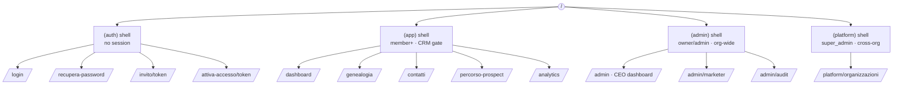
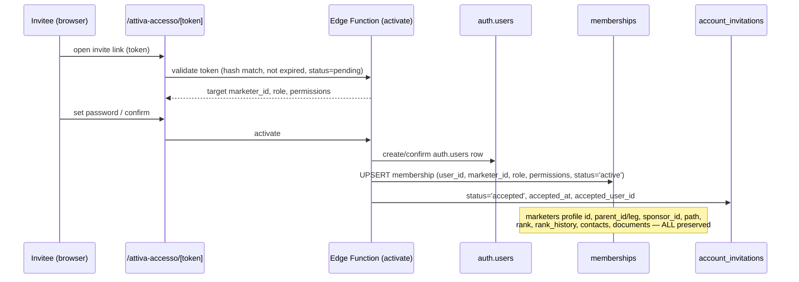

# 06 — Complete Sitemap (Next.js App Router)

> **Status:** Architecture-validation phase. No application code. This document enumerates
> **every route/page** in the Next.js 14 App Router for the platform, with: purpose, access
> control (org/platform **role** + **rank** eligibility + **permission flags** + **visibility
> scope**), the key data each route loads (referencing **exact** table/column names from
> [`01-database-schema.md`](./01-database-schema.md)), and whether the route exposes
> **Global / Left Branch / Right Branch** variants.
>
> **Binds to:**
> - Canonical schema — [`01-database-schema.md`](./01-database-schema.md) (table/column/enum names).
> - Authorization model — [`03-roles-matrix.md`](./03-roles-matrix.md) (the three orthogonal
>   axes + visibility scope). RLS SQL lives in [`04-permissions-matrix.md`](./04-permissions-matrix.md) §5 and [`10-security-architecture.md`](./10-security-architecture.md) §3.
>
> **Stack:** Next.js 14 App Router + TypeScript + Tailwind + shadcn/ui + Recharts; Supabase
> backend (Postgres 15, Auth, RLS, Edge Functions, Realtime, `pg_cron`). UI language: **Italian**,
> i18n-ready via `next-intl`. Route segments use **Italian slugs** (canonical), with `next-intl`
> locale handling layered on top.

---

## 0. Conventions for this document

| Convention | Rule |
|---|---|
| **Route segments** | Italian, kebab/lower-case (`/genealogia`, `/percorso-prospect`, `/sette-perche`). Canonical and stable; they are the product's URL contract. |
| **Route groups** | `(auth)` = unauthenticated shell; `(app)` = authenticated CRM shell; `(admin)` = org-admin shell; `(platform)` = super-admin shell. Parentheses groups do **not** add a URL segment. |
| **Dynamic segments** | `[marketerId]`, `[contactId]`, `[prospectId]`, `[documentId]`, `[token]`, `[reportId]` — all `uuid` except `[token]` (opaque invite token, validated against `account_invitations.token_hash`). |
| **i18n** | A `[locale]` segment is **not** in the path; `next-intl` middleware resolves locale from `organizations.locale` (default `'it'`) / cookie / `Accept-Language`. Slugs stay Italian regardless of locale. |
| **Access legend** | **super_admin** (platform), **owner**, **admin**, **manager** *(reserved → behaves as member in v1)*, **member**. Rank gate noted where CRM eligibility applies. Flags from `memberships.permissions`. |
| **Scope legend** | **Org-wide** (owner/admin/super_admin bypass the closure filter) vs **Own subtree** (closure `ancestor_id = jwt.marketer_id`). Every authenticated read is additionally hard-scoped by `org_id = jwt.org_id`. |
| **G/L/R variants** | "Yes" = the route renders Global / Left Branch / Right Branch tabs/views driven by `marketer_tree_closure.branch_leg` (`'LEFT'`/`'RIGHT'`) and the `branch_side` enum (`'GLOBAL'`/`'LEFT'`/`'RIGHT'`). Selection carried as a `?branch=global|left|right` search param (default `global`). |
| **CRM gate** | Authenticated `(app)` routes require `effective_crm_access = true` (`ranks_meta.crm_eligible` OR `memberships.permissions->>'crm_access' = 'true'`). An `executive` without the override is bounced to `/accesso-negato`. |
| **Data access** | All reads go through RLS-protected Postgres (PostgREST) or Edge Functions. No route ever sees cross-org rows. |

---

## 1. Top-level route tree

```text
app/
├── (auth)/                         ← unauthenticated; redirects to /dashboard if a session exists
│   ├── login/                      → /login
│   ├── recupera-password/          → /recupera-password
│   ├── reimposta-password/         → /reimposta-password         (?token=…)
│   ├── invito/[token]/             → /invito/<token>             (accept invitation landing)
│   ├── attiva-accesso/[token]/     → /attiva-accesso/<token>     ("Activate CRM Access" wizard)
│   └── verifica-email/             → /verifica-email
│
├── (app)/                          ← authenticated CRM shell (sidebar + topbar); CRM gate enforced
│   ├── dashboard/                  → /dashboard                  (rank-adaptive home)
│   │
│   ├── genealogia/                 → /genealogia                 (binary tree, G/L/R)
│   │   └── [marketerId]/           → /genealogia/<id>            (node-rooted subtree + profile drawer)
│   │
│   ├── profilo/                    → /profilo                    (my own marketer profile)
│   │   └── [marketerId]/           → /profilo/<id>               (a downline's profile)
│   │       ├── (overview)         → /profilo/<id>
│   │       ├── sette-perche/      → /profilo/<id>/sette-perche
│   │       ├── ranghi/            → /profilo/<id>/ranghi         (rank_history)
│   │       └── attivita/          → /profilo/<id>/attivita       (calls/journey timeline)
│   │
│   ├── contatti/                   → /contatti                   (CRM contact book)
│   │   ├── [contactId]/            → /contatti/<id>
│   │   └── follow-up/              → /contatti/follow-up         (due-follow-up queue)
│   │
│   ├── centos/                     → /centos                     (Centos List / list of 100)
│   │
│   ├── sette-perche/               → /sette-perche               (my Sette Perché)
│   │
│   ├── percorso-prospect/          → /percorso-prospect          (6-stage funnel board)
│   │   └── [prospectId]/           → /percorso-prospect/<id>     (prospect detail + journey history)
│   │
│   ├── chiamate/                   → /chiamate                   (call tracking log)
│   │   └── nuova/                  → /chiamate/nuova             (log a call — modal route)
│   │
│   ├── documenti/                  → /documenti                  (internal knowledge base)
│   │   ├── [documentId]/           → /documenti/<id>             (read rendered body)
│   │   │   ├── modifica/           → /documenti/<id>/modifica    (rich-text editor)
│   │   │   └── versioni/           → /documenti/<id>/versioni    (version history)
│   │   └── nuovo/                  → /documenti/nuovo
│   │
│   ├── analytics/                  → /analytics                  (performance hub, G/L/R)
│   │   ├── funnel/                 → /analytics/funnel           (totals per stage, G/L/R)
│   │   ├── conversioni/            → /analytics/conversioni      (stage-to-stage %, trend, G/L/R)
│   │   ├── team/                   → /analytics/team             (team size/active/new/growth)
│   │   ├── branche/                → /analytics/branche          (Left vs Right side-by-side)
│   │   └── colli-di-bottiglia/     → /analytics/colli-di-bottiglia (bottleneck findings)
│   │
│   ├── classifiche/                → /classifiche                (leaderboards; filters)
│   │
│   ├── report/                     → /report                     (monthly/quarterly reports list)
│   │   └── [reportId]/             → /report/<id>                (report detail + export)
│   │
│   ├── notifiche/                  → /notifiche                  (notification center)
│   │
│   └── impostazioni/               → /impostazioni               (account/profile settings)
│       ├── account/               → /impostazioni/account
│       ├── sicurezza/             → /impostazioni/sicurezza      (password, 2FA, sessions)
│       ├── notifiche/             → /impostazioni/notifiche      (notification prefs)
│       └── lingua/                → /impostazioni/lingua         (locale)
│
├── (admin)/                        ← org admin/owner shell (closure bypass; org-wide)
│   └── admin/
│       ├── (dashboard)            → /admin                       (Executive / CEO dashboard)
│       ├── marketer/              → /admin/marketer              (all profiles in org)
│       │   ├── nuovo/             → /admin/marketer/nuovo        (pre-registration)
│       │   └── [marketerId]/      → /admin/marketer/<id>
│       │       ├── (overview)    → /admin/marketer/<id>
│       │       ├── ranghi/       → /admin/marketer/<id>/ranghi   (change rank, rank_history)
│       │       ├── posizionamento/ → …/posizionamento            (placement / move node)
│       │       └── accesso/      → …/accesso                     (activate / manage membership)
│       ├── inviti/               → /admin/inviti                 (account_invitations mgmt)
│       │   └── nuovo/            → /admin/inviti/nuovo
│       ├── ranghi/               → /admin/ranghi                 (rank governance, ranks_meta)
│       ├── documenti/            → /admin/documenti              (org doc governance)
│       ├── analytics/            → /admin/analytics              (org-wide analytics, G/L/R)
│       │   ├── funnel/           → /admin/analytics/funnel
│       │   ├── conversioni/      → /admin/analytics/conversioni
│       │   ├── team/             → /admin/analytics/team
│       │   └── branche/          → /admin/analytics/branche
│       ├── classifiche/          → /admin/classifiche            (org-scope leaderboards)
│       ├── report/              → /admin/report                  (org-level monthly_reports)
│       ├── colli-di-bottiglia/  → /admin/colli-di-bottiglia      (org-wide findings)
│       ├── audit/               → /admin/audit                   (audit_log viewer)
│       ├── membri/              → /admin/membri                  (memberships / roles / flags)
│       └── impostazioni/        → /admin/impostazioni            (organizations.settings)
│
├── (platform)/                     ← super_admin only (cross-org, impersonation)
│   └── platform/
│       ├── (dashboard)            → /platform
│       ├── organizzazioni/        → /platform/organizzazioni
│       │   └── [orgId]/           → /platform/organizzazioni/<id> (impersonate context)
│       ├── amministratori/        → /platform/amministratori      (platform_admins)
│       └── audit/                 → /platform/audit               (cross-org audit, one org at a time)
│
├── api/                            ← Route Handlers (BFF) + webhooks (not user-navigable pages)
│   ├── export/[type]/             → PDF/Excel/CSV generation (flag export_enabled)
│   ├── auth/callback/             → Supabase auth code exchange
│   └── webhooks/…                 → Supabase Auth hooks / cron callbacks
│
├── accesso-negato/                 → /accesso-negato              (CRM gate / RBAC denial)
├── non-trovato/  (not-found.tsx)   → 404
└── errore/       (error.tsx)       → 500 boundary
```

> **Mermaid overview of the four shells**



---

## 2. Auth routes — `(auth)` group

Unauthenticated shell. Middleware: if a valid Supabase session exists, redirect to `/dashboard`
(or `/admin` for owner/admin). No `org_id`/`marketer_id` claim required to render these.

| Route | Purpose | Who can access | Key data loaded | G/L/R |
|---|---|---|---|---|
| `/login` | Email/password sign-in; entry to recovery & future Google/Microsoft OAuth + 2FA challenge. | Anyone (no session). | None pre-auth. On submit: Supabase Auth `signInWithPassword`; access-token hook stamps `org_id`, `marketer_id`, `role`, `is_platform_admin` into the JWT from `memberships`. | No |
| `/recupera-password` | Request a password-reset email. | Anyone. | None; triggers Supabase recovery email. | No |
| `/reimposta-password` | Set a new password from the recovery link (`?token`). | Holder of a valid recovery token. | Validates recovery token via Supabase; writes new password to `auth.users`. | No |
| `/verifica-email` | Email-verification confirmation / resend. | Newly signed-up user. | Supabase verification state. | No |
| `/invito/[token]` | **Invitation landing.** Validates an `account_invitations` token; shows which `marketers` profile is being attached and the offered `role`. | Holder of an invite link (token matches `account_invitations.token_hash`, `status='pending'`, not expired). | `account_invitations` row by `token_hash` (read via Edge Function, never exposing other invites): `marketer_id`, `email`, `role`, `permissions`, `expires_at`, `status`; preview of target `marketers.display_name`, `rank`. | No |
| `/attiva-accesso/[token]` | **"Activate CRM Access" wizard.** The activation flow: sign up / set password → membership activation. Preserves the existing profile (never recreates). | Invitee holding a valid token. | Reads the `account_invitations` row; on completion an Edge Function creates `auth.users` (if needed) and **activates a `memberships` row** (`user_id`, `marketer_id`, `role`, `permissions`, `status='active'`), sets `account_invitations.status='accepted'`, `accepted_at`, `accepted_user_id`. Writes `audit_log` (`action='invitation.accept'`, `'membership.activate'`). | No |
| `/accesso-negato` | RBAC / CRM-gate denial page (e.g. `executive` with no `crm_access`, or insufficient role). Rendered outside the `(app)` shell so it never loops the gate. | Any authenticated user who failed a gate. | Reads `effective_crm_access` reason; offers "request access" CTA (notifies upline/admin). | No |

**Activation sequence (consistent with schema §3.1 + roles-matrix §6):**



---

## 3. Authenticated CRM routes — `(app)` group

Shell layout: persistent sidebar + topbar (org switcher hidden for single-org users, branch
selector where relevant, notification bell subscribed via Supabase **Realtime** on
`notifications` filtered by `recipient_marketer_id = jwt.marketer_id`). **CRM gate** runs in the
`(app)/layout.tsx` route guard: requires a JWT with `marketer_id` and `effective_crm_access =
true`; otherwise redirect to `/accesso-negato`.

**Default visibility for all `(app)` routes:** own subtree only, enforced by RLS via
`marketer_tree_closure` (`ancestor_id = jwt.marketer_id`). `owner`/`admin` see the same routes
but RLS lets them read org-wide; the **org-wide management** surfaces live under `(admin)`.

### 3.1 Dashboard

| Route | Purpose | Who / scope | Key data loaded | G/L/R |
|---|---|---|---|---|
| `/dashboard` | **Rank-adaptive personal home.** KPI cards, today's follow-ups, recent activity, open bottlenecks, mini leaderboard, funnel snapshot. Layout/affordances vary by `marketers.rank` (richer own-subtree analytics for higher ranks). | All CRM-eligible members (Rank: CRM-eligible); owner/admin see their own-profile dashboard here (the CEO view is `/admin`). Scope: **own subtree**. | `daily_marketer_metrics` (own + subtree via closure), `mv_funnel_totals`, open `bottleneck_findings WHERE resolved_at IS NULL`, `contacts WHERE next_follow_up_at <= now()`, latest `monthly_reports` row, unread `notifications`. | **Yes** — summary cards offer Global / Left / Right toggle (closure `branch_leg`). |

### 3.2 Genealogy (binary tree)

| Route | Purpose | Who / scope | Key data loaded | G/L/R |
|---|---|---|---|---|
| `/genealogia` | **Binary placement tree** rooted at the caller's own `marketers` node: expand/collapse, search, zoom, drag (admin-only re-placement), branch summaries, team stats; each node shows name, rank, status, team size, KPI indicators (activity/performance). | All CRM-eligible members; scope **own subtree** (own node = closure root). Owner/admin: org-wide (can root anywhere). | `marketers` (`display_name`, `rank`, `status`, `parent_id`, `leg`, `sponsor_id`, `avatar_url`, `path`) filtered by closure; per-node team size = `count` over `marketer_tree_closure WHERE ancestor_id=node`; KPI badges from `daily_marketer_metrics` rollups. Search uses `marketers_name_trgm`. | **Yes** — Left Branch = subtree of node's `leg='LEFT'` child; Right Branch = `leg='RIGHT'` child; Global = whole subtree. Toggle filters on closure `branch_leg`. |
| `/genealogia/[marketerId]` | **Node-rooted view:** re-root the tree at any visible downline `[marketerId]`, with that node's branch summaries + profile drawer. | Caller may open any `marketerId` in their subtree (`can_see_marketer`). Out-of-subtree id → 404 via RLS. | Same as `/genealogia` but `ancestor_id = [marketerId]`; node profile drawer reads `marketers` + `seven_whys` + latest `rank_history`. | **Yes** (relative to `[marketerId]`). |

> **Drag / re-placement** is surfaced here but the actual move (`marketers.parent_id`/`leg`
> change → closure + `path` rewrite) is an **admin-only** action routed to
> `/admin/marketer/[marketerId]/posizionamento`. Members get a read-only tree.

### 3.3 Marketer profiles

| Route | Purpose | Who / scope | Key data loaded | G/L/R |
|---|---|---|---|---|
| `/profilo` | The caller's **own** marketer profile (identity, hierarchy, rank, stats, history). | Self. | `marketers` (self row), `memberships` (self), `seven_whys`, `rank_history`, owned counts. | No |
| `/profilo/[marketerId]` | A **downline's** profile overview. | `can_see_marketer([marketerId])` (own subtree); owner/admin org-wide. | `marketers` row + team size (closure), `seven_whys` (read), recent `calls`/journey. | No |
| `/profilo/[marketerId]/sette-perche` | View a downline's **Sette Perché**. | Own subtree. | `seven_whys` (`why_1..why_7`, `primary_why_index`) by `marketer_id`. | No |
| `/profilo/[marketerId]/ranghi` | A profile's **rank history** timeline. | Own subtree (read); rank *changes* are admin-only (→ `/admin/marketer/...`). | `rank_history` (`previous_rank`, `new_rank`, `changed_at`, `changed_by`, `notes`) ordered `changed_at DESC`. | No |
| `/profilo/[marketerId]/attivita` | Combined **activity timeline**: calls + journey events. | Own subtree. | `calls` + `prospect_journey_events` for the marketer, time-ordered. | No |

### 3.4 Contacts

| Route | Purpose | Who / scope | Key data loaded | G/L/R |
|---|---|---|---|---|
| `/contatti` | **CRM contact book.** Search / filter / sort / **tags** / **bulk actions**; column for **next follow-up**. | CRM-eligible members; scope own subtree (contacts owned by self or any downline). | `contacts` (`first_name`, `last_name`, `email`, `phone`, `city`, `status` [`contact_status`], `source` [`contact_source`], `tags`, `next_follow_up_at`, `last_interaction_at`, `owner_marketer_id`). Filters hit `contacts_status_idx`, `contacts_tags_gin`, `contacts_name_trgm`; follow-up sort on `contacts_followup_idx`. | No |
| `/contatti/[contactId]` | Single contact detail: info, tags, linked `prospects`, call history, notes, promote-to-prospect. | Own subtree; `can_see_marketer(owner_marketer_id)`. | `contacts` row + related `prospects WHERE contact_id=…` + `calls WHERE contact_id=…`. | No |
| `/contatti/follow-up` | **Follow-up queue** — contacts whose `next_follow_up_at` is due/overdue, grouped by date. | Own subtree. | `contacts WHERE next_follow_up_at <= now() AND deleted_at IS NULL` (uses `contacts_followup_idx`); mirrors `notifications(type='follow_up_due')`. | No |

> Bulk actions (tag, set status, set follow-up) are issued via a Route Handler / Edge Function;
> each bulk op writes `audit_log` (`entity_type='contacts'`).

### 3.5 Centos List

| Route | Purpose | Who / scope | Key data loaded | G/L/R |
|---|---|---|---|---|
| `/centos` | **Centos List** ("list of 100"): ordered prospecting names with rating, contacted flag, promote-to-contact. Reorder by `position`. | CRM-eligible members; own list (and downlines' lists within subtree). | `centos_list_entries` (`position`, `full_name`, `phone`, `relationship`, `rating` [1–5], `contacted`, `promoted_contact_id`, `notes`) for `owner_marketer_id` in subtree, ordered by `position`. | No |

### 3.6 Sette Perché (Seven Whys)

| Route | Purpose | Who / scope | Key data loaded | G/L/R |
|---|---|---|---|---|
| `/sette-perche` | The caller's own **Sette Perché** exercise — edit the seven reasons + mark the primary. | Self (one record per marketer). | `seven_whys` (`why_1..why_7`, `primary_why_index`) by `marketer_id = jwt.marketer_id` (UNIQUE). | No |

> Viewing a *downline's* Sette Perché is at `/profilo/[marketerId]/sette-perche` (read-only).

### 3.7 Prospect journey (6-stage funnel)

| Route | Purpose | Who / scope | Key data loaded | G/L/R |
|---|---|---|---|---|
| `/percorso-prospect` | **6-stage funnel board** (kanban by `prospect_stage`: `conoscitiva → business_info → follow_up → closing → check_soldi → iscrizione`). Drag to transition (atomic `change_prospect_stage()`). Shows time-in-stage + outcome. | CRM-eligible members; own subtree (prospects owned by self/downlines). | `prospects` (`full_name`, `current_stage`, `outcome` [`prospect_outcome`], `current_stage_since`, `entered_funnel_at`, `owner_marketer_id`, `expected_value`) via `prospects_owner_stage_idx`. | **Yes** — board can be scoped Global / Left / Right (closure `branch_leg` on `owner_marketer_id`). |
| `/percorso-prospect/[prospectId]` | Prospect detail: full **journey history**, notes, linked contact, calls; stage-transition control. | Own subtree; `can_see_marketer(owner_marketer_id)`. | `prospects` row + `prospect_journey_events` (`from_stage`, `to_stage`, `entered_at`, `exited_at`, `time_in_stage_secs`, `responsible_marketer_id`, `notes`) ordered `entered_at`; `calls WHERE prospect_id=…`; source `contacts` row. | No |

### 3.8 Calls

| Route | Purpose | Who / scope | Key data loaded | G/L/R |
|---|---|---|---|---|
| `/chiamate` | **Call tracking log**: type, duration, outcome, prospect/contact, notes; filter by type/outcome/date. | CRM-eligible members; own subtree (calls where `marketer_id` in subtree). | `calls` (`call_type` [`call_type`], `outcome` [`call_outcome`], `duration_secs`, `occurred_at`, `prospect_id`, `contact_id`, `marketer_id`, `notes`) via `calls_marketer_time_idx`, `calls_outcome_idx`. | No |
| `/chiamate/nuova` | **Log a call** (intercepting/modal route over `/chiamate` or `/percorso-prospect/[id]`). | Self (CRM-eligible). | Writes `calls` (must satisfy `calls_has_target`); updates `contacts.last_interaction_at`; may set outcome `iscritto` → prompts stage move. | No |

### 3.9 Internal documents (knowledge base)

| Route | Purpose | Who / scope | Key data loaded | G/L/R |
|---|---|---|---|---|
| `/documenti` | **Internal documents** list (rich-text only, **no uploads**). Browse by `category`/`status`, search by `tags`/title; duplicate/archive actions. | **Read:** any CRM-eligible member (org-wide knowledge). **Write:** Flag `manage_documents` (else admin/owner). | `internal_documents` (`title`, `category` [`document_category`], `status` [`document_status`], `tags`, `current_version`, `duplicated_from_id`, `archived_at`) via `internal_documents_cat_idx`, `internal_documents_tags_gin`. | No |
| `/documenti/[documentId]` | Read the rendered document `body` (ProseMirror/Tiptap JSON). | Read: CRM-eligible. | `internal_documents.body` (jsonb) + metadata. | No |
| `/documenti/[documentId]/modifica` | Rich-text editor (create/edit). Saving snapshots prior body → `document_versions` and bumps `current_version`. | Flag `manage_documents` (admin/owner default true; member default false). | `internal_documents` row for edit; on save trigger writes `document_versions`. | No |
| `/documenti/[documentId]/versioni` | **Version history** — list immutable snapshots; diff/restore. | Read: CRM-eligible; restore: `manage_documents`. | `document_versions` (`version_no`, `title`, `body`, `change_note`, `created_by`, `created_at`) via `document_versions_doc_idx`. | No |
| `/documenti/nuovo` | Create a new document (optionally from `duplicated_from_id`). | Flag `manage_documents`. | Inserts `internal_documents`; `audit_log` (`document.create`). | No |

### 3.10 Analytics hub

All analytics read the rollups/materialized views and join `marketer_tree_closure` for
subtree/branch aggregation. **Scope:** own subtree for members; owner/admin see the same pages
but the org-wide variants live under `/admin/analytics`.

| Route | Purpose | Who / scope | Key data loaded | G/L/R |
|---|---|---|---|---|
| `/analytics` | Analytics landing — overview cards linking to funnel/conversion/team/branch/bottleneck. | CRM-eligible; own subtree. | Aggregates from `daily_marketer_metrics` + `mv_funnel_totals` + `mv_stage_conversion`. | **Yes** |
| `/analytics/funnel` | **Performance analytics:** totals per funnel stage (volume in each `prospect_stage`, enrollments). | CRM-eligible; own subtree. | `mv_funnel_totals` (`current_stage`, `outcome`, `prospects_count`, `enrolled_count`) joined to closure (`ancestor_id = jwt.marketer_id`). | **Yes** — totals filtered by `branch_leg` (Global/Left/Right). |
| `/analytics/conversioni` | **Conversion analytics:** stage-to-stage % + avg time-in-stage; historical / **monthly** / **quarterly** trend. | CRM-eligible; own subtree. Branch comparison gated by Flag `view_branch_comparison` (member default: rank ≥ `team_leader`). | `mv_stage_conversion` (`period_month`, `to_stage`, `entered_count`, `exited_count`, `avg_time_in_stage_secs`); stage-to-stage % computed `entered(n+1)/entered(n)` over the `prospect_stage` order. | **Yes** |
| `/analytics/team` | **Team analytics:** size, direct recruits, active/inactive, new joiners, growth. | CRM-eligible; own subtree. | `marketer_tree_closure` counts (subtree size, `depth=1` for direct), `marketers.status` (active/inactive/`pending`), `daily_marketer_metrics.new_recruits` (growth/new). Direct recruits = `marketers WHERE sponsor_id = node`. | **Yes** — team split by `branch_leg`. |
| `/analytics/branche` | **Branch analytics:** **Left vs Right side-by-side** with separate metrics per branch (the locked Global/Left/Right requirement, dedicated page). | CRM-eligible; own subtree. Member access gated by Flag `view_branch_comparison`. | Two parallel aggregations of `daily_marketer_metrics`/`mv_funnel_totals` filtered `branch_leg='LEFT'` vs `'RIGHT'`, plus Global. | **Yes (core purpose)** |
| `/analytics/colli-di-bottiglia` | **Bottleneck detection** output: weak conversions, stage delays, inactivity, overdue follow-ups → alerts + recommendations. | CRM-eligible; own subtree. | `bottleneck_findings` (`type` [`bottleneck_type`], `severity` [`bottleneck_severity`], `stage`, `metric_value`, `threshold_value`, `title_it`, `recommendation_it`, `resolved_at`) via `bottleneck_open_idx`. | **Yes** — findings scoped per branch where the affected `marketer_id` sits. |

### 3.11 Leaderboards

| Route | Purpose | Who / scope | Key data loaded | G/L/R |
|---|---|---|---|---|
| `/classifiche` | **Leaderboards**: calls / new prospects / conversion / enrollments / team growth. Filters: **month/year**, **team**, **branch**, **org** (org filter only for owner/admin). | CRM-eligible members see team/branch scopes within their **own subtree**; owner/admin see all scopes incl. `org`. | `leaderboard_snapshots` (`metric` [`leaderboard_metric`], `scope` [`leaderboard_scope`], `scope_ref_id`, `branch_side` [`branch_side`], `period_start`, `rank_position`, `value`, `marketer_id`) via `leaderboard_lookup_idx`. | **Yes** — `branch_side` = `GLOBAL`/`LEFT`/`RIGHT`; `scope='branch'` uses `scope_ref_id` rooted at caller/downline. |

### 3.12 Reports

| Route | Purpose | Who / scope | Key data loaded | G/L/R |
|---|---|---|---|---|
| `/report` | **Monthly/quarterly performance reports** list (MoM diff + %). Auto-generated by `pg_cron`. | CRM-eligible members see their own-subtree reports; org-level row is admin-only (`/admin/report`). | `monthly_reports` (`period` [`report_period`], `period_start`, `period_end`, `metrics`, `previous_metrics`, `deltas`, `delta_pct`, `generated_at`) where `marketer_id` in subtree; via `monthly_reports_marketer_idx`. | No (report bodies already carry per-branch metrics inside `metrics` jsonb). |
| `/report/[reportId]` | Single report detail + **export** (PDF/Excel/CSV). | Own subtree; export gated by Flag `export_enabled`. | One `monthly_reports` row; export routed to `/api/export/[type]?reportId=…`. | No |

### 3.13 Notifications

| Route | Purpose | Who / scope | Key data loaded | G/L/R |
|---|---|---|---|---|
| `/notifiche` | **Notification center**: follow-up due, rank changed, bottleneck alert, monthly report ready, invitation, system. Mark-read, deep-link via `payload`. | Self only (`recipient_marketer_id = jwt.marketer_id`). | `notifications` (`type` [`notification_type`], `title_it`, `body_it`, `payload`, `read_at`, `created_at`); Realtime subscription on insert. | No |

### 3.14 Settings (personal)

| Route | Purpose | Who / scope | Key data loaded | G/L/R |
|---|---|---|---|---|
| `/impostazioni` | Settings hub (redirects to `/impostazioni/account`). | Any authenticated user. | — | No |
| `/impostazioni/account` | Edit profile contact fields (`marketers.first_name/last_name/email/phone/avatar_url`) + view rank/status (read-only). | Self. | `marketers` (self), `memberships` (self: `role`, `permissions`, `last_login_at`). | No |
| `/impostazioni/sicurezza` | Password change, **2FA enrollment** (future), active **JWT sessions** management, Google/Microsoft link (future). | Self. | Supabase Auth factors/sessions; updates `auth.users`. | No |
| `/impostazioni/notifiche` | Notification preferences (which `notification_type` to receive in-app/email). | Self. | Preferences in `memberships.permissions`/`organizations.settings` overlay. | No |
| `/impostazioni/lingua` | Locale selection (`next-intl`); persists to profile/cookie. | Self. | `organizations.locale` default; cookie override. | No |

---

## 4. Admin routes — `(admin)` group

Shell: org-admin layout. **Guard:** `memberships.role IN ('owner','admin')` (or `super_admin`
impersonating). These routes **bypass the closure subtree filter** → org-wide reads (RLS allows
it for `role IN ('admin','owner')`). Owner-only capabilities (billing, org delete, granting
`admin`/`owner`) are additionally gated on `role='owner'`. Every mutating action writes
`audit_log`.

| Route | Purpose | Who can access | Key data loaded | G/L/R |
|---|---|---|---|---|
| `/admin` | **Executive (CEO) dashboard** — org-wide KPIs: total marketers by rank/status, org funnel, enrollments, growth, branch comparison, top performers, open critical bottlenecks. | owner, admin, super_admin (impersonated). | Org-wide `daily_marketer_metrics`, `mv_funnel_totals`, `mv_stage_conversion`, `marketers` (rank/status distribution), critical `bottleneck_findings`, top `leaderboard_snapshots`. | **Yes** — org-level Global / Left / Right (closure from org root). |
| `/admin/marketer` | **All marketer profiles** in the org: search/filter by rank/status, manage. | owner, admin. | `marketers` (org-wide, no closure filter) + `memberships` link state + `marketer_tree_closure` for team sizes. | No |
| `/admin/marketer/nuovo` | **Pre-registration** — create a `marketers` profile with **no login** (placement, leg, sponsor, rank). | owner, admin (manager+`can_invite` future). | Inserts `marketers` (sets `parent_id`/`leg`/`sponsor_id`/`rank`/`status='pending'`); triggers build closure + `path`; `audit_log` (`marketer.create`). | No |
| `/admin/marketer/[marketerId]` | Admin profile detail / edit (any field). | owner, admin. | Full `marketers` row + `memberships` + `rank_history` + owned-data counts. | No |
| `/admin/marketer/[marketerId]/ranghi` | **Manage rank**: change `marketers.rank` → trigger writes `rank_history`. View full history. | owner, admin (Manage ranks). | `rank_history`; update writes `previous_rank`/`new_rank`/`changed_by`; auto-toggles CRM eligibility per `ranks_meta`. | No |
| `/admin/marketer/[marketerId]/posizionamento` | **Placement / move node** — change `parent_id`/`leg` (re-placement). Guarded against cycles and occupied `(org_id, parent_id, leg)`. | owner, admin only (rare, audited). | `marketers` (`parent_id`, `leg`); move triggers closure delete+reinsert + `path` subtree rewrite (schema §2.2 op 2); `audit_log` (`marketer.move`). | **Yes** (target leg selection = Left/Right). |
| `/admin/marketer/[marketerId]/accesso` | **Manage account access** — issue/resend `account_invitations` ("Activate CRM Access"), set `permissions` overrides (e.g. enable Executive `crm_access`), suspend/disable membership. | owner, admin (Set permission overrides). | `memberships` (`role`, `status` [`membership_status`], `permissions`), `account_invitations` for this `marketer_id`. | No |
| `/admin/inviti` | **Invitations management** — all `account_invitations`: pending/accepted/expired/revoked, resend, revoke. | owner, admin. | `account_invitations` (`email`, `role`, `permissions`, `status` [`invitation_status`], `expires_at`, `accepted_at`, `invited_by`). | No |
| `/admin/inviti/nuovo` | Issue a new invitation for an existing profile (eligibility guard: `ranks_meta.crm_eligible` OR `permissions.crm_access`). | owner, admin. | Inserts `account_invitations` (BEFORE INSERT eligibility trigger); emits token; `audit_log` (`invitation.create`). | No |
| `/admin/ranghi` | **Rank governance** — view `ranks_meta` ladder (order/label/eligibility), org rank distribution, bulk rank ops. | owner, admin. | `ranks_meta` (`rank`, `sort_order`, `label_it`, `crm_eligible`); `marketers` rank histogram; org overrides in `organizations.settings`. | No |
| `/admin/documenti` | **Org document governance** — manage all `internal_documents` regardless of author; publish/archive/restore. | owner, admin (manager/member need `manage_documents` and use `/documenti`). | `internal_documents` (org-wide) + `document_versions`. | No |
| `/admin/analytics` | **Org-wide analytics** hub. | owner, admin, super_admin. | Org-wide rollups (no closure filter). | **Yes** |
| `/admin/analytics/funnel` | Org funnel totals per stage. | owner, admin. | `mv_funnel_totals` org-wide. | **Yes** |
| `/admin/analytics/conversioni` | Org conversion % + monthly/quarterly trend. | owner, admin. | `mv_stage_conversion` org-wide. | **Yes** |
| `/admin/analytics/team` | Org team analytics (size/active/inactive/new/growth) across all branches. | owner, admin. | `marketer_tree_closure` (from org root) + `marketers.status` + `daily_marketer_metrics`. | **Yes** |
| `/admin/analytics/branche` | Org-level **Left vs Right** branch comparison from the org root. | owner, admin. | Parallel `branch_leg='LEFT'`/`'RIGHT'` aggregations from the root `marketers` node. | **Yes (core)** |
| `/admin/classifiche` | Org-scope leaderboards (`scope='org'`) + any team/branch. | owner, admin. | `leaderboard_snapshots` all scopes incl. `scope='org'`. | **Yes** |
| `/admin/report` | **Org-level monthly/quarterly reports** (the `marketer_id IS NULL` roll-up rows) + any marketer's report. | owner, admin. | `monthly_reports WHERE marketer_id IS NULL` (org roll-up) + per-marketer; export via `/api/export`. | No |
| `/admin/colli-di-bottiglia` | Org-wide **bottleneck findings** triage across all marketers. | owner, admin. | `bottleneck_findings` org-wide (no closure filter), severity-sorted. | **Yes** |
| `/admin/audit` | **Audit log viewer** — every sensitive action (profile create/move, rank change, invitation, activation, bulk ops, document publish, permission change). | owner, admin (members never read raw audit). | `audit_log` (`actor_marketer_id`, `actor_user_id`, `action`, `entity_type`, `entity_id`, `before`, `after`, `ip_address`, `created_at`); indexes `(org_id, created_at DESC)`, `(org_id, entity_type, entity_id)`. | No |
| `/admin/membri` | **Memberships / roles / flags** — list all `memberships`, change `role` (≤ admin), toggle `permissions` flags, suspend/disable. | admin (≤ admin); **owner** to grant/revoke `admin`/`owner`. | `memberships` (`user_id`, `marketer_id`, `role`, `status`, `permissions`, `last_login_at`). Writes `audit_log` (`permission.change`, role changes). | No |
| `/admin/impostazioni` | **Org settings** — `organizations.settings` (feature flags, branding, rank thresholds), `locale`, `timezone`. Billing + org delete = **owner only**. | admin (settings read/edit); owner (billing/delete). | `organizations` (`name`, `slug`, `locale`, `timezone`, `settings`). | No |

---

## 5. Platform (super-admin) routes — `(platform)` group

Cross-org operator surface. **Guard:** `(auth.jwt() ->> 'is_platform_admin')::boolean IS TRUE`
(`platform_admins` row). Super-admin has **no** `marketers` profile and no genealogy; access is
**org-scoped at runtime via impersonation**, and every action is logged.

| Route | Purpose | Who can access | Key data loaded | G/L/R |
|---|---|---|---|---|
| `/platform` | Platform dashboard — orgs overview, health, recent provisioning. | super_admin. | `organizations` (all, cross-org — the only cross-org read), high-level counts. | No |
| `/platform/organizzazioni` | **Organizations** list: provision/suspend/restore, open an org context. | super_admin. | `organizations` (`name`, `slug`, `locale`, `timezone`, `deleted_at`). | No |
| `/platform/organizzazioni/[orgId]` | **Enter an org's context (impersonation)** — sets the runtime `org_id`; from here the super-admin uses the `(admin)` surfaces scoped to that single org. | super_admin. | Selected `organizations` row; sets impersonation context; `audit_log` (`platform.impersonate`) in that org. | inherits `(admin)` G/L/R once inside |
| `/platform/amministratori` | Manage `platform_admins` (grant/revoke platform super-admin). | super_admin. | `platform_admins` (`user_id`, `granted_by`, `note`, `created_at`, `deleted_at`). | No |
| `/platform/audit` | Cross-org audit access — **one org at a time** (never merged). | super_admin. | `audit_log` scoped to the currently-impersonated `org_id`. | No |

---

## 6. API / Route Handlers & system routes (not user-navigable pages)

These are not navigable "pages" but are part of the route tree and the access model.

| Route | Purpose | Who can access | Notes |
|---|---|---|---|
| `/api/export/[type]` | Generate **PDF / Excel / CSV** of a report or leaderboard. `[type] ∈ pdf\|xlsx\|csv`. | Flag `export_enabled` (admin/owner default true; member default false). | Reads `monthly_reports` / `leaderboard_snapshots` under RLS as the caller; renders server-side; `audit_log` (`report.export`). |
| `/api/auth/callback` | Supabase Auth **code exchange** (PKCE) for email confirm / OAuth (future Google/Microsoft). | Anyone mid-auth. | Sets session cookie; runs the access-token hook stamping `org_id`/`marketer_id`/`role`/`is_platform_admin`. |
| `/api/webhooks/*` | Internal webhooks: Supabase **Auth hook** (custom claims), `pg_cron` callbacks (report-ready, bottleneck alerts), email delivery. | Service-role / signed only (no user). | Service-role key; verifies signatures. Writes `notifications`, `monthly_reports`, etc. |
| `/accesso-negato` | CRM-gate / RBAC denial (see §2). | Any authenticated user who failed a gate. | Rendered outside `(app)` to avoid gate loops. |
| `not-found.tsx` → 404 | Unknown route OR a row hidden by RLS (out-of-subtree `[id]`). | Anyone. | RLS returns no row → render 404 (never "forbidden", to avoid leaking existence). |
| `error.tsx` → 500 | Error boundary. | Anyone. | No data leak in the message. |

> **Security note on 404 vs 403:** When a member requests `/profilo/[marketerId]` or
> `/percorso-prospect/[prospectId]` for a row outside their subtree, RLS returns zero rows and
> the route renders **404 / non-trovato** — never a "forbidden" page that would confirm the
> entity exists. This preserves the no-upline / no-parallel-branch visibility guarantee.

---

## 7. Route → access → scope → data → G/L/R master table

Consolidated single-glance contract (one row per navigable page; sub-pages folded where access
is identical).

| # | Route | Shell | Min role | Rank/CRM gate | Flag(s) | Scope | Primary tables/views | G/L/R |
|---|---|---|---|---|---|---|---|---|
| 1 | `/login` | (auth) | — | — | — | — | `auth.users`, `memberships` (post-auth) | No |
| 2 | `/recupera-password` | (auth) | — | — | — | — | `auth.users` | No |
| 3 | `/reimposta-password` | (auth) | — | — | — | — | `auth.users` | No |
| 4 | `/verifica-email` | (auth) | — | — | — | — | `auth.users` | No |
| 5 | `/invito/[token]` | (auth) | invitee | — | — | single row | `account_invitations` | No |
| 6 | `/attiva-accesso/[token]` | (auth) | invitee | — | — | single row | `account_invitations`→`memberships`,`auth.users` | No |
| 7 | `/accesso-negato` | — | authed | — | — | — | `memberships` | No |
| 8 | `/dashboard` | (app) | member | CRM-eligible | — | own subtree | `daily_marketer_metrics`,`mv_funnel_totals`,`bottleneck_findings`,`notifications` | **Yes** |
| 9 | `/genealogia` (+`/[marketerId]`) | (app) | member | CRM-eligible | — | own subtree | `marketers`,`marketer_tree_closure`,`daily_marketer_metrics` | **Yes** |
| 10 | `/profilo` (+`/[marketerId]/*`) | (app) | member | CRM-eligible | — | own subtree | `marketers`,`seven_whys`,`rank_history`,`calls`,`prospect_journey_events` | No |
| 11 | `/contatti` (+`/[id]`,`/follow-up`) | (app) | member | CRM-eligible | — | own subtree | `contacts`,`prospects`,`calls` | No |
| 12 | `/centos` | (app) | member | CRM-eligible | — | own subtree | `centos_list_entries` | No |
| 13 | `/sette-perche` | (app) | member | CRM-eligible | — | self | `seven_whys` | No |
| 14 | `/percorso-prospect` (+`/[id]`) | (app) | member | CRM-eligible | — | own subtree | `prospects`,`prospect_journey_events`,`calls`,`contacts` | **Yes** |
| 15 | `/chiamate` (+`/nuova`) | (app) | member | CRM-eligible | — | own subtree | `calls`,`contacts`,`prospects` | No |
| 16 | `/documenti/*` | (app) | member | CRM-eligible (read) | `manage_documents` (write) | org-wide read | `internal_documents`,`document_versions` | No |
| 17 | `/analytics` | (app) | member | CRM-eligible | — | own subtree | `daily_marketer_metrics`,`mv_funnel_totals`,`mv_stage_conversion` | **Yes** |
| 18 | `/analytics/funnel` | (app) | member | CRM-eligible | — | own subtree | `mv_funnel_totals`+closure | **Yes** |
| 19 | `/analytics/conversioni` | (app) | member | CRM-eligible | `view_branch_comparison` (branch) | own subtree | `mv_stage_conversion`+closure | **Yes** |
| 20 | `/analytics/team` | (app) | member | CRM-eligible | — | own subtree | `marketer_tree_closure`,`marketers`,`daily_marketer_metrics` | **Yes** |
| 21 | `/analytics/branche` | (app) | member | CRM-eligible | `view_branch_comparison` | own subtree | `daily_marketer_metrics`,`mv_funnel_totals` (LEFT vs RIGHT) | **Yes (core)** |
| 22 | `/analytics/colli-di-bottiglia` | (app) | member | CRM-eligible | — | own subtree | `bottleneck_findings` | **Yes** |
| 23 | `/classifiche` | (app) | member | CRM-eligible | — | own subtree (org filter: admin) | `leaderboard_snapshots` | **Yes** |
| 24 | `/report` (+`/[id]`) | (app) | member | CRM-eligible | `export_enabled` (export) | own subtree | `monthly_reports` | No |
| 25 | `/notifiche` | (app) | member | CRM-eligible | — | self | `notifications` | No |
| 26 | `/impostazioni/*` | (app) | authed | — | — | self | `marketers`,`memberships`,`organizations`,`auth.users` | No |
| 27 | `/admin` (CEO dashboard) | (admin) | admin | — | — | **org-wide** | rollups, `mv_*`, `marketers`, `bottleneck_findings`, `leaderboard_snapshots` | **Yes** |
| 28 | `/admin/marketer/*` | (admin) | admin | — | — | org-wide | `marketers`,`memberships`,`marketer_tree_closure`,`rank_history` | No / **Yes** (posizionamento) |
| 29 | `/admin/inviti/*` | (admin) | admin | — | — | org-wide | `account_invitations`,`memberships` | No |
| 30 | `/admin/ranghi` | (admin) | admin | — | — | org-wide | `ranks_meta`,`marketers`,`rank_history` | No |
| 31 | `/admin/documenti` | (admin) | admin | — | — | org-wide | `internal_documents`,`document_versions` | No |
| 32 | `/admin/analytics/*` | (admin) | admin | — | — | org-wide | `mv_funnel_totals`,`mv_stage_conversion`,`daily_marketer_metrics`,`marketer_tree_closure` | **Yes** |
| 33 | `/admin/classifiche` | (admin) | admin | — | — | org-wide | `leaderboard_snapshots` (incl. `scope='org'`) | **Yes** |
| 34 | `/admin/report` | (admin) | admin | — | `export_enabled` | org-wide | `monthly_reports` (incl. org roll-up) | No |
| 35 | `/admin/colli-di-bottiglia` | (admin) | admin | — | — | org-wide | `bottleneck_findings` | **Yes** |
| 36 | `/admin/audit` | (admin) | admin | — | — | org-wide | `audit_log` | No |
| 37 | `/admin/membri` | (admin) | admin (owner for admin/owner grants) | — | — | org-wide | `memberships`,`audit_log` | No |
| 38 | `/admin/impostazioni` | (admin) | admin (owner: billing/delete) | — | — | org-wide | `organizations` | No |
| 39 | `/platform` | (platform) | super_admin | — | — | cross-org | `organizations` | No |
| 40 | `/platform/organizzazioni/*` | (platform) | super_admin | — | — | per-org impersonation | `organizations`,`audit_log` | inherits |
| 41 | `/platform/amministratori` | (platform) | super_admin | — | — | platform | `platform_admins` | No |
| 42 | `/platform/audit` | (platform) | super_admin | — | — | one org at a time | `audit_log` | No |
| 43 | `/api/export/[type]` | api | member | CRM-eligible | `export_enabled` | own subtree (RLS) | `monthly_reports`,`leaderboard_snapshots` | No |

---

## 8. Cross-cutting routing rules

1. **Route guards layer top-down.** `(app)/layout.tsx` runs the **CRM gate** (`effective_crm_access`);
   `(admin)/layout.tsx` adds `role IN ('owner','admin')`; `(platform)/layout.tsx` adds
   `is_platform_admin`. A failed guard redirects to `/login` (no session) or `/accesso-negato`
   (insufficient rights). Guards read claims from the JWT (`auth.jwt()`), never re-query for the
   happy path.

2. **RLS is the real boundary.** Route guards are UX, not security. Even if a route renders, RLS
   returns only `org_id = jwt.org_id` rows the caller may see (closure check for members; bypass
   for `owner`/`admin`). Out-of-subtree `[id]` → 404, never 403.

3. **Branch (`?branch=`) is a view param, not a security boundary.** Global/Left/Right only
   *narrow* within the already-RLS-scoped subtree by filtering `marketer_tree_closure.branch_leg`
   / `branch_side`. It can never widen visibility.

4. **Member vs admin route duplication is intentional.** `/analytics/*`, `/classifiche`, `/report`
   exist in **both** `(app)` (own subtree) and `(admin)` (org-wide). Same components, different
   data scope driven by `role`. This keeps the subtree-vs-org split explicit in the URL.

5. **Italian slugs are the contract.** Slugs do not change with locale (`next-intl` localizes the
   *content*, not the path). Domain enum values rendered to users come from `ranks_meta.label_it`,
   `bottleneck_findings.title_it/recommendation_it`, `notifications.title_it/body_it`, and i18n
   message catalogs.

6. **Modal/intercepting routes.** `/chiamate/nuova`, `/documenti/nuovo`, and bulk-action drawers
   use Next.js parallel/intercepting routes so they overlay the list without losing context, while
   remaining deep-linkable (e.g. from a notification `payload`).

7. **Notifications deep-link via `payload`.** A `notifications.payload` such as
   `{"prospect_id": "…"}` deep-links to `/percorso-prospect/<id>`; `{"report_id": "…"}` →
   `/report/<id>`; `{"invitation_id": "…"}` (admin) → `/admin/inviti`.

---

## 9. Open Questions / Decisions Needing Sign-off

1. **Localized slugs.** This sitemap fixes **Italian** route segments (`/genealogia`,
   `/percorso-prospect`) for all locales, localizing only content via `next-intl`. Confirm we do
   **not** want per-locale path translation (`/genealogy` for `en`). **Recommended: keep Italian
   slugs as the stable URL contract.**

2. **Admin/member route duplication vs. a single `?scope=` switch.** We expose org-wide analytics
   under `/admin/analytics/*` separate from member `/analytics/*`. Alternative: one route tree with
   a `?scope=org|subtree` param gated by `role`. Confirm the explicit `(admin)` split (clearer URLs,
   simpler guards) over a single param-driven tree. **Recommended: explicit split.**

3. **`/sette-perche` vs `/percorso-prospect` top-level naming.** "Sette Perché" and the prospect
   journey are distinct; confirm both deserve top-level nav entries (vs. nesting Sette Perché under
   `/profilo`). **Recommended: keep `/sette-perche` top-level (self) + read-only copy under
   `/profilo/[id]/sette-perche`.**

4. **Re-placement entry point.** Drag-to-move appears on `/genealogia` but the mutation is
   admin-only at `/admin/marketer/[id]/posizionamento`. Confirm members get a strictly read-only
   tree (recommended) vs. allowing leaders to re-place within their own subtree (would need a
   `manage` flag + a constrained move guard).

5. **Branch-comparison gate.** `/analytics/branche` and the branch tab on `/analytics/conversioni`
   use Flag `view_branch_comparison` (member default = rank ≥ `team_leader`). Confirm the minimum
   rank, or make branch comparison always flag-gated for members (aligns with roles-matrix OQ #5).

6. **Export surface.** Export lives at `/api/export/[type]` gated by `export_enabled` (member
   default false). Confirm members may export **own-subtree** data once granted, and that org-wide
   export is admin-only (aligns with roles-matrix OQ #4).

7. **`manager` routes.** Schema/roles reserve `membership_role='manager'` for delegated-subtree
   admin. This sitemap does **not** add a `(manager)` shell for v1 (manager → member behavior).
   Confirm `manager` ships post-v1; when it does, a scoped subset of `(admin)/admin/marketer` +
   `(admin)/admin/inviti` (own subtree, `can_invite`) becomes its surface.

8. **2FA / OAuth pages.** `/impostazioni/sicurezza` reserves UI for 2FA enrollment and
   Google/Microsoft linking (locked decision: "future"). Confirm these are stubbed (visible,
   disabled) in v1 vs. hidden until built. **Recommended: visible-but-disabled.**

9. **No-CRM Executive landing.** An `executive` with an activated `memberships` row but
   `effective_crm_access = false` is routed to `/accesso-negato` (no minimal CRM). Confirm this
   over a dedicated minimal landing page (roles-matrix OQ #6 leans toward a landing). If a landing
   is wanted, add `/(app)/benvenuto` outside the CRM gate.
