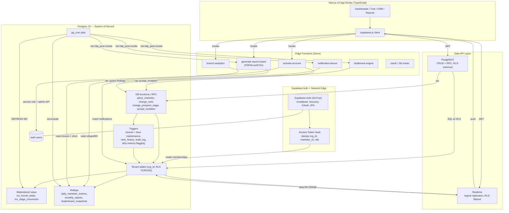
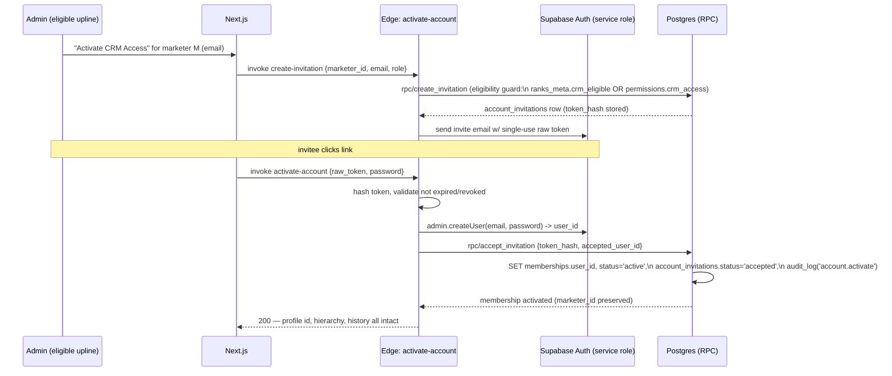

# 07 — Backend Architecture (Supabase System of Record)

> **Status:** Architecture-validation phase. No application code. This document defines the
> **backend layering** of the platform: where each piece of behavior lives (Postgres vs.
> PostgREST vs. Edge Functions vs. Realtime vs. `pg_cron`), how transactional integrity is
> guaranteed for binary-tree mutations, how idempotency is enforced, and how background jobs
> are designed.
>
> **Consistency contract:** every table/column/enum identifier used here is defined in
> [`01-database-schema.md`](./01-database-schema.md) and is used verbatim. RLS policy keys are
> summarized in §8 of the schema doc and detailed in [`04-permissions-matrix.md`](./04-permissions-matrix.md) §5 and [`10-security-architecture.md`](./10-security-architecture.md) §3. This document is the
> authority for the *runtime topology* and the *placement of business logic*.
>
> **Locked stack:** Supabase — Postgres 15, Supabase Auth (`auth.users`), Row-Level Security,
> Edge Functions (Deno), Realtime, `pg_cron`. Frontend: Next.js 14 App Router + TypeScript.

---

## 1. Architecture at a glance

The backend is a **database-centric** architecture. Postgres is not "a place to store rows
that the app understands" — it is the **system of record AND the primary execution engine**.
Multi-tenancy (RLS on `org_id`), genealogy invariants (binary placement, closure table, ltree
`path`), and transactional domain logic (placement, rank change, activation, stage transitions)
all live *inside the database* so they cannot be bypassed by any client, edge function, or
direct PostgREST call.

Edge Functions exist for exactly four things the database should not do alone: (1) operations
that must call **external systems** (sending invitation emails, OAuth, PDF/Excel rendering),
(2) operations that need **privileged orchestration across the auth schema** (creating
`auth.users`, minting tokens), (3) **compute-heavy report assembly** that benefits from a
procedural runtime, and (4) **fan-out** (notifications to many recipients). Everything that is
a *transactional state change on tenant data* is a Postgres function invoked via RPC, so it
inherits RLS, ACID, and the trigger-maintained invariants for free.

### 1.1 Layer responsibilities

| Layer | Technology | Owns | Never does |
|---|---|---|---|
| **System of record** | Postgres 15 + RLS | All tenant data, all invariants (binary tree, closure, ltree, enum domains), all transactional domain logic via `SECURITY DEFINER`/`INVOKER` functions, triggers, constraints | External I/O (email, HTTP, file rendering) |
| **Auto-API** | PostgREST (Supabase Data API) | CRUD on tables/views with RLS enforced; calling DB functions via `rpc/<fn>`; pagination, filtering, ordering | Multi-step business transactions that aren't a single DB function |
| **Edge functions** | Deno (Supabase Functions) | Activation orchestration (auth.users + membership + token), report PDF/Excel/CSV rendering, branch-analytics assembly for export, bottleneck engine orchestration, notification fan-out, OAuth/2FA, webhooks | Direct table mutation that bypasses DB functions/RLS for tenant data (must call RPC or use service role *with explicit org scoping*) |
| **Realtime** | Supabase Realtime (logical replication) | Pushing row changes on `notifications`, `bottleneck_findings`, `marketers` (status/rank), dashboard rollups to subscribed clients, RLS-filtered | Business logic; it is a transport only |
| **Scheduler** | `pg_cron` | Monthly/quarterly report generation, nightly rollups, leaderboard recompute, bottleneck rules, follow-up enqueue, MV refresh | Long-running external calls (it triggers an Edge Function via `net.http_post` for those) |
| **Auth** | Supabase Auth (GoTrue) | Email/password, recovery, JWT issuance, future OAuth/2FA; **access-token hook** stamping `org_id`, `marketer_id`, `role` claims | Knowing about the binary tree (it only knows `auth.users` ↔ `memberships`) |

### 1.2 Component diagram



---

## 2. Postgres as the system of record

### 2.1 Why DB-first for this domain

Three properties of this product make a thin-API / fat-database design correct:

1. **Hard isolation is non-negotiable.** "No cross-org access is ever possible at the database
   layer" can only be guaranteed if isolation is *in* the database. RLS (`FORCE ROW LEVEL
   SECURITY` on every tenant table, keyed on `auth.jwt() ->> 'org_id'`) makes a tenant leak
   impossible even for a buggy Edge Function that forgets a `WHERE org_id = …` — the policy
   re-applies it. (Exception: service-role connections bypass RLS; §6.4 governs that.)

2. **Genealogy invariants are global and recursive.** A binary tree with a closure table and an
   ltree `path` has invariants (`marketers_one_child_per_leg`, single root per org, no cycles,
   closure ↔ `path` consistency) that must hold *for every writer*. Encoding them in triggers
   and constraints means a placement via PostgREST, via an Edge Function, or via an admin SQL
   console are all equally safe.

3. **Analytics are aggregations over the same rows.** `daily_marketer_metrics`,
   `mv_funnel_totals`, `mv_stage_conversion`, `monthly_reports`, and `leaderboard_snapshots`
   are all derived from the operational tables joined to `marketer_tree_closure`. Keeping them
   in-database (MVs + rollup tables refreshed by `pg_cron`) avoids a separate ETL system.

### 2.2 Schema/role topology inside Postgres

| Schema | Contents | Exposed via PostgREST? |
|---|---|---|
| `public` | All tenant tables, MVs, rollups, the canonical enums, and INVOKER RPC functions | Yes (RLS-enforced) |
| `auth` | Supabase-managed (`auth.users`, identities) | No (never directly; only via DB FKs and the activation Edge Function with service role) |
| `app_private` | `SECURITY DEFINER` helpers (`can_see_marketer`, closure-maintenance internals, audit writers) and functions that must run with elevated rights | No — `REVOKE ALL ... FROM anon, authenticated`; called only by triggers/other functions |
| `cron` | `pg_cron` job catalog | No |

Postgres roles in play:

- `anon` — pre-auth (only reachable surface: nothing tenant; public org lookup by slug if needed).
- `authenticated` — the role every logged-in request runs as; **all RLS policies target this role**.
- `service_role` — bypasses RLS; used **only** by trusted Edge Functions for cross-`auth`-schema
  work and never handed to the browser. Every service-role write to a tenant table must set
  `org_id` explicitly and is wrapped in a function that re-asserts the org scope (§6.4).

### 2.3 The visibility primitive lives in the DB

All subtree visibility (a user sees self + all downlines, never uplines/parallel branches)
reduces to one closure lookup. The schema defines it as a `SECURITY DEFINER` helper; the
backend treats it as the single authorization gate for tenant reads:

```sql
-- app_private.can_see_marketer(target uuid) RETURNS boolean
-- TRUE iff caller's marketer_id is an ancestor-or-self of target in the same org.
CREATE OR REPLACE FUNCTION app_private.can_see_marketer(target uuid)
RETURNS boolean
LANGUAGE sql
STABLE
SECURITY DEFINER
SET search_path = public, app_private
AS $$
  SELECT
    (auth.jwt() ->> 'role') IN ('admin','owner')
    OR EXISTS (
      SELECT 1
      FROM marketer_tree_closure c
      WHERE c.org_id        = (auth.jwt() ->> 'org_id')::uuid
        AND c.ancestor_id   = (auth.jwt() ->> 'marketer_id')::uuid
        AND c.descendant_id = target
    );
$$;
```

RLS policies on `marketers`, `contacts`, `prospects`, `prospect_journey_events`, `calls`,
`centos_list_entries`, `seven_whys`, `rank_history`, `daily_marketer_metrics`,
`monthly_reports`, `bottleneck_findings`, and `leaderboard_snapshots` call this helper against
the row's `owner_marketer_id` / `marketer_id` / `responsible_marketer_id`. Because it is
`SECURITY DEFINER` and `STABLE`, it reads `marketer_tree_closure` (which itself is RLS-protected
for clients) without recursion and is index-served by `closure_descendant_idx` /
`PRIMARY KEY (ancestor_id, descendant_id)`.

---

## 3. PostgREST auto-API — the default path

For the large majority of feature surface (contacts CRUD, search/filter/sort/tag, Centos list,
Seven Whys, documents, reading prospects/calls, reading dashboards/rollups/leaderboards) the
frontend talks **directly to PostgREST** with the user's JWT. No bespoke API code is written;
RLS does the authorization.

### 3.1 What goes through PostgREST directly

| Feature | Surface | Mechanism |
|---|---|---|
| Contact book | `GET/POST/PATCH /contacts` + filters | RLS subtree on `owner_marketer_id`; `pg_trgm` index for fuzzy search; `tags` GIN for tag filter; `next_follow_up_at` index for the follow-up queue |
| Centos List | `/centos_list_entries` | RLS subtree; ordered by `position` |
| Seven Whys | `/seven_whys` | one row per marketer (`UNIQUE(org_id, marketer_id)`) |
| Documents (read) | `/internal_documents`, `/document_versions` | org-wide read for CRM-eligible members |
| Funnel/conversion read | `/mv_funnel_totals`, `/mv_stage_conversion` | RLS-protected MVs; closure join done in the request via `resource embedding` or a wrapping view |
| Leaderboards (read) | `/leaderboard_snapshots` | precomputed, RLS subtree |
| Notifications (read/mark-read) | `/notifications` | `recipient_marketer_id = jwt.marketer_id` |

### 3.2 What is exposed as RPC (DB function) instead of raw table writes

Any write that must (a) hold an invariant across multiple rows, (b) write history, or (c) be
idempotent is **not** a raw PostgREST `INSERT/UPDATE`. It is a Postgres function exposed at
`POST /rpc/<function_name>`. These run as the `authenticated` role under RLS (INVOKER) unless
they need elevated maintenance rights, in which case they delegate to an `app_private`
`SECURITY DEFINER` helper for the privileged step only.

| RPC | Maps to schema mechanics | Why not raw CRUD |
|---|---|---|
| `rpc/place_marketer` | inserts `marketers` row, fires closure + `path` triggers | Must enforce binary-leg uniqueness + cycle guard + closure/ltree maintenance atomically |
| `rpc/move_marketer` | updates `parent_id`/`leg`, closure delete+reinsert, `path` subtree rewrite | Admin-only structural move; O(ancestors×subtree); must be one transaction |
| `rpc/change_rank` | updates `marketers.rank`, writes `rank_history`, may emit notification | Must write immutable history + enforce `previous_rank <> new_rank` |
| `rpc/change_prospect_stage` | closes open `prospect_journey_events`, opens new, updates `prospects.current_stage`/`current_stage_since` | Must keep "one open event per prospect" invariant and denormalized current stage consistent |
| `rpc/promote_contact_to_prospect` | inserts `prospects`, links `contact_id`, opens first journey event | Multi-row + first-stage event creation |
| `rpc/promote_centos_entry` | sets `centos_list_entries.promoted_contact_id`, inserts `contacts` | Two-table linkage |
| `rpc/accept_invitation` | validates `account_invitations` token, activates `memberships` | Token validity + single-use + profile-preserving activation (the DB half of activation; the auth.users half is the Edge Function) |
| `rpc/bulk_update_contacts` | bulk tag/status/assignment | Single transaction + audit + dirty-metrics flag |
| `rpc/upsert_bottleneck_finding` | idempotent finding write | Conflict-target upsert; called by the engine |

### 3.3 Pagination, search, ordering

PostgREST handles `Range`/`limit`/`offset`, `order`, and operator filters. For large tenants we
mandate **keyset pagination** on hot lists (contacts, calls, journey events) using
`(created_at, id)` or domain-natural keys, exposed through views with appropriate composite
indexes (already defined: `contacts_owner_idx`, `calls_marketer_time_idx`, `pje_prospect_idx`).
Fuzzy search uses the `gin_trgm_ops` indexes (`marketers_name_trgm`, `contacts_name_trgm`).

---

## 4. Edge Functions (Deno) — where complex/secure logic lives

Edge Functions are the **only** components allowed to (a) touch the `auth` schema with elevated
rights, (b) make outbound HTTP/SMTP calls, and (c) render binary artifacts (PDF/XLSX). They are
stateless, invoked either by the client (`supabase.functions.invoke`) or by `pg_cron` via
`net.http_post`. Each one is small, single-purpose, and — critically — **delegates all tenant
state mutation back into the database via RPC** so that RLS and invariants still apply. The
function does the orchestration and the external I/O; the database does the truth.

### 4.1 `activate-account` — the "Activate CRM Access" workflow

This is the canonical example of split responsibility. **Profile ≠ account** (locked decision):
activation must never recreate the `marketers` profile; it only attaches an `auth.users` login
via a `memberships` row.



Why this split:

- **Token minting & hashing**, **createUser** in `auth`, and **email send** require the service
  role / Auth Admin API and outbound SMTP — only an Edge Function may do them.
- **Eligibility** (`ranks_meta.crm_eligible = true` OR `permissions->>'crm_access' = 'true'`;
  Executives blocked by default) is enforced **twice**: in `rpc/create_invitation` and by the
  `BEFORE INSERT` trigger on `account_invitations` (schema §3.1). Defense in depth.
- **`rpc/accept_invitation`** runs in the database in **one transaction**: it re-checks token
  validity (`token_hash` match, `status='pending'`, `expires_at > now()`), sets
  `memberships.user_id`, flips `memberships.status='active'`, sets
  `account_invitations.status='accepted'`/`accepted_at`/`accepted_user_id`, and writes
  `audit_log`. Because it is a single SQL transaction, partial activation is impossible. The
  `marketers` row is **never written** — `id`, `parent_id`/`leg`, `sponsor_id`, `path`, rank,
  contacts, documents, notes, history all survive untouched.

> **Idempotency:** `account_invitations.token_hash` is `UNIQUE` and single-use. If
> `activate-account` is retried after the membership was already activated (e.g. network
> retry), `rpc/accept_invitation` is a no-op-or-error keyed on `status`: a second call with the
> same token sees `status='accepted'` and returns the already-linked membership instead of
> double-creating. The Edge Function additionally guards `auth.createUser` with a lookup by
> email so a retried call does not create two logins.

### 4.2 `branch-analytics` — Global / Left Branch / Right Branch computation

The Global/Left/Right views with **separate analytics per branch** are computed by joining
`marketer_tree_closure` (`ancestor_id = N`) to `daily_marketer_metrics`, filtering on
`branch_leg` (`NULL`/all = GLOBAL, `'LEFT'`, `'RIGHT'`). For interactive single-node reads this
is fast enough as a DB function (`rpc/branch_summary(node_id, branch_side, period)`); the Edge
Function exists for the **heavier export/assembly** case (a CEO pulling Global+Left+Right with
trend series and team breakdown in one payload) and for shaping the response for Recharts.

```sql
-- Core branch aggregation (used by rpc/branch_summary and by the edge fn via RPC)
-- branch_side: 'GLOBAL' | 'LEFT' | 'RIGHT'  (enum branch_side)
SELECT
  sum(d.calls_total)        AS calls_total,
  sum(d.calls_connected)    AS calls_connected,
  sum(d.new_prospects)      AS new_prospects,
  sum(d.stage_iscrizione)   AS enrollments,
  sum(d.new_recruits)       AS new_recruits,
  count(DISTINCT d.marketer_id) AS active_marketers
FROM marketer_tree_closure c
JOIN daily_marketer_metrics d
  ON d.marketer_id = c.descendant_id
 AND d.metric_date BETWEEN p_start AND p_end
WHERE c.org_id      = p_org_id
  AND c.ancestor_id = p_node_id
  AND (
        p_branch_side = 'GLOBAL'                    -- whole subtree incl. self
     OR (p_branch_side = 'LEFT'  AND c.branch_leg = 'LEFT')
     OR (p_branch_side = 'RIGHT' AND c.branch_leg = 'RIGHT')
      );
```

The Edge Function calls this (one round trip per branch side, or a single function returning all
three) using the **caller's JWT** so RLS still constrains `p_node_id` to a visible node. It
never uses the service role for reads — branch analytics must respect subtree visibility.

### 4.3 `generate-report-export` — PDF / Excel / CSV

Monthly/quarterly `monthly_reports` rows are **already computed and stored** in the database by
`pg_cron` (§5). The Edge Function's job is purely **rendering**: read the immutable
`monthly_reports.metrics` / `previous_metrics` / `deltas` / `delta_pct` (and, for ad-hoc
exports, leaderboard/branch data) under the caller's JWT, then produce a binary artifact (PDF
via a Deno-compatible renderer, XLSX/CSV via a sheet library) and return a signed, short-lived
download. Because the numbers are precomputed and immutable snapshots, the export is fully
deterministic and reproducible.

### 4.4 `bottleneck-engine` — orchestration of the detection rules

The bottleneck **rules** (weak conversion %, stage delay, inactivity, overdue follow-ups) are
expressed as SQL over `mv_stage_conversion`, `daily_marketer_metrics`,
`prospect_journey_events`, and `contacts.next_follow_up_at`. The Edge Function is the
**orchestrator** invoked by `pg_cron` nightly: it iterates org-by-org (to bound per-tenant work
and keep transactions small), calls `rpc/upsert_bottleneck_finding` for each breach (idempotent
on `UNIQUE(org_id, marketer_id, type, stage, period_start)`), resolves findings whose condition
has cleared (`resolved_at = now()`), and then calls `notification-fanout` for new `critical`
findings. Heavy rule evaluation can stay in SQL functions; the Edge layer gives us per-org
batching, retry/backoff, and the ability to emit external alerts later (email/Slack) without
touching the DB.

### 4.5 `notification-fanout`

Emitting one `notifications` row is trivial and done inline by RPC/triggers (e.g.
`rank_changed`, `invitation`). **Fan-out** — one logical event producing many recipient rows
(e.g. a `monthly_report_ready` to every marketer in an org, or a bottleneck alert to a
subtree's uplines) — is the Edge Function's job: it computes the recipient set (via closure
queries), bulk-inserts `notifications` in chunked transactions, and lets Realtime push them. It
is idempotent via a dedupe key in `notifications.payload` (e.g. `payload->>'event_id'`) checked
with an upsert so a retried fan-out does not double-notify.

### 4.6 OAuth / 2FA hooks (future)

Google/Microsoft OAuth and 2FA are Supabase Auth features; the only custom backend code is the
**access-token hook** (below) and optional post-login hooks. These are listed for completeness;
they do not change the tenant data model.

### 4.7 The access-token hook (Auth → JWT claims)

A Supabase Auth **access-token hook** (a `SECURITY DEFINER` DB function registered with GoTrue)
runs at token issuance, reads the caller's row from `memberships`, and stamps `org_id`,
`marketer_id`, and `role` into the JWT. RLS then reads them from `auth.jwt()` with no per-query
join. This is the recommended option in schema §10.1.

```sql
-- Registered as the Auth access-token hook. Receives the event, returns claims to merge.
CREATE OR REPLACE FUNCTION app_private.jwt_claims_hook(event jsonb)
RETURNS jsonb
LANGUAGE plpgsql
STABLE
SECURITY DEFINER
SET search_path = public, app_private
AS $$
DECLARE
  v_user_id uuid := (event -> 'user_id')::uuid;
  v_claims  jsonb := coalesce(event -> 'claims', '{}'::jsonb);
  v_m       record;
BEGIN
  SELECT m.org_id, m.marketer_id, m.role
    INTO v_m
  FROM memberships m
  WHERE m.user_id = v_user_id
    AND m.status  = 'active'
    AND m.deleted_at IS NULL
  ORDER BY m.created_at
  LIMIT 1;  -- one membership per (org, user) is guaranteed by UNIQUE(org_id, user_id)

  IF FOUND THEN
    v_claims := v_claims
      || jsonb_build_object('org_id',      v_m.org_id)
      || jsonb_build_object('marketer_id', v_m.marketer_id)
      || jsonb_build_object('role',        v_m.role);
  END IF;

  RETURN jsonb_set(event, '{claims}', v_claims);
END;
$$;
```

> **Multi-org note:** the schema enforces one membership per `(org_id, user_id)` but a person
> could in principle belong to two orgs. If multi-org login is in scope, the active org is
> selected client-side and passed to a session-refresh that re-stamps claims. Flagged in §9.

---

## 5. Scheduled & background work (`pg_cron`)

`pg_cron` is the scheduler. Pure-SQL jobs (MV refresh, rollups, report generation) run directly
in Postgres. Jobs that need external I/O or procedural orchestration **do not** run heavy logic
in cron; they call the relevant Edge Function via `net.http_post` (the `pg_net` extension),
passing a service token, and the Edge Function does the work. This keeps cron transactions short
and avoids holding locks during slow operations.

### 5.1 Job catalog (authoritative — matches schema §9)

| Job (cron name) | Cadence | Type | Action |
|---|---|---|---|
| `refresh_funnel_mvs` | every 15 min | SQL | `REFRESH MATERIALIZED VIEW CONCURRENTLY mv_funnel_totals`, then `mv_stage_conversion`. Concurrent refresh requires the unique indexes already defined (`mv_funnel_totals_uq`, `mv_stage_conversion_uq`). |
| `rebuild_daily_metrics` | hourly (rolling 48h) | SQL | Recompute `daily_marketer_metrics` for the **dirty set** (marketer/day pairs flagged by triggers); cron is the backstop that also re-derives the last 48h in case a trigger was missed. |
| `generate_monthly_reports` | 1st of month 02:00 org-tz | SQL (+optional EF for notify) | Build `monthly_reports` (current + previous + `deltas` + `delta_pct`) per marketer and the org-level row; then enqueue `monthly_report_ready` via `notification-fanout`. |
| `generate_quarterly_reports` | 1st of quarter 02:30 | SQL | Same for `period = 'quarterly'`. |
| `refresh_leaderboards` | nightly + on-demand | SQL | Recompute `leaderboard_snapshots` for every `(metric, scope, branch_side)` combo for the current period. |
| `run_bottleneck_rules` | nightly 03:00 | EF via `net.http_post` | Invoke `bottleneck-engine`; it evaluates rules, upserts `bottleneck_findings`, fans out alerts. |
| `enqueue_followups` | every 30 min | SQL | Find `contacts.next_follow_up_at <= now() AND deleted_at IS NULL` → insert `notifications(type='follow_up_due')` (idempotent per contact/day). |

### 5.2 Dirty-set rollup design (incremental, not full-table)

`daily_marketer_metrics` is the atomic fact table; recomputing it wholesale every hour would not
scale. Instead, **write-time triggers** on `calls`, `prospects`, `prospect_journey_events`, and
`marketers` (sponsorship) flag the affected `(org_id, marketer_id, metric_date)` into a small
`app_private.dirty_metric_days` queue. The hourly cron job drains the queue, recomputing only those
rows (and re-deriving the rolling 48h as a self-healing backstop). This gives near-real-time
metrics with bounded write amplification.

```sql
-- Trigger AFTER INSERT/UPDATE/DELETE on calls (and analogous on prospects, pje, marketers)
-- flags the day bucket as dirty using the org's timezone for the date boundary.
CREATE OR REPLACE FUNCTION app_private.flag_metrics_dirty()
RETURNS trigger LANGUAGE plpgsql AS $$
DECLARE
  v_org  uuid := coalesce(NEW.org_id, OLD.org_id);
  v_mk   uuid := coalesce(NEW.marketer_id, OLD.marketer_id);
  v_tz   text;
  v_day  date;
BEGIN
  SELECT timezone INTO v_tz FROM organizations WHERE id = v_org;
  v_day := (coalesce(NEW.occurred_at, OLD.occurred_at) AT TIME ZONE coalesce(v_tz,'Europe/Rome'))::date;
  INSERT INTO app_private.dirty_metric_days (org_id, marketer_id, metric_date)
  VALUES (v_org, v_mk, v_day)
  ON CONFLICT DO NOTHING;
  RETURN NULL;  -- AFTER trigger
END;
$$;
```

> **Timezone:** day bucketing uses `organizations.timezone` (recommended in schema §10.9), so
> reports/leaderboards align to org-local days.

### 5.3 Idempotency of scheduled jobs

Every job is safe to run twice (machine restart, overlapping schedules):

- `generate_monthly_reports` / `generate_quarterly_reports`: `INSERT ... ON CONFLICT
  (org_id, marketer_id, period, period_start) DO UPDATE` — re-running the same month just
  re-stamps the snapshot, never duplicates.
- `refresh_leaderboards`: upsert on
  `UNIQUE(org_id, metric, scope, scope_ref_id, branch_side, period_start, marketer_id)`.
- `run_bottleneck_rules`: `rpc/upsert_bottleneck_finding` upserts on
  `UNIQUE(org_id, marketer_id, type, stage, period_start)`.
- `enqueue_followups`: dedupe key (contact_id + due-day) inside `notifications.payload` prevents
  re-notifying the same overdue follow-up the same day.
- MV refresh and dirty-set rollup are inherently idempotent (recompute = same result).

### 5.4 Concurrency & locking

- MV refresh uses `CONCURRENTLY` so readers (live dashboards) never block.
- Long jobs that call Edge Functions use `net.http_post` (fire-and-forget with a result table),
  so the cron transaction commits immediately and does not hold locks while the EF runs.
- `bottleneck-engine` and `notification-fanout` process **one org per transaction** to keep
  lock scope and rollback cost small.
- An advisory lock (`pg_try_advisory_lock` on the job key) guards jobs whose runtime could
  exceed their interval (e.g. `refresh_leaderboards`), so a slow run never overlaps itself.

---

## 6. Transactional integrity & where business logic lives

### 6.1 The placement decision rule

> **Logic that mutates tenant state and must hold an invariant lives in a Postgres function
> (RPC). Logic that needs the outside world or the `auth` schema lives in an Edge Function and
> calls back into RPC for the state change.**

| Behavior | Lives in | Reason |
|---|---|---|
| Binary placement + closure + ltree maintenance | DB function + triggers | Invariant across `marketers`, `marketer_tree_closure`, `path`; must be ACID |
| Rank change + `rank_history` | DB function + trigger | Immutable history; constraint `previous_rank <> new_rank` |
| Prospect stage transition | DB function (`change_prospect_stage`) | "one open event" invariant + denormalized `current_stage` |
| Invitation acceptance (DB half) | DB function (`accept_invitation`) | Single-transaction membership activation, profile-preserving |
| `auth.users` creation, email, token mint | Edge function | Privileged auth-schema + external I/O |
| Report **assembly** (numbers) | DB / `pg_cron` | Aggregation over rollups; deterministic |
| Report **rendering** (PDF/XLSX) | Edge function | Binary artifact generation |
| Branch analytics **aggregation** | DB function | Closure join; index-served; respects RLS |
| Branch analytics **export/shaping** | Edge function | Multi-branch payload assembly for the client |
| Bottleneck **rules** | DB SQL (functions/views) | Aggregation over journey events/rollups |
| Bottleneck **orchestration/alerts** | Edge function | Per-org batching, retry, external alerts |
| Notification **single insert** | DB (RPC/trigger) | One row, inline |
| Notification **fan-out** | Edge function | Many recipients, dedupe, chunking |

### 6.2 Tree mutations are single transactions

**Placement (`rpc/place_marketer`).** Inserting a node is one statement; the closure and `path`
are maintained by the `AFTER INSERT` trigger described in schema §2.2. The whole thing is one
transaction, so either the node + all its closure rows + its `path` exist, or none do. The
binary-leg uniqueness (`marketers_one_child_per_leg`) and single-root (`marketers_single_root_per_org`)
partial unique indexes reject an illegal placement atomically; the cycle-prevention
`BEFORE INSERT/UPDATE` trigger rejects setting `parent_id` to a node inside the new child's own
subtree.

```sql
-- rpc/place_marketer (INVOKER; runs under RLS as authenticated)
-- Creates a profile and places it under parent on a given leg. Closure + path
-- are maintained by triggers; this function guarantees the call is one transaction
-- and that the actor is allowed to place under that parent.
CREATE OR REPLACE FUNCTION place_marketer(
  p_parent_id  uuid,
  p_leg        placement_leg,
  p_sponsor_id uuid,
  p_first_name text,
  p_last_name  text,
  p_external_code text DEFAULT NULL
) RETURNS marketers
LANGUAGE plpgsql
AS $$
DECLARE
  v_org uuid := (auth.jwt() ->> 'org_id')::uuid;
  v_new marketers;
BEGIN
  -- Authorization: caller must be able to see (own-or-downline) the parent.
  IF NOT app_private.can_see_marketer(p_parent_id) THEN
    RAISE EXCEPTION 'not authorized to place under parent %', p_parent_id
      USING ERRCODE = '42501';
  END IF;

  INSERT INTO marketers (org_id, parent_id, leg, sponsor_id,
                         first_name, last_name, external_code,
                         status, created_by)
  VALUES (v_org, p_parent_id, p_leg, p_sponsor_id,
          p_first_name, p_last_name, p_external_code,
          'pending', (auth.jwt() ->> 'marketer_id')::uuid)
  RETURNING * INTO v_new;
  -- AFTER INSERT trigger has now populated marketer_tree_closure + path.
  -- A unique-violation on (org_id, parent_id, leg) aborts the whole transaction.

  RETURN v_new;
EXCEPTION
  WHEN unique_violation THEN
    RAISE EXCEPTION 'leg % already occupied under parent %', p_leg, p_parent_id
      USING ERRCODE = '23505';
END;
$$;
```

**Move (`rpc/move_marketer`).** The structural re-placement (admin-only) does, in one
transaction: validate the move (target not inside the subtree, destination leg free), delete the
stale ancestor↔subtree closure rows, reinsert the recomputed cross-product with correct `depth`
and `branch_leg`, rewrite `path` for the moved node and **every descendant** (ltree prefix
swap), and write `audit_log('marketer.move')`. Because it is O(ancestors × subtree) it runs as a
single serialized transaction guarded by an advisory lock on the org's tree to prevent two
concurrent structural moves from racing on closure rows. This is rare/admin-only by design
(schema §10.2).

**Concurrency on placement.** Two simultaneous inserts targeting the same `(parent_id, leg)` are
resolved by the partial unique index: one commits, the other gets `23505` and is retried by the
client against the *other* leg or rejected. No lost-update window because the constraint is the
arbiter, not application-level checking.

### 6.3 Rank change & stage transition

`rpc/change_rank` updates `marketers.rank`; the `AFTER UPDATE` trigger (schema §2.3) writes the
`rank_history` row (`previous_rank`, `new_rank`, `changed_at`, `changed_by`, `notes`). One
transaction ⇒ the history can never diverge from the current rank. A `rank_changed` notification
is emitted inline.

`rpc/change_prospect_stage` implements the exact mechanics in schema §5.2: stamp `exited_at` on
the open `prospect_journey_events` row, insert the new event (`from_stage`/`to_stage`), update
`prospects.current_stage` + `current_stage_since`. The partial index `pje_open_stage_idx`
(`WHERE exited_at IS NULL`) plus a trigger guarantee exactly one open event per prospect. All in
one transaction; `time_in_stage_secs` is a generated column so it is consistent by construction.

### 6.4 Service-role writes (the dangerous path) are fenced

When an Edge Function must use the service role (only `activate-account` for `auth.users`, and
infrastructure jobs), it:

1. Never accepts an `org_id` from the client — it derives it from validated server state
   (the invitation row, the cron payload).
2. Mutates tenant tables only through `SECURITY DEFINER` functions that re-assert
   `org_id` and set `created_by`/`updated_by` from server context.
3. Writes an `audit_log` row for every privileged action (`account.activate`, etc.).

This preserves the "no cross-org access at the DB layer" guarantee even on the RLS-bypassing
path: the service role is constrained by *code-reviewed functions*, not by ad-hoc SQL.

---

## 7. Realtime — live dashboards & notifications

Supabase Realtime streams committed row changes over logical replication, **RLS-filtered**, so a
client only receives changes to rows it is allowed to read.

| Channel / table | Use | Filter |
|---|---|---|
| `notifications` | toast + bell badge; instant follow-up/rank/bottleneck/report alerts | `recipient_marketer_id = jwt.marketer_id` |
| `bottleneck_findings` | live alert panel on dashboards | RLS subtree of `marketer_id` |
| `marketers` (status/rank cols) | tree nodes update status/rank live without refetch | RLS subtree |
| `prospects` (current_stage) | funnel/kanban board live moves | RLS subtree of `owner_marketer_id` |
| Rollup tables (`daily_marketer_metrics`) | optional live KPI tiles | RLS subtree |

Design notes:

- Realtime is **transport only** — it carries the truth produced by RPC/triggers/cron; it never
  computes. The frontend treats a Realtime event as a hint to update local cache or refetch a
  specific aggregate (for derived numbers behind MVs).
- For **dashboard rollups** (which live in MVs refreshed every 15 min), the client subscribes to
  a lightweight `dashboard_pulses` notification (or listens on `notifications`) rather than to
  the MV directly, because MV refresh is a bulk swap, not row-level WAL events. The pulse tells
  the client "rollups refreshed, refetch your tiles."
- Replica identity / publication is configured per table so only the needed tables stream,
  keeping WAL volume and client traffic bounded.

---

## 8. Idempotency & integrity — consolidated guarantees

| Operation | Idempotency mechanism | Integrity mechanism |
|---|---|---|
| Account activation | `account_invitations.token_hash` UNIQUE + single-use; `status` gate in `accept_invitation`; email-lookup before `createUser` | One-transaction membership activation; profile (`marketers`) never written |
| Marketer placement | Client retries against the constraint; no surrogate dedupe needed | Partial unique `marketers_one_child_per_leg`; cycle trigger; closure+`path` triggers — all in one tx |
| Marketer move | Advisory lock on org tree; deterministic recompute | Delete+reinsert closure + ltree subtree rewrite in one tx; cycle/destination guards |
| Rank change | `previous_rank <> new_rank` CHECK rejects no-op | `rank_history` written by trigger in same tx |
| Stage transition | One-open-event invariant makes re-fire a no-op-or-guarded | Generated `time_in_stage_secs`; denormalized `current_stage` updated in same tx |
| Monthly/quarterly reports | Upsert on `(org_id, marketer_id, period, period_start)` | Immutable snapshot from precomputed rollups |
| Leaderboards | Upsert on the full unique key | Recompute = same result |
| Bottleneck findings | Upsert on `(org_id, marketer_id, type, stage, period_start)` | Resolve-on-clear sets `resolved_at` |
| Notification fan-out | `payload->>'event_id'` dedupe on upsert | Recipient set computed from closure |
| Daily metrics | Dirty-set queue `ON CONFLICT DO NOTHING`; recompute is pure | 48h self-heal backstop |

**General Edge-Function idempotency contract:** any client-invokable Edge Function that performs
a write accepts (or derives) an idempotency key and routes the mutation through an RPC whose
upsert/constraint makes a retry safe. Functions return the *current* state on a duplicate call
rather than erroring, so client retries (mobile networks, double-clicks) never corrupt state.

---

## 9. Open Questions / Decisions Needing Sign-off

1. **Access-token hook vs. per-request resolution.** This document assumes the Supabase Auth
   access-token hook (`app_private.jwt_claims_hook`) stamps `org_id`/`marketer_id`/`role` so RLS
   reads them from `auth.jwt()`. Confirm we enable the hook (recommended; mirrors schema §10.1)
   rather than resolving `marketer_id` from `memberships` per request.

2. **`pg_net` for cron→Edge invocation.** We use the `pg_net` (`net.http_post`) extension so
   long-running jobs (bottleneck engine, fan-out, report rendering) run in Edge Functions while
   cron transactions stay short. Confirm `pg_net` is enabled and a results/retry table is
   acceptable, vs. an external scheduler (e.g. a Supabase scheduled function) invoking them.

3. **Multi-org login & claim selection.** Schema enforces one membership per `(org_id, user_id)`,
   but a single `auth.users` could belong to multiple orgs. Confirm whether multi-org login is in
   v1; if so we need an active-org selector that re-stamps JWT claims on org switch (ties to
   schema §10.3).

4. **Service-role surface.** Only `activate-account` (and infra jobs) use the service role, and
   only through `SECURITY DEFINER` functions that re-assert `org_id`. Confirm no other Edge
   Function needs RLS bypass; if a future feature does, it must follow the §6.4 fencing rules.

5. **Report rendering runtime.** PDF/XLSX generation runs inside the Deno Edge Function. Confirm
   the chosen renderer is Deno-compatible and within the function memory/time budget for the
   largest org; otherwise the renderer moves to a queue-backed worker. (Depends on schema §10.7
   document-body model for document exports.)

6. **Realtime granularity for rollups.** MVs (`mv_funnel_totals`, `mv_stage_conversion`) refresh
   as a bulk swap and do not emit row-level WAL events; live dashboards refetch on a "rollups
   refreshed" pulse. Confirm a pulse-then-refetch model is acceptable vs. streaming a dedicated
   per-marketer summary table that *does* emit row events.

7. **Move frequency.** `rpc/move_marketer` is treated as rare/admin-only (advisory-locked,
   O(ancestors×subtree)). Confirm placement corrections are not a routine end-user action
   (schema §10.2); if they are, we add an async maintenance worker and batch closure rewrites.

8. **Bottleneck batching unit.** The engine processes one org per transaction. Confirm this
   granularity is acceptable for the largest tenants, or whether per-subtree chunking within an
   org is required for very large genealogies.
