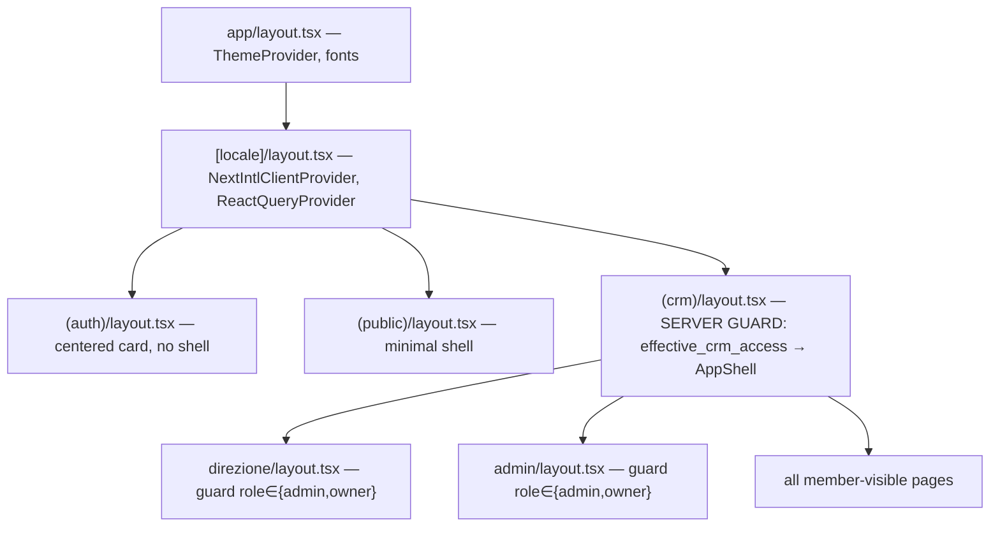
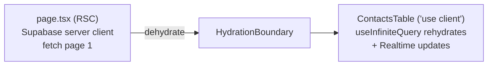
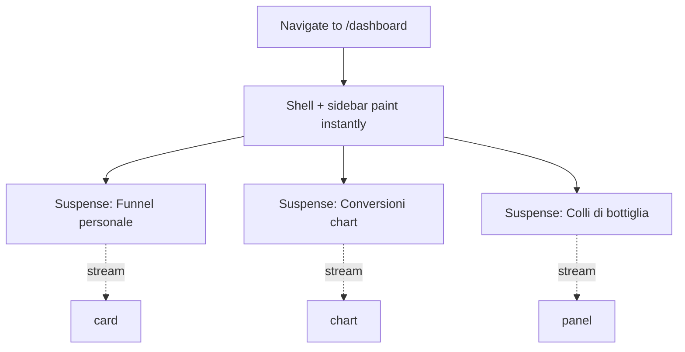
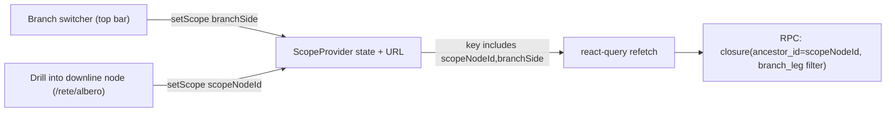
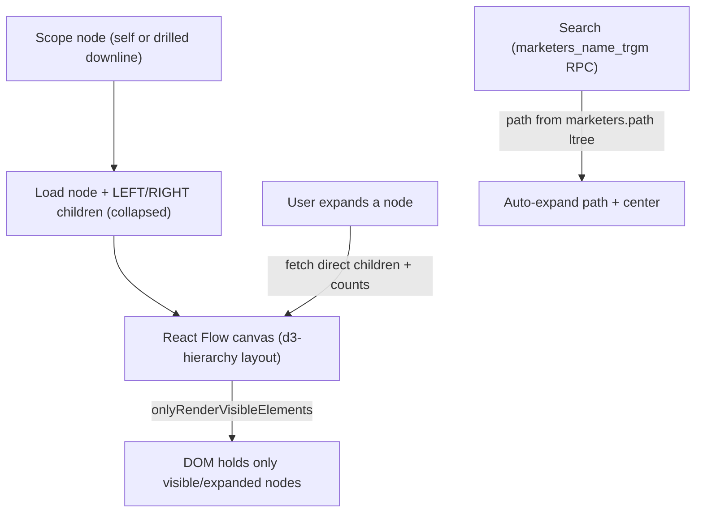
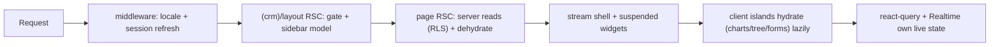

# 08 — Frontend Architecture (Next.js 14 App Router)

> **Status:** Architecture-validation phase. No application code. This document is the single
> source of truth for the **frontend** of the platform: the Next.js 14 App Router layout (route
> groups, layouts, server/client boundaries), data fetching against Supabase (server client in
> RSC, browser client for Realtime/mutations), state management, the design system
> (Tailwind + shadcn/ui, light/dark tokens, premium SaaS look), charts (Recharts), the binary
> **genealogy tree renderer** with virtualization, i18n (`next-intl`, Italian default), forms
> (`react-hook-form` + `zod`), the **Global / Left Branch / Right Branch** scope provider, the
> folder structure, responsiveness (desktop-first), and performance.
>
> **Binds to:**
> - Canonical schema [`01-database-schema.md`](./01-database-schema.md) — every table/column/enum
>   referenced here (`marketers`, `marketer_tree_closure.branch_leg`, `prospect_stage`,
>   `branch_side`, `daily_marketer_metrics`, `mv_funnel_totals`, `mv_stage_conversion`,
>   `leaderboard_snapshots`, `notifications`, …) uses its exact identifiers.
> - Roles matrix [`03-roles-matrix.md`](./03-roles-matrix.md) — `effective_crm_access`, the four
>   axes, the five permission flags (`crm_access`, `export_enabled`, `manage_documents`,
>   `view_branch_comparison`, `can_invite`).
> - Navigation [`05-navigation-structure.md`](./05-navigation-structure.md) — the route map,
>   sidebar tree, contextual sub-nav, the branch switcher and scope node, mobile patterns. This
>   document **implements** that information architecture; it never invents new routes or gates.
>
> **Stack (locked):** Next.js 14 (App Router) · TypeScript (strict) · Tailwind CSS · shadcn/ui ·
> Recharts · `next-intl` · `@supabase/ssr` + `@supabase/supabase-js` · `@tanstack/react-query` ·
> `react-hook-form` + `zod` · `@xyflow/react` (React Flow) for the genealogy canvas ·
> `@tanstack/react-virtual` for list virtualization · `next-themes` for light/dark.

---

## 1. Architectural principles (the five rules the whole frontend obeys)

| # | Principle | Consequence |
|---|---|---|
| 1 | **Server-first.** Every page is a React Server Component (RSC) by default; `'use client'` is opt-in and pushed to the leaves (interactive islands). | Initial data is fetched on the server with the **RLS-bound** Supabase server client; no secrets and no unnecessary JS ship to the browser. |
| 2 | **RLS is the security boundary; the UI is a projection.** The frontend never *enforces* visibility — it *renders* what RLS already allows. Layout guards and hidden nav items are defence-in-depth, not the security model. | A hidden sidebar item is still re-checked in the route's server layout AND re-denied by Postgres RLS (per [doc #05 §0 rule 3](./05-navigation-structure.md)). |
| 3 | **One scope context, everywhere.** A single client provider holds `{ scope_node_id, branch_side }` (the [doc #05 §6](./05-navigation-structure.md) control). Every analytics query key includes it. | Switching branch/scope re-fetches with a new closure predicate; it never changes the route. |
| 4 | **Read on the server, react on the client.** RSC fetches the first paint (cacheable, SEO-irrelevant but fast); `react-query` + Supabase Realtime own live updates, optimistic mutations, infinite lists, and the branch re-scoping fetches. | The two layers share types and query keys; the server seeds `react-query`'s cache via hydration so there is no double-fetch on mount. |
| 5 | **i18n and design tokens are data, not literals.** All user-facing strings come from `next-intl` catalogs (Italian default); all colors/spacing/radius come from CSS variables (Tailwind tokens). Domain enum labels come from `ranks_meta.label_it` or the shared `enumLabel()` catalog ([doc #05 §9](./05-navigation-structure.md)). | No hard-coded Italian in components; theme and locale switch without re-rendering structure. |

---

## 2. Route groups & the App Router tree

Routes live under a **locale segment** `[locale]` (default `it`) and are organized into three
route groups that map 1:1 to the [doc #05 §7 route map](./05-navigation-structure.md):

- `(auth)` — pre-authentication, **no shell** (login, password recovery, activation landing).
- `(public)` — authenticated-but-no-CRM and error/marketing surfaces, **no shell**.
- `(crm)` — the authenticated **AppShell** (top bar + sidebar + contextual sub-nav + branch
  switcher), gated by `effective_crm_access` in its server layout.

```
app/
├── layout.tsx                      # root <html>; theme provider, fonts; NO locale yet
├── not-found.tsx
├── global-error.tsx
└── [locale]/
    ├── layout.tsx                  # NextIntlClientProvider + setRequestLocale; <body>
    ├── (auth)/
    │   ├── layout.tsx              # centered card shell, no sidebar
    │   ├── login/page.tsx                       → /[locale]/login
    │   ├── recupero-password/page.tsx           → /[locale]/recupero-password
    │   └── attiva/[token]/page.tsx              → /[locale]/attiva/[token]   (activation)
    ├── (public)/
    │   ├── no-access/page.tsx                   → /[locale]/no-access  (effective_crm_access=false)
    │   └── non-autorizzato/page.tsx             → /[locale]/non-autorizzato (403)
    └── (crm)/
        ├── layout.tsx              # ⬅ THE CRM GATE + AppShell (server component)
        ├── dashboard/page.tsx                   → /[locale]/dashboard
        ├── notifiche/page.tsx
        ├── avvisi/page.tsx
        ├── rete/
        │   ├── albero/page.tsx                  (genealogy canvas)
        │   ├── team/page.tsx
        │   ├── rami/page.tsx                     (Global vs SX vs DX, always all three)
        │   ├── sponsorizzazioni/page.tsx
        │   └── pre-registrazioni/page.tsx
        ├── crm/
        │   ├── contatti/page.tsx
        │   ├── contatti/[id]/page.tsx
        │   ├── centos/page.tsx
        │   ├── prospect/page.tsx                 (funnel board + list + history tabs)
        │   ├── prospect/[id]/page.tsx
        │   ├── chiamate/page.tsx
        │   └── follow-up/page.tsx
        ├── analisi/
        │   ├── performance/page.tsx
        │   ├── conversioni/page.tsx
        │   ├── team/page.tsx                     (layout guard: rank ≥ team_leader)
        │   ├── rami/page.tsx
        │   ├── avanzata/page.tsx                 (layout guard: rank ≥ senior_team_leader)
        │   ├── classifiche/page.tsx
        │   └── report/page.tsx
        ├── risorse/
        │   ├── documenti/page.tsx
        │   ├── documenti/[id]/page.tsx
        │   └── sette-perche/page.tsx
        ├── profilo/
        │   ├── me/page.tsx                       (redirects to /profilo/<own marketer_id>)
        │   └── [id]/page.tsx
        ├── impostazioni/page.tsx
        ├── direzione/                            # layout guard: role ∈ {admin,owner}
        │   ├── layout.tsx
        │   ├── ceo/page.tsx
        │   ├── org-analytics/page.tsx
        │   └── classifiche-org/page.tsx
        └── admin/                                # layout guard: role ∈ {admin,owner}
            ├── layout.tsx
            ├── utenti/page.tsx
            ├── attivazioni/page.tsx              (also allowed via flag:can_invite — see §4.3)
            ├── gradi/page.tsx
            ├── permessi/page.tsx
            ├── audit/page.tsx
            ├── organizzazione/page.tsx           (owner-only write; admin read-only)
            └── fatturazione/page.tsx             (owner-only)
```

### 2.1 Why a locale segment (not middleware-only)

`next-intl` runs with the **App Router locale-segment** strategy: the locale is the first path
segment, the middleware (`createMiddleware` from `next-intl`) negotiates/redirects (`it` default,
prefix-as-needed), and `setRequestLocale(locale)` in `[locale]/layout.tsx` keeps RSC static where
possible. This makes the structure i18n-ready for future locales **without restructuring nav**
([doc #05 §9](./05-navigation-structure.md)). The default `it` is the source catalog.

### 2.2 Layout hierarchy & where guards live



| Layout | Runs on | Responsibility |
|---|---|---|
| `app/layout.tsx` | Server | `<html suppressHydrationWarning>`, `next-themes` provider, font variables. No data. |
| `[locale]/layout.tsx` | Server | `setRequestLocale`, load messages, wrap in `NextIntlClientProvider` + the client `ReactQueryProvider`. |
| `(crm)/layout.tsx` | **Server** | **The CRM gate.** Reads JWT claims (`org_id`, `marketer_id`, `role`) + `memberships.permissions` server-side. Computes `effective_crm_access`; redirect → `/no-access` if false. Builds the **filtered sidebar model** and renders `AppShell` with it. Provides the scope context boundary. |
| `direzione/layout.tsx`, `admin/layout.tsx` | Server | Re-check `role ∈ {admin,owner}` (the `Attivazioni` page additionally accepts `flag:can_invite`); else redirect → `/non-autorizzato`. Defence-in-depth alongside RLS ([doc #05 §7](./05-navigation-structure.md)). |

> **Guard is server-only.** The gate reads the session inside a Server Component via the Supabase
> server client, so an unauthenticated/ineligible request never streams the shell HTML or its JS.
> The same predicate is also enforced by Postgres RLS on every query the shell issues.

---

## 3. Server Components vs Client Components — the boundary

The default is **RSC**. A component becomes a Client Component (`'use client'`) only if it needs
one of: browser state/effects, event handlers, Realtime subscriptions, `react-query` hooks, React
Flow/Recharts (which use the DOM/refs), `react-hook-form`, or `next-themes`/locale switching.

### 3.1 Classification table

| Concern | Server Component | Client Component |
|---|---|---|
| Page shell & first data load (`/crm/contatti`, `/dashboard`, …) | ✔ fetch via Supabase server client | — |
| Sidebar **model** (which items, gated by role/rank/flags) | ✔ computed in `(crm)/layout.tsx` | — |
| Sidebar **rendering** (collapse animation, active highlight) | — | ✔ receives the model as props |
| Top bar **branch switcher / scope node** | — | ✔ writes the scope context + URL params |
| Genealogy canvas (`/rete/albero`) | ✔ fetch initial visible window | ✔ React Flow renderer island |
| Funnel **board** (drag between `prospect_stage` columns) | ✔ initial columns | ✔ DnD + `change_prospect_stage()` mutation |
| Charts (Recharts) | ✔ fetch series data | ✔ chart island (`ResponsiveContainer`) |
| Tables (contacts/calls/leaderboards) | ✔ first page (server) | ✔ filters, sort, virtualization, infinite scroll |
| Notifications bell (Realtime) | ✔ initial unread count | ✔ `supabase.channel(...)` subscription |
| Forms (create/edit) | ✔ wrapper page + Server Action target | ✔ `react-hook-form` + `zod` island |
| Rich-text document editor | — | ✔ Tiptap (ProseMirror) island writing `internal_documents.body` |
| Locale/theme switch | — | ✔ |

### 3.2 The "server shell, client island" pattern (canonical example)

`/crm/contatti` (`subnav.contacts.*` from [doc #05 §4.2](./05-navigation-structure.md)):

```
app/[locale]/(crm)/crm/contatti/page.tsx          ← RSC
  ├─ fetch first page of `contacts` (RLS-bound, server client)
  ├─ <ContactsToolbar/>        ← client island: search (pg_trgm), status/source/tags filters
  ├─ <ContactsTable/>          ← client island: @tanstack/react-virtual + react-query infinite
  └─ <BulkActionBar/>          ← client island: multi-select bulk ops
```

The RSC fetches the first page and **dehydrates** it into the `react-query` cache (via
`HydrationBoundary`), so the client `ContactsTable` mounts already populated — no waterfall, no
flash. Subsequent pages, filter changes, and live updates are owned by the client island.



### 3.3 Mutations: Server Actions vs client mutations

Two complementary mechanisms, chosen by need:

- **Server Actions** (`'use server'`) for **form submits and admin operations** that benefit from
  progressive enhancement and server-side `zod` re-validation: create/edit contact, create
  prospect, issue `account_invitations` (Activate CRM Access), change rank (writes
  `rank_history`), publish/duplicate `internal_documents`. They call the Supabase server client
  (RLS-bound) and `revalidatePath`/`revalidateTag` the affected RSC.
- **Client mutations** (`react-query` `useMutation` → Supabase RPC/`from().update()`) for
  **interactive, optimistic** changes: dragging a prospect across funnel columns
  (`change_prospect_stage()`), toggling `contacts` tags, marking `notifications.read_at`,
  reordering `centos_list_entries.position`. These do optimistic cache updates and roll back on
  error.

> **Single validation source.** The same `zod` schemas (in `lib/validation/`) are imported by both
> the client form and the Server Action, so client and server validate identically.

---

## 4. Data fetching against Supabase

Three Supabase client factories, each for one runtime, all RLS-bound (anon key + the user's JWT —
the service-role key is **never** used in the frontend):

| Factory | File | Runtime | Use |
|---|---|---|---|
| `createServerClient()` | `lib/supabase/server.ts` | RSC, Server Actions, Route Handlers | First-paint reads, mutations with progressive enhancement. Reads cookies via `@supabase/ssr`. |
| `createBrowserClient()` | `lib/supabase/client.ts` | Client Components | Realtime channels, optimistic `react-query` mutations, infinite lists. |
| `createMiddlewareClient()` | `middleware.ts` | Edge middleware | Session refresh (rotate the auth cookie) + early redirect for unauthenticated `(crm)` requests. |

### 4.1 Server-side reads (RSC) — the primary path

```ts
// app/[locale]/(crm)/dashboard/page.tsx (RSC, illustrative)
import { createServerClient } from '@/lib/supabase/server';
import { getScopeFromSearchParams } from '@/lib/scope';

export default async function DashboardPage({ searchParams }) {
  const supabase = createServerClient();                 // RLS-bound to caller's JWT
  const { scopeNodeId, branchSide } = getScopeFromSearchParams(searchParams); // GLOBAL by default

  // Subtree-aggregating read: closure join is done by an RPC that applies branch_side.
  const { data: funnel } = await supabase.rpc('funnel_totals_for_scope', {
    p_scope_node_id: scopeNodeId,   // self by default; a downline when drilled in
    p_branch_side: branchSide,      // 'GLOBAL' | 'LEFT' | 'RIGHT'  (schema enum branch_side)
  });
  // funnel reads mv_funnel_totals joined to marketer_tree_closure (ancestor_id = scopeNodeId,
  // branch_leg filter when LEFT/RIGHT) — exactly the doc #05 §6.1 predicate.
  ...
}
```

**RPC over raw closure joins from the client.** Subtree/branch aggregation always goes through a
`SECURITY INVOKER` Postgres function (e.g. `funnel_totals_for_scope`, `conversion_for_scope`,
`team_stats_for_scope`, `branch_compare_for_scope`) that encapsulates the
`marketer_tree_closure` join and the `branch_leg` predicate. Benefits: (a) the closure predicate
lives in one place, (b) RLS still applies because the function runs as the caller, (c) the client
never builds genealogy SQL. These map directly to the schema's analytics surfaces
(`mv_funnel_totals` §6.2, `mv_stage_conversion` §6.3, `daily_marketer_metrics` §6.1,
`leaderboard_snapshots` §6.5, `bottleneck_findings` §6.6).

### 4.2 Client-side reads (react-query)

The client uses `@tanstack/react-query` for everything interactive. **Query-key discipline** is
the backbone of the branch/scope system:

```ts
// Every analytics query key encodes the scope context, so a branch switch = a new key = a refetch.
['funnel', { orgId, scopeNodeId, branchSide, period }]
['conversion', { orgId, scopeNodeId, branchSide, periodMonth }]
['leaderboard', { orgId, metric, scope, scopeRefId, branchSide, periodStart }]
['contacts', { orgId, ownerScope, filters, sort }]   // contacts ignore branchSide (per-owner CRUD)
['notifications', { orgId, marketerId }]
```

Defaults: `staleTime` 30–60 s for analytics (data is rollup-backed and refreshed every 15 min by
`pg_cron` per [schema §9](./01-database-schema.md)), `staleTime` 0 for CRUD lists,
`gcTime` 5 min. Infinite lists (`contacts`, `calls`, leaderboard rows) use `useInfiniteQuery` with
keyset pagination (cursor on `created_at`/`occurred_at`, never OFFSET) to stay O(index).

### 4.3 Realtime (Supabase Realtime → react-query cache)

Realtime is **client-only** and surgically scoped. Channels subscribe to `postgres_changes`
filtered by the caller's `org_id`/`marketer_id` (RLS still applies on the replication stream):

| Surface | Channel filter | On event |
|---|---|---|
| Notifications bell | `notifications` where `recipient_marketer_id = <me>` | invalidate `['notifications', …]`; bump unread badge; toast. |
| Funnel board (open prospect) | `prospect_journey_events` for visible `prospect_id`s | patch the affected board column; update time-in-stage. |
| Avvisi / bottlenecks | `bottleneck_findings` where `resolved_at IS NULL` in scope | invalidate `['bottlenecks', scope]`. |
| Tree node live KPIs (optional, throttled) | `daily_marketer_metrics` for visible nodes | debounced badge refresh. |

The pattern is **invalidate, don't trust the payload**: a Realtime event marks the relevant
`react-query` key stale and triggers a re-fetch through the RLS-bound client, so the UI never shows
a row the user shouldn't see (the payload is only a signal). `activate`/`unsubscribe` is tied to
component lifecycle to avoid leaking channels.

### 4.4 Caching, revalidation, streaming

- **RSC caching:** analytics RSC reads use `revalidate` (ISR-style) where data is rollup-backed
  (e.g. dashboard cards `revalidate = 60`), and `cache: 'no-store'` for per-request CRUD lists.
  Mutations (Server Actions) call `revalidateTag('contacts')` / `revalidatePath('/crm/prospect')`.
- **Streaming with Suspense:** each page wraps independent data regions in `<Suspense>` with a
  skeleton fallback so the shell + cheap widgets paint immediately while heavier widgets (charts,
  tree) stream in. The CEO dashboard (`/direzione/ceo`) and rank-adaptive `/dashboard` are
  composed of independently-suspended widget cards.
- **`loading.tsx` + `error.tsx`** per route segment: skeletons during navigation; error boundaries
  render the localized `error.*` UI ([doc #05 §9](./05-navigation-structure.md)).



---

## 5. State management

State is layered by lifetime and ownership — there is no single global store.

| Layer | Tool | Holds | Lifetime |
|---|---|---|---|
| **Server cache** | RSC + `react-query` hydration | Authoritative row data (RLS-filtered) | Per request, revalidated |
| **Async client cache** | `@tanstack/react-query` | Lists, infinite scroll, mutations, Realtime-synced data | Session, `gcTime` |
| **URL state** | `searchParams` + `nuqs` (typed search-param hooks) | **`scope` (= `marketer_id`)**, **`branch` (= `branch_side`)**, table filters/sort, active tab, period | Shareable / bookmarkable / survives reload |
| **Scope context** | React Context (`ScopeProvider`) | Derived `{ scopeNodeId, branchSide, scopeNodeName }`, synced to/from URL | App session |
| **Ephemeral UI** | Local `useState` / `zustand` (only where truly cross-component, e.g. multi-select bulk mode, command palette open) | Drawer/sheet open, selection sets, DnD ghost | Component / interaction |
| **Theme & locale** | `next-themes` + `next-intl` | `light`/`dark`/`system`; active locale | Persisted (cookie/localStorage) |

> **Deliberately NOT a global Redux/zustand store for domain data.** Domain data lives in
> `react-query` (server-synced); only genuinely client-only, cross-component ephemeral state uses a
> tiny `zustand` slice. This avoids dual-source-of-truth bugs and keeps the cache RLS-consistent.

### 5.1 The Global / Left / Right scope provider (the cross-cutting control)

This is the [doc #05 §6](./05-navigation-structure.md) control, implemented as **URL-state +
context** so it is shareable and never causes a route change.

```ts
// lib/scope/scope-context.tsx  ('use client')
type BranchSide = 'GLOBAL' | 'LEFT' | 'RIGHT';   // ← schema enum branch_side (Group 6)

interface ScopeState {
  scopeNodeId: string;     // marketer_id; defaults to the caller's own marketer_id
  scopeNodeName: string;   // marketers.display_name, for the "Vista: {nome}" indicator
  branchSide: BranchSide;  // defaults to 'GLOBAL'
}

// Backed by URL search params: ?scope=<marketer_id>&branch=GLOBAL|LEFT|RIGHT  (nuqs)
const { scope, setScope } = useScope();
```

Behaviour (faithful to [doc #05 §6.2–6.3](./05-navigation-structure.md)):

- The provider sits inside `(crm)/layout.tsx`'s client boundary so it persists across all CRM
  routes without remounting.
- Default on entering any analytics surface: `branch = GLOBAL`, `scope = self`.
- The **branch switcher** (top bar) calls `setScope({ branchSide })`; the **scope node** changes
  when a user drills into a downline node on `/rete/albero` (`setScope({ scopeNodeId, scopeNodeName })`).
- Changing either updates the URL params only — **no route change**. All analytics `react-query`
  keys include `{ scopeNodeId, branchSide }`, so the change triggers a re-fetch with the new
  closure predicate (`ancestor_id = scopeNodeId` [`AND branch_leg = …`]).
- **Switcher availability** mirrors [doc #05 §6.2](./05-navigation-structure.md): enabled on
  analytics-bearing pages (`/dashboard`, `/rete/albero`, `/analisi/*`, `/avvisi`), rendered
  **disabled with tooltip `branch.not_applicable`** on `/crm/*`, `/risorse/*`, `/admin/*`,
  `/profilo/*` (desktop) and **hidden** on mobile non-analytics pages.
- `/rete/rami` and `/analisi/rami` ignore the single value and always render **Global vs SX vs DX
  side-by-side**; the switcher merely highlights the focused column ([doc #05 §6.2](./05-navigation-structure.md)).
- **Scope guard:** because RLS only returns closure rows where `ancestor_id = caller`, a `scope`
  param pointing outside the caller's subtree yields empty data and the provider resets to self —
  the URL can't be tampered into cross-subtree access. Admin/owner `GLOBAL` means the org root's
  full tree.



---

## 6. Design system (Tailwind + shadcn/ui)

The look is **premium B2B SaaS** — the calm density of **Linear**, the structured data clarity of
**HubSpot**, the trustworthy polish of **Stripe**, the soft surfaces of **Notion**. Concretely:
generous-but-efficient spacing, a single accent color, restrained shadows, crisp 1px borders,
`rounded-lg`/`rounded-xl` radii, a refined neutral gray ramp, and tabular numerals for all metrics.

### 6.1 Foundation

- **shadcn/ui** (Radix primitives + Tailwind) is the component layer — copied into `components/ui/`
  (owned, not a black-box dependency), themed via CSS variables. Primitives used across the app:
  `Button`, `Card`, `Table`, `Tabs`, `Dialog`, `Sheet` (mobile drawer), `Command` (⌘K palette),
  `DropdownMenu`, `Popover`, `Tooltip`, `Badge`, `Avatar`, `Select`, `Skeleton`, `Sonner` (toasts),
  `Drawer` (mobile bottom sheet), `ScrollArea`.
- **Tailwind** with a custom token layer (below). Plugins: `tailwindcss-animate`,
  `@tailwindcss/typography` (for rendered `internal_documents.body` rich text).
- **Fonts:** `next/font` — **Inter** (UI) + a tabular/monospace face (**Geist Mono** / `ui-monospace`)
  for KPI numbers and IDs. `font-variant-numeric: tabular-nums` on all metric displays so columns
  align.
- **Icons:** `lucide-react`.

### 6.2 Design tokens (CSS variables → Tailwind) with light/dark

All color/radius/shadow are HSL CSS variables on `:root` (light) and `.dark`, consumed by Tailwind
via `hsl(var(--token))`. `next-themes` toggles the `.dark` class on `<html>` (default `system`).

```css
/* app/globals.css (excerpt) — shadcn-compatible token set, premium-tuned */
:root {
  --background: 0 0% 100%;
  --foreground: 222 22% 11%;
  --card: 0 0% 100%;
  --card-foreground: 222 22% 11%;
  --muted: 220 16% 96%;
  --muted-foreground: 220 9% 46%;
  --border: 220 14% 90%;
  --input: 220 14% 90%;
  --ring: 222 80% 56%;
  --primary: 222 80% 56%;          /* single brand accent (Stripe/Linear-like indigo-blue) */
  --primary-foreground: 0 0% 100%;
  --radius: 0.625rem;              /* rounded-lg baseline; xl = +0.25rem */

  /* Semantic data-viz + status ramp (used by Recharts, badges, funnel stages) */
  --success: 142 64% 38%;
  --warning: 38 92% 50%;
  --danger:  0 72% 51%;
  --info:    210 90% 56%;
  /* Funnel stage ramp (6 prospect_stage values, cool→warm progression) */
  --stage-conoscitiva:   210 85% 60%;
  --stage-business-info: 200 80% 52%;
  --stage-follow-up:     265 70% 60%;
  --stage-closing:       38  92% 52%;
  --stage-check-soldi:   25  90% 55%;
  --stage-iscrizione:    142 64% 42%;
  /* Branch identity (Global / Left / Right) */
  --branch-global: 222 80% 56%;
  --branch-left:   265 70% 58%;
  --branch-right:  170 70% 42%;
}
.dark {
  --background: 222 24% 8%;
  --foreground: 210 20% 96%;
  --card: 222 22% 11%;
  --card-foreground: 210 20% 96%;
  --muted: 222 16% 17%;
  --muted-foreground: 217 12% 65%;
  --border: 222 16% 20%;
  --input: 222 16% 20%;
  --ring: 222 90% 66%;
  --primary: 222 90% 66%;
  --primary-foreground: 222 47% 11%;
  /* status + stage + branch ramps re-tuned for dark surfaces (lighter, less saturated) */
}
```

Tailwind config maps tokens to utilities (`bg-background`, `text-foreground`, `border-border`,
`bg-primary`, `text-stage-iscrizione`, …):

```ts
// tailwind.config.ts (excerpt)
theme: { extend: { colors: {
  background: 'hsl(var(--background))', foreground: 'hsl(var(--foreground))',
  card: { DEFAULT: 'hsl(var(--card))', foreground: 'hsl(var(--card-foreground))' },
  primary: { DEFAULT: 'hsl(var(--primary))', foreground: 'hsl(var(--primary-foreground))' },
  muted: { DEFAULT: 'hsl(var(--muted))', foreground: 'hsl(var(--muted-foreground))' },
  border: 'hsl(var(--border))', input: 'hsl(var(--input))', ring: 'hsl(var(--ring))',
  success: 'hsl(var(--success))', warning: 'hsl(var(--warning))', danger: 'hsl(var(--danger))',
  stage: {
    conoscitiva: 'hsl(var(--stage-conoscitiva))', businessInfo: 'hsl(var(--stage-business-info))',
    followUp: 'hsl(var(--stage-follow-up))', closing: 'hsl(var(--stage-closing))',
    checkSoldi: 'hsl(var(--stage-check-soldi))', iscrizione: 'hsl(var(--stage-iscrizione))',
  },
  branch: { global: 'hsl(var(--branch-global))', left: 'hsl(var(--branch-left))', right: 'hsl(var(--branch-right))' },
}, borderRadius: { lg: 'var(--radius)', xl: 'calc(var(--radius) + 0.25rem)' } } }
```

> **Why one accent + a semantic ramp:** premium SaaS restraint. Color carries *meaning*
> (stage progression, branch identity, status) rather than decoration. The six funnel colors are a
> deliberate cool→warm gradient so the Kanban and funnel charts read as a journey at a glance.

### 6.3 Component conventions

- **`cn()`** (clsx + tailwind-merge) for class composition; **`cva`** (class-variance-authority) for
  variant APIs on shared components (`Button`, `Badge`, `StatCard`).
- **Domain components** in `components/domain/` compose `ui/` primitives: `StatCard`,
  `RankBadge` (renders `ranks_meta.label_it` with a per-rank tone), `StatusPill`
  (`marketer_status`/`contact_status`/`prospect_outcome` via `enumLabel()`), `StageTag`
  (`prospect_stage` → stage color), `BranchChip` (`branch_side`), `MarketerAvatar`
  (`marketers.avatar_url` + initials fallback), `KpiTrend` (value + MoM delta arrow + %),
  `TimeInStage`, `FollowUpBadge`.
- **Empty / loading / error states** are first-class: every list has a designed empty state, a
  `Skeleton` loading state, and an error state — no raw spinners on data surfaces.
- **Accessibility:** Radix gives focus management/ARIA; color is never the sole signal (icons +
  text accompany status colors); AA contrast verified in both themes.

---

## 7. Charts (Recharts)

All charts are **client islands** wrapped in `<ResponsiveContainer>` and lazy-loaded
(`next/dynamic`, `ssr: false`) so Recharts' DOM-measuring code never runs on the server and the
~heavy chart bundle is code-split out of the initial load.

### 7.1 Chart inventory mapped to data sources

| Chart component | Page(s) | Recharts type | Data source (schema) |
|---|---|---|---|
| `FunnelStageBars` | `/analisi/performance` (Totali), `/dashboard` | stacked/horizontal `BarChart` | `mv_funnel_totals` via `funnel_totals_for_scope` |
| `ConversionFunnel` | `/analisi/conversioni` (Fase per fase) | `FunnelChart` / step `BarChart` | `mv_stage_conversion` (stage-to-stage %) |
| `ConversionTrend` | `/analisi/conversioni` (Mensile/Trimestrale) | `LineChart` / `AreaChart` | `mv_stage_conversion.period_month` |
| `TimeInStageBars` | `/analisi/conversioni` (Tempo per fase) | `BarChart` | `mv_stage_conversion.avg_time_in_stage_secs` |
| `ActivitySeries` | `/analisi/performance` (Attività), `/dashboard` | `LineChart` | `daily_marketer_metrics` (calls/duration/recruits) |
| `BranchCompare` | `/rete/rami`, `/analisi/rami`, dashboard `dash.branch_compare` | grouped `BarChart` (3 series) | three `*_for_scope` calls: GLOBAL/LEFT/RIGHT |
| `TeamGrowth` | `/analisi/team`, `/dashboard` `dash.team` | `AreaChart` | `daily_marketer_metrics.new_recruits` over closure subtree |
| `LeaderboardBars` | `/analisi/classifiche`, `/direzione/classifiche-org` | horizontal `BarChart` | `leaderboard_snapshots` |
| `MonthlyReportDelta` | `/analisi/report`, dashboard `dash.monthly_report` | `BarChart` + delta labels | `monthly_reports` (`deltas`, `delta_pct`) |

### 7.2 Charting conventions

- A shared `<ChartCard>` wrapper provides title, the active `branch_side` chip, period control,
  legend, and an export affordance (gated by `flag:export_enabled`, [roles §3.1](./03-roles-matrix.md)).
- Colors come from the **token ramp** (§6.2): funnel charts use the six `stage-*` colors in canonical
  order; `BranchCompare` uses `branch-global/left/right`; status uses `success/warning/danger`.
  Charts read `getComputedStyle` tokens so they recolor automatically on light/dark switch.
- Numbers use the locale formatter (`Intl.NumberFormat('it-IT')`); durations
  (`avg_time_in_stage_secs`, `calls_duration_secs`) render via a `formatDuration` helper; percentages
  via the conversion helper.
- Custom localized tooltips (`stage.*`, `enumLabel()` labels); responsive: charts collapse to
  single-metric, full-width, vertically-stacked branch series on mobile ([doc #05 §8.3](./05-navigation-structure.md)).

---

## 8. The genealogy tree renderer (the signature surface)

`/rete/albero` ([doc #05 §4.1](./05-navigation-structure.md)) renders the **true binary placement
tree** with expand/collapse/zoom/pan/drag, search, branch summaries, per-node KPIs, and must stay
fluid at **tens of thousands of nodes**. Renderer: **React Flow (`@xyflow/react`)** — chosen over
raw d3 for batteries-included pan/zoom/minimap/custom nodes/edges and a mature virtualization story,
while we keep **`d3-hierarchy`** purely for **layout** (tidy binary tree positioning), feeding
computed `x/y` into React Flow nodes.

### 8.1 Why React Flow + d3-hierarchy (not pure d3, not a generic tree lib)

| Need | Solution |
|---|---|
| Binary placement layout (one LEFT, one RIGHT child) | `d3-hierarchy` (`tree()`/cluster) computes positions; LEFT child placed left, RIGHT child right, matching `marketers.leg`. |
| Pan / zoom / fit-to-view / minimap | React Flow built-ins (`<Controls>`, `<MiniMap>`, `fitView`). |
| Rich custom node cards (name, rank, status, team size, KPIs) | React Flow **custom node types** (React components). |
| Drag-to-replace (admin re-placement) | React Flow drag handlers → `marketers.parent_id`/`leg` move via a guarded Server Action / Edge Function (admin-only; disabled on touch per [doc #05 §8.3](./05-navigation-structure.md)). |
| Tens of thousands of nodes | **On-demand subtree loading + viewport virtualization** (§8.3). |

### 8.2 Node card (data contract)

Each node card renders, per [doc #05 §4.1](./05-navigation-structure.md):

| Field shown | Source |
|---|---|
| Name | `marketers.display_name` |
| Rank | `ranks_meta.label_it` for `marketers.rank` (via `RankBadge`) |
| Status | `marketers.status` (`StatusPill`) |
| Team size | closure descendant count: `count(*) FROM marketer_tree_closure WHERE ancestor_id = node AND depth > 0` |
| KPIs (calls / new prospects / enrollments) | `daily_marketer_metrics` aggregated over the node's subtree (windowed, e.g. last 30d) |
| Activity / performance indicator | derived badge from recent `daily_marketer_metrics` + open `bottleneck_findings` (active = recent activity; warning tint if open critical finding) |
| Leg marker | `marketers.leg` (LEFT/RIGHT pill on the connecting edge) |
| Sponsorship hint | `sponsor_id ≠ parent_id` → a subtle "spillover" indicator |

A node fetch returns only the **direct children** of an expanded node (one LEFT + one RIGHT slot)
plus their precomputed counts — never the whole tree.

### 8.3 Virtualization & scale strategy (tens of thousands of nodes)

Three combined techniques keep the canvas O(visible), not O(tree):

1. **Lazy subtree expansion.** The tree loads **collapsed by default** from the scope node. Expanding
   a node fetches only its immediate children (`marketers WHERE parent_id = node`) + their team-size
   counts (a single closure aggregate). Collapsing prunes them from the React Flow node set. This is
   the primary scale lever: the DOM only ever holds expanded paths.
2. **Viewport virtualization.** Nodes/edges outside the current React Flow viewport (plus a margin)
   are not mounted; React Flow's `onlyRenderVisibleElements` (and our memoized custom node) keep the
   DOM small even with a large expanded set. The `<MiniMap>` shows global position without rendering
   the off-screen nodes.
3. **Server-side layout for big jumps.** "Expand all" / deep-link to a downline computes layout via a
   batched RPC that returns a paginated, depth-bounded slice (e.g. up to N levels / M nodes) rather
   than the full subtree; deeper levels are fetched on demand as the user pans/zooms in.

Additional measures: memoized node components (`React.memo` keyed on data hash), `requestIdleCallback`
for background prefetch of likely-next expansions, throttled Realtime KPI refresh, and a search box
(top bar / canvas) that uses the `marketers_name_trgm` index via RPC and then **focuses + auto-expands
the path** to the match (path derived from `marketers.path` ltree) instead of scanning the DOM.



### 8.4 Branch interaction

- The tabs **Ramo Sinistro / Ramo Destro** ([doc #05 §4.1](./05-navigation-structure.md)) set
  `branchSide = LEFT|RIGHT` and root the canvas at the corresponding child
  (`marketer_tree_closure.branch_leg`). **Globale** shows the full subtree from the scope node.
- **Drilling into a downline node** calls `setScope({ scopeNodeId, scopeNodeName })`, re-scoping the
  whole analytics shell (top bar shows "Vista: {nome}", reset returns to self) — bounded by RLS.
- **Drag-to-replace** is an admin-only desktop action; on success it calls the guarded move
  (closure + ltree rewrite per [schema §2.2](./01-database-schema.md)) and optimistically relays out.

---

## 9. i18n with `next-intl` (Italian default)

- **Routing:** locale-segmented (`/[locale]/...`), `next-intl` middleware with default `it` and
  prefix-as-needed; `setRequestLocale` in `[locale]/layout.tsx` for static RSC.
- **Catalogs:** `messages/it.json` is the **source** catalog; structure is i18n-ready for future
  locales (`messages/en.json`, …) without nav restructuring. Namespaces match [doc #05 §9](./05-navigation-structure.md):
  `nav.*`, `subnav.*`, `topbar.*`, `branch.*`, `dash.*`, `stage.*`, `mobile.*`, `error.*`, plus
  `enum.*`, `form.*`, `common.*`.
- **Domain enum labels are data, not literals:** ranks render from `ranks_meta.label_it`; all other
  fixed enums (`contact_status`, `contact_source`, `document_category`, `prospect_outcome`,
  `call_outcome`, `membership_status`, `invitation_status`, `prospect_stage`, `branch_side`) render
  via a shared **`enumLabel(enumType, value)`** helper keyed on the **canonical stored value**
  (Italian snake_case where the business defines it; English for system enums like
  `LEFT`/`RIGHT`/`GLOBAL`). E.g. `enum.contact_status.in_lavorazione = "In lavorazione"`,
  `enum.prospect_stage.check_soldi = "Check Soldi"`. This guarantees a single, consistent display
  mapping ([doc #05 §9](./05-navigation-structure.md)).
- **Formatting:** dates/times via `next-intl`'s `useFormatter` + the org `timezone`
  ([schema §1.1](./01-database-schema.md) `organizations.timezone`, `Europe/Rome` default);
  numbers/currency via `Intl.NumberFormat('it-IT')` (money is `numeric(14,2)` →
  `€` formatting). Server and client share the formatter config.
- **Server + client:** RSC use `getTranslations`/`getFormatter`; client islands use
  `useTranslations`/`useFormatter` under `NextIntlClientProvider`. Only the namespaces a client
  island needs are passed into the provider to keep the client bundle lean.
- **Locale switch** (top bar `topbar.locale`) updates the locale segment; per-user preference is
  persisted, falling back to `organizations.locale`.

---

## 10. Forms (`react-hook-form` + `zod`)

Every create/edit surface uses **`react-hook-form`** with a **`zod`** resolver
(`@hookform/resolvers/zod`), wired into shadcn/ui `Form` primitives.

### 10.1 Pattern

- **One schema, two consumers.** `zod` schemas live in `lib/validation/` and are imported by both the
  client form and the **Server Action** (or Route Handler) that persists — identical validation on
  both sides. Server re-validation is mandatory (never trust the client).
- **Field-level i18n:** `zod` error messages map to `form.*` keys; the resolver injects localized
  messages.
- **Enum fields bind to schema enums:** form `Select`s for `contact_status`, `contact_source`,
  `document_category`, `prospect_stage`, `call_type`, `call_outcome`, `placement_leg`, rank, etc.
  derive their options from the canonical enum lists and render labels via `enumLabel()`. The stored
  value is always the canonical one.
- **Submit UX:** optimistic where safe (client mutation), or progressive-enhancement Server Action
  with `useFormStatus` pending state; success/error via `Sonner` toasts; on success, invalidate the
  relevant `react-query` keys / `revalidatePath`.

### 10.2 Representative forms ↔ schema

| Form | Writes | Key validations |
|---|---|---|
| Nuovo / modifica contatto | `contacts` | required `first_name`; `email` format; `tags` array; `next_follow_up_at` future-or-null |
| Nuovo prospect / promozione | `prospects` (+ `prospect_journey_events` entry) | `full_name` required; `current_stage` ∈ `prospect_stage`; optional `contact_id` |
| Sposta fase (drag/azione) | `change_prospect_stage()` RPC | `from_stage ≠ to_stage`; valid stage; writes journey event |
| Registra chiamata | `calls` | `call_type`, `outcome` required; `duration_secs ≥ 0`; at least one of `prospect_id`/`contact_id` (schema `calls_has_target`) |
| Centos entry | `centos_list_entries` | `full_name`; `rating` 1–5; `position` unique-per-owner |
| Sette Perché | `seven_whys` | up to 7 `why_*`; `primary_why_index` 1–7 |
| Documento interno | `internal_documents` (+ `document_versions`) | `title`, `category` ∈ `document_category`, `status` ∈ `document_status`; `body` Tiptap JSON; write gated by `flag:manage_documents` |
| Pre-registrazione | `marketers` (`status='pending'`) | name; `parent_id` + `leg` (binary slot free); optional `sponsor_id` |
| Attiva accesso CRM | `account_invitations` | target `marketer_id` `crm_eligible` or override; `email`; gated by `role∈{admin,owner}` or `flag:can_invite` |
| Cambia grado | `marketers.rank` (+ `rank_history` via trigger) | `new_rank ≠ previous_rank`; `role∈{admin,owner}` |

> **Rich-text editor (no file uploads, per locked decision):** `internal_documents.body` is edited
> with **Tiptap/ProseMirror** (a `'use client'` island) producing the `jsonb` doc model
> ([schema §4.4](./01-database-schema.md)); rendered read-only via `@tailwindcss/typography`. Export
> to PDF renders from this model.

---

## 11. Folder structure

```
src/
├── app/                                  # App Router (§2) — routes only, thin pages
│   ├── layout.tsx · not-found.tsx · global-error.tsx
│   └── [locale]/ … (auth)/ (public)/ (crm)/ …
├── components/
│   ├── ui/                               # shadcn/ui primitives (owned, themed)
│   ├── domain/                           # StatCard, RankBadge, StatusPill, StageTag, BranchChip,
│   │                                     #   MarketerAvatar, KpiTrend, FollowUpBadge, TimeInStage
│   ├── charts/                           # Recharts islands (§7) + ChartCard
│   ├── tree/                             # genealogy renderer (§8): TreeCanvas, NodeCard, useTreeData
│   ├── shell/                            # AppShell, TopBar, Sidebar, ContextualSubNav, BranchSwitcher,
│   │                                     #   ScopeNodeIndicator, MobileTabBar, CommandPalette
│   └── forms/                            # form islands (§10) wrapping ui/Form
├── lib/
│   ├── supabase/                         # server.ts · client.ts · middleware.ts (RLS-bound clients)
│   ├── scope/                            # scope-context.tsx · useScope · getScopeFromSearchParams
│   ├── queries/                          # typed react-query hooks + query-key factory (per surface)
│   ├── rpc/                              # typed wrappers for *_for_scope RPCs + change_prospect_stage
│   ├── validation/                       # zod schemas (shared client/server)
│   ├── auth/                             # effective_crm_access, role/flag guards, getSessionClaims
│   ├── i18n/                             # next-intl config, request.ts, enumLabel, formatters
│   └── utils/                            # cn(), formatDuration, formatCurrency, date helpers
├── types/
│   ├── database.types.ts                 # generated from Supabase (supabase gen types) — schema-truth
│   └── domain.ts                         # branded/derived types (BranchSide, ScopeState, …)
├── messages/                             # next-intl catalogs: it.json (source) [+ future locales]
├── styles/ globals.css                   # design tokens (§6.2)
├── middleware.ts                         # next-intl locale + Supabase session refresh
└── tailwind.config.ts
```

> **`types/database.types.ts` is generated from the canonical schema** (`supabase gen types
> typescript`). It is the bridge that makes every table/column reference in this document
> compile-time checked against [doc #01](./01-database-schema.md) — drift becomes a type error.

---

## 12. Responsiveness (desktop-first)

The product is **desktop-first** (data-dense BI for field leaders at a desk) and fully responsive
down to mobile, implementing [doc #05 §8](./05-navigation-structure.md) exactly.

| Region | Desktop (≥ `md`, 768px) | Mobile (< `md`) |
|---|---|---|
| Sidebar | Persistent, collapsible to icons | Off-canvas `Sheet` drawer (☰); same rank/role-filtered tree; closes on select |
| Top bar | Full (branch switcher, scope indicator, search, locale, notifications, user) | Condensed (☰ · logo · search icon · 🔔 · avatar); locale/scope move into menu/drawer |
| Branch switcher | In top bar; disabled+tooltip on non-analytics pages | Sticky segmented `[Globale][SX][DX]` under top bar on analytics pages; hidden elsewhere |
| Contextual sub-nav | `Tabs` | Horizontal scroll-snap chip strip; active chip auto-scrolls into view |
| Primary nav (thumb) | — | Fixed **bottom tab bar**: Home · Rete · Funnel · Contatti · Altro |
| Tables | Full data tables (virtualized) | Stacked cards; bulk actions → multi-select + bottom action bar |
| Funnel board | 6-column Kanban (drag) | Single-column, stage-paged; "Sposta in…" action sheet → `change_prospect_stage()` |
| Genealogy tree | Pan/zoom + drag-to-replace | Pan/zoom touch; drag disabled; node cards collapse to name+rank + KPI bottom `Drawer` |
| Charts | Side-by-side branch comparison | Single-metric full-width; branch series stacked vertically |
| Search / notifications | Palette / popover | Full-screen overlays |

Tailwind breakpoints are the defaults (`sm 640 · md 768 · lg 1024 · xl 1280 · 2xl 1536`); the shell
container maxes at a comfortable BI width with a fluid content column. Layout uses CSS grid for the
shell and `container queries` (`@container`) for card grids so widgets reflow by available space, not
just viewport.

---

## 13. Performance

| Lever | Implementation |
|---|---|
| **Server-first rendering** | RSC default (§1); minimal client JS — only islands ship interactivity. |
| **Code-splitting** | Heavy client surfaces (`@xyflow/react` tree, Recharts charts, Tiptap editor) are `next/dynamic({ ssr: false })` with skeletons, so they never bloat the initial bundle and never run on the server. Route segments are inherently split by the App Router. |
| **Suspense streaming** | Independent data regions stream with `<Suspense>` skeletons (§4.4); shell paints before heavy widgets. |
| **`react-query` caching** | Rollup-backed analytics get `staleTime` 30–60s (data refreshed every 15min by `pg_cron`); dedup + structural sharing prevent re-render storms; query-key factory keeps keys consistent. |
| **Keyset pagination + virtualization** | Lists use cursor pagination (O(index), per schema indexes like `calls_marketer_time_idx`, `contacts_owner_idx`) + `@tanstack/react-virtual`; the tree uses lazy subtree loading + viewport virtualization (§8.3). |
| **RPC-pushed aggregation** | Subtree/branch math runs in Postgres (closure-indexed, O(index)) via `*_for_scope` RPCs, not in the browser; the client transfers small aggregated rows. |
| **RSC caching / ISR** | Analytics RSC use `revalidate`; mutations `revalidateTag`/`revalidatePath` precisely. |
| **Realtime, not polling** | Live updates via Supabase channels (invalidate-then-refetch), avoiding interval polling. |
| **Asset optimization** | `next/font` (no layout shift, self-hosted), `next/image` for avatars (`marketers.avatar_url`), `lucide-react` tree-shaken icons, route-level prefetch on hover for sidebar links. |
| **Bundle hygiene** | `@next/bundle-analyzer` in CI; Recharts/React Flow/Tiptap kept out of shared chunks; barrel-file imports avoided to preserve tree-shaking. |



---

## 14. Cross-document consistency check

| This document references | Resolves to |
|---|---|
| Route groups `(auth)`/`(public)`/`(crm)`, full route map | [doc #05 §7](./05-navigation-structure.md) |
| CRM gate, layout guards (`role∈{admin,owner}`, `effective_crm_access`) | [doc #05 §7](./05-navigation-structure.md) / [roles §2.1, §1](./03-roles-matrix.md) |
| Sidebar/sub-nav model, rank-adaptive dashboards, mobile patterns | [doc #05 §3–5, §8](./05-navigation-structure.md) |
| Branch switcher / scope node, `branch_side` enum, closure predicate | [doc #05 §6](./05-navigation-structure.md) / [schema §6, §2.2](./01-database-schema.md) |
| Permission flags (`crm_access`, `export_enabled`, `manage_documents`, `view_branch_comparison`, `can_invite`) | [roles §3.1](./03-roles-matrix.md) / `memberships.permissions` ([schema §1.2](./01-database-schema.md)) |
| Tree node KPIs / team size | `daily_marketer_metrics`, `marketer_tree_closure` ([schema §6.1, §2.2](./01-database-schema.md)) |
| Binary layout (LEFT/RIGHT), drag-to-replace move | `marketers.parent_id`/`leg`, closure + `path` ltree rewrite ([schema §2.1, §2.2](./01-database-schema.md)) |
| Funnel board columns, stage move | `prospect_stage` + `change_prospect_stage()` ([schema §5](./01-database-schema.md)) |
| Performance / conversion / time-in-stage charts | `mv_funnel_totals`, `mv_stage_conversion` ([schema §6.2–6.3](./01-database-schema.md)) |
| Leaderboards | `leaderboard_snapshots` (`metric`,`scope`,`scope_ref_id`,`branch_side`) ([schema §6.5](./01-database-schema.md)) |
| Monthly report deltas | `monthly_reports` (`deltas`,`delta_pct`) ([schema §6.4](./01-database-schema.md)) |
| Bottlenecks / Avvisi | `bottleneck_findings` ([schema §6.6](./01-database-schema.md)) |
| Notifications bell (Realtime) | `notifications` ([schema §6.7](./01-database-schema.md)) |
| Rich-text documents (no uploads) | `internal_documents.body` jsonb + `document_versions` ([schema §4.4](./01-database-schema.md)) |
| Enum labels via `enumLabel()` / `ranks_meta.label_it` | [doc #05 §9](./05-navigation-structure.md) / [schema §2.0](./01-database-schema.md) |
| Org timezone/locale for formatting | `organizations.timezone`/`locale` ([schema §1.1](./01-database-schema.md)) |

No identifier in this document diverges from the canonical schema, the roles matrix, or the
navigation structure.

---

## 15. Open Questions / Decisions Needing Sign-off

1. **Tree renderer: React Flow vs pure d3 / Cytoscape.** This document selects **React Flow
   (`@xyflow/react`) + `d3-hierarchy` for layout**, judged best for custom node cards + built-in
   pan/zoom/minimap + a workable virtualization story at 10k+ nodes. Confirm vs. a pure-d3/canvas
   renderer (lighter DOM, more build effort) for the very largest orgs. **Recommended: React Flow
   for v1; revisit a canvas/WebGL renderer only if profiling shows DOM limits at the P99 org size.**

2. **`zustand` footprint.** We propose `react-query` for all server-synced data and a *minimal*
   `zustand` slice only for cross-component ephemeral UI (bulk-select mode, command palette).
   Confirm we do not want a larger global store. **Recommended: keep it minimal.**

3. **Scope/branch in URL params vs. cookie.** The scope context lives in URL search params
   (`?scope=&branch=`) for shareability/bookmarking ([doc #05 §6.3](./05-navigation-structure.md)).
   Confirm acceptable that sharing a link shares the branch/scope view; if not, fall back to a
   per-user cookie. **Recommended: URL params (shareable), reset-to-self affordance always visible.**

4. **Rich-text editor choice.** We assume **Tiptap (ProseMirror)** for `internal_documents.body`
   jsonb (ties to [schema OQ #7](./01-database-schema.md)). Confirm Tiptap so the JSON schema and the
   PDF export renderer are fixed. **Recommended: Tiptap.**

5. **Server Actions vs. dedicated Route Handlers / Edge Functions for writes.** We use Server Actions
   for form/admin writes and `react-query` mutations (→ RPC) for interactive writes. Some writes
   (activation, placement move) also have Edge Functions in the backend docs. Confirm the division:
   **Recommended — UI calls Server Actions/RPCs that wrap the same guarded DB functions/Edge
   Functions; no business logic duplicated in the frontend.**

6. **Theme default.** `next-themes` default is `system` (light/dark/auto). Confirm whether the org
   can pin a default theme via `organizations.settings`. **Recommended: `system` default, optional
   org override later.**

7. **Tree KPI windows on node cards.** Node KPIs aggregate `daily_marketer_metrics` over a fixed
   window (proposed last 30 days). Confirm the window (and whether it should follow the active period
   control). **Recommended: last 30 days on the card, with the full period control on the
   Statistiche tab.**

8. **Realtime cost at scale.** Per-node Realtime KPI refresh on the tree (§8.3) is throttled/optional.
   Confirm whether live node KPIs are needed in v1 or whether on-expand/on-focus fetch suffices.
   **Recommended: on-demand fetch in v1; live node KPIs behind a setting.**
```