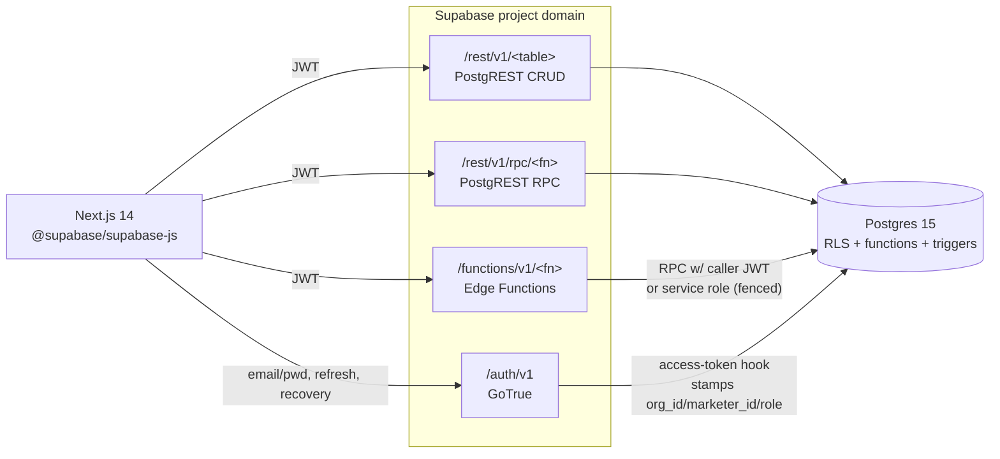

# 09 — API Architecture (REST conventions, RPC/Edge endpoints, Auth, Errors)

> **Status:** Architecture-validation phase. No application code. This document specifies the
> **API surface** of the platform: the PostgREST REST conventions for CRUD, the RPC and Edge
> Function endpoints for non-trivial operations, the auth flows, the JWT claim contract, the
> error format, rate limiting, idempotency, and versioning strategy.
>
> **Consistency contract:** every table, column, enum value, constraint, RPC name, and Edge
> Function name used here is defined in
> [`01-database-schema.md`](./01-database-schema.md) and
> [`07-backend-architecture.md`](./07-backend-architecture.md) and is used **verbatim**. RLS
> semantics are summarized in schema §8 and roles in
> [`03-roles-matrix.md`](./03-roles-matrix.md). This document is the authority for the
> **HTTP-level wire contract**: paths, methods, payloads, response shapes, status codes.
>
> **Locked stack:** Supabase — Postgres 15, Supabase Auth (GoTrue), PostgREST (Data API),
> Edge Functions (Deno), Realtime, `pg_cron`. Frontend: Next.js 14 App Router + TypeScript +
> `@supabase/supabase-js` + `@supabase/ssr`.

---

## 1. API surface map — three planes, one JWT

The platform exposes exactly **three** HTTP surfaces, all behind the same Supabase project
domain and all authenticated by the **same bearer JWT** minted by Supabase Auth. There is no
bespoke Node/Express API server; the "backend for frontend" is the combination of PostgREST +
RPC + Edge Functions, with RLS as the authorization gate.

| Plane | Base path | Technology | Used for | Auth |
|---|---|---|---|---|
| **Auth API** | `/auth/v1/*` | Supabase Auth (GoTrue) | login, refresh, recovery, signup-on-invite, OAuth, 2FA | public + bearer |
| **Data API (REST)** | `/rest/v1/<table>` | PostgREST | CRUD on tables/views, filtering, pagination, ordering, embedding | bearer (RLS-enforced) |
| **Data API (RPC)** | `/rest/v1/rpc/<fn>` | PostgREST → Postgres function | transactional domain ops that hold invariants/history | bearer (RLS-enforced) |
| **Functions API** | `/functions/v1/<fn>` | Edge Functions (Deno) | external I/O, `auth`-schema orchestration, binary rendering, fan-out | bearer (+ service role internally) |



**Routing principle (restated from `07-backend-architecture.md` §3):**

- **Read anything / simple CRUD** → PostgREST table endpoint (RLS does authz).
- **Write that must hold an invariant, write history, or be idempotent** → RPC (`/rpc/<fn>`).
- **Write that needs the `auth` schema, external I/O, or binary rendering** → Edge Function
  (`/functions/v1/<fn>`), which calls back into RPC for the tenant-state change.

> The frontend almost never constructs raw URLs; it uses the `supabase-js` query builder
> (`.from('contacts').select(...)`, `.rpc('place_marketer', {...})`,
> `.functions.invoke('activate-account', {...})`). The wire contract below is what that builder
> produces and is the contract any non-JS consumer (export tooling, tests) must honor.

---

## 2. PostgREST REST conventions (CRUD)

All table endpoints live under `/rest/v1/`. The table name is the canonical plural from the
schema (`marketers`, `contacts`, `prospects`, `prospect_journey_events`, `calls`,
`centos_list_entries`, `seven_whys`, `internal_documents`, `document_versions`,
`notifications`, `leaderboard_snapshots`, `monthly_reports`, `bottleneck_findings`,
`rank_history`, `account_invitations`, `mv_funnel_totals`, `mv_stage_conversion`). RLS makes
every one of these org- and subtree-scoped automatically; **no endpoint ever needs a manual
`org_id` filter for correctness** (it may add one for index selectivity).

### 2.1 Standard headers

| Header | Value | Purpose |
|---|---|---|
| `apikey` | `<SUPABASE_ANON_KEY>` | identifies the project (publishable key) |
| `Authorization` | `Bearer <access_jwt>` | the caller identity; drives RLS |
| `Accept` | `application/json` (default) or `text/csv` | JSON or CSV export of a result set |
| `Accept-Profile` / `Content-Profile` | `public` | schema selector (always `public`; `app_private` is never exposed) |
| `Prefer` | see below | controls return shape, counting, conflict handling, dedup |

`Prefer` values used by this platform:

| `Prefer` token | Effect |
|---|---|
| `return=representation` | `POST/PATCH` return the affected rows (default for our client; otherwise `return=minimal`) |
| `count=exact` / `count=planned` / `count=estimated` | populate `Content-Range` total; **`planned`/`estimated` is mandated on large lists** (contacts, calls) to avoid full counts |
| `resolution=merge-duplicates` / `resolution=ignore-duplicates` | upsert behavior on `POST` with `on_conflict` |
| `handling=strict` | reject unknown query params/columns (we enable this to fail loudly on typos) |

### 2.2 CRUD verbs

| Verb | Path | Semantics |
|---|---|---|
| `GET` | `/rest/v1/contacts?...` | list/read; filters, order, pagination, embedding |
| `POST` | `/rest/v1/contacts` | insert one or many rows (array body = bulk insert) |
| `PATCH` | `/rest/v1/contacts?id=eq.<uuid>` | partial update of rows matching the filter |
| `DELETE` | `/rest/v1/contacts?id=eq.<uuid>` | **soft-delete is preferred** via `PATCH ... deleted_at=now()`; hard `DELETE` is restricted (see §2.9) |

> **Hard vs soft delete.** Tables with a `deleted_at` column (`marketers`, `contacts`,
> `prospects`, `calls`, `centos_list_entries`, `internal_documents`, `notifications`,
> `memberships`, `organizations`) are deleted by `PATCH`ing `deleted_at = now()`. RLS read
> policies already filter `deleted_at IS NULL` for active views. Genuine row removal is reserved
> for admin RPC paths (e.g. structural tree operations) where referential rules apply.

### 2.3 Filtering (operator syntax)

PostgREST filters are `?<column>=<op>.<value>`. The operators this platform relies on:

| Operator | Meaning | Example (canonical columns) |
|---|---|---|
| `eq`, `neq` | =, ≠ | `?status=eq.nuovo` (`contacts.status`, `contact_status` enum) |
| `gt,gte,lt,lte` | comparisons | `?next_follow_up_at=lte.2026-06-01T00:00:00Z` |
| `in` | set membership | `?current_stage=in.(closing,check_soldi,iscrizione)` (`prospects.current_stage`) |
| `is` | NULL / boolean | `?deleted_at=is.null`, `?read_at=is.null` (notifications) |
| `like,ilike` | pattern | `?last_name=ilike.*rossi*` |
| `cs` (contains) | array contains | `?tags=cs.{vip,evento}` (`contacts.tags text[]`, GIN-indexed) |
| `cd` (contained-in) | array contained | `?tags=cd.{vip,evento}` |
| `fts`/`plfts`/`wfts` | full-text / trigram-friendly search | name search on `marketers.display_name`, contacts computed name |
| `not` | negation prefix | `?status=not.in.(perso,non_qualificato)` |

**Logical composition** uses `and`/`or` group syntax:

```http
GET /rest/v1/prospects
    ?and=(outcome.eq.open,current_stage.in.(closing,check_soldi))
    &or=(expected_value.gte.1000,full_name.ilike.*spa*)
    &order=current_stage_since.asc
```

**Fuzzy search** (the contact/marketer search box) maps to the `gin_trgm_ops` indexes
(`marketers_name_trgm`, `contacts_name_trgm`). The client issues `ilike` against the indexed
expression; for ranked relevance the platform exposes a thin RPC (`/rpc/search_contacts`,
`/rpc/search_marketers`) that orders by `similarity()` — raw `ilike` is fine for prefix/substring,
the RPC is used where ranking matters.

### 2.4 Ordering

```http
GET /rest/v1/calls?order=occurred_at.desc,id.desc
GET /rest/v1/centos_list_entries?order=position.asc
GET /rest/v1/leaderboard_snapshots?order=rank_position.asc
```

`nullsfirst`/`nullslast` are appended where relevant (e.g.
`?order=next_follow_up_at.asc.nullslast` for the follow-up queue so un-scheduled contacts sink).

### 2.5 Pagination — keyset preferred, offset allowed

Two mechanisms, with a hard rule on hot lists:

**(a) Offset/limit (small or admin lists):**

```http
GET /rest/v1/internal_documents?limit=25&offset=50
# or, equivalently, via Range header:
GET /rest/v1/internal_documents
Range-Unit: items
Range: 50-74
```
Response carries `Content-Range: 50-74/342` (total present only when `Prefer: count=...`).

**(b) Keyset (mandatory on `contacts`, `calls`, `prospect_journey_events`, `notifications`):**
the client pages by the last seen sort key rather than `offset`, using the composite indexes
already defined (`contacts_owner_idx`, `calls_marketer_time_idx`, `pje_prospect_idx`):

```http
# first page
GET /rest/v1/calls?order=occurred_at.desc,id.desc&limit=50
# next page (cursor = last row's occurred_at + id)
GET /rest/v1/calls
    ?or=(occurred_at.lt.2026-05-20T10:00:00Z,and(occurred_at.eq.2026-05-20T10:00:00Z,id.lt.<lastId>))
    &order=occurred_at.desc,id.desc
    &limit=50
```

> **Why keyset on hot lists:** large tenants have hundreds of thousands of calls/contacts; deep
> `OFFSET` scans degrade. Keyset is O(index) per page. The client wraps this in an opaque
> base64 `cursor` token so the URL shape can evolve without breaking callers (versioning, §13).

### 2.6 Resource embedding (joins) — read-only graph fetch

PostgREST follows FK relationships via `select=...(...)`. The platform's canonical embeds:

```http
# Prospect with its journey history and the responsible marketer's name/rank
GET /rest/v1/prospects?select=
    id,full_name,current_stage,outcome,current_stage_since,
    owner:marketers!owner_marketer_id(id,display_name,rank),
    contact:contacts!contact_id(id,first_name,last_name,phone),
    journey:prospect_journey_events(from_stage,to_stage,entered_at,exited_at,time_in_stage_secs)
    &id=eq.<prospect_id>

# Contact with its calls and the prospect(s) it spawned
GET /rest/v1/contacts?select=
    id,first_name,last_name,status,tags,next_follow_up_at,
    calls(id,call_type,outcome,occurred_at),
    prospects(id,current_stage,outcome)
    &id=eq.<contact_id>

# Marketer node for the tree, with rank history and seven_whys
GET /rest/v1/marketers?select=
    id,display_name,rank,status,leg,parent_id,sponsor_id,
    rank_history(previous_rank,new_rank,changed_at),
    seven_whys(primary_why_index)
    &id=eq.<marketer_id>
```

Embedded resources are **independently RLS-filtered** — an embed never widens visibility. The
disambiguating `!fk_column` hint is required where two FKs point at the same table
(`marketers!owner_marketer_id` vs `marketers!sponsor_id`; `marketers!parent_id`).

> **Genealogy embedding limit.** PostgREST embeds are one hop. **Subtree** reads (whole branch,
> team roster) are *not* done by recursive embedding — they go through the closure table, exposed
> as RPC/views (`/rpc/get_subtree`, `/rpc/branch_summary`) so the closure index does the work.

### 2.7 Column selection & computed shaping

`?select=` restricts columns (always used to avoid over-fetching `notes`/`body`). Renaming and
casting are supported (`select=stage:current_stage,since:current_stage_since`). Aggregates over
embeds are **not** done client-side; aggregated reads use the MVs (`mv_funnel_totals`,
`mv_stage_conversion`) or RPC.

### 2.8 Insert / update / upsert bodies

```http
POST /rest/v1/contacts
Prefer: return=representation
Content-Type: application/json

{ "owner_marketer_id": "<uuid>", "first_name": "Mario", "last_name": "Rossi",
  "source": "referral", "tags": ["vip"], "status": "nuovo" }
```
`org_id`, `created_by`, `updated_by` are **not** sent by the client — they are set by a
`BEFORE INSERT` trigger from `auth.jwt()` (`org_id`) and the caller's `marketer_id`. The RLS
`WITH CHECK` policy rejects any row whose `org_id` ≠ the JWT `org_id`, so even a forged body
cannot cross tenants.

Upsert:

```http
POST /rest/v1/seven_whys?on_conflict=org_id,marketer_id
Prefer: resolution=merge-duplicates,return=representation
{ "marketer_id": "<uuid>", "why_1": "...", "primary_why_index": 1 }
```

### 2.9 What is intentionally **not** exposed as raw CRUD

| Operation | Reason | Use instead |
|---|---|---|
| `INSERT` into `marketers` (placement) | binary-leg + closure + ltree invariants | `POST /rpc/place_marketer` |
| `UPDATE marketers.parent_id/leg` (move) | closure delete+reinsert + path rewrite | `POST /rpc/move_marketer` |
| `UPDATE marketers.rank` | must write `rank_history` | `POST /rpc/change_rank` |
| `INSERT/UPDATE prospect_journey_events` directly | one-open-event invariant | `POST /rpc/change_prospect_stage` |
| `INSERT marketer_tree_closure` | trigger-maintained derived data | (never; read-only to clients) |
| `UPDATE memberships.user_id/status` (activation) | profile-preserving auth link | Edge `activate-account` → `/rpc/accept_invitation` |
| `INSERT account_invitations` | eligibility guard + token hashing | Edge `create-invitation` → `/rpc/create_invitation` |
| `UPDATE audit_log` / `DELETE audit_log` | append-only | (revoked at the grant level) |
| `INSERT/UPDATE` MVs, `daily_marketer_metrics`, `leaderboard_snapshots`, `monthly_reports` | cron/trigger-derived | read-only to clients; written by jobs |

PostgREST `GRANT`s are configured so the `authenticated` role has **no `INSERT/UPDATE/DELETE`**
on those tables — only `SELECT` and `EXECUTE` on the corresponding RPC. This makes the "not
exposed" guarantee enforced by privilege, not convention.

---

## 3. RPC endpoints (Postgres functions over `/rest/v1/rpc/<fn>`)

Every RPC is `POST /rest/v1/rpc/<function_name>` with a JSON body of named parameters
(PostgREST maps JSON keys → function args, dropping the `p_` prefix convention; we expose
clean argument names). All run as the `authenticated` role **under RLS** (INVOKER) unless noted;
privileged sub-steps delegate to `app_private` `SECURITY DEFINER` helpers. All are idempotent or
constraint-arbitrated per `07-backend-architecture.md` §8.

Common conventions for every RPC below:

- **Method:** `POST`. (PostgREST also allows `GET` for `STABLE` read-only functions; read RPCs
  like `branch_summary`, `get_subtree`, `search_contacts` are `GET`-able and cacheable.)
- **Auth:** `Bearer <access_jwt>`; the function reads `org_id`/`marketer_id`/`role` from
  `auth.jwt()`. Cross-org is impossible (RLS + explicit `org_id` derivation).
- **Authorization gate:** `app_private.can_see_marketer(target)` for any node-scoped write;
  `role IN ('admin','owner')` for admin-only ops.
- **Errors:** Postgres `RAISE EXCEPTION ... USING ERRCODE` → PostgREST maps SQLSTATE → HTTP
  (mapping table in §10).

### 3.0 RPC catalog (index)

| RPC | Method | Min role/rank | Mutates | Idempotency |
|---|---|---|---|---|
| `place_marketer` | POST | member (must see parent) | `marketers` (+closure/path via trigger) | constraint-arbitrated (leg unique) |
| `move_marketer` | POST | admin/owner | `marketers`, closure, path, `audit_log` | advisory-locked; deterministic |
| `change_rank` | POST | admin/owner | `marketers.rank` (+`rank_history` via trigger), `notifications` | `previous_rank <> new_rank` |
| `change_prospect_stage` | POST | member (must own/see prospect) | `prospect_journey_events`, `prospects` | one-open-event invariant |
| `promote_contact_to_prospect` | POST | member (must see contact) | `prospects`, first journey event | dedupe on `(contact_id, open prospect)` |
| `promote_centos_entry` | POST | member | `centos_list_entries.promoted_contact_id`, `contacts` | dedupe on `promoted_contact_id` |
| `create_invitation` | POST | admin/owner (or eligible upline) | `account_invitations` | partial unique `(org_id,marketer_id) WHERE status='pending'` |
| `accept_invitation` | POST | service (via Edge) | `memberships`, `account_invitations`, `audit_log` | `token_hash` single-use + status gate |
| `revoke_invitation` | POST | admin/owner | `account_invitations.status='revoked'` | status gate |
| `bulk_update_contacts` | POST | member | `contacts` (many), `audit_log` | idempotency key + dirty-metrics flag |
| `upsert_bottleneck_finding` | POST | service (engine) | `bottleneck_findings` | upsert on full unique key |
| `recompute_branch_analytics` | POST | member (must see node) / admin | `daily_marketer_metrics` (dirty subset), MV refresh hint | dirty-set; recompute = same |
| `branch_summary` | GET/POST | member (must see node) | none (read) | n/a (read) |
| `get_subtree` | GET/POST | member (must see node) | none (read) | n/a (read) |
| `funnel_conversion` | GET/POST | member (must see node) | none (read) | n/a (read) |
| `mark_notifications_read` | POST | member (own only) | `notifications.read_at` | re-mark is no-op |

The five "headline" custom operations called out in the task are detailed in full below
(`activate_crm_access`, `place_marketer`, `recompute_branch_analytics`,
`generate_monthly_report`, `run_bottleneck_engine`, `export_report`); the remaining RPCs are
specified more tersely since they follow the same template.

---

### 3.1 `place_marketer` — binary placement + spillover

Creates a **marketer profile** and places it under a parent on a specific leg. `parent_id`/`leg`
define placement; `sponsor_id` records the actual recruiter (may differ → **spillover**). Closure
rows + ltree `path` are maintained by the `AFTER INSERT` trigger (schema §2.2). The new profile
is created with `status = 'pending'` and **no login** — a `memberships`/`auth.users` link is
attached later by activation (profile ≠ account).

| Property | Value |
|---|---|
| **Method / Path** | `POST /rest/v1/rpc/place_marketer` |
| **Auth** | `authenticated`; caller must satisfy `can_see_marketer(parent_id)` (own-or-downline) — i.e. you can only place under yourself or a descendant. Admin/owner can place under any node in the org. |
| **Mutates** | `marketers` (one row) → triggers populate `marketer_tree_closure` and `path` |

**Request body**

```json
{
  "parent_id": "8f1c…",           // placement upline (required; org root is created by provisioning, not this RPC)
  "leg": "LEFT",                  // placement_leg enum: 'LEFT' | 'RIGHT'
  "sponsor_id": "a02d…",          // actual recruiter; may differ from parent_id (spillover). Optional but recommended.
  "first_name": "Giulia",
  "last_name": "Bianchi",
  "external_code": "AFF-10293",   // optional; company affiliate code, unique per org when present
  "email": "giulia@example.com",  // optional profile contact email (NOT a login)
  "phone": "+39…",                // optional
  "rank": "executive"             // optional; defaults to 'executive' per schema; CRM access still gated
}
```

**Spillover semantics.** The endpoint stores the *result* of a placement decision; it does not
run a placement algorithm (schema §10.4 — operator-driven for v1). The client/admin chooses
`parent_id` + `leg` (where the person lands in the binary tree) and `sponsor_id` (who recruited
them). When `sponsor_id ≠ parent_id`, that *is* spillover — the recruit hangs under a different
upline than their recruiter, exactly as the model intends.

**Success response — `201 Created`**, body = the inserted `marketers` row (`return=representation`):

```json
{
  "id": "c77e…",
  "org_id": "11aa…",
  "parent_id": "8f1c…",
  "leg": "LEFT",
  "sponsor_id": "a02d…",
  "first_name": "Giulia",
  "last_name": "Bianchi",
  "display_name": "Giulia Bianchi",
  "external_code": "AFF-10293",
  "rank": "executive",
  "status": "pending",
  "path": "8f1c….c77e…",
  "registration_date": "2026-05-30",
  "created_at": "2026-05-30T09:12:00Z"
}
```

**Error cases**

| Condition | SQLSTATE | HTTP | Error `code` |
|---|---|---|---|
| Caller cannot see `parent_id` | `42501` | 403 | `not_authorized_for_parent` |
| Leg already occupied (`marketers_one_child_per_leg`) | `23505` | 409 | `leg_occupied` |
| `external_code` already used in org (`marketers_external_code_uq`) | `23505` | 409 | `external_code_taken` |
| `parent_id` does not exist / wrong org | `23503` | 422 | `parent_not_found` |
| Cycle (parent inside new node's subtree — impossible on insert, guarded on move) | `P0001` | 422 | `would_create_cycle` |
| Missing required field (`first_name`/`last_name`/`leg`) | `23502`/`22004` | 422 | `validation_error` |

> The org **root** marketer (the only row with `parent_id IS NULL`) is created during org
> provisioning by an admin/service path, **not** by `place_marketer`, which always requires a
> parent. `marketers_single_root_per_org` enforces exactly one root.

---

### 3.2 `move_marketer` — structural re-placement (admin-only)

Corrects a placement: re-parents a node to a new `(parent_id, leg)`, rewriting closure rows and
ltree `path` for the moved node and its entire subtree, in **one transaction** guarded by an
advisory lock on the org's tree (schema §2.2 op 2, backend §6.2).

| Property | Value |
|---|---|
| **Method / Path** | `POST /rest/v1/rpc/move_marketer` |
| **Auth** | `role IN ('admin','owner')` only |
| **Mutates** | `marketers.parent_id`/`leg`, `marketer_tree_closure` (delete+reinsert), `path` (subtree rewrite), `audit_log('marketer.move')` |

**Request** `{ "marketer_id": "<uuid>", "new_parent_id": "<uuid>", "new_leg": "RIGHT" }`

**Success — `200 OK`**, body = updated `marketers` row + `{ "subtree_rows_rewritten": <int> }`.

**Error cases**

| Condition | HTTP | `code` |
|---|---|---|
| Not admin/owner | 403 | `forbidden` |
| `new_parent_id` is inside `marketer_id`'s own subtree (cycle) | 422 | `would_create_cycle` |
| Destination `(org_id, new_parent_id, new_leg)` occupied | 409 | `leg_occupied` |
| `marketer_id` is the org root | 422 | `cannot_move_root` |
| Concurrent move already running (advisory lock busy) | 409 | `tree_locked` |

---

### 3.3 `change_rank` — rank change with history (admin-only)

| Property | Value |
|---|---|
| **Method / Path** | `POST /rest/v1/rpc/change_rank` |
| **Auth** | `role IN ('admin','owner')` |
| **Mutates** | `marketers.rank` → `AFTER UPDATE` trigger writes `rank_history(previous_rank,new_rank,changed_at,changed_by,notes)`; emits `notifications(type='rank_changed')` |

**Request** `{ "marketer_id": "<uuid>", "new_rank": "team_leader", "notes": "Q2 promotion" }`
(`new_rank` ∈ `marketer_rank` enum.)

**Success — `200 OK`**: `{ "marketer_id": "...", "previous_rank": "consultant", "new_rank": "team_leader", "crm_eligible": true, "changed_at": "..." }`.
`crm_eligible` is read from `ranks_meta` for the new rank and surfaced so the UI can immediately
reflect CRM-access eligibility.

**Error cases**

| Condition | HTTP | `code` |
|---|---|---|
| Not admin/owner | 403 | `forbidden` |
| `new_rank == current rank` (`CHECK previous_rank IS DISTINCT FROM new_rank`) | 422 | `rank_unchanged` |
| Invalid enum value | 422 | `validation_error` |
| Marketer not in org | 404 | `marketer_not_found` |

> **CRM eligibility is not changed here.** A rank change updates eligibility *defaults*
> (`ranks_meta.crm_eligible`), but the actual CRM login is governed by `memberships` +
> `permissions->>'crm_access'`. Demoting to `executive` does **not** delete an existing
> membership; an admin must explicitly suspend the membership (`PATCH /memberships`).

---

### 3.4 `change_prospect_stage` — journey transition

Implements the exact mechanics in schema §5.2 atomically: closes the open
`prospect_journey_events` row (`exited_at = now()`), inserts a new event (`from_stage`/`to_stage`),
updates `prospects.current_stage` + `current_stage_since`, and (when `to_stage = 'iscrizione'`
with success) sets `outcome = 'enrolled'`, `closed_at`.

| Property | Value |
|---|---|
| **Method / Path** | `POST /rest/v1/rpc/change_prospect_stage` |
| **Auth** | caller must `can_see_marketer(prospects.owner_marketer_id)` |
| **Mutates** | `prospect_journey_events` (close + insert), `prospects` |

**Request**

```json
{
  "prospect_id": "…",
  "to_stage": "closing",          // prospect_stage enum
  "responsible_marketer_id": "…", // defaults to jwt.marketer_id; must be visible to caller
  "notes": "Cliente chiede secondo incontro",
  "outcome": "open"               // optional; 'enrolled'|'lost'|'on_hold' to also close the funnel
}
```

**Success — `200 OK`**: updated `prospects` row + the new `prospect_journey_events` row.

**Error cases**

| Condition | HTTP | `code` |
|---|---|---|
| Caller cannot see prospect's owner | 403 | `forbidden` |
| `to_stage == current_stage` (`pje_stage_progression`) | 422 | `stage_unchanged` |
| Prospect already closed (`outcome <> 'open'`) and not re-opening | 409 | `prospect_closed` |
| Invalid enum | 422 | `validation_error` |

> Backward transitions (e.g. `closing` → `follow_up`) are **allowed** — the enum order is
> canonical for reporting, not a state-machine lock — and are recorded as normal events. Only
> equal-stage no-ops are rejected.

---

### 3.5 `recompute_branch_analytics`

Forces a refresh of the Global / Left Branch / Right Branch rollups for a node's subtree. Used
after bulk operations (bulk stage change, bulk contact import) or by an admin who wants
analytics to reflect changes *now* rather than waiting for the hourly `rebuild_daily_metrics`
cron. It flags the relevant `(org_id, marketer_id, metric_date)` pairs into the dirty-set queue
(`app_private.dirty_metric_days`) and synchronously recomputes the affected `daily_marketer_metrics`
rows for the requested window, then requests a concurrent MV refresh.

| Property | Value |
|---|---|
| **Method / Path** | `POST /rest/v1/rpc/recompute_branch_analytics` |
| **Auth** | caller must `can_see_marketer(node_id)`; org-wide recompute (`node_id` = root) requires admin/owner |
| **Mutates** | `daily_marketer_metrics` (recomputed subset); enqueues MV refresh; **no** raw operational data is changed |
| **Idempotency** | recompute is pure (same inputs → same rollup); safe to call repeatedly; dirty-set `ON CONFLICT DO NOTHING` |

**Request**

```json
{
  "node_id": "8f1c…",            // subtree root to recompute (must be visible)
  "period_start": "2026-05-01",  // inclusive (org-local day)
  "period_end": "2026-05-31",    // inclusive
  "branch_side": "GLOBAL",       // branch_side enum: 'GLOBAL' | 'LEFT' | 'RIGHT'
  "refresh_mv": true             // also REFRESH MATERIALIZED VIEW CONCURRENTLY (default true)
}
```

**Behavior (SQL core, mirrors backend §4.2):** the recompute joins `marketer_tree_closure`
(`ancestor_id = node_id`, optionally `branch_leg = LEFT/RIGHT`) to the operational tables
(`calls`, `prospects`, `prospect_journey_events`) to re-derive each descendant's
`daily_marketer_metrics` rows for the window, then `REFRESH MATERIALIZED VIEW CONCURRENTLY
mv_funnel_totals, mv_stage_conversion` if `refresh_mv`.

**Success — `200 OK`**

```json
{
  "node_id": "8f1c…",
  "branch_side": "GLOBAL",
  "period_start": "2026-05-01",
  "period_end": "2026-05-31",
  "marketers_recomputed": 142,
  "metric_rows_written": 1860,
  "mv_refreshed": true,
  "recomputed_at": "2026-05-30T09:20:11Z"
}
```

**Error cases**

| Condition | HTTP | `code` |
|---|---|---|
| Caller cannot see `node_id` | 403 | `forbidden` |
| `node_id` = root but caller not admin/owner | 403 | `org_recompute_requires_admin` |
| `period_end < period_start` | 422 | `invalid_period` |
| Window too large (> 1 year guard) | 422 | `period_too_large` |
| MV refresh already running (advisory lock) | 409 | `refresh_in_progress` — recompute still applied; retry refresh |

> **Read-only branch analytics** (the common case — drawing the Global/Left/Right dashboard
> cards) does **not** call this; it reads via `GET /rest/v1/rpc/branch_summary` (§3.10) which is
> a `STABLE` function and cacheable. `recompute_branch_analytics` is the *write*/refresh path.

---

### 3.6 `generate_monthly_report` — on-demand report generation

Normally `monthly_reports` rows are produced by the `generate_monthly_reports` `pg_cron` job
(1st of month, schema §9). This RPC lets an admin (or a marketer for their own subtree) generate
or regenerate the immutable snapshot **on demand** (e.g. mid-month preview, or backfill). It is
the SQL **assembly** half; rendering to PDF/Excel is the separate `export_report` Edge Function
(§4.3).

| Property | Value |
|---|---|
| **Method / Path** | `POST /rest/v1/rpc/generate_monthly_report` |
| **Auth** | marketer for `marketer_id` within own subtree (`can_see_marketer`); `marketer_id = null` (org-level row) requires admin/owner |
| **Mutates** | `monthly_reports` (upsert on `(org_id, marketer_id, period, period_start)`) |
| **Idempotency** | upsert — regenerating the same period re-stamps the snapshot, never duplicates |

**Request**

```json
{
  "marketer_id": "8f1c…",   // null = org-level report (admin only)
  "period": "monthly",      // report_period enum: 'monthly' | 'quarterly'
  "period_start": "2026-04-01"  // first day of the month/quarter; period_end derived
}
```

**Behavior.** Computes current-period metrics (subtree-inclusive: closure join to
`daily_marketer_metrics`), the previous period, and the MoM/QoQ `deltas` + `delta_pct`, then
`INSERT … ON CONFLICT (org_id, marketer_id, period, period_start) DO UPDATE`. `metrics`,
`previous_metrics`, `deltas`, `delta_pct` are the canonical `jsonb` shapes from schema §6.4.

**Success — `201 Created`** (or `200 OK` on regenerate), body = the `monthly_reports` row:

```json
{
  "id": "rep_…",
  "org_id": "11aa…",
  "marketer_id": "8f1c…",
  "period": "monthly",
  "period_start": "2026-04-01",
  "period_end": "2026-04-30",
  "metrics": { "calls": 412, "connected": 188, "new_prospects": 73,
               "enrollments": 11, "conversion_rate": 0.1507, "team_size": 142 },
  "previous_metrics": { "calls": 365, "enrollments": 8, "conversion_rate": 0.1304, "team_size": 131 },
  "deltas":    { "calls": 47, "enrollments": 3, "team_size": 11 },
  "delta_pct": { "calls": 0.1288, "enrollments": 0.375, "conversion_rate": 0.1556 },
  "generated_at": "2026-05-30T09:25:00Z"
}
```

**Error cases**

| Condition | HTTP | `code` |
|---|---|---|
| `marketer_id` not visible to caller | 403 | `forbidden` |
| Org-level report requested by non-admin | 403 | `org_report_requires_admin` |
| `period_start` not the first day of a month/quarter | 422 | `invalid_period_start` |
| Future period (no data) | 422 | `period_in_future` |

---

### 3.7 `run_bottleneck_engine` — manual trigger of detection rules

Wraps the nightly `run_bottleneck_rules` job for **on-demand** execution (admin clicks "Analizza
ora", or a manager wants a fresh scan of their subtree). It evaluates the four rule sets over the
rollups and journey data, upserts `bottleneck_findings`, resolves cleared findings, and (for new
`critical` findings) requests notification fan-out.

> **Implementation note.** Because rule evaluation can be heavy and the *orchestration* (per-org
> batching, fan-out) is the Edge Function `bottleneck-engine`'s job
> (`07-backend-architecture.md` §4.4), the **client-facing trigger is the Edge Function**
> `POST /functions/v1/bottleneck-engine` (§4.4 below), which internally calls the SQL rules and
> `/rpc/upsert_bottleneck_finding`. A thin `POST /rest/v1/rpc/run_bottleneck_engine` also exists
> for a **synchronous single-subtree** scan (no fan-out) usable directly from PostgREST.

**RPC variant — `POST /rest/v1/rpc/run_bottleneck_engine`** (synchronous, one subtree)

| Property | Value |
|---|---|
| **Auth** | caller must `can_see_marketer(node_id)`; org-wide (`node_id` = root) requires admin/owner |
| **Mutates** | `bottleneck_findings` (upsert on `(org_id, marketer_id, type, stage, period_start)`); sets `resolved_at` on cleared findings |
| **Idempotency** | full-key upsert; resolve-on-clear; re-running yields identical `findings` set |

**Request**

```json
{
  "node_id": "8f1c…",
  "period_start": "2026-05-01",
  "period_end": "2026-05-31",
  "rules": ["weak_conversion", "stage_delay", "inactivity", "followup_overdue"], // subset of bottleneck_type; default = all
  "notify": false   // RPC default false; the Edge variant fans out notifications
}
```

**Success — `200 OK`**

```json
{
  "node_id": "8f1c…",
  "period_start": "2026-05-01",
  "period_end": "2026-05-31",
  "evaluated_marketers": 142,
  "findings_upserted": 9,
  "findings_resolved": 3,
  "by_severity": { "info": 2, "warning": 5, "critical": 2 },
  "findings": [
    { "id": "bf_…", "marketer_id": "…", "type": "weak_conversion", "severity": "critical",
      "stage": "closing", "metric_value": 0.08, "threshold_value": 0.20,
      "title_it": "Conversione debole in fase di closing",
      "recommendation_it": "Rivedi gli script di chiusura e pianifica un affiancamento." }
  ]
}
```

**Error cases**

| Condition | HTTP | `code` |
|---|---|---|
| Caller cannot see `node_id` | 403 | `forbidden` |
| Org-wide run by non-admin | 403 | `org_run_requires_admin` |
| Unknown rule in `rules[]` | 422 | `unknown_rule` |
| `period_end < period_start` | 422 | `invalid_period` |
| Another scan running for this subtree (advisory lock) | 409 | `engine_busy` |

---

### 3.8 `promote_contact_to_prospect`, `promote_centos_entry`

`POST /rest/v1/rpc/promote_contact_to_prospect`
`{ "contact_id": "…", "full_name": "…", "expected_value": 1500 }` → inserts a `prospects` row
linked to `contact_id`, opens the first `prospect_journey_events` (`to_stage='conoscitiva'`).
Dedupe: if an **open** prospect already exists for that contact, returns it (`200`) instead of
creating a second. Auth: `can_see_marketer(contacts.owner_marketer_id)`.

`POST /rest/v1/rpc/promote_centos_entry`
`{ "centos_entry_id": "…" }` → inserts a `contacts` row (`source='centos_list'`) and sets
`centos_list_entries.promoted_contact_id`. Idempotent on `promoted_contact_id` (returns existing).

### 3.9 `create_invitation`, `accept_invitation`, `revoke_invitation`

These power activation (full flow in §4.1). Wire summary:

- `POST /rest/v1/rpc/create_invitation`
  `{ "marketer_id": "…", "email": "…", "role": "member", "permissions": {"crm_access": true} }`
  → inserts `account_invitations` with `token_hash` (the **raw** token is returned **only** to the
  Edge Function caller, never persisted). Eligibility guard: target's `rank` must be
  `ranks_meta.crm_eligible = true` **or** `permissions->>'crm_access' = 'true'`. Auth: admin/owner
  or the invited marketer's upline. Errors: `403 not_authorized`, `409 invitation_exists` (partial
  unique), `422 not_crm_eligible`.
- `POST /rest/v1/rpc/accept_invitation`
  `{ "token_hash": "…", "accepted_user_id": "…" }` → activates `memberships`, marks invitation
  `accepted`. **Called only by the `activate-account` Edge Function** (service context). Profile
  (`marketers`) is never written. Idempotent: a second call with an already-`accepted` token
  returns the existing membership.
- `POST /rest/v1/rpc/revoke_invitation` `{ "invitation_id": "…" }` → sets `status='revoked'`.
  Admin/owner. `422 already_accepted` if past acceptance.

### 3.10 Read RPCs — `branch_summary`, `get_subtree`, `funnel_conversion`, search

All are `STABLE`, callable via `GET` (cacheable) or `POST`, RLS-respecting (node must be visible).

| RPC | Returns |
|---|---|
| `GET /rest/v1/rpc/branch_summary?node_id=…&branch_side=LEFT&period_start=…&period_end=…` | aggregated KPIs for the branch (`calls_total`, `calls_connected`, `new_prospects`, `enrollments`, `new_recruits`, `active_marketers`) per backend §4.2 SQL |
| `GET /rest/v1/rpc/get_subtree?node_id=…&max_depth=3` | flat list of `(marketer_id, depth, branch_leg, display_name, rank, status, team_size)` for tree rendering |
| `GET /rest/v1/rpc/funnel_conversion?node_id=…&period_start=…&period_end=…` | per-stage `entered_count`, `exited_count`, `avg_time_in_stage_secs`, and derived stage-to-stage `%` over the `prospect_stage` ladder (from `mv_stage_conversion`) |
| `GET /rest/v1/rpc/search_contacts?q=ros&limit=20` | trigram-ranked contacts (`similarity()` order), RLS subtree |
| `GET /rest/v1/rpc/search_marketers?q=bianchi&limit=20` | trigram-ranked marketers, RLS subtree |

### 3.11 `bulk_update_contacts`, `mark_notifications_read`

- `POST /rest/v1/rpc/bulk_update_contacts`
  `{ "contact_ids": ["…"], "set": {"status":"qualificato","tags_add":["vip"]}, "idempotency_key": "<uuid>" }`
  → one transaction updates many `contacts`, writes a single `audit_log('contacts.bulk_update')`,
  flags dirty metrics. Honors the `Idempotency-Key` header / `idempotency_key` arg (§12). Only
  contacts the caller can see are affected; invisible ids are silently skipped and reported in
  `skipped[]`.
- `POST /rest/v1/rpc/mark_notifications_read`
  `{ "notification_ids": ["…"] }` or `{ "before": "2026-05-30T00:00:00Z" }` → sets `read_at = now()`
  for the caller's own notifications. Re-marking is a no-op.

---

## 4. Edge Function endpoints (`/functions/v1/<fn>`)

Edge Functions are invoked by the client with `supabase.functions.invoke('<fn>', { body })`
(which issues `POST /functions/v1/<fn>` with the caller's `Authorization` bearer) or by `pg_cron`
via `net.http_post` (with a service token). Each validates the JWT, does the external/privileged
work, and **routes tenant-state mutations through RPC** so RLS and invariants still hold
(`07-backend-architecture.md` §4).

### 4.0 Edge catalog

| Function | Path | Invoked by | Purpose |
|---|---|---|---|
| `create-invitation` | `/functions/v1/create-invitation` | client (admin) | mint token + `/rpc/create_invitation` + send email |
| `activate-account` | `/functions/v1/activate-account` | client (invitee) | validate token + `auth.admin.createUser` + `/rpc/accept_invitation` |
| `branch-analytics` | `/functions/v1/branch-analytics` | client | assemble Global+Left+Right + trends for export/CEO view |
| `generate-report-export` | `/functions/v1/generate-report-export` | client / cron | render PDF/XLSX/CSV from `monthly_reports`/leaderboards |
| `bottleneck-engine` | `/functions/v1/bottleneck-engine` | cron / admin | evaluate rules org-wide, upsert findings, fan out alerts |
| `notification-fanout` | `/functions/v1/notification-fanout` | cron / other EFs | expand one event to many `notifications` rows |

### 4.1 `activate_crm_access` flow — `create-invitation` + `activate-account`

The task's `activate_crm_access` operation is the **two-call activation workflow**
(`07-backend-architecture.md` §4.1). "Activate CRM Access" = issue an invitation against an
**existing** `marketers` profile, then the invitee accepts and a login is attached — the profile
is **never** recreated.

#### 4.1.1 `POST /functions/v1/create-invitation`

| Property | Value |
|---|---|
| **Auth** | `Bearer` of an admin/owner **or** the invited marketer's upline (`can_see_marketer(marketer_id)` + management permission). |
| **Side effects** | `/rpc/create_invitation` (stores `token_hash`); sends invite email via Auth/SMTP with the **raw** single-use token; `audit_log('invitation.create')`. |

**Request**

```json
{ "marketer_id": "8f1c…", "email": "giulia@example.com",
  "role": "member", "permissions": { "crm_access": true } }
```

**Eligibility (enforced in RPC + `BEFORE INSERT` trigger).** Allowed only if the target's `rank`
has `ranks_meta.crm_eligible = true`, **or** `permissions.crm_access = true` (admin override for an
`executive`). This is the encoded rule: *Executive → no CRM access unless explicitly enabled.*

**Success — `200 OK`**

```json
{ "invitation_id": "inv_…", "marketer_id": "8f1c…", "email": "giulia@example.com",
  "status": "pending", "expires_at": "2026-06-06T09:00:00Z", "email_sent": true }
```
(The raw token is **not** returned to the client — it goes only into the email link.)

**Error cases**

| Condition | HTTP | `code` |
|---|---|---|
| Caller not admin/owner/upline | 403 | `not_authorized` |
| Target not CRM-eligible and no override | 422 | `not_crm_eligible` |
| Live pending invite already exists | 409 | `invitation_exists` |
| Profile already has an active membership | 409 | `already_activated` |
| Email send failed (invite row still created) | 502 | `email_delivery_failed` (retriable) |

#### 4.1.2 `POST /functions/v1/activate-account`

| Property | Value |
|---|---|
| **Auth** | **public** (the invitee is not yet logged in) — authorization is the **single-use raw token**, not a JWT. |
| **Side effects** | hash + validate token; `auth.admin.createUser(email, password)` (service role); `/rpc/accept_invitation` to activate `memberships`; `audit_log('account.activate')`. |

**Request**

```json
{ "token": "<raw-single-use-token-from-email-link>", "password": "<chosen-password>" }
```

**Success — `200 OK`** (profile fully preserved; new login attached)

```json
{
  "membership_id": "mem_…",
  "marketer_id": "8f1c…",          // SAME id as before — profile preserved
  "org_id": "11aa…",
  "user_id": "usr_…",              // newly created auth.users
  "role": "member",
  "status": "active",
  "crm_access": true
}
```
The client then performs a normal login (or the function returns a session) and the access-token
hook stamps `org_id`/`marketer_id`/`role` into the JWT.

**Error cases**

| Condition | HTTP | `code` |
|---|---|---|
| Token unknown / malformed | 401 | `invalid_token` |
| Token expired (`expires_at < now()`) | 410 | `invitation_expired` |
| Token revoked | 410 | `invitation_revoked` |
| Already accepted (retry) | 200 | *(idempotent — returns existing membership)* |
| Weak password (Auth policy) | 422 | `weak_password` |
| Email already a login for another profile in org | 409 | `email_in_use` |

> **Idempotency.** `account_invitations.token_hash` is `UNIQUE` + single-use; a retried
> `activate-account` after success sees `status='accepted'` and returns the already-linked
> membership (no second `auth.users`, no second membership). The function also looks up the email
> before `createUser` to avoid duplicate logins on network retry (backend §4.1).

### 4.2 `branch-analytics` — `POST /functions/v1/branch-analytics`

Heavy assembly of the Global / Left Branch / Right Branch views with trend series and team
breakdown, shaped for Recharts. Uses the **caller's JWT** (never service role) so `node_id` is
RLS-constrained. Internally calls `branch_summary`/`funnel_conversion` per branch side.

**Request**
`{ "node_id": "8f1c…", "period_start": "2026-01-01", "period_end": "2026-05-31", "granularity": "month" }`

**Success — `200 OK`**

```json
{
  "node_id": "8f1c…",
  "period": { "start": "2026-01-01", "end": "2026-05-31", "granularity": "month" },
  "global": { "kpis": { "calls_total": 1820, "enrollments": 41, "active_marketers": 142 },
              "trend": [ { "month": "2026-01", "enrollments": 6, "new_prospects": 51 } ] },
  "left":   { "kpis": { "calls_total": 980, "enrollments": 22, "active_marketers": 77 },
              "trend": [ /* … */ ] },
  "right":  { "kpis": { "calls_total": 840, "enrollments": 19, "active_marketers": 65 },
              "trend": [ /* … */ ] }
}
```

**Errors:** `403 forbidden` (node not visible), `422 invalid_period`.

### 4.3 `export_report` — `POST /functions/v1/generate-report-export`

The task's `export_report` operation. Renders a **precomputed, immutable** report (or leaderboard
/ branch payload) to PDF / Excel / CSV. The numbers come from `monthly_reports` /
`leaderboard_snapshots` / branch aggregation (already deterministic); the function only renders.

| Property | Value |
|---|---|
| **Auth** | caller's `Bearer`; the underlying data read is RLS-scoped (a member can only export their own subtree's report; admin exports org-level) |
| **Side effects** | none on tenant data; returns a signed, short-lived download URL (or the binary directly) |

**Request**

```json
{
  "type": "monthly_report",       // 'monthly_report' | 'leaderboard' | 'branch_analytics'
  "format": "pdf",                // 'pdf' | 'xlsx' | 'csv'
  "report_id": "rep_…",           // for type=monthly_report
  "scope": null,                  // for leaderboard: { metric, scope, scope_ref_id, branch_side, period_start }
  "locale": "it"
}
```

**Success — `200 OK`**

```json
{
  "file_name": "report-mensile-2026-04-giulia-bianchi.pdf",
  "format": "pdf",
  "mime_type": "application/pdf",
  "size_bytes": 184320,
  "download_url": "https://…/storage/v1/object/sign/exports/…?token=…",
  "expires_at": "2026-05-30T09:40:00Z"   // signed URL TTL ~10 min
}
```
(Alternatively, with `Accept: application/pdf`, the function streams the binary directly with
`Content-Disposition: attachment`.)

**Error cases**

| Condition | HTTP | `code` |
|---|---|---|
| `report_id` not visible to caller | 403 | `forbidden` |
| Unknown `type`/`format` | 422 | `unsupported_export` |
| Report not yet generated | 404 | `report_not_found` |
| Render failure (renderer error/timeout) | 500 | `render_failed` (retriable) |
| Payload too large for sync render | 413 | `export_too_large` (falls back to async job + notification) |

### 4.4 `bottleneck-engine` — `POST /functions/v1/bottleneck-engine`

The orchestrated, fan-out-capable form of `run_bottleneck_engine`. Invoked nightly by `pg_cron`
(`run_bottleneck_rules` job) via `net.http_post` with a service token, or by an admin
on-demand with their JWT.

**Request (admin on-demand)** `{ "org_id": "11aa…", "notify": true }`
**Request (cron)** `{ "mode": "all_orgs", "notify": true }` (service token).

**Behavior:** iterates org-by-org (one transaction per org), evaluates the four rule sets, calls
`/rpc/upsert_bottleneck_finding` per breach, resolves cleared findings, and calls
`notification-fanout` for new `critical` findings.

**Success — `200 OK`** `{ "orgs_processed": 1, "findings_upserted": 9, "findings_resolved": 3, "notifications_enqueued": 2 }`.
**Errors:** `403 forbidden` (non-admin, non-service), `409 engine_busy` (advisory lock).

### 4.5 `notification-fanout` — `POST /functions/v1/notification-fanout`

Internal (called by `bottleneck-engine`, report jobs). Expands one logical event into many
`notifications` rows (recipient set via closure), chunked, deduped on `payload->>'event_id'`.
Not a primary client endpoint. Auth: service token or admin. Idempotent via the event dedupe key.

---

## 5. Auth flows (Supabase Auth `/auth/v1`)

All auth uses GoTrue's standard endpoints. The frontend uses `@supabase/ssr` for cookie-based
sessions in the Next.js App Router; the wire calls are below for completeness.

### 5.1 Login (email/password)

```http
POST /auth/v1/token?grant_type=password
apikey: <ANON_KEY>
Content-Type: application/json

{ "email": "giulia@example.com", "password": "…" }
```
**`200 OK`** → `{ access_token, token_type:"bearer", expires_in:3600, refresh_token, user }`.
The **access-token hook** (`app_private.jwt_claims_hook`) stamps `org_id`, `marketer_id`, `role`
(and `is_platform_admin` for super-admins) into `access_token` at issuance (backend §4.7).
**Errors:** `400 invalid_grant` (bad credentials), `400 email_not_confirmed`, `429` (rate limit,
§11), `403` (membership `status` = `suspended`/`disabled` → custom claim check rejects).

### 5.2 Refresh

```http
POST /auth/v1/token?grant_type=refresh_token
{ "refresh_token": "…" }
```
**`200 OK`** → new `access_token` (claims re-stamped by the hook, so a role/rank/membership change
propagates on the next refresh) + rotated `refresh_token`. Access tokens are short-lived (1h);
refresh tokens rotate. **Errors:** `400 invalid_grant` (revoked/expired refresh → force re-login).

> **Claim freshness.** Because RLS reads `org_id`/`marketer_id`/`role` from the JWT, a privilege
> change (rank promotion, membership suspension, role grant) takes effect on the **next token
> refresh**, not instantly. For immediate revocation (suspend), the membership-status check is
> *also* applied in sensitive RPCs (defense in depth) and Realtime channels are dropped on
> suspend. Max staleness = access-token TTL (1h); tunable.

### 5.3 Password recovery

```http
POST /auth/v1/recover            { "email": "…" }           # sends reset email (always 200, no user enumeration)
PUT  /auth/v1/user               { "password": "newpw" }    # with the recovery-session bearer, sets new password
```
**Errors:** `422 weak_password`, `401` (invalid/expired recovery token), `429` (rate limit).

### 5.4 Signup-on-invite (handled by `activate-account`, not public signup)

**Public self-signup is disabled** for this platform (a login always attaches to a pre-existing
profile). The only path that creates an `auth.users` row is the `activate-account` Edge Function
(§4.1.2), which calls `auth.admin.createUser` with the service role after token validation. There
is no `POST /auth/v1/signup` surface exposed to the public.

### 5.5 OAuth & 2FA (future)

- **OAuth (Google/Microsoft):** `GET /auth/v1/authorize?provider=google` → callback. On first
  OAuth login, the user must still be linked to a profile via an accepted invitation; OAuth
  identity is attached to the existing `auth.users` (or rejected if no invitation/membership). No
  data-model change (roles doc / backend §4.6).
- **2FA (TOTP):** GoTrue MFA endpoints (`/auth/v1/factors`, `/auth/v1/factors/{id}/verify`).
  AAL2 can be required for admin/owner roles via an RLS/claim check (`aal` in the JWT). Listed for
  completeness; not in v1 scope.

### 5.6 Logout

`POST /auth/v1/logout` (revokes the refresh token / session). Client clears cookies.

---

## 6. JWT claim contract

Every authenticated request carries a Supabase-signed JWT. The **custom claims** below are
stamped by `app_private.jwt_claims_hook` (backend §4.7) and are the basis of every RLS policy and
RPC authorization check.

| Claim | Type | Source | Used by |
|---|---|---|---|
| `sub` | uuid | GoTrue | `auth.uid()` — the `auth.users` id |
| `email` | text | GoTrue | display / audit |
| `role` | text | **stamped** from `memberships.role` | RLS admin bypass, RPC admin gates. **Note:** Postgres also uses a top-level `role` for the DB role (`authenticated`); our app role lives at `app_metadata` namespace to avoid clash (below) |
| `org_id` | uuid | **stamped** from `memberships.org_id` | tenant key in **every** RLS policy |
| `marketer_id` | uuid | **stamped** from `memberships.marketer_id` | closure visibility (`can_see_marketer`), ownership defaults |
| `is_platform_admin` | boolean | **stamped** from `platform_admins` | cross-org bypass (super-admin) |
| `aal` | text | GoTrue MFA | (future) require AAL2 for admin |
| `exp` / `iat` | int | GoTrue | TTL (access ~3600s) |

**Namespacing.** To avoid colliding with PostgREST's reserved top-level `role` (which must be the
DB role, e.g. `authenticated`), the **application** role and other custom claims are read in
policies from the GoTrue `app_metadata`/custom-claims object. The canonical accessors used
throughout the schema/backend docs are written as `auth.jwt() ->> 'org_id'`,
`auth.jwt() ->> 'marketer_id'`, `auth.jwt() ->> 'role'` — these resolve against the stamped custom
claims (the hook writes them at the top level of the access token's claim set, and the DB role for
PostgREST is taken from the standard `role` GoTrue claim which we keep as `authenticated`). The
**app role** used for admin checks is the membership role value (`owner`/`admin`/`manager`/
`member`); when both must coexist, policies read the app role from the explicit
`auth.jwt() -> 'app_metadata' ->> 'app_role'` path. *(This precise claim placement is an open
question for sign-off — see §14.1 — but the semantic contract above is fixed.)*

**Example decoded access token (claims):**

```json
{
  "sub": "usr_…",
  "email": "giulia@example.com",
  "role": "authenticated",
  "org_id": "11aa…",
  "marketer_id": "8f1c…",
  "app_metadata": { "app_role": "member", "is_platform_admin": false },
  "aal": "aal1",
  "iat": 1748590000,
  "exp": 1748593600
}
```

---

## 7. Standard request shape

| Aspect | Rule |
|---|---|
| Content type | `application/json` for bodies; `text/csv` accepted on `GET` for export |
| Encoding | UTF-8; all timestamps ISO-8601 with `Z` (UTC on the wire); date-only fields `YYYY-MM-DD` |
| Locale | response domain values are canonical (Italian enum values like `nuovo`, `conoscitiva`); UI labels resolved client-side via `next-intl`. Error `message` is technical English; `message_it` carries the user-facing Italian string where surfaced |
| Idempotency | `Idempotency-Key: <uuid>` header on mutating Edge/RPC calls that aren't constraint-arbitrated (§12) |
| Tracing | `X-Request-Id` echoed in responses and `audit_log` where relevant |

---

## 8. Standard response & pagination shape

**REST list response** (PostgREST): a JSON array of rows. Metadata travels in headers:

| Header | Meaning |
|---|---|
| `Content-Range: 0-49/1240` | items returned / total (total only when `Prefer: count=...`) |
| `Content-Profile: public` | schema |
| `Preference-Applied: count=planned` | which `Prefer` tokens were honored |

The frontend wraps lists in a normalized envelope client-side:
`{ data: Row[], page: { count, range, next_cursor } }` — the `next_cursor` is the opaque keyset
token (§2.5). **RPC and Edge** responses are single JSON objects shaped exactly as documented per
endpoint above (no array envelope).

---

## 9. Error format (uniform across all three planes)

Every error — whether raised by Postgres (`RAISE EXCEPTION`), PostgREST validation, or an Edge
Function — is normalized to **one JSON envelope** so the frontend has a single error path.
PostgREST already returns `{code, details, hint, message}` for SQL errors; Edge Functions emit the
same shape; the client maps both.

```json
{
  "error": {
    "code": "leg_occupied",                  // stable, machine-readable app code (snake_case)
    "message": "RIGHT leg already occupied under parent 8f1c…",  // technical English
    "message_it": "La gamba destra è già occupata sotto questo upline.", // user-facing Italian
    "http_status": 409,
    "sqlstate": "23505",                      // present for DB-originated errors
    "details": { "parent_id": "8f1c…", "leg": "RIGHT" },
    "request_id": "req_01HZ…",
    "retriable": false
  }
}
```

### 9.1 SQLSTATE → HTTP → app-code mapping (canonical)

| SQLSTATE | Condition | HTTP | Typical app `code` |
|---|---|---|---|
| `23505` | unique_violation | 409 | `leg_occupied`, `external_code_taken`, `invitation_exists`, `duplicate` |
| `23503` | foreign_key_violation | 422 | `parent_not_found`, `reference_not_found` |
| `23502` | not_null_violation | 422 | `validation_error` |
| `23514` | check_violation | 422 | `rank_unchanged`, `stage_unchanged`, `invalid_value` |
| `22P02`/`22004` | invalid_text/enum | 422 | `validation_error` |
| `42501` | insufficient_privilege (RLS / explicit) | 403 | `forbidden`, `not_authorized_for_parent` |
| `P0001` | raised by our triggers/functions | 4xx per `USING` | `would_create_cycle`, `not_crm_eligible`, etc. |
| `PGRST301`/`PGRST302` | PostgREST auth (JWT missing/expired) | 401 | `unauthenticated` |
| `PGRST116` | no rows where ≥1 expected | 404 | `not_found` |
| `40001` | serialization_failure (move/placement race) | 409 | `conflict_retry` (`retriable: true`) |
| `55P03` | lock_not_available (advisory) | 409 | `tree_locked`, `engine_busy` |

> **Custom app codes** are raised in functions via
> `RAISE EXCEPTION 'message' USING ERRCODE='…', DETAIL='{"code":"leg_occupied",…}'`; an Edge
> wrapper / PostgREST `pre-request` normalizer lifts the `code`, `message_it`, and `retriable`
> fields out of `DETAIL` into the envelope. The `code` set is a closed, versioned vocabulary
> shipped to the frontend as a TypeScript union for exhaustive handling.

### 9.2 HTTP status usage

| Status | Used when |
|---|---|
| 200 | successful read/update/RPC; idempotent retry returning existing state |
| 201 | resource created (`place_marketer`, `generate_monthly_report` first run) |
| 204 | successful delete / mark-read with `return=minimal` |
| 400 | malformed request (bad JSON, bad grant) |
| 401 | missing/expired/invalid JWT or token |
| 403 | authenticated but not authorized (RLS, role gate, subtree) |
| 404 | not found **or** not visible (we return 404 rather than 403 for invisible rows to avoid leaking existence across subtrees) |
| 409 | conflict (unique violation, occupied leg, lock busy, concurrent move) |
| 410 | gone (expired/revoked invitation token) |
| 413 | payload too large (sync export over budget) |
| 422 | semantically invalid (validation, business rule, bad period) |
| 429 | rate limited (§11) |
| 5xx | server/render/dependency failure (`retriable: true` where safe) |

> **404-vs-403 policy.** For **row-level** visibility (a marketer/contact in a sibling subtree),
> the API returns **404** so callers cannot probe existence outside their subtree. For
> **action-level** authorization (you can see the parent but can't place because you're not
> admin), it returns **403** with a clear `code`. RLS naturally yields the 404 case (the row
> simply isn't in the result set); explicit role gates yield the 403 case.

---

## 10. Versioning strategy

| Layer | Versioning approach |
|---|---|
| **Supabase platform paths** | `/auth/v1`, `/rest/v1`, `/functions/v1` carry Supabase's own major version; we do not fork these. |
| **Our domain contract** | versioned by **additive evolution + a header**, not by path forks. New columns/RPC params are additive (clients ignore unknown fields). Breaking changes ship a **new RPC name** (`place_marketer_v2`) or a new Edge route, with the old one kept until all clients migrate. |
| **API version header** | clients send `X-Api-Version: 2026-05-01` (date-based). The Edge layer and a PostgREST `pre-request` hook can branch behavior on it; absence = latest. This lets us deprecate a response shape on a schedule without breaking pinned clients. |
| **Database views as the contract** | hot read surfaces are exposed through **named views** (`v_contacts_list`, `v_tree_nodes`) rather than raw tables, so we can refactor underlying columns while keeping the API stable. The view *is* the versioned contract; the table can change beneath it. |
| **Enum evolution** | enum values (`prospect_stage`, `marketer_rank`, etc.) are **append-only**; values are never renamed/removed (would break stored rows and clients). Deprecated values are filtered in views, not deleted. |
| **Deprecation policy** | a deprecated endpoint/field returns a `Deprecation: true` + `Sunset: <date>` header for one minor cycle before removal; the change is announced in the changelog and the TS client warns at build time. |

> **Why date-versioned, not `/v2/` path forks:** path forks force a hard cut and duplicate RLS
> policies. Additive evolution + a date header + view-based read contracts lets the single RLS
> policy set keep guarding all clients, while shape changes are negotiated per request.

---

## 11. Rate limiting

Rate limits protect Auth (brute force), expensive RPC/exports, and bulk writes. Enforced at the
**edge gateway** (Supabase platform limits + our Edge Function middleware) and, for DB-heavy
calls, by per-org concurrency guards.

| Surface | Limit (per identity) | Window | Enforcement | On exceed |
|---|---|---|---|---|
| `POST /auth/v1/token` (login) | 10 / IP+email | 5 min | GoTrue + edge | `429`, `Retry-After` |
| `POST /auth/v1/recover` | 5 / email | 1 h | GoTrue | `429` (still `200`-shaped to avoid enumeration where applicable) |
| `POST /functions/v1/activate-account` | 10 / IP | 10 min | edge middleware | `429` |
| REST CRUD (`/rest/v1/*`) | 600 / user | 1 min | edge | `429`, `Retry-After` |
| Search RPC (`search_contacts`/`search_marketers`) | 60 / user | 1 min | edge | `429` |
| `generate-report-export` | 20 / user | 1 h | edge + per-org render queue | `429` or `202` queued |
| `recompute_branch_analytics`, `run_bottleneck_engine` | 6 / user | 1 h | advisory lock + edge | `429` / `409 *_busy` |
| `bulk_update_contacts` | 30 / user | 1 min | edge | `429` |

Response headers on every limited surface:

```
RateLimit-Limit: 600
RateLimit-Remaining: 540
RateLimit-Reset: 37
Retry-After: 37            # on 429 only
```

> Limits are **per JWT subject** (and per IP for unauthenticated auth calls). Per-org global caps
> (e.g. total concurrent exports/recomputes) prevent one tenant from starving shared Edge/DB
> capacity; these surface as `429` with `code: "org_rate_limited"` and a `Retry-After`.

---

## 12. Idempotency keys

Two classes of mutating operations, two idempotency strategies (consolidated from backend §8):

**(a) Constraint-arbitrated (no key needed).** Operations whose uniqueness is a DB constraint are
naturally idempotent / conflict-safe: `place_marketer` (leg unique index), `accept_invitation`
(`token_hash` single-use), `generate_monthly_report` (upsert key), `upsert_bottleneck_finding`
(full unique key), `mark_notifications_read` (re-mark = no-op). Retries either succeed-as-no-op or
return `409` to retry against the other arbiter — no surrogate key required.

**(b) Key-based (header `Idempotency-Key`).** Operations without a natural unique key — chiefly
`bulk_update_contacts`, `create-invitation` (email send), `generate-report-export` (render),
`notification-fanout` — accept an `Idempotency-Key: <uuid>` header (or `idempotency_key` body
field for RPC). The server records `(org_id, idempotency_key) → result` in a short-lived
`app_private.idempotency_keys` table (24h TTL). A retry with the same key returns the **stored
result** (same status + body) without re-executing the side effect.

```http
POST /rest/v1/rpc/bulk_update_contacts
Idempotency-Key: 7f3c2a10-…-9b
{ "contact_ids": [...], "set": { "status": "qualificato" } }
```

| Behavior | Rule |
|---|---|
| Same key, identical body | returns the first result (no re-execution) |
| Same key, **different** body | `422 idempotency_key_reuse` (key bound to its original request) |
| No key on a key-eligible call | allowed, but the client SHOULD send one for retry-safe semantics |
| TTL | 24h; after expiry the key is forgotten and the call re-executes |

> **Edge Functions** that send email / render binaries are the primary beneficiaries: a
> double-clicked "Activate CRM Access" or "Export PDF" with the same key produces one email / one
> render, not two.

---

## 13. End-to-end examples (canonical)

**Place a recruit with spillover (recruited by A, placed under downline B's LEFT leg):**

```http
POST /rest/v1/rpc/place_marketer
Authorization: Bearer <jwt of A or admin>
{ "parent_id": "<B>", "leg": "LEFT", "sponsor_id": "<A>",
  "first_name": "Luca", "last_name": "Verdi", "external_code": "AFF-55012" }
→ 201  { "id":"<C>", "parent_id":"<B>", "sponsor_id":"<A>", "leg":"LEFT",
          "path":"…<B>.<C>", "status":"pending", … }
```

**Activate CRM access for that profile (two calls):**

```http
POST /functions/v1/create-invitation
Authorization: Bearer <admin/upline jwt>
{ "marketer_id":"<C>", "email":"luca@example.com", "role":"member" }
→ 200  { "invitation_id":"inv_…","status":"pending","expires_at":"…","email_sent":true }

# invitee clicks email link, sets password:
POST /functions/v1/activate-account
{ "token":"<raw>", "password":"…" }
→ 200  { "membership_id":"mem_…","marketer_id":"<C>","user_id":"usr_…","status":"active","crm_access":true }
# marketer_id <C> unchanged — profile, genealogy, history preserved
```

**Move a prospect to closing, then read the funnel:**

```http
POST /rest/v1/rpc/change_prospect_stage
{ "prospect_id":"<P>", "to_stage":"closing", "notes":"Secondo incontro fissato" }
→ 200  { /* prospects row */, "current_stage":"closing", "current_stage_since":"…" }

GET /rest/v1/rpc/funnel_conversion?node_id=<me>&period_start=2026-05-01&period_end=2026-05-31
→ 200  [ { "to_stage":"conoscitiva","entered_count":73, … },
         { "to_stage":"closing","entered_count":21,"avg_time_in_stage_secs":210000 }, … ]
```

**Generate then export a monthly report:**

```http
POST /rest/v1/rpc/generate_monthly_report
{ "marketer_id":"<me>", "period":"monthly", "period_start":"2026-04-01" }
→ 201  { "id":"rep_…", "metrics":{…}, "deltas":{…}, "delta_pct":{…} }

POST /functions/v1/generate-report-export
Idempotency-Key: <uuid>
{ "type":"monthly_report", "format":"pdf", "report_id":"rep_…", "locale":"it" }
→ 200  { "download_url":"…", "expires_at":"…", "size_bytes":184320 }
```

---

## 14. Open Questions / Decisions Needing Sign-off

1. **JWT claim placement for the app role.** RLS/backend docs read
   `auth.jwt() ->> 'role'` as the *membership* role, but PostgREST reserves the top-level `role`
   claim for the **DB** role (`authenticated`). This document resolves the clash by placing the
   membership role at `app_metadata.app_role` and keeping the top-level `role = authenticated`,
   while the convenience accessors in the other docs are understood to resolve against the
   stamped custom claims. **Confirm the exact claim layout** (top-level custom claims vs.
   `app_metadata` namespace) so the access-token hook and every policy use one consistent path.
   *(Recommended: namespace under `app_metadata` to avoid any reserved-claim collision.)*

2. **404 vs 403 for invisible rows.** We return **404** for rows outside the caller's subtree (to
   avoid leaking existence) and **403** for action-level denials. Confirm this is the desired
   privacy posture (some teams prefer uniform 403). *(Recommended: 404 for row visibility.)*

3. **Claim staleness window.** Privilege changes take effect on the next token refresh (≤1h).
   Confirm 1h access-token TTL is acceptable, with sensitive RPCs double-checking membership
   status for immediate revocation. If instant propagation is required, we shorten TTL (more
   refreshes) or move admin gates to per-request `memberships` lookups (slower).

4. **`run_bottleneck_engine` dual surface.** We expose both a synchronous single-subtree RPC
   (`/rpc/run_bottleneck_engine`, no fan-out) and the orchestrated Edge Function
   (`/functions/v1/bottleneck-engine`, fan-out). Confirm both are wanted, or whether the
   client-facing trigger should be Edge-only.

5. **Export delivery: signed URL vs. streamed binary.** `generate-report-export` can return a
   signed Storage URL (default, supports large files / async) or stream the binary inline.
   Confirm signed-URL-by-default; large exports (`413 export_too_large`) fall back to an async job
   that notifies via `notifications(type='monthly_report_ready')` on completion.

6. **Rate-limit enforcement point.** Limits in §11 assume an edge middleware + Supabase platform
   limits + DB advisory locks. Confirm whether a dedicated API gateway (e.g. Kong/Cloudflare) is
   in front of Supabase for org-level quotas, or whether platform limits + per-org locks suffice
   for v1.

7. **Idempotency-key store.** `app_private.idempotency_keys` (24h TTL) backs key-based
   idempotency. Confirm TTL and that storing request hashes (to detect key reuse with a different
   body) is acceptable, vs. a lighter "key seen" set without body comparison.

8. **CSV/native exports via PostgREST.** Simple list exports can use PostgREST's
   `Accept: text/csv` directly (no Edge Function), while formatted/branded PDF/XLSX go through
   `generate-report-export`. Confirm this split (raw CSV from REST, rich formats from Edge) rather
   than routing all exports through the Edge Function.
