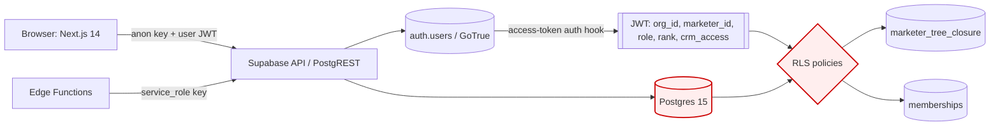
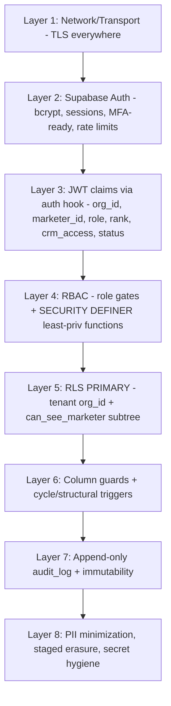

# 10 — Security Architecture (End-to-End)

> **Status:** Architecture-validation phase. No application code. This document is the
> authoritative security design for the platform. Every table, column, enum, and helper
> named here is taken verbatim from **`01-database-schema.md`** (the canonical schema) and
> **`02` RLS policies** where referenced. Do not introduce identifiers that contradict the
> canonical schema.
>
> **Platform security stack:** Supabase Auth (GoTrue, bcrypt password hashing), Postgres 15
> Row-Level Security (RLS) as the **primary** isolation boundary, JWT custom claims injected
> by a Supabase **access-token auth hook**, Edge Functions running under the **service role**
> with least-privilege guards, `pg_cron` for scheduled jobs, and an append-only `audit_log`.

---

## 0. Security model in one paragraph

Identity lives in `auth.users` (Supabase Auth). Authorization is **defense-in-depth** with
the database as the last and strongest line: **RLS is the primary isolation mechanism**, not
the API. Two orthogonal predicates govern every read/write to a tenant table:

1. **Tenant isolation** — `org_id = (auth.jwt() ->> 'org_id')::uuid`. No row of any other
   organization is ever visible, regardless of bugs in application code.
2. **Hierarchy (subtree) visibility** — a caller may only touch rows owned by themselves or a
   **descendant** in the binary placement tree, resolved through `marketer_tree_closure`.
   Admins/owners bypass the subtree filter but never the tenant filter.

Because both predicates live in the database, a compromised or buggy Next.js/Edge layer
cannot leak cross-org or cross-branch data. The frontend and Edge Functions are convenience
and ergonomics; the **security perimeter is Postgres**.



---

## 1. Authentication — Supabase Auth (GoTrue)

### 1.1 Credential storage

- Email/password is handled entirely by **Supabase Auth (GoTrue)**. Passwords are stored as
  **bcrypt** hashes in `auth.users.encrypted_password` — the application never sees, stores,
  or logs a plaintext password, and the `public` schema (where all our tenant tables live)
  has **no password column at all**.
- `marketers.email` is a **profile contact field, not a credential** (the schema comment says
  so explicitly: *"contact email on the profile; NOT the login credential"*). The login email
  lives only in `auth.users.email`. The two may coincide but are independent: changing a
  marketer's contact email does not change their login.
- Minimum password policy (enforced in GoTrue config + a client-side check): length ≥ 12,
  Supabase "leaked password protection" (HaveIBeenPwned) enabled, and required complexity
  class. Configure in Supabase Auth → Policies.

### 1.2 Email/password flows

| Flow | Mechanism | Notes |
|---|---|---|
| Sign-up | Only via **invitation** (see §1.4). Public open sign-up is **disabled** in GoTrue. | A login may never be created without an existing `marketers` profile to attach to. |
| Sign-in | `signInWithPassword` → access token (JWT) + refresh token. | Custom claims added by the auth hook (§2). |
| Password recovery | `resetPasswordForEmail` → time-limited recovery link → `updateUser({password})`. | Recovery email template localized (Italian) via Supabase Auth templates. |
| Email change | `updateUser({email})` with double-confirmation (old + new). | Audited as `auth.email_change` in `audit_log`. |
| Session refresh | Refresh-token rotation (see §1.3). | |

### 1.3 Sessions, JWT, and refresh tokens

- **Access token (JWT):** short-lived (default **1 hour**, `JWT_EXP = 3600`). Signed with the
  project's HS256 secret (or the asymmetric signing key if the project is migrated to
  JWT-signing-keys). RLS reads claims from `auth.jwt()`.
- **Refresh token:** long-lived, **single-use with rotation** (`REFRESH_TOKEN_ROTATION_ENABLED = true`,
  reuse-interval small). A stolen-and-reused refresh token triggers automatic revocation of the
  token family — detection of refresh-token replay logs a `system` audit event.
- **Storage on the client:** Supabase JS persists the session in cookies via the
  `@supabase/ssr` helper for the Next.js App Router (HTTP-only, `Secure`, `SameSite=Lax`),
  **not** `localStorage`, to reduce XSS token theft. Server Components / Route Handlers read
  the session from the request cookies.
- **Logout / global sign-out:** `signOut({scope:'global'})` revokes all refresh tokens for the
  user (used after a suspected compromise or when an admin disables a membership).
- **JWT claim freshness caveat:** claims are snapshotted at token mint time. A role/rank/
  permission change takes effect on the **next token refresh** (≤ 1 h). For changes that must
  be immediate (e.g. suspending a user, revoking CRM access), we additionally **re-validate at
  the DB layer** against live `memberships.status` (§4.4) so a stale-but-valid JWT cannot keep
  acting after suspension.

### 1.4 Account activation = the "Activate CRM Access" workflow

This is the security-critical join between **profile** and **login**, and it must **never
recreate the profile**. It uses `account_invitations` (canonical schema §3.1) and `memberships`
(§1.2).

```mermaid
sequenceDiagram
  participant Admin as Admin / eligible upline
  participant EF as Edge Function (service_role)
  participant DB as Postgres
  participant Invitee
  participant GoTrue as Supabase Auth

  Admin->>EF: invite(marketer_id, email, role, permissions)
  EF->>DB: assert ranks_meta.crm_eligible OR permissions.crm_access (trigger + EF)
  EF->>DB: INSERT account_invitations (token_hash=SHA256(token), expires_at)
  EF-->>Invitee: email with single-use raw token (never stored)
  Invitee->>GoTrue: sign-up with email + password + token
  GoTrue->>EF: accept(token)
  EF->>DB: lookup by SHA256(token); check status='pending', not expired
  EF->>DB: create auth.users (if new) ; UPDATE memberships SET user_id, status='active'
  EF->>DB: UPDATE account_invitations status='accepted', accepted_user_id, accepted_at
  EF->>DB: audit_log action='account.activate' (before/after)
```

Security properties of activation:

- **Profile preservation:** activation only sets `memberships.user_id` and
  `memberships.status = 'active'` and stamps the invitation. `marketers.id`, genealogy
  (`parent_id`, `leg`, `sponsor_id`, `path`, closure rows), `rank_history`, contacts,
  documents, notes, and stats are untouched. The unique constraint `UNIQUE(org_id, marketer_id)`
  on `memberships` makes a duplicate account link impossible.
- **Token never stored raw:** `account_invitations.token_hash` holds **SHA-256 of the
  single-use token** (schema comment: *"raw token never stored"*). Lookups hash the presented
  token and compare; a database dump never reveals usable tokens.
- **Expiry & single-use:** `expires_at` defaults to `now() + interval '7 days'`; partial
  `UNIQUE(org_id, marketer_id) WHERE status = 'pending'` guarantees one live invite per profile;
  acceptance flips `status` to `'accepted'` so the token cannot be replayed.
- **Eligibility guard (CRM-access rule):** an invitation may be created **only** if the target
  marketer's `rank` has `ranks_meta.crm_eligible = true`, **or**
  `account_invitations.permissions->>'crm_access' = 'true'` (admin override for an Executive).
  Enforced **twice** — in the Edge Function and in a `BEFORE INSERT` trigger on
  `account_invitations` — so the rule holds even if the Edge layer is bypassed. This encodes
  the locked decision: *Executive ⇒ no CRM access unless explicitly enabled.*

---

## 2. JWT custom claims & the access-token auth hook

### 2.1 Claims we inject

On every token mint/refresh, a Supabase **Custom Access Token Auth Hook** enriches the JWT with
tenant + authorization context resolved from `memberships`, `marketers`, and `ranks_meta`:

| Claim | Source | Used by |
|---|---|---|
| `org_id` | `memberships.org_id` | Tenant isolation in **every** RLS policy. |
| `marketer_id` | `memberships.marketer_id` | Subtree visibility (closure `ancestor_id`). |
| `role` | `memberships.role` (`owner`/`admin`/`manager`/`member`) | RBAC bypass / write gating. |
| `rank` | `marketers.rank` | Rank-adaptive dashboards, some write rules. |
| `crm_access` | `ranks_meta.crm_eligible` OR `memberships.permissions->>'crm_access'` | Gate on CRM-eligible surfaces. |
| `membership_status` | `memberships.status` | Allows DB to reject `suspended`/`disabled` even on a valid token. |

> These mirror the canonical schema's JWT note (§1.2): *"`org_id`, `marketer_id`, and `role`
> are stamped into the JWT via a custom access-token hook reading from `memberships`."* We
> extend it with `rank`, `crm_access`, and `membership_status` for the feature surface.

### 2.2 The hook function (least privilege, `SECURITY DEFINER`)

```sql
-- Runs as the auth hook. Returns the (possibly modified) claims object.
CREATE OR REPLACE FUNCTION public.custom_access_token_hook(event jsonb)
RETURNS jsonb
LANGUAGE plpgsql
STABLE
SECURITY DEFINER
SET search_path = public
AS $$
DECLARE
  v_uid          uuid := (event -> 'claims' ->> 'sub')::uuid;
  v_claims       jsonb := event -> 'claims';
  v_membership   record;
  v_crm_access   boolean;
BEGIN
  -- Resolve the ACTIVE membership for this login. A user has exactly one
  -- membership per org (UNIQUE(org_id, user_id)); MVP = one org per login.
  SELECT m.org_id, m.marketer_id, m.role, m.status, m.permissions,
         mk.rank, rm.crm_eligible
    INTO v_membership
  FROM public.memberships m
  JOIN public.marketers   mk ON mk.id   = m.marketer_id
  JOIN public.ranks_meta  rm ON rm.rank = mk.rank
  WHERE m.user_id = v_uid
    AND m.deleted_at IS NULL
  ORDER BY (m.status = 'active') DESC, m.created_at ASC
  LIMIT 1;

  IF v_membership.marketer_id IS NULL THEN
    -- No profile link yet (mid-activation). Issue a minimal token: no org context,
    -- so RLS denies all tenant rows by default.
    RETURN event;
  END IF;

  v_crm_access := v_membership.crm_eligible
                  OR COALESCE((v_membership.permissions ->> 'crm_access')::boolean, false);

  v_claims := v_claims
    || jsonb_build_object(
         'org_id',            v_membership.org_id,
         'marketer_id',       v_membership.marketer_id,
         'role',              v_membership.role,
         'rank',              v_membership.rank,
         'crm_access',        v_crm_access,
         'membership_status', v_membership.status
       );

  RETURN jsonb_set(event, '{claims}', v_claims);
END;
$$;

-- Lock it down: only the auth admin role may execute the hook; revoke from everyone else.
REVOKE EXECUTE ON FUNCTION public.custom_access_token_hook(jsonb) FROM authenticated, anon, public;
GRANT  EXECUTE ON FUNCTION public.custom_access_token_hook(jsonb) TO supabase_auth_admin;
GRANT  USAGE  ON SCHEMA public TO supabase_auth_admin;
GRANT  SELECT ON public.memberships, public.marketers, public.ranks_meta TO supabase_auth_admin;
```

Register the hook in Supabase Auth → Hooks → *Custom Access Token* → `public.custom_access_token_hook`.

### 2.3 Why a hook instead of per-request lookup

The canonical Open Question #1 recommends the auth hook. RLS reading three integers from
`auth.jwt()` is essentially free; resolving `marketer_id` from `memberships` inside a
`SECURITY DEFINER` function on **every** query would add a join to every policy evaluation.
The hook computes it **once per token** (≤ 1 h). The trade-off — claim staleness — is handled
by the live `membership_status` re-check (§4.4) and short token TTL.

### 2.4 Reading claims safely in RLS

We wrap claim access in immutable helpers so policies are terse and a missing claim **denies**
rather than errors:

```sql
CREATE OR REPLACE FUNCTION public.jwt_org_id() RETURNS uuid
LANGUAGE sql STABLE AS $$
  SELECT NULLIF(auth.jwt() ->> 'org_id', '')::uuid
$$;

CREATE OR REPLACE FUNCTION public.jwt_marketer_id() RETURNS uuid
LANGUAGE sql STABLE AS $$
  SELECT NULLIF(auth.jwt() ->> 'marketer_id', '')::uuid
$$;

CREATE OR REPLACE FUNCTION public.jwt_role() RETURNS text
LANGUAGE sql STABLE AS $$
  SELECT COALESCE(auth.jwt() ->> 'role', 'member')
$$;

CREATE OR REPLACE FUNCTION public.is_org_admin() RETURNS boolean
LANGUAGE sql STABLE AS $$
  SELECT public.jwt_role() IN ('admin', 'owner')
$$;

CREATE OR REPLACE FUNCTION public.jwt_membership_active() RETURNS boolean
LANGUAGE sql STABLE AS $$
  SELECT COALESCE(auth.jwt() ->> 'membership_status', '') = 'active'
$$;
```

If `org_id` is NULL (token issued before activation completed), `org_id = jwt_org_id()` is
`org_id = NULL` → false → **deny**. Fail-closed by construction.

---

## 3. RLS — the primary isolation mechanism

### 3.1 Global posture

Every tenant table is hardened with **both** statements (the canonical schema §8 mandates this):

```sql
ALTER TABLE <table> ENABLE ROW LEVEL SECURITY;
ALTER TABLE <table> FORCE  ROW LEVEL SECURITY;   -- applies even to the table owner
```

`FORCE` matters: without it, the table-owner role (used by migrations) would bypass RLS.
Default-deny is implied — once RLS is enabled, no row is visible until a policy `USING`
clause permits it.

### 3.2 The single visibility primitive — `can_see_marketer()`

The canonical schema (§8) defines the visibility primitive: *"caller can see X ⇔ a row exists
in `marketer_tree_closure` with `ancestor_id = caller's marketer_id` and `descendant_id = X`
(depth 0 = self)"*, wrapped in a `SECURITY DEFINER` helper `can_see_marketer(target uuid)`.
Concrete definition:

```sql
CREATE OR REPLACE FUNCTION public.can_see_marketer(target_marketer_id uuid)
RETURNS boolean
LANGUAGE sql
STABLE
SECURITY DEFINER          -- bypasses RLS on marketer_tree_closure to avoid recursion
SET search_path = public
AS $$
  SELECT
    -- Admins/owners see the whole org (tenant filter still applies upstream).
    public.is_org_admin()
    OR EXISTS (
      SELECT 1
      FROM public.marketer_tree_closure c
      WHERE c.org_id        = public.jwt_org_id()        -- tenant-scope the closure read
        AND c.ancestor_id   = public.jwt_marketer_id()   -- caller is an ancestor (or self)
        AND c.descendant_id = target_marketer_id
    );
$$;

REVOKE EXECUTE ON FUNCTION public.can_see_marketer(uuid) FROM public;
GRANT  EXECUTE ON FUNCTION public.can_see_marketer(uuid) TO authenticated;
```

Why `SECURITY DEFINER`: a policy on `marketers` that itself reads `marketer_tree_closure`
under RLS would recurse. The helper runs as a privileged owner role and reads the closure
directly, but it **re-applies the tenant filter** (`org_id = jwt_org_id()`) internally so it
cannot become a cross-org oracle. It exposes only a boolean — never closure rows.

> **Self always visible:** the closure table contains the self-row `(X, X, 0, NULL)` for every
> node (canonical maintenance strategy §2.2.1), so `can_see_marketer(own_id)` is true via the
> depth-0 row — no special case needed.

### 3.3 Policy template per table family

#### 3.3.1 `marketers` (profiles), `rank_history`, `seven_whys`

The visibility column differs per table but the predicate is the same family. For `marketers`,
the row's own `id` is the marketer key:

```sql
-- READ: own profile + entire downline subtree; admins see all in org.
CREATE POLICY marketers_select ON marketers
FOR SELECT TO authenticated
USING (
  org_id = public.jwt_org_id()
  AND public.can_see_marketer(id)
);

-- INSERT: may only create a profile inside your own subtree (the new node's parent
-- must be you or a descendant of you), and within your org. Admins unrestricted.
CREATE POLICY marketers_insert ON marketers
FOR INSERT TO authenticated
WITH CHECK (
  org_id = public.jwt_org_id()
  AND public.jwt_membership_active()
  AND (
        public.is_org_admin()
     OR (parent_id IS NOT NULL AND public.can_see_marketer(parent_id))
  )
);

-- UPDATE: may edit a profile you can see; but structural columns (parent_id, leg,
-- sponsor_id, rank, status) are admin-only — enforced by a column-guard trigger (see §3.5)
-- because RLS cannot diff old/new column values.
CREATE POLICY marketers_update ON marketers
FOR UPDATE TO authenticated
USING      (org_id = public.jwt_org_id() AND public.can_see_marketer(id))
WITH CHECK (org_id = public.jwt_org_id() AND public.can_see_marketer(id));

-- DELETE: soft-delete only, admin-only (hard DELETE blocked by structural rules);
-- members never DELETE marketers.
CREATE POLICY marketers_delete ON marketers
FOR DELETE TO authenticated
USING (org_id = public.jwt_org_id() AND public.is_org_admin());
```

`rank_history` and `seven_whys` carry an explicit `marketer_id`, so the predicate keys on it:

```sql
CREATE POLICY rank_history_select ON rank_history
FOR SELECT TO authenticated
USING (org_id = public.jwt_org_id() AND public.can_see_marketer(marketer_id));

-- rank_history is append-only & system-written (trigger on marketers): no INSERT/UPDATE/
-- DELETE policy for `authenticated` ⇒ writes only via the SECURITY DEFINER trigger.

CREATE POLICY seven_whys_rw ON seven_whys
FOR ALL TO authenticated
USING      (org_id = public.jwt_org_id() AND public.can_see_marketer(marketer_id))
WITH CHECK (org_id = public.jwt_org_id() AND public.can_see_marketer(marketer_id));
```

#### 3.3.2 Owner-keyed CRM/funnel/analytics tables

`contacts`, `centos_list_entries`, `prospects`, `daily_marketer_metrics`, `monthly_reports`,
`bottleneck_findings` all key on a marketer column (`owner_marketer_id` or `marketer_id`):

```sql
-- Example: contacts. Same shape for prospects, centos_list_entries, etc.
CREATE POLICY contacts_select ON contacts
FOR SELECT TO authenticated
USING (org_id = public.jwt_org_id() AND public.can_see_marketer(owner_marketer_id));

CREATE POLICY contacts_modify ON contacts
FOR ALL TO authenticated
USING (
  org_id = public.jwt_org_id()
  AND public.jwt_membership_active()
  AND public.can_see_marketer(owner_marketer_id)
)
WITH CHECK (
  org_id = public.jwt_org_id()
  AND public.jwt_membership_active()
  AND public.can_see_marketer(owner_marketer_id)
);
```

The `WITH CHECK` half is essential: it stops a user from **moving** a row to a marketer they
cannot see (e.g. reassigning a contact's `owner_marketer_id` to an upline to exfiltrate it) —
the new owner must also pass `can_see_marketer`.

`prospect_journey_events` and `calls` key on `responsible_marketer_id` / `marketer_id`
respectively; `daily_marketer_metrics`, `monthly_reports`, `bottleneck_findings` on
`marketer_id` (org-level `monthly_reports` rows have `marketer_id IS NULL` and are admin-only):

```sql
CREATE POLICY monthly_reports_select ON monthly_reports
FOR SELECT TO authenticated
USING (
  org_id = public.jwt_org_id()
  AND (
       (marketer_id IS NOT NULL AND public.can_see_marketer(marketer_id))
    OR (marketer_id IS NULL     AND public.is_org_admin())   -- org-level rollup
  )
);
```

#### 3.3.3 `memberships`

```sql
-- Read your own membership, or any membership if admin/owner.
CREATE POLICY memberships_select ON memberships
FOR SELECT TO authenticated
USING (
  org_id = public.jwt_org_id()
  AND (user_id = auth.uid() OR public.is_org_admin())
);

-- Mutations (role/status/permissions) are admin/owner only and go through the
-- account-lifecycle Edge Function; members cannot escalate themselves.
CREATE POLICY memberships_admin_write ON memberships
FOR ALL TO authenticated
USING      (org_id = public.jwt_org_id() AND public.is_org_admin())
WITH CHECK (org_id = public.jwt_org_id() AND public.is_org_admin());
```

This closes the most dangerous privilege-escalation path: a `member` can **read** their own
membership but can never `UPDATE` their own `role` to `admin` or set
`permissions->>'crm_access'`.

#### 3.3.4 `account_invitations`

```sql
-- Visible to admins/owners and to the invited marketer's upline (who can see that marketer).
CREATE POLICY invitations_select ON account_invitations
FOR SELECT TO authenticated
USING (
  org_id = public.jwt_org_id()
  AND (public.is_org_admin() OR public.can_see_marketer(marketer_id))
);

-- Create/manage: admin/owner OR an eligible upline of the target marketer.
CREATE POLICY invitations_write ON account_invitations
FOR ALL TO authenticated
USING (
  org_id = public.jwt_org_id()
  AND (public.is_org_admin() OR public.can_see_marketer(marketer_id))
)
WITH CHECK (
  org_id = public.jwt_org_id()
  AND (public.is_org_admin() OR public.can_see_marketer(marketer_id))
);
-- NOTE: the crm_eligible / crm_access guard is enforced by the BEFORE INSERT trigger
-- (canonical §3.1), independent of RLS, so it cannot be bypassed by direct DB access.
```

#### 3.3.5 `internal_documents` + `document_versions`

Documents are **org-wide knowledge**, not subtree-scoped (canonical §4.4): read for any
CRM-eligible member, write gated by role/permissions.

```sql
CREATE POLICY documents_select ON internal_documents
FOR SELECT TO authenticated
USING (
  org_id = public.jwt_org_id()
  AND COALESCE((auth.jwt() ->> 'crm_access')::boolean, false) = true
  AND deleted_at IS NULL
);

CREATE POLICY documents_write ON internal_documents
FOR ALL TO authenticated
USING (
  org_id = public.jwt_org_id()
  AND (public.is_org_admin() OR public.jwt_role() = 'manager')
)
WITH CHECK (
  org_id = public.jwt_org_id()
  AND (public.is_org_admin() OR public.jwt_role() = 'manager')
);

-- Versions inherit the parent's visibility: readable to CRM-eligible members in the org,
-- written only by the snapshot trigger (SECURITY DEFINER).
CREATE POLICY document_versions_select ON document_versions
FOR SELECT TO authenticated
USING (
  org_id = public.jwt_org_id()
  AND COALESCE((auth.jwt() ->> 'crm_access')::boolean, false) = true
);
```

#### 3.3.6 `notifications`

```sql
CREATE POLICY notifications_select ON notifications
FOR SELECT TO authenticated
USING (
  org_id = public.jwt_org_id()
  AND recipient_marketer_id = public.jwt_marketer_id()
);

-- A user may only mark their own notifications read (UPDATE read_at).
CREATE POLICY notifications_update ON notifications
FOR UPDATE TO authenticated
USING      (org_id = public.jwt_org_id() AND recipient_marketer_id = public.jwt_marketer_id())
WITH CHECK (org_id = public.jwt_org_id() AND recipient_marketer_id = public.jwt_marketer_id());
-- INSERT only by system (SECURITY DEFINER functions / service role).
```

#### 3.3.7 `leaderboard_snapshots`

```sql
-- A member sees rows whose marketer_id is in their subtree, or team/branch scopes rooted
-- at themselves or a downline. Admins see all.
CREATE POLICY leaderboard_select ON leaderboard_snapshots
FOR SELECT TO authenticated
USING (
  org_id = public.jwt_org_id()
  AND (
        public.is_org_admin()
     OR public.can_see_marketer(marketer_id)
     OR (scope IN ('team','branch') AND scope_ref_id IS NOT NULL
         AND public.can_see_marketer(scope_ref_id))
  )
);
```

#### 3.3.8 `organizations`

```sql
CREATE POLICY organizations_self ON organizations
FOR SELECT TO authenticated
USING (id = public.jwt_org_id());

CREATE POLICY organizations_admin_update ON organizations
FOR UPDATE TO authenticated
USING      (id = public.jwt_org_id() AND public.is_org_admin())
WITH CHECK (id = public.jwt_org_id() AND public.is_org_admin());
```

#### 3.3.9 `audit_log` (read-only, admin-only)

```sql
CREATE POLICY audit_log_admin_select ON audit_log
FOR SELECT TO authenticated
USING (org_id = public.jwt_org_id() AND public.is_org_admin());
-- No INSERT/UPDATE/DELETE policy for authenticated: writes only via SECURITY DEFINER
-- trigger/function; immutability also enforced by REVOKE + guard trigger (§5.2).
```

### 3.4 RLS coverage matrix (must match canonical §8)

| Table | Tenant key | Visibility predicate | Write rule |
|---|---|---|---|
| `organizations` | `id = jwt.org_id` | self only | admin update |
| `memberships` | `org_id = jwt.org_id` | own row (`user_id = auth.uid()`) or admin | admin only |
| `marketers` | `org_id = jwt.org_id` | `can_see_marketer(id)` | own-subtree insert; structural cols admin-only (trigger) |
| `rank_history` | `org_id = jwt.org_id` | `can_see_marketer(marketer_id)` | system trigger only |
| `seven_whys` | `org_id = jwt.org_id` | `can_see_marketer(marketer_id)` | subtree |
| `account_invitations` | `org_id = jwt.org_id` | admin or upline of target | admin/upline + eligibility trigger |
| `contacts` | `org_id = jwt.org_id` | `can_see_marketer(owner_marketer_id)` | subtree (+ owner-move check) |
| `centos_list_entries` | `org_id = jwt.org_id` | `can_see_marketer(owner_marketer_id)` | subtree |
| `prospects` | `org_id = jwt.org_id` | `can_see_marketer(owner_marketer_id)` | subtree |
| `prospect_journey_events` | `org_id = jwt.org_id` | `can_see_marketer(responsible_marketer_id)` | via `change_prospect_stage()` |
| `calls` | `org_id = jwt.org_id` | `can_see_marketer(marketer_id)` | subtree |
| `daily_marketer_metrics` | `org_id = jwt.org_id` | `can_see_marketer(marketer_id)` | system rollup only |
| `monthly_reports` | `org_id = jwt.org_id` | `can_see_marketer(marketer_id)` or admin (org row) | system only |
| `internal_documents` | `org_id = jwt.org_id` | CRM-eligible member (org-wide) | admin/manager |
| `document_versions` | `org_id = jwt.org_id` | inherits document | snapshot trigger |
| `leaderboard_snapshots` | `org_id = jwt.org_id` | subtree of `marketer_id`/`scope_ref_id` or admin | system only |
| `bottleneck_findings` | `org_id = jwt.org_id` | `can_see_marketer(marketer_id)` | system only |
| `notifications` | `org_id = jwt.org_id` | `recipient_marketer_id = jwt.marketer_id` | system insert; self-update read_at |
| `audit_log` | `org_id = jwt.org_id` | admin/owner only | append-only system |

The **materialized views** `mv_funnel_totals` and `mv_stage_conversion` do not enforce RLS
themselves (MVs cannot). They are **not granted to `authenticated`**; they are read only by
`SECURITY DEFINER` analytics functions that re-apply `org_id`+`can_see_marketer` filters, or
exposed through RLS-protected wrapper views. See §6.3.

### 3.5 Column-level guards RLS cannot express

RLS evaluates whole-row predicates; it cannot say "members may edit `notes` but not `rank`."
Those are enforced by **`BEFORE UPDATE` trigger functions** (`SECURITY DEFINER`) that compare
`OLD`/`NEW` and reject unauthorized column changes for non-admins:

```sql
CREATE OR REPLACE FUNCTION public.guard_marketer_structural_cols()
RETURNS trigger LANGUAGE plpgsql AS $$
BEGIN
  IF NOT public.is_org_admin() THEN
    IF NEW.parent_id   IS DISTINCT FROM OLD.parent_id
    OR NEW.leg         IS DISTINCT FROM OLD.leg
    OR NEW.sponsor_id  IS DISTINCT FROM OLD.sponsor_id
    OR NEW.rank        IS DISTINCT FROM OLD.rank
    OR NEW.status      IS DISTINCT FROM OLD.status
    OR NEW.org_id      IS DISTINCT FROM OLD.org_id THEN
      RAISE EXCEPTION 'insufficient_privilege: structural/rank/status columns are admin-only'
        USING ERRCODE = '42501';
    END IF;
  END IF;
  RETURN NEW;
END;
$$;

CREATE TRIGGER trg_guard_marketer_cols
BEFORE UPDATE ON marketers
FOR EACH ROW EXECUTE FUNCTION public.guard_marketer_structural_cols();
```

The same pattern guards `memberships.role`/`permissions` (belt-and-suspenders with the RLS
admin-only write policy) and prevents `org_id` rewrites on any table (tenant-pinning).

---

## 4. RBAC, least privilege, and the binary-tree defense

### 4.1 Role model

Two layers of role:

1. **Postgres roles** (Supabase built-ins): `anon` (pre-login, used by the public client with
   the anon key — effectively no tenant access), `authenticated` (logged-in users, all RLS
   above applies), `service_role` (Edge Functions / server — **bypasses RLS**, see §4.3).
2. **Application roles** in `memberships.role` (`owner`, `admin`, `manager`, `member`) plus the
   `marketer_rank` ladder, surfaced as JWT claims and consumed by RLS/RBAC checks.

| App role | Scope | Can do |
|---|---|---|
| `owner` | org | Everything admin can + billing/org settings + delete org (soft). |
| `admin` | org | Full org visibility; manage marketers, invitations, ranks, permissions, documents; read `audit_log`. |
| `manager` | assigned subtree (reserved) | Elevated within a subtree; write `internal_documents`. Not org-wide. |
| `member` | own subtree | Standard marketer: own + downline CRM data; no upline/parallel access. |

### 4.2 Principle of least privilege — `authenticated`

- `authenticated` has **no table privileges granted by default** beyond what RLS permits, and
  even those are explicit `GRANT`s. We do **not** `GRANT ALL`. Per table:
  `GRANT SELECT, INSERT, UPDATE` only where the feature requires it; `DELETE` is granted only
  where soft-delete is not used (almost nowhere — most "deletes" are `UPDATE deleted_at`).
- **No grants** to `authenticated` on `daily_marketer_metrics`, `monthly_reports`,
  `leaderboard_snapshots`, `bottleneck_findings`, `rank_history`, `document_versions`,
  `audit_log`, `mv_funnel_totals`, `mv_stage_conversion` for **write** — these are system-
  maintained. Reads go through RLS `SELECT` policies (or `SECURITY DEFINER` functions for MVs).
- Sequence/usage and function execution are granted narrowly (e.g. `can_see_marketer`,
  `change_prospect_stage`).

### 4.3 Least privilege for the **service role**

`service_role` bypasses RLS entirely — it is the most dangerous credential in the system.
Controls:

- **Never** ships to the browser. It exists only in Edge Function / server-side environment
  variables (`SUPABASE_SERVICE_ROLE_KEY`), injected via Supabase secrets, never in
  `NEXT_PUBLIC_*` and never in client bundles. CI lint blocks any `service_role` reference in
  client code paths.
- Edge Functions that use it are **thin and audited**: each one re-implements the tenant +
  visibility check **in code** before touching data, because RLS will not protect it. Pattern:

```ts
// Edge Function pseudo-pattern: never trust the caller's org/marketer from the body.
const { data: claims } = await verifyUserJwt(req);          // validate the *user* token
const orgId = claims.org_id, callerMarketer = claims.marketer_id;
assert(orgId && callerMarketer, '401');
// Re-assert visibility for any target the action touches:
const allowed = await svc.rpc('can_see_marketer_for', { caller: callerMarketer, target });
assert(allowed, '403');
// Only now perform the privileged write with service_role.
```

- Where possible, privileged DB logic is a **`SECURITY DEFINER` SQL function owned by a
  dedicated minimal role** (not `postgres` superuser) with `GRANT EXECUTE TO authenticated` —
  so the *user's* JWT and RLS-aware helpers still bound it — **instead of** reaching for
  `service_role`. `service_role` is reserved for genuinely cross-cutting tasks (auth-admin
  operations, cron jobs that must aggregate org-wide, invitation acceptance that creates
  `auth.users`).
- `service_role` Edge Functions run with `verify_jwt = true` so the platform validates the
  caller's user token before the function body runs; the function then performs its own RBAC.

### 4.4 Live status re-validation (defeats stale JWTs)

To ensure a suspended/disabled membership cannot keep acting on a still-valid (≤ 1 h) JWT,
sensitive write paths add a **live** check against `memberships.status`, independent of the
`membership_status` claim:

```sql
CREATE OR REPLACE FUNCTION public.assert_caller_active()
RETURNS boolean LANGUAGE sql STABLE SECURITY DEFINER SET search_path = public AS $$
  SELECT EXISTS (
    SELECT 1 FROM public.memberships m
    WHERE m.user_id = auth.uid()
      AND m.org_id  = public.jwt_org_id()
      AND m.status  = 'active'
      AND m.deleted_at IS NULL
  );
$$;
```

Invoked inside the `change_prospect_stage()`, invitation, rank-change, and bulk-action
functions. Combined with `signOut({scope:'global'})` on suspension, the window of a stale
token is effectively closed for write actions.

### 4.5 Defense for the binary-tree visibility rules (no upline / parallel-branch leakage)

This is the crux of the model and gets dedicated attention. The rule: a user sees **own +
direct + indirect downlines and everything they own**, and **never** uplines, parallel
branches, or anything outside their subtree (admins excepted).

How each leakage vector is closed:

| Leakage vector | How it is blocked |
|---|---|
| **Reading an upline's profile** | `can_see_marketer(upline_id)` is false: no closure row has `ancestor_id = caller, descendant_id = upline` (the relationship is the reverse). `SELECT` denied. |
| **Reading a parallel branch (sibling subtree)** | A sibling and its descendants are not in the caller's descendant set → no closure row → denied. |
| **Reading any other org** | `org_id = jwt_org_id()` fails first; `can_see_marketer` also re-scopes the closure read to `jwt_org_id()`. Double barrier. |
| **Enumerating via owned data** (contacts/prospects/calls of an upline) | Those tables key on the owner marketer; `can_see_marketer(owner_marketer_id)` denies upline-owned rows. |
| **Reassigning a row to an upline to read it** | `WITH CHECK` requires the **new** owner to also pass `can_see_marketer`; you cannot move a row to someone you can't see, and you can't read it after if you could move it. |
| **Analytics aggregation leaking upline totals** | Analytics joins `marketer_tree_closure` with `ancestor_id = caller` (or a visible descendant); roll-ups are computed only over the caller's subtree. MVs are not directly selectable by `authenticated` (§6.3). |
| **Branch (Left/Right) cross-leak** | `branch_leg` on the closure restricts Left/Right views to the correct subtree of the caller's own node; a caller cannot request the Left Branch of an *upline* because the closure query is anchored at `ancestor_id = caller`. |
| **`marketer_tree_closure` direct read** | `closure` is **not granted** to `authenticated` for `SELECT`; visibility is mediated only through `can_see_marketer` (boolean) and `SECURITY DEFINER` analytics functions. A user cannot dump the tree to discover uplines. |
| **Realtime channel leakage** | Realtime respects RLS on the underlying table; a user can only subscribe to changes on rows they can `SELECT`. Channels are additionally scoped per `org_id`/`marketer_id` topic. |
| **Notification topic guessing** | `notifications` policy pins `recipient_marketer_id = jwt_marketer_id()`; you cannot subscribe to another marketer's notifications. |

> **Why closure, not `path`/ltree, for security:** ltree `<@` could also answer subtree
> membership, but using the **closure table** keeps a single, index-backed, integer-equality
> primitive (`ancestor_id = caller AND descendant_id = target`) that is trivial to reason
> about and audit. `path` is used for analytics convenience; **security decisions key on
> closure only.** Both are kept consistent by the same triggers (canonical §7), but the
> security predicate never depends on string parsing.

### 4.6 The `manager` role (reserved) — scoping note

`manager` is reserved (canonical: *"elevated, can manage assigned subtrees (reserved)"*). Until
a manager-assignment table exists, `manager` is treated **exactly like `member` for
visibility** (still bounded by `can_see_marketer`) and only granted the extra
`internal_documents` write capability. It does **not** widen subtree visibility. When the
assignment model is introduced, it must extend `can_see_marketer` with explicit grant rows,
never loosen the closure check globally. (Tracked in Open Questions.)

---

## 5. Audit logging of sensitive actions

### 5.1 What is audited (and the canonical action names)

The `audit_log` table (canonical §6.8) is the **append-only** trail. Sensitive actions and
their `action` string (matching the schema's examples `marketer.move`, `rank.change`,
`invitation.create`):

| Event | `action` | `entity_type` | `before`/`after` |
|---|---|---|---|
| Profile created | `marketer.create` | `marketers` | after = new row |
| Placement move / re-parent | `marketer.move` | `marketers` | parent_id/leg/path before+after |
| **Rank change** | `rank.change` | `marketers` | previous_rank/new_rank (mirrors `rank_history`) |
| Status change (suspend/activate profile) | `marketer.status_change` | `marketers` | status before+after |
| Invitation issued | `invitation.create` | `account_invitations` | after (no token) |
| Invitation revoked | `invitation.revoke` | `account_invitations` | status before+after |
| **CRM-access activation** | `account.activate` | `memberships` | user_id/status before+after |
| **Permission change** | `membership.permissions_change` | `memberships` | permissions before+after |
| **Role change** | `membership.role_change` | `memberships` | role before+after |
| Membership suspended/disabled | `membership.status_change` | `memberships` | status before+after |
| Bulk contact op | `contacts.bulk_update` / `contacts.bulk_delete` | `contacts` | summary + ids |
| Document publish/archive | `document.publish` / `document.archive` | `internal_documents` | status before+after |
| Org settings change | `organization.update` | `organizations` | settings before+after |
| Auth email change | `auth.email_change` | `auth.users` | old/new email (redacted) |
| Refresh-token reuse detected | `auth.refresh_reuse` | `auth.users` | system flag |

Every row records `actor_marketer_id` (the acting profile), `actor_user_id`
(`auth.users.id`), `ip_address`, and `created_at`. For system/cron actions, `actor_*` is NULL.

### 5.2 How auditing is enforced (cannot be skipped or tampered)

- **Write path:** a `SECURITY DEFINER` function `log_audit(action, entity_type, entity_id,
  before, after)` resolves `org_id`, `actor_marketer_id` (via `jwt_marketer_id()`),
  `actor_user_id = auth.uid()`, and `ip_address` from request context, then inserts. Rank
  changes additionally fire a trigger on `marketers` that writes **both** `rank_history`
  (canonical §2.3) and an `audit_log` row, so the two never diverge.
- **Append-only:** per canonical §6.8 there is no `updated_at`/`deleted_at`. We enforce
  immutability with:
  ```sql
  REVOKE UPDATE, DELETE ON audit_log FROM authenticated, service_role;
  CREATE OR REPLACE FUNCTION public.deny_audit_mutation()
  RETURNS trigger LANGUAGE plpgsql AS $$
  BEGIN RAISE EXCEPTION 'audit_log is append-only'; END $$;
  CREATE TRIGGER trg_audit_immutable
  BEFORE UPDATE OR DELETE ON audit_log
  FOR EACH ROW EXECUTE FUNCTION public.deny_audit_mutation();
  ```
  Even `service_role` is blocked from mutating history. Inserts come only through `log_audit`
  / triggers.
- **Read path:** admin/owner only (RLS policy `audit_log_admin_select`); members never read it.
- **Retention:** audit rows are retained indefinitely (or per legal hold); a `pg_cron` archival
  job may move rows older than N years to cold storage, but never deletes within the active
  window.

---

## 6. PII handling

### 6.1 PII inventory (from the canonical schema)

| Table.column | PII class |
|---|---|
| `auth.users.email`, `encrypted_password` | Credentials (bcrypt; Supabase-managed) |
| `marketers.first_name`, `last_name`, `display_name`, `email`, `phone`, `avatar_url` | Personal contact data |
| `contacts.first_name`, `last_name`, `email`, `phone`, `city` | Third-party (prospect) personal data |
| `centos_list_entries.full_name`, `phone`, `relationship`, `notes` | Third-party personal data |
| `prospects.full_name`, `notes` | Third-party personal data |
| `calls.notes` | May contain personal data |
| `account_invitations.email` | Invitee email |
| `audit_log.ip_address`, `before`/`after` | Network + potentially PII snapshots |
| `notifications.body_it`, `payload` | May reference personal data |

### 6.2 Handling principles

- **Minimization & purpose limitation:** we store only what the CRM features need. No payment
  data, no government IDs, no compensation/volume data (explicitly out of scope per canonical
  Open Question #5).
- **Encryption in transit:** all traffic TLS (Supabase enforced). **At rest:** Supabase
  encrypts the Postgres volume and backups. We do not add column-level encryption for names/
  phones (operationally needed in cleartext for search/`pg_trgm`), but **access** to them is
  fully governed by RLS — a marketer can only see PII of their own subtree.
- **`audit_log` PII discipline:** `before`/`after` snapshots may contain PII. They are
  admin-only and append-only. Credential-adjacent values (passwords, raw tokens) are **never**
  written to `audit_log`; `auth.email_change` stores redacted/partial emails.
- **Right-to-erasure (GDPR Art. 17):** because login (`auth.users`) is separable from the
  profile (`marketers`), erasure is staged:
  1. Delete the `auth.users` row (Supabase admin API) → removes credentials and login PII.
  2. Anonymize the `marketers` profile in place (replace names/email/phone with tombstone
     values, set `status='suspended'`, set `deleted_at`) **without** removing the node — the
     genealogy/closure structure and aggregate analytics must survive (the binary tree cannot
     have holes). This satisfies erasure of personal data while preserving structural
     integrity (recommended; confirm with legal — see Open Questions).
  3. `contacts`/`prospects` belonging to that marketer are erasable per-row on data-subject
     request; the contact's PII columns are nulled/tombstoned while the funnel-history row is
     retained for aggregate analytics, or fully soft-deleted if required.
- **Data-subject access (GDPR Art. 15) & portability (Art. 20):** the reporting/export surface
  (PDF/Excel/CSV) provides per-marketer and per-contact export. Exports inherit RLS — you can
  only export what you can see.
- **Logs:** application/Edge logs scrub PII; we log identifiers (`org_id`, `marketer_id`,
  `auth.uid()`) not names/emails. Supabase log access is restricted to project admins.

### 6.3 Analytics views & PII

`mv_funnel_totals` and `mv_stage_conversion` aggregate prospect data but carry `marketer_id`
and counts (no raw names). They are **not granted to `authenticated`**. Access is via
`SECURITY DEFINER` functions that filter to `jwt_org_id()` + the caller's subtree
(`can_see_marketer`), e.g.:

```sql
CREATE OR REPLACE FUNCTION public.funnel_totals_for_subtree(root uuid)
RETURNS TABLE (current_stage prospect_stage, outcome prospect_outcome, prospects_count bigint)
LANGUAGE sql STABLE SECURITY DEFINER SET search_path = public AS $$
  SELECT f.current_stage, f.outcome, sum(f.prospects_count)
  FROM mv_funnel_totals f
  JOIN marketer_tree_closure c
    ON c.descendant_id = f.marketer_id
  WHERE f.org_id      = public.jwt_org_id()
    AND c.org_id      = public.jwt_org_id()
    AND c.ancestor_id = root
    AND public.can_see_marketer(root)        -- caller must be allowed to anchor here
  GROUP BY f.current_stage, f.outcome;
$$;
```

This guarantees materialized views — which themselves cannot enforce RLS — never leak
cross-org or upline data.

---

## 7. Secrets management

| Secret | Where it lives | Exposure rules |
|---|---|---|
| `SUPABASE_ANON_KEY` / publishable key | `NEXT_PUBLIC_SUPABASE_ANON_KEY` (client) | Public by design; safe **only because RLS protects data**. Never relied on for authorization. |
| `SUPABASE_SERVICE_ROLE_KEY` | Edge Function / server env only (Supabase secrets) | **Never** in client bundles, `NEXT_PUBLIC_*`, git, or logs. CI scanner blocks it. Bypasses RLS. |
| JWT signing secret / signing keys | Supabase-managed | Rotatable; rotation invalidates outstanding tokens (planned maintenance). Prefer asymmetric JWT signing keys when available. |
| Auth hook execution grant | DB role `supabase_auth_admin` | Only role allowed to execute `custom_access_token_hook`. |
| SMTP / email provider creds | Supabase Auth config / secrets | For recovery + invitation emails. |
| Future OAuth client secrets (Google/Microsoft) | Supabase Auth provider config | Stored in Supabase, never in app code. |
| Invitation tokens | **Not stored** — only `SHA-256` in `account_invitations.token_hash` | Raw token exists transiently in the invite email. |

Operational rules: secrets are injected via the platform's secret store and environment, never
committed; `.env*` files are git-ignored and a pre-commit/secret-scan (gitleaks) runs in CI;
key rotation is a documented runbook (rotate service key → redeploy Edge Functions → confirm).
Least-privilege DB roles own `SECURITY DEFINER` functions (not `postgres`).

---

## 8. Future integration points — OAuth (Google/Microsoft) & 2FA

These are **design hooks**, not yet built, but the model accommodates them without schema change.

### 8.1 Google / Microsoft OAuth

- Enabled per-provider in Supabase Auth. OAuth sign-in still produces an `auth.users` row, so
  **the same activation invariant holds**: an OAuth login must attach to an **existing**
  `marketers` profile via `memberships` (the `custom_access_token_hook` works identically — it
  keys on `auth.users.id`, agnostic to how the user authenticated).
- **Account linking:** to prevent an OAuth sign-in from silently creating an orphan login with
  no profile, OAuth callbacks route through the **invitation acceptance** path: the OAuth email
  must match a `pending` `account_invitations.email` (or be linked by an admin), otherwise
  membership is not created and the token carries no `org_id` (RLS denies everything).
- **Domain allow-listing:** optionally restrict Microsoft/Google tenants by email domain in the
  Edge callback before activating a membership.

### 8.2 2FA / MFA

- Supabase Auth supports **TOTP MFA** and (roadmap) WebAuthn. Enabling MFA adds an `aal`
  (authenticator-assurance-level) claim to the JWT (`aal1` = password only, `aal2` = MFA
  satisfied).
- **Step-up enforcement:** sensitive actions (rank change, permission/role change, placement
  move, invitation issue, bulk delete, org settings) can require `aal2`. Enforced both in the
  Edge Function and at the DB via a helper:
  ```sql
  CREATE OR REPLACE FUNCTION public.require_mfa() RETURNS boolean
  LANGUAGE sql STABLE AS $$
    SELECT COALESCE(auth.jwt() ->> 'aal', 'aal1') = 'aal2'
  $$;
  ```
  e.g. the rank-change function asserts `require_mfa()` for admins.
- **Admin/owner mandatory MFA:** policy that `owner`/`admin` memberships must have MFA enrolled
  (checked at login; unenrolled admins are forced through enrollment before receiving an
  org-scoped token).
- No schema change is needed: MFA factors live in Supabase Auth's own tables; our claims/policies
  simply read `aal`.

---

## 9. Threat model (STRIDE-informed) — threat → mitigation

| # | Threat | Category | Vector | Mitigation |
|---|---|---|---|---|
| 1 | Cross-tenant data access | Information disclosure | Forged/edited `org_id` in request body | RLS `org_id = jwt_org_id()` on every tenant table; `org_id` comes from the signed JWT, not the request; `FORCE ROW LEVEL SECURITY`. |
| 2 | Upline / parallel-branch data leak | Information disclosure | Querying another marketer's contacts/profile | `can_see_marketer()` closure check on every owner-keyed table; closure table not directly selectable; `WITH CHECK` blocks owner-reassignment exfiltration. |
| 3 | Privilege escalation to admin | Elevation of privilege | `UPDATE memberships SET role='admin'` on self | `memberships` writes are admin-only (RLS) + `guard` trigger; members can read but not modify their `role`/`permissions`. |
| 4 | Granting self CRM access (Executive) | Elevation of privilege | Set `permissions.crm_access` on own membership | Same admin-only write gate; CRM eligibility is recomputed in the auth hook from `ranks_meta` + admin-set permissions, not self-assertable. |
| 5 | Stale JWT after suspension | Spoofing / broken access control | Acting on a valid-but-old token after being disabled | Short token TTL (1 h) + live `assert_caller_active()` / `membership_status` re-check on writes + `signOut({scope:'global'})` on suspend. |
| 6 | Service-role key leakage | Elevation of privilege | Key in client bundle / git | Key only in server/Edge env; CI secret scan; never `NEXT_PUBLIC_*`; Edge Functions re-check visibility in code. |
| 7 | Invitation token theft / replay | Spoofing | Intercepting or reusing an invite link | Only `SHA-256` hash stored; single-use (`status` flips to `accepted`); `expires_at` 7 days; one live invite per profile. |
| 8 | Password compromise | Spoofing | Credential stuffing / weak password | bcrypt storage; leaked-password protection (HIBP); min length/complexity; (future) mandatory MFA for admins; rate limiting on auth endpoints (GoTrue). |
| 9 | Refresh-token theft | Spoofing | Stolen long-lived token | Rotation with reuse detection → family revocation; HTTP-only Secure cookies via `@supabase/ssr`; audited `auth.refresh_reuse`. |
| 10 | XSS stealing session | Tampering / disclosure | Injected script reading tokens | Tokens in HTTP-only cookies (not `localStorage`); React auto-escaping; CSP headers; rich-text `internal_documents.body` is sanitized JSON (ProseMirror/Tiptap) rendered without `dangerouslySetInnerHTML`. |
| 11 | SQL injection | Tampering | Malicious input to queries | Parameterized PostgREST / Supabase client; no string-built SQL; `SECURITY DEFINER` functions use typed params + fixed `search_path`. |
| 12 | Tampering with audit trail | Repudiation | Editing/deleting `audit_log` | `REVOKE UPDATE,DELETE` (even from `service_role`) + immutability trigger; append-only by design. |
| 13 | Genealogy corruption / cycle | Tampering / DoS | Re-parenting to create a cycle | Cycle-prevention trigger (canonical §7); structural columns admin-only (guard trigger); moves audited as `marketer.move`. |
| 14 | Closure-table desync ⇒ visibility bug | Broken access control | Inconsistent closure after move | Closure maintained transactionally by triggers (canonical §2.2); a `pg_cron` consistency check re-validates closure vs. `path`; security predicate keys on closure only. |
| 15 | Materialized-view leakage | Information disclosure | Direct `SELECT` on MV bypassing RLS | MVs not granted to `authenticated`; accessed only via `SECURITY DEFINER` functions that re-apply `org_id` + `can_see_marketer`. |
| 16 | Realtime channel leak | Information disclosure | Subscribing to others' row changes | Realtime honors RLS on the source table; topics scoped per `org_id`/`recipient_marketer_id`. |
| 17 | PII over-exposure / GDPR breach | Disclosure / compliance | Excess PII in exports or logs | Data minimization; logs carry IDs not PII; exports inherit RLS; staged erasure that anonymizes profile but preserves tree. |
| 18 | Auth-hook bypass / tampering | Elevation | Calling the hook to mint claims | Hook executable only by `supabase_auth_admin`; `authenticated`/`anon` revoked; hook re-derives claims from DB, ignores caller-supplied claims. |
| 19 | Mass enumeration / scraping | Disclosure / DoS | Iterating IDs to harvest data | RLS denies anything outside subtree; UUID PKs (non-sequential); API rate limiting; pagination caps. |
| 20 | Denial of service on heavy analytics | DoS | Expensive subtree aggregations | Reads hit pre-computed rollups (`daily_marketer_metrics`, MVs, snapshots) not recursive CTEs; closure indexes make subtree filters O(index); cron offloads heavy work. |
| 21 | Bulk-action abuse | Tampering / DoS | Bulk-deleting a subtree's contacts | Bulk ops bounded by RLS (only own subtree), audited (`contacts.bulk_*`), and (future) `aal2` step-up; soft-delete keeps recovery possible. |
| 22 | Email/recovery flow abuse | Spoofing | Password-reset spam / takeover | GoTrue rate limits; recovery links time-limited & single-use; email change double-confirmed; activation gated by invitation, not open sign-up. |
| 23 | Orphan OAuth login (no profile) | Broken access control | OAuth sign-in without invitation | OAuth routed through invitation match; no membership ⇒ no `org_id` claim ⇒ RLS denies all. |

---

## 10. Defense-in-depth summary (layer map)



The security guarantee does **not** depend on any single layer. Even if the Next.js app, an
Edge Function, or a JWT-claim assumption were compromised, **Layer 5 (RLS) alone** prevents
cross-org and cross-branch data access because it runs inside Postgres on the data itself.

---

## 11. Open Questions / Decisions Needing Sign-off

1. **GDPR erasure vs. tree integrity.** Recommended approach: **anonymize-in-place** the
   `marketers` profile (tombstone PII, keep node + closure) on erasure requests, and delete the
   `auth.users` login. Confirm with legal that anonymization (not row deletion) satisfies
   Art. 17 given the structural necessity of keeping genealogy nodes. (Ties to canonical Open
   Question #10 on soft-deleted marketers.)
2. **Mandatory MFA scope.** Recommended: **mandatory MFA (`aal2`) for `owner`/`admin`** and
   `aal2` **step-up** for rank/role/permission changes, placement moves, bulk deletes, and org
   settings. Confirm we require it from day one vs. phase it in after launch.
3. **Token TTL vs. revocation immediacy.** We rely on a 1 h access-token TTL plus a live
   `membership_status` re-check on writes. Confirm 1 h is acceptable for **read** staleness on
   suspension (a suspended user could still *read* their subtree for up to an hour). If not,
   shorten TTL or add a per-request status check to read policies (costlier).
4. **`manager` role semantics.** `manager` is reserved and currently behaves as `member` for
   visibility (plus document-write). Confirm the eventual manager-assignment model (an explicit
   `manager_assignments` table extending `can_see_marketer`) before we expose the role, so it
   never silently widens the closure check. (Ties to canonical §1 enum `membership_role`.)
5. **OAuth account-linking policy.** Recommended: OAuth logins must match a `pending`
   `account_invitations.email` (or be admin-linked) before a membership is created — no
   self-service org join. Confirm this matches the intended onboarding, and whether email-
   domain allow-listing per org is required.
6. **Column-level encryption for phones/emails.** We keep contact PII in cleartext for search
   (`pg_trgm`) and rely on RLS for access control. Confirm no regulatory requirement forces
   column-level encryption (which would break trigram search on those columns).
7. **Audit retention period.** Recommended: indefinite retention with optional cold-storage
   archival of rows older than N years (never deleted within the active window). Confirm the
   legal retention horizon (e.g. 5/7/10 years) and whether archived rows must remain queryable.
8. **JWT signing migration.** Recommended: adopt **asymmetric JWT signing keys** when the
   project supports it (enables key rotation without a shared secret and lets edge verify
   tokens without the secret). Confirm the migration window.
9. **Service-role surface review.** Each Edge Function using `service_role` must pass a security
   review confirming it re-implements tenant + `can_see_marketer` checks in code. Confirm this
   review is a release gate, and whether any of those functions can be downgraded to a
   `SECURITY DEFINER` SQL function bounded by the user's JWT instead.
10. **IP capture for `audit_log.ip_address`.** We assume the Edge/gateway forwards the real
    client IP (e.g. `x-forwarded-for`) into `log_audit`. Confirm the infra passes a trustworthy
    client IP and how proxies are handled (to avoid logging only the gateway IP).
```
