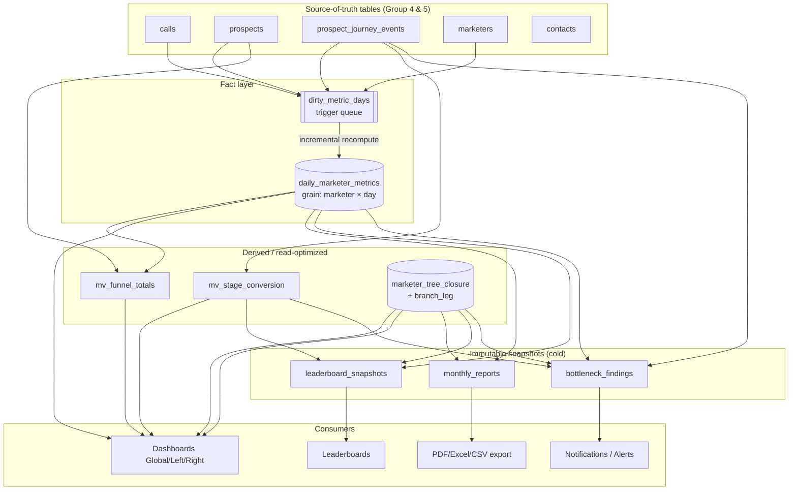
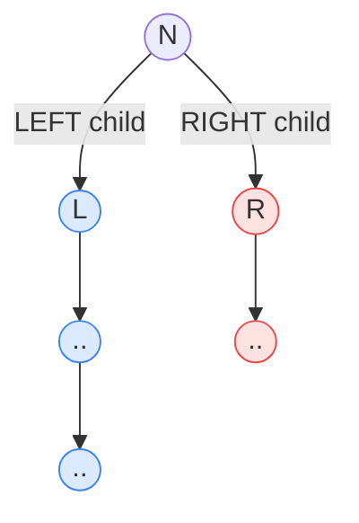

# 11 — Analytics Architecture (BI Engine)

> **Status:** Architecture-validation phase. No application code. This document specifies the
> Business-Intelligence engine for the platform: every metric definition, the computation
> strategy (fact tables, materialized views, nightly `pg_cron` rollups, incremental refresh,
> on-the-fly branch aggregation via the closure table), the bottleneck-detection rule engine,
> and leaderboard computation.
>
> **Consistency contract:** every table, column, enum value, and index referenced here is
> defined in **`01-database-schema.md`** (the canonical foundation) and is used verbatim. No
> new physical columns are invented; where this document needs a derived structure it is
> declared explicitly as an additional materialized view, function, or rollup and flagged in
> the Open Questions section if it requires sign-off.
>
> **Platform primitives leveraged:** Postgres 15 (window functions, `FILTER`, `date_trunc`,
> generated columns), `ltree` + `marketer_tree_closure` (subtree/branch aggregation), `pg_cron`
> (scheduled rollups & reports), Supabase Realtime (live dashboard pushes), RLS (every analytics
> read is scoped by `org_id` + closure-based subtree visibility).

---

## Table of Contents

1. [Design Principles & Data-Flow Overview](#1-design-principles--data-flow-overview)
2. [The Fact Layer: `daily_marketer_metrics`](#2-the-fact-layer-daily_marketer_metrics)
3. [Metric Catalogue (exhaustive definitions)](#3-metric-catalogue-exhaustive-definitions)
4. [Per-Marketer Totals](#4-per-marketer-totals)
5. [Conversion Analytics (stage-to-stage, trends, MoM)](#5-conversion-analytics-stage-to-stage-trends-mom)
6. [Team Analytics](#6-team-analytics)
7. [Branch Analytics (Left vs Right, separately)](#7-branch-analytics-left-vs-right-separately)
8. [Computation Strategy: rollups, MVs, incremental refresh](#8-computation-strategy-rollups-mvs-incremental-refresh)
9. [Monthly / Quarterly Reports (MoM diff + %)](#9-monthly--quarterly-reports-mom-diff--)
10. [Bottleneck Detection Engine](#10-bottleneck-detection-engine)
11. [Leaderboards](#11-leaderboards)
12. [Executive (CEO) Dashboard & Rank-Adaptive Dashboards](#12-executive-ceo-dashboard--rank-adaptive-dashboards)
13. [Helper Functions & SQL Reference Library](#13-helper-functions--sql-reference-library)
14. [Performance, Indexing & Cost Model](#14-performance-indexing--cost-model)
15. [RLS Interaction with Analytics](#15-rls-interaction-with-analytics)
16. [pg_cron Schedule (consolidated)](#16-pg_cron-schedule-consolidated)
17. [Open Questions / Decisions Needing Sign-off](#17-open-questions--decisions-needing-sign-off)

---

## 1. Design Principles & Data-Flow Overview

The BI engine follows five non-negotiable principles:

1. **One atomic fact grain.** All numeric analytics derive from a single fact table,
   `daily_marketer_metrics`, at the grain **(org_id, marketer_id, metric_date)** holding a
   marketer's *own* activity. Nothing else stores pre-aggregated subtree totals as physical
   rows except snapshot tables (`monthly_reports`, `leaderboard_snapshots`) that exist for
   immutability/instant-load reasons.

2. **Subtree/branch aggregation is computed on read** by joining `marketer_tree_closure`
   (`ancestor_id = N`) to the fact table. "Own activity" rows stay small and write-cheap; any
   node's team/Left/Right totals are an O(index) closure join + `SUM`. This is the central
   architectural lever (`branch_leg` on the closure row makes Left/Right a single indexed
   predicate).

3. **Two refresh tiers.** *Hot* surfaces (live dashboard cards, funnel totals) read
   materialized views refreshed every 15 minutes plus a trigger-maintained dirty set for the
   fact table. *Cold* surfaces (monthly/quarterly reports, leaderboard snapshots, bottleneck
   findings) are nightly/period `pg_cron` batch jobs producing immutable snapshots.

4. **Incremental, never full-table.** The fact table is recomputed only for *dirty
   (marketer, day)* pairs flagged by triggers on `calls`, `prospects`,
   `prospect_journey_events`, and `marketers`. Cron is only a backstop / reconciliation pass.

5. **Timezone-correct day bucketing.** Every `date`-grained metric buckets on
   `organizations.timezone` (org-local day), not UTC — see Open Question #9 in the schema doc,
   resolved here as **org-local**.

### Data-flow diagram



### Where each feature-surface metric is served from

| Feature surface | Primary source | Refresh tier |
|---|---|---|
| Per-marketer funnel totals | `mv_funnel_totals` | hot (15 min) |
| Per-marketer call/activity totals | `daily_marketer_metrics` (SUM over date range) | hot (trigger + 15 min backstop) |
| Stage-to-stage conversion % | `mv_stage_conversion` | hot (15 min) |
| Historical / monthly / quarterly conversion trend | `mv_stage_conversion` sliced by `period_month` | hot |
| MoM diff + % (live) | `daily_marketer_metrics` aggregated per month | hot |
| MoM diff + % (immutable report) | `monthly_reports` | cold (1st of month) |
| Team analytics (size/active/new/growth) | `marketer_tree_closure` ⋈ `marketers` ⋈ `daily_marketer_metrics` | hot |
| Branch analytics (Left vs Right) | `marketer_tree_closure` (`branch_leg`) ⋈ `daily_marketer_metrics` / `mv_funnel_totals` | hot |
| Leaderboards | `leaderboard_snapshots` | cold (nightly + on-demand) |
| Bottleneck alerts | `bottleneck_findings` | cold (nightly 03:00) |
| Executive dashboard | org-scoped aggregates over all of the above | hot |

---

## 2. The Fact Layer: `daily_marketer_metrics`

The canonical fact table (defined in §6.1 of the schema doc). Reproduced here for reference of
the exact columns the BI engine reads/writes:

```sql
-- PRIMARY KEY (marketer_id, metric_date); org_id carried for tenant scoping & RLS.
daily_marketer_metrics (
  org_id, marketer_id, metric_date,
  calls_total, calls_connected, calls_duration_secs,
  new_prospects,
  stage_conoscitiva, stage_business_info, stage_follow_up,
  stage_closing, stage_check_soldi, stage_iscrizione,
  new_recruits,
  created_at, updated_at
)
```

### 2.1 Exact population rules (per dirty `(marketer_id, metric_date)`)

The fact row for a marketer/day is **fully recomputed** from source tables (idempotent upsert).
`day_lo`/`day_hi` are the org-local-day boundaries converted to `timestamptz` (see
`org_day_bounds()` in §13).

| Fact column | Derivation (canonical source) |
|---|---|
| `calls_total` | `count(*)` from `calls` where `marketer_id = M`, `occurred_at ∈ [day]`, `deleted_at IS NULL`. |
| `calls_connected` | same, `FILTER (WHERE outcome = 'connesso')`. |
| `calls_duration_secs` | `sum(duration_secs)` same window. |
| `new_prospects` | `count(*)` from `prospects` where `owner_marketer_id = M`, `entered_funnel_at ∈ [day]`, `deleted_at IS NULL`. |
| `stage_conoscitiva` | `count(*)` from `prospect_journey_events` where `responsible_marketer_id = M`, `to_stage = 'conoscitiva'`, `entered_at ∈ [day]`. |
| `stage_business_info` | … `to_stage = 'business_info'` … |
| `stage_follow_up` | … `to_stage = 'follow_up'` … |
| `stage_closing` | … `to_stage = 'closing'` … |
| `stage_check_soldi` | … `to_stage = 'check_soldi'` … |
| `stage_iscrizione` | … `to_stage = 'iscrizione'` … (= enrollments by stage entry) |
| `new_recruits` | `count(*)` from `marketers` where `sponsor_id = M`, `registration_date = metric_date`, `deleted_at IS NULL`. |

> **Stage counters = stage *entries*, not current occupancy.** A prospect entering
> `business_info` on day D increments `stage_business_info` for D exactly once (the row in
> `prospect_journey_events` with `to_stage='business_info'`, `entered_at∈D`). This makes the
> stage counters additive across days and is the correct grain for both throughput totals and
> conversion ratios. Current *occupancy* (how many prospects sit in a stage right now) is a
> different question answered by `mv_funnel_totals` (which groups on `prospects.current_stage`).

> **Recruiting attribution uses `sponsor_id`, not `parent_id`.** A "new recruit" is credited to
> the person who actually recruited them (`sponsor_id`), per the locked model separation
> (spillover can put the placement under a different `parent_id`). Team *size* and *growth*,
> by contrast, use placement (`marketer_tree_closure`) — see §6.

### 2.2 Incremental recompute function

```sql
CREATE OR REPLACE FUNCTION recompute_daily_marketer_metric(
  p_org_id      uuid,
  p_marketer_id uuid,
  p_date        date
) RETURNS void
LANGUAGE plpgsql AS $$
DECLARE
  v_lo timestamptz;
  v_hi timestamptz;
BEGIN
  SELECT lo, hi INTO v_lo, v_hi FROM org_day_bounds(p_org_id, p_date);

  INSERT INTO daily_marketer_metrics AS d (
    org_id, marketer_id, metric_date,
    calls_total, calls_connected, calls_duration_secs,
    new_prospects,
    stage_conoscitiva, stage_business_info, stage_follow_up,
    stage_closing, stage_check_soldi, stage_iscrizione,
    new_recruits, updated_at
  )
  SELECT
    p_org_id, p_marketer_id, p_date,
    -- calls
    coalesce((SELECT count(*)                                   FROM calls c
              WHERE c.marketer_id = p_marketer_id AND c.deleted_at IS NULL
                AND c.occurred_at >= v_lo AND c.occurred_at < v_hi), 0),
    coalesce((SELECT count(*) FILTER (WHERE c.outcome = 'connesso') FROM calls c
              WHERE c.marketer_id = p_marketer_id AND c.deleted_at IS NULL
                AND c.occurred_at >= v_lo AND c.occurred_at < v_hi), 0),
    coalesce((SELECT sum(c.duration_secs)                       FROM calls c
              WHERE c.marketer_id = p_marketer_id AND c.deleted_at IS NULL
                AND c.occurred_at >= v_lo AND c.occurred_at < v_hi), 0),
    -- new prospects
    coalesce((SELECT count(*) FROM prospects p
              WHERE p.owner_marketer_id = p_marketer_id AND p.deleted_at IS NULL
                AND p.entered_funnel_at >= v_lo AND p.entered_funnel_at < v_hi), 0),
    -- stage entries (one CTE-style scan in real impl; expanded here for clarity)
    coalesce((SELECT count(*) FROM prospect_journey_events e WHERE e.responsible_marketer_id = p_marketer_id AND e.to_stage='conoscitiva'   AND e.entered_at >= v_lo AND e.entered_at < v_hi),0),
    coalesce((SELECT count(*) FROM prospect_journey_events e WHERE e.responsible_marketer_id = p_marketer_id AND e.to_stage='business_info' AND e.entered_at >= v_lo AND e.entered_at < v_hi),0),
    coalesce((SELECT count(*) FROM prospect_journey_events e WHERE e.responsible_marketer_id = p_marketer_id AND e.to_stage='follow_up'     AND e.entered_at >= v_lo AND e.entered_at < v_hi),0),
    coalesce((SELECT count(*) FROM prospect_journey_events e WHERE e.responsible_marketer_id = p_marketer_id AND e.to_stage='closing'       AND e.entered_at >= v_lo AND e.entered_at < v_hi),0),
    coalesce((SELECT count(*) FROM prospect_journey_events e WHERE e.responsible_marketer_id = p_marketer_id AND e.to_stage='check_soldi'   AND e.entered_at >= v_lo AND e.entered_at < v_hi),0),
    coalesce((SELECT count(*) FROM prospect_journey_events e WHERE e.responsible_marketer_id = p_marketer_id AND e.to_stage='iscrizione'    AND e.entered_at >= v_lo AND e.entered_at < v_hi),0),
    -- new recruits (by sponsor)
    coalesce((SELECT count(*) FROM marketers m
              WHERE m.sponsor_id = p_marketer_id AND m.deleted_at IS NULL
                AND m.registration_date = p_date), 0),
    now()
  ON CONFLICT (marketer_id, metric_date) DO UPDATE SET
    calls_total         = EXCLUDED.calls_total,
    calls_connected     = EXCLUDED.calls_connected,
    calls_duration_secs = EXCLUDED.calls_duration_secs,
    new_prospects       = EXCLUDED.new_prospects,
    stage_conoscitiva   = EXCLUDED.stage_conoscitiva,
    stage_business_info = EXCLUDED.stage_business_info,
    stage_follow_up     = EXCLUDED.stage_follow_up,
    stage_closing       = EXCLUDED.stage_closing,
    stage_check_soldi   = EXCLUDED.stage_check_soldi,
    stage_iscrizione    = EXCLUDED.stage_iscrizione,
    new_recruits        = EXCLUDED.new_recruits,
    updated_at          = now();
END;
$$;
```

### 2.3 Dirty-set queue (trigger-driven incremental refresh)

A lightweight unlogged queue table accumulates `(marketer_id, metric_date)` pairs that need
recompute. Triggers on the source tables enqueue; a frequent `pg_cron` micro-batch drains.

```sql
-- Additional structure introduced by the analytics layer (see Open Question A-1).
CREATE UNLOGGED TABLE dirty_metric_days (
  org_id       uuid NOT NULL,
  marketer_id  uuid NOT NULL,
  metric_date  date NOT NULL,
  enqueued_at  timestamptz NOT NULL DEFAULT now(),
  PRIMARY KEY (marketer_id, metric_date)
);

-- Example: enqueue on call write. The metric_date is the ORG-LOCAL day of occurred_at.
CREATE OR REPLACE FUNCTION trg_calls_enqueue_metric() RETURNS trigger
LANGUAGE plpgsql AS $$
DECLARE r record;
BEGIN
  FOR r IN
    SELECT x.marketer_id, x.org_id, x.occurred_at
    FROM (VALUES
      (COALESCE(NEW.marketer_id, OLD.marketer_id),
       COALESCE(NEW.org_id, OLD.org_id),
       COALESCE(NEW.occurred_at, OLD.occurred_at))
    ) AS x(marketer_id, org_id, occurred_at)
  LOOP
    INSERT INTO dirty_metric_days (org_id, marketer_id, metric_date)
    VALUES (r.org_id, r.marketer_id, org_local_date(r.org_id, r.occurred_at))
    ON CONFLICT DO NOTHING;
  END LOOP;
  RETURN NULL;
END;
$$;

CREATE TRIGGER calls_enqueue_metric
  AFTER INSERT OR UPDATE OR DELETE ON calls
  FOR EACH ROW EXECUTE FUNCTION trg_calls_enqueue_metric();
```

Analogous `AFTER` triggers enqueue from:

| Source table | Date used for `metric_date` | Marketer(s) enqueued |
|---|---|---|
| `calls` | `occurred_at` (org-local) | `marketer_id` (and `OLD` on update/delete if changed) |
| `prospects` | `entered_funnel_at` (org-local) | `owner_marketer_id` |
| `prospect_journey_events` | `entered_at` (org-local) | `responsible_marketer_id` |
| `marketers` (recruit) | `registration_date` | `sponsor_id` |

The drain job:

```sql
CREATE OR REPLACE FUNCTION drain_dirty_metric_days(p_limit int DEFAULT 5000)
RETURNS int LANGUAGE plpgsql AS $$
DECLARE v_count int := 0; r record;
BEGIN
  FOR r IN
    DELETE FROM dirty_metric_days
    WHERE (marketer_id, metric_date) IN (
      SELECT marketer_id, metric_date FROM dirty_metric_days
      ORDER BY enqueued_at LIMIT p_limit FOR UPDATE SKIP LOCKED
    )
    RETURNING org_id, marketer_id, metric_date
  LOOP
    PERFORM recompute_daily_marketer_metric(r.org_id, r.marketer_id, r.metric_date);
    v_count := v_count + 1;
  END LOOP;
  RETURN v_count;
END;
$$;
-- pg_cron: SELECT cron.schedule('drain_metrics', '*/2 * * * *', $$SELECT drain_dirty_metric_days();$$);
```

> **Why a queue and not direct recompute in the trigger?** Stage transitions and bulk contact
> ops can touch many rows in one statement; a 2-minute micro-batch coalesces repeated dirtying
> of the same `(marketer, day)` into a single recompute and keeps write latency on the hot path
> (logging a call) negligible.

---

## 3. Metric Catalogue (exhaustive definitions)

Every metric the platform exposes, with its **canonical definition**, **source**, and **grain
of aggregation**. `[date range]` always means the org-local window the consumer requested.

### 3.1 Activity metrics

| Metric (key) | Definition | Source column(s) | Aggregation |
|---|---|---|---|
| `calls_total` | Count of non-deleted calls in window | `daily_marketer_metrics.calls_total` | SUM over date + closure subtree |
| `calls_connected` | Calls with `outcome='connesso'` | `calls_connected` | SUM |
| `connect_rate` | `calls_connected / NULLIF(calls_total,0)` | derived | ratio of SUMs |
| `calls_duration_secs` | Total talk-time seconds | `calls_duration_secs` | SUM |
| `avg_call_duration_secs` | `calls_duration_secs / NULLIF(calls_total,0)` | derived | ratio of SUMs |
| `calls_appointment` | Calls whose `outcome='appuntamento'` | `calls` (live count — not pre-aggregated; see note) | SUM live |
| `calls_enrolled_on_call` | Calls whose `outcome='iscritto'` | `calls` (live) | SUM live |

> **Outcome-sliced call counts** beyond connected (`appuntamento`, `iscritto`, `richiamare`,
> `no_risposta`, `non_interessato`) are *not* pre-aggregated columns in
> `daily_marketer_metrics`. They are computed live from `calls` filtered by `outcome` and
> `occurred_at`, scoped by closure. If a specific outcome breakdown becomes a hot dashboard
> card, promote it to a fact column (see Open Question A-2). The schema deliberately keeps
> `daily_marketer_metrics` lean.

### 3.2 Funnel volume metrics (the 6 stages)

| Metric (key) | Definition | Source |
|---|---|---|
| `new_prospects` | Prospects that entered the funnel in window | `daily_marketer_metrics.new_prospects` |
| `stage_conoscitiva` | Entries into stage 1 in window | `daily_marketer_metrics.stage_conoscitiva` |
| `stage_business_info` | Entries into stage 2 | `daily_marketer_metrics.stage_business_info` |
| `stage_follow_up` | Entries into stage 3 | `daily_marketer_metrics.stage_follow_up` |
| `stage_closing` | Entries into stage 4 | `daily_marketer_metrics.stage_closing` |
| `stage_check_soldi` | Entries into stage 5 | `daily_marketer_metrics.stage_check_soldi` |
| `stage_iscrizione` | Entries into stage 6 (= enrollments) | `daily_marketer_metrics.stage_iscrizione` |
| `enrollments` | Alias for `stage_iscrizione` (throughput) **or** `prospects.outcome='enrolled'` (state) | see note |

> **Two enrollment definitions, both valid, used distinctly:**
> - **Throughput enrollments** = entries into `iscrizione` in the window (`stage_iscrizione`).
>   Used for time-series, leaderboards, MoM. Additive across days.
> - **State enrollments** = current `prospects.outcome = 'enrolled'`. Used for current funnel
>   snapshot cards (via `mv_funnel_totals.enrolled_count`). Not additive across windows.
>   Dashboards label these clearly (Italian: "Iscrizioni nel periodo" vs "Iscritti totali").

### 3.3 Current-occupancy metrics (state, not throughput)

| Metric | Definition | Source |
|---|---|---|
| `open_in_<stage>` | Prospects whose `current_stage = <stage>` AND `outcome='open'` right now | `mv_funnel_totals` grouped by `current_stage` (filter `outcome='open'`) |
| `enrolled_total` | Prospects with `outcome='enrolled'` | `mv_funnel_totals.enrolled_count` |
| `lost_total` | Prospects with `outcome='lost'` | `mv_funnel_totals` filter `outcome='lost'` |
| `pipeline_value` | `sum(expected_value)` of open prospects | live SUM on `prospects` (closure-scoped) |

### 3.4 Conversion metrics

| Metric | Definition |
|---|---|
| `conv_<a>_<b>` | `entered_count(stage b) / NULLIF(entered_count(stage a),0)` for consecutive stages |
| `conv_overall` | `stage_iscrizione / NULLIF(new_prospects,0)` (funnel-end to funnel-start) |
| `avg_time_in_stage_<s>_secs` | Mean `time_in_stage_secs` for completed events of stage `s` (`mv_stage_conversion.avg_time_in_stage_secs`) |
| `current_time_in_stage_secs` | Live `now() - prospects.current_stage_since` for open prospects |

Full treatment in §5.

### 3.5 Team & growth metrics

| Metric | Definition | Source |
|---|---|---|
| `team_size` | Count of descendants (depth ≥ 1) of node N | `marketer_tree_closure` |
| `team_size_incl_self` | Descendants + self (depth ≥ 0) | `marketer_tree_closure` |
| `direct_recruits` | Marketers with `sponsor_id = N` | `marketers` |
| `direct_children` | Marketers with `parent_id = N` (≤ 2 in binary tree) | `marketers` |
| `active_members` | Subtree members with `status='active'` | closure ⋈ `marketers` |
| `inactive_members` | Subtree members with `status='inactive'` | closure ⋈ `marketers` |
| `pending_members` | Subtree members with `status='pending'` | closure ⋈ `marketers` |
| `new_members_<period>` | Subtree members with `registration_date ∈ window` | closure ⋈ `marketers` |
| `growth_rate` | `new_members_period / NULLIF(team_size_start_of_period,0)` | derived |

Full treatment in §6.

### 3.6 Branch metrics

Every metric in §3.1–3.5 has a **Global / Left / Right** variant, obtained by adding a
`branch_leg` predicate on the closure join (`branch_leg='LEFT'`, `='RIGHT'`, or omitted for
Global). Full treatment in §7.

---

## 4. Per-Marketer Totals

"Per-marketer totals" appear in two flavours, both required by the feature surface:

- **Own totals** — this marketer's individual activity only (their personal scorecard).
- **Subtree (team) totals** — this marketer + everyone in their downline (the default for
  dashboards, because a leader's numbers include their team).

The closure table makes the difference a single predicate: **own** = `depth = 0`,
**subtree** = `depth >= 0` (i.e. include self), **downline-only** = `depth >= 1`.

### 4.1 Own totals for a marketer over a date range

```sql
SELECT
  sum(calls_total)         AS calls_total,
  sum(calls_connected)     AS calls_connected,
  sum(calls_duration_secs) AS calls_duration_secs,
  sum(new_prospects)       AS new_prospects,
  sum(stage_conoscitiva)   AS conoscitiva,
  sum(stage_business_info) AS business_info,
  sum(stage_follow_up)     AS follow_up,
  sum(stage_closing)       AS closing,
  sum(stage_check_soldi)   AS check_soldi,
  sum(stage_iscrizione)    AS iscrizione,
  sum(new_recruits)        AS new_recruits
FROM daily_marketer_metrics
WHERE org_id = $org
  AND marketer_id = $marketer
  AND metric_date BETWEEN $from AND $to;
```

### 4.2 Subtree (team-inclusive) totals for a marketer

This is the workhorse query — closure join, self included:

```sql
SELECT
  sum(d.calls_total)         AS calls_total,
  sum(d.calls_connected)     AS calls_connected,
  sum(d.calls_duration_secs) AS calls_duration_secs,
  sum(d.new_prospects)       AS new_prospects,
  sum(d.stage_conoscitiva)   AS conoscitiva,
  sum(d.stage_business_info) AS business_info,
  sum(d.stage_follow_up)     AS follow_up,
  sum(d.stage_closing)       AS closing,
  sum(d.stage_check_soldi)   AS check_soldi,
  sum(d.stage_iscrizione)    AS iscrizione,
  sum(d.new_recruits)        AS new_recruits
FROM marketer_tree_closure cl
JOIN daily_marketer_metrics d
  ON d.marketer_id = cl.descendant_id
WHERE cl.org_id = $org
  AND cl.ancestor_id = $marketer        -- the subtree root
  AND d.metric_date BETWEEN $from AND $to;
-- depth >= 0 by default => self included. Add `AND cl.depth >= 1` for downline-only.
```

> **Indexing:** `closure_ancestor_depth (ancestor_id, depth)` resolves the closure side;
> `daily_marketer_metrics PRIMARY KEY (marketer_id, metric_date)` resolves the fact side. The
> planner does a nested-loop / hash join over a few-thousand-row subtree — sub-10 ms for
> typical org sizes.

### 4.3 Per-marketer current funnel occupancy (node KPI card)

The genealogy tree node card ("name, rank, status, team size, KPIs") and the profile funnel use
`mv_funnel_totals` for instant current-state numbers:

```sql
SELECT
  current_stage,
  outcome,
  sum(prospects_count) AS n,
  sum(enrolled_count)  AS enrolled
FROM mv_funnel_totals
WHERE org_id = $org
  AND marketer_id IN (
    SELECT descendant_id FROM marketer_tree_closure
    WHERE org_id = $org AND ancestor_id = $marketer   -- subtree
  )
GROUP BY current_stage, outcome
ORDER BY current_stage;
```

---

## 5. Conversion Analytics (stage-to-stage, trends, MoM)

### 5.1 Canonical stage order

The ordered ladder is the physical order of the `prospect_stage` enum:

```
conoscitiva → business_info → follow_up → closing → check_soldi → iscrizione
```

A reference function exposes the order so SQL never hard-codes positions:

```sql
CREATE OR REPLACE FUNCTION prospect_stage_order(s prospect_stage) RETURNS int
LANGUAGE sql IMMUTABLE AS $$
  SELECT CASE s
    WHEN 'conoscitiva'   THEN 1
    WHEN 'business_info' THEN 2
    WHEN 'follow_up'     THEN 3
    WHEN 'closing'       THEN 4
    WHEN 'check_soldi'   THEN 5
    WHEN 'iscrizione'    THEN 6
  END;
$$;
```

### 5.2 Definition of stage-to-stage conversion

For a window and a marketer/subtree, define `entered(stage)` = number of prospects that
**entered** that stage in the window (= `prospect_journey_events` rows with that `to_stage`).
Then:

```
conv(stage_n → stage_n+1) = entered(stage_n+1) / entered(stage_n)
```

This is a **flow ratio**, the network-marketing-standard "what fraction of people who reached
step N advanced to step N+1". Because the journey is strictly ordered and a prospect can only
reach `iscrizione` by passing through earlier stages, `entered(stage_n+1) ≤ entered(stage_n)`
in the steady state, and the ratio lands in `[0,1]`.

> **Cohort caveat (documented, not silently ignored):** within a fixed window, a prospect can
> enter stage N near the end of the window and enter stage N+1 just after the window closes,
> slightly depressing the ratio (right-censoring). For *trend* and *relative comparison* this is
> acceptable and consistent. For exact cohort conversion we additionally support a
> cohort-tracked variant (§5.6) that follows each prospect's eventual furthest stage. The
> default dashboard ratio is the flow ratio (cheap, from `mv_stage_conversion`); the cohort
> ratio is an opt-in deeper analysis.

### 5.3 The `mv_stage_conversion` materialized view (per marketer, per month)

Defined in §6.3 of the schema. Grain: `(org_id, marketer_id, period_month, to_stage)` with
`entered_count`, `exited_count`, `avg_time_in_stage_secs`. This is the backbone of all
conversion analytics.

### 5.4 Stage-to-stage conversion for a subtree, single window

Pivot the per-stage `entered_count` into one row, then divide consecutive stages. Closure-scoped
for a subtree; `branch_leg` predicate optional for branch variants (§7).

```sql
WITH agg AS (
  SELECT
    sc.to_stage,
    sum(sc.entered_count) AS entered
  FROM mv_stage_conversion sc
  JOIN marketer_tree_closure cl
    ON cl.descendant_id = sc.marketer_id
  WHERE sc.org_id = $org
    AND cl.org_id = $org
    AND cl.ancestor_id = $marketer
    AND sc.period_month BETWEEN date_trunc('month',$from::date) AND date_trunc('month',$to::date)
  GROUP BY sc.to_stage
),
pivoted AS (
  SELECT
    coalesce(max(entered) FILTER (WHERE to_stage='conoscitiva'),0)   AS c1,
    coalesce(max(entered) FILTER (WHERE to_stage='business_info'),0) AS c2,
    coalesce(max(entered) FILTER (WHERE to_stage='follow_up'),0)     AS c3,
    coalesce(max(entered) FILTER (WHERE to_stage='closing'),0)       AS c4,
    coalesce(max(entered) FILTER (WHERE to_stage='check_soldi'),0)   AS c5,
    coalesce(max(entered) FILTER (WHERE to_stage='iscrizione'),0)    AS c6
  FROM agg
)
SELECT
  c1, c2, c3, c4, c5, c6,
  round(c2::numeric / NULLIF(c1,0), 4) AS conv_conoscitiva_business_info,
  round(c3::numeric / NULLIF(c2,0), 4) AS conv_business_info_follow_up,
  round(c4::numeric / NULLIF(c3,0), 4) AS conv_follow_up_closing,
  round(c5::numeric / NULLIF(c4,0), 4) AS conv_closing_check_soldi,
  round(c6::numeric / NULLIF(c5,0), 4) AS conv_check_soldi_iscrizione,
  round(c6::numeric / NULLIF(c1,0), 4) AS conv_overall
FROM pivoted;
```

### 5.5 Historical / monthly / quarterly trend + MoM comparison

Because `mv_stage_conversion` already buckets on `period_month`, trend is a `GROUP BY
period_month` with the same pivot, then `LAG()` window functions give the month-over-month diff
and %.

**Monthly trend with MoM diff and % (overall conversion, subtree):**

```sql
WITH monthly AS (
  SELECT
    sc.period_month,
    sum(sc.entered_count) FILTER (WHERE sc.to_stage='conoscitiva') AS c1,
    sum(sc.entered_count) FILTER (WHERE sc.to_stage='iscrizione')  AS c6
  FROM mv_stage_conversion sc
  JOIN marketer_tree_closure cl ON cl.descendant_id = sc.marketer_id
  WHERE sc.org_id = $org AND cl.org_id = $org AND cl.ancestor_id = $marketer
  GROUP BY sc.period_month
),
rated AS (
  SELECT
    period_month,
    c1, c6,
    round(c6::numeric / NULLIF(c1,0), 4) AS conv_overall
  FROM monthly
)
SELECT
  period_month,
  c1 AS conoscitiva_entries,
  c6 AS iscrizione_entries,
  conv_overall,
  conv_overall - lag(conv_overall) OVER w                          AS mom_diff,
  round( (conv_overall - lag(conv_overall) OVER w)
         / NULLIF(lag(conv_overall) OVER w, 0) * 100, 2)           AS mom_pct
FROM rated
WINDOW w AS (ORDER BY period_month)
ORDER BY period_month;
```

**Quarterly trend** uses `date_trunc('quarter', period_month)` as the grouping key over the same
MV (re-bucketing monthly buckets into quarters is exact because monthly buckets nest perfectly
inside quarters):

```sql
SELECT
  date_trunc('quarter', period_month)::date AS period_quarter,
  sum(entered_count) FILTER (WHERE to_stage='conoscitiva') AS c1,
  sum(entered_count) FILTER (WHERE to_stage='iscrizione')  AS c6,
  round( sum(entered_count) FILTER (WHERE to_stage='iscrizione')::numeric
       / NULLIF(sum(entered_count) FILTER (WHERE to_stage='conoscitiva'),0), 4) AS conv_overall
FROM mv_stage_conversion sc
JOIN marketer_tree_closure cl ON cl.descendant_id = sc.marketer_id
WHERE sc.org_id = $org AND cl.org_id = $org AND cl.ancestor_id = $marketer
GROUP BY 1
ORDER BY 1;
```

### 5.6 Cohort-accurate conversion (opt-in deep analysis)

When exact cohort conversion is required (e.g. "of the prospects that entered `conoscitiva` in
March, what fraction *ever* reached `iscrizione`"), we follow each prospect's furthest stage
rather than period flow:

```sql
WITH cohort AS (
  SELECT p.id AS prospect_id,
         date_trunc('month', p.entered_funnel_at)::date AS cohort_month,
         -- furthest stage this prospect ever reached
         (SELECT max(prospect_stage_order(e.to_stage))
            FROM prospect_journey_events e
           WHERE e.prospect_id = p.id) AS max_stage_ord
  FROM prospects p
  JOIN marketer_tree_closure cl ON cl.descendant_id = p.owner_marketer_id
  WHERE p.org_id = $org AND cl.org_id = $org AND cl.ancestor_id = $marketer
    AND p.deleted_at IS NULL
)
SELECT
  cohort_month,
  count(*)                                            AS cohort_size,
  count(*) FILTER (WHERE max_stage_ord >= 2)          AS reached_business_info,
  count(*) FILTER (WHERE max_stage_ord >= 6)          AS reached_iscrizione,
  round(count(*) FILTER (WHERE max_stage_ord >= 6)::numeric
        / NULLIF(count(*),0), 4)                      AS cohort_conv_overall
FROM cohort
GROUP BY cohort_month
ORDER BY cohort_month;
```

This is an on-demand analytical query (not pre-materialized) — heavier, run from the
conversion-analytics screen when the user toggles "cohort mode".

---

## 6. Team Analytics

Team analytics describe the *people* in a subtree (placement-based), distinct from the *activity*
metrics of §4. The closure table is the sole structural source.

### 6.1 Team size, composition, recruits — single node

```sql
SELECT
  -- size: descendants excluding self
  count(*) FILTER (WHERE cl.depth >= 1)                               AS team_size,
  count(*) FILTER (WHERE cl.depth >= 1 AND m.status='active')         AS active_members,
  count(*) FILTER (WHERE cl.depth >= 1 AND m.status='inactive')       AS inactive_members,
  count(*) FILTER (WHERE cl.depth >= 1 AND m.status='pending')        AS pending_members,
  count(*) FILTER (WHERE cl.depth >= 1 AND m.status='suspended')      AS suspended_members,
  -- direct placement children (binary tree: 0..2)
  count(*) FILTER (WHERE cl.depth = 1)                                AS direct_children,
  -- new members in the requested window (by registration_date)
  count(*) FILTER (WHERE cl.depth >= 1 AND m.registration_date BETWEEN $from AND $to) AS new_members_period
FROM marketer_tree_closure cl
JOIN marketers m
  ON m.id = cl.descendant_id AND m.deleted_at IS NULL
WHERE cl.org_id = $org
  AND cl.ancestor_id = $marketer;
```

`direct_recruits` (sponsorship, not placement) is a separate count because spillover decouples
the two:

```sql
SELECT count(*) AS direct_recruits
FROM marketers
WHERE org_id = $org AND sponsor_id = $marketer AND deleted_at IS NULL;
```

### 6.2 Growth rate

`growth_rate` over a period = new members in the period / team size at the start of the period.
"Team size at start" is reconstructed from `registration_date` (members who existed before
`period_start`):

```sql
WITH base AS (
  SELECT
    count(*) FILTER (WHERE m.registration_date <  $period_start)                    AS size_start,
    count(*) FILTER (WHERE m.registration_date BETWEEN $period_start AND $period_end) AS new_in_period
  FROM marketer_tree_closure cl
  JOIN marketers m ON m.id = cl.descendant_id AND m.deleted_at IS NULL
  WHERE cl.org_id = $org AND cl.ancestor_id = $marketer AND cl.depth >= 1
)
SELECT
  size_start, new_in_period,
  round(new_in_period::numeric / NULLIF(size_start,0) * 100, 2) AS growth_pct
FROM base;
```

> **Active/inactive definition.** "Active" is the `marketers.status='active'` flag (the
> business-managed state). The bottleneck engine separately computes *behavioural* inactivity
> (no calls / no stage movement in a window) — see §10.3 — which is a different, derived notion
> and does **not** mutate `marketers.status`.

### 6.3 Team activity totals

Team *activity* (calls/prospects/enrollments for the whole team) is exactly the subtree-inclusive
query of §4.2. Team analytics screens show §6.1 (composition) and §4.2 (activity) side by side.

---

## 7. Branch Analytics (Left vs Right, separately)

The defining requirement: for any node N, compute **Left Branch** and **Right Branch** analytics
*separately*, where Left Branch = the subtree rooted at N's LEFT child and Right Branch = the
subtree rooted at N's RIGHT child. The schema's `marketer_tree_closure.branch_leg` column is
purpose-built for this: for any ancestor N and descendant X at depth ≥ 1, `branch_leg` records
whether X hangs off N's LEFT or RIGHT child. Therefore **branch filtering is a single indexed
equality predicate**, not a path comparison.



For node N: every blue node has a closure row `(ancestor_id=N, descendant_id=blue,
branch_leg='LEFT')`; every red node has `branch_leg='RIGHT'`. Global = both + N itself.

### 7.1 The three views (GLOBAL / LEFT / RIGHT)

The `branch_side` enum (`'GLOBAL' | 'LEFT' | 'RIGHT'`) is the canonical selector. The predicate
mapping:

| `branch_side` | Closure predicate |
|---|---|
| `GLOBAL` | `cl.ancestor_id = N` (depth ≥ 0, all branches + self) |
| `LEFT` | `cl.ancestor_id = N AND cl.branch_leg = 'LEFT'` (depth ≥ 1) |
| `RIGHT` | `cl.ancestor_id = N AND cl.branch_leg = 'RIGHT'` (depth ≥ 1) |

> Note Left/Right exclude N itself by construction (`branch_leg` is NULL on the depth-0 self
> row). N's own activity is part of GLOBAL only — which is correct: a node's personal numbers
> belong to neither leg.

### 7.2 Example SQL — branch funnel aggregation (the canonical example)

This is the reference query the brief asks for: **funnel stage totals split by Left vs Right vs
Global for a node N, over a date range**, all in one pass using the `branch_leg` column.

```sql
-- Branch funnel aggregation for node N over [$from,$to].
-- Returns one row per branch_side with all six stage entry totals + enrollments + calls.
WITH scoped AS (
  SELECT
    CASE
      WHEN cl.depth = 0            THEN 'GLOBAL'      -- self contributes to GLOBAL only
      ELSE cl.branch_leg::text                        -- 'LEFT' | 'RIGHT'
    END                                  AS leg_bucket,
    d.calls_total,
    d.calls_connected,
    d.new_prospects,
    d.stage_conoscitiva,
    d.stage_business_info,
    d.stage_follow_up,
    d.stage_closing,
    d.stage_check_soldi,
    d.stage_iscrizione,
    d.new_recruits
  FROM marketer_tree_closure cl
  JOIN daily_marketer_metrics d
    ON d.marketer_id = cl.descendant_id
   AND d.metric_date BETWEEN $from AND $to
  WHERE cl.org_id = $org
    AND cl.ancestor_id = $marketer        -- node N
),
-- expand each row into the buckets it belongs to:
--   LEFT/RIGHT descendants -> their own leg AND GLOBAL
--   self (GLOBAL only)     -> GLOBAL
exploded AS (
  SELECT 'GLOBAL'::branch_side AS branch_side, * FROM scoped
  UNION ALL
  SELECT leg_bucket::branch_side AS branch_side, * FROM scoped WHERE leg_bucket <> 'GLOBAL'
)
SELECT
  branch_side,
  sum(calls_total)         AS calls_total,
  sum(calls_connected)     AS calls_connected,
  sum(new_prospects)       AS new_prospects,
  sum(stage_conoscitiva)   AS conoscitiva,
  sum(stage_business_info) AS business_info,
  sum(stage_follow_up)     AS follow_up,
  sum(stage_closing)       AS closing,
  sum(stage_check_soldi)   AS check_soldi,
  sum(stage_iscrizione)    AS iscrizione,
  sum(new_recruits)        AS new_recruits,
  -- conversion ratios per branch, computed inline
  round(sum(stage_business_info)::numeric / NULLIF(sum(stage_conoscitiva),0),4) AS conv_conoscitiva_business_info,
  round(sum(stage_follow_up)::numeric     / NULLIF(sum(stage_business_info),0),4) AS conv_business_info_follow_up,
  round(sum(stage_closing)::numeric       / NULLIF(sum(stage_follow_up),0),4)     AS conv_follow_up_closing,
  round(sum(stage_check_soldi)::numeric   / NULLIF(sum(stage_closing),0),4)       AS conv_closing_check_soldi,
  round(sum(stage_iscrizione)::numeric    / NULLIF(sum(stage_check_soldi),0),4)   AS conv_check_soldi_iscrizione,
  round(sum(stage_iscrizione)::numeric    / NULLIF(sum(stage_conoscitiva),0),4)   AS conv_overall
FROM exploded
GROUP BY branch_side
ORDER BY branch_side;   -- GLOBAL, LEFT, RIGHT
```

> The `exploded` CTE pattern (emit each descendant once for its leg and once for GLOBAL) lets us
> compute all three views in a single scan of the subtree — important for the genealogy node
> card that shows Global/Left/Right summary chips together. The `WHERE leg_bucket <> 'GLOBAL'`
> on the second arm ensures the self row (which is GLOBAL-only) is not double-counted into a
> leg.

### 7.3 Branch team composition (size/active/new) split Left vs Right

```sql
SELECT
  cl.branch_leg AS branch_side,
  count(*)                                            AS branch_size,
  count(*) FILTER (WHERE m.status='active')           AS active_members,
  count(*) FILTER (WHERE m.status='inactive')         AS inactive_members,
  count(*) FILTER (WHERE m.registration_date BETWEEN $from AND $to) AS new_members_period
FROM marketer_tree_closure cl
JOIN marketers m ON m.id = cl.descendant_id AND m.deleted_at IS NULL
WHERE cl.org_id = $org
  AND cl.ancestor_id = $marketer
  AND cl.depth >= 1                 -- exclude self; branch_leg is NULL on self anyway
GROUP BY cl.branch_leg
ORDER BY cl.branch_leg;
```

This directly powers "branch analytics (Left vs Right separately)" and the binary-tree
"balance" indicator (Left size vs Right size) used in network marketing to spot leg imbalance.

### 7.4 Branch balance / weak-leg indicator

```sql
WITH legs AS (
  SELECT
    sum(d.stage_iscrizione) FILTER (WHERE cl.branch_leg='LEFT')  AS left_enroll,
    sum(d.stage_iscrizione) FILTER (WHERE cl.branch_leg='RIGHT') AS right_enroll,
    count(DISTINCT cl.descendant_id) FILTER (WHERE cl.branch_leg='LEFT')  AS left_size,
    count(DISTINCT cl.descendant_id) FILTER (WHERE cl.branch_leg='RIGHT') AS right_size
  FROM marketer_tree_closure cl
  LEFT JOIN daily_marketer_metrics d
    ON d.marketer_id = cl.descendant_id AND d.metric_date BETWEEN $from AND $to
  WHERE cl.org_id = $org AND cl.ancestor_id = $marketer AND cl.depth >= 1
)
SELECT
  left_size, right_size, left_enroll, right_enroll,
  CASE WHEN coalesce(left_size,0) = coalesce(right_size,0) THEN 'balanced'
       WHEN coalesce(left_size,0) <  coalesce(right_size,0) THEN 'left_is_weak'
       ELSE 'right_is_weak' END                              AS weak_leg,
  round(abs(coalesce(left_size,0) - coalesce(right_size,0))::numeric
        / NULLIF(greatest(left_size,right_size),0) * 100, 1) AS imbalance_pct
FROM legs;
```

---

## 8. Computation Strategy: rollups, MVs, incremental refresh

This section consolidates *how* each structure stays fresh.

### 8.1 Structure inventory

| Structure | Type | Grain | Freshness mechanism |
|---|---|---|---|
| `daily_marketer_metrics` | base fact table | marketer × day | **Trigger dirty-set** (`dirty_metric_days`) drained every 2 min by `drain_dirty_metric_days()`; hourly cron backstop recomputes the last 48h for safety. |
| `mv_funnel_totals` | materialized view | marketer × current_stage × outcome | `REFRESH … CONCURRENTLY` every 15 min (`refresh_funnel_mvs`) + on-demand after bulk stage changes. |
| `mv_stage_conversion` | materialized view | marketer × month × to_stage | `REFRESH … CONCURRENTLY` every 15 min (same job). |
| `monthly_reports` | snapshot table | marketer × month (+ org row) | `pg_cron` 1st of month 02:00 org-tz (`generate_monthly_reports`). |
| quarterly rows in `monthly_reports` | snapshot | marketer × quarter | `pg_cron` 1st of quarter 02:30 (`generate_quarterly_reports`). |
| `leaderboard_snapshots` | snapshot table | metric × scope × branch_side × period | `pg_cron` nightly + on-demand (`refresh_leaderboards`). |
| `bottleneck_findings` | snapshot table | finding | `pg_cron` nightly 03:00 (`run_bottleneck_rules`). |

### 8.2 Why this split

- **Fact table incremental, not MV.** `daily_marketer_metrics` is a *table* (not a MV) precisely
  so it can be updated *incrementally per dirty key*. A MV would force full recompute or
  `CONCURRENTLY` full re-scan; with millions of historical rows that is wasteful. Only "today"
  and recently-edited days are dirty on any given write.
- **MVs for the two heavy GROUP BYs.** `mv_funnel_totals` and `mv_stage_conversion` aggregate the
  large `prospects` / `prospect_journey_events` tables. Full `CONCURRENTLY` refresh every 15 min
  is acceptable at expected volumes and trivially correct; both have the `UNIQUE` index required
  for `CONCURRENTLY`.
- **Snapshots for immutability + instant load.** Reports, leaderboards, and bottleneck findings
  must be *stable within a period* (a leaderboard shouldn't reshuffle mid-day) and load
  instantly, so they are precomputed rows, not live queries.

### 8.3 `mv_funnel_totals` refresh correctness

`mv_funnel_totals` groups on `prospects.current_stage` / `outcome`, which change as prospects
move. Between refreshes the live `prospects` table is the truth; the MV lags up to 15 min. For
surfaces that must be exact-now (e.g. immediately after a user advances a prospect on their own
screen) the frontend reads the live `prospects` row it just mutated and patches the card
optimistically, while background refresh reconciles. Documented as the accepted hot-path
trade-off.

### 8.4 On-demand refresh hook

After bulk operations (bulk stage change, CSV import of prospects, placement move), the Edge
Function performing the op calls:

```sql
SELECT refresh_funnel_analytics($org);   -- wraps the two CONCURRENTLY refreshes, debounced
```

`refresh_funnel_analytics` is debounced (advisory lock + "last refreshed at" guard) so a burst of
bulk ops triggers at most one refresh per N seconds.

### 8.5 Placement moves & analytics

A placement move rewrites closure rows (and `branch_leg`) for the moved subtree. Because all
team/branch analytics are *computed on read* from the closure table, **no analytics
recomputation is needed** beyond the closure rewrite the schema triggers already perform — the
next read reflects the new structure automatically. The fact table is keyed on `marketer_id`
(not on position), so it is untouched by moves. This is a major benefit of the
"facts-own-only + closure-on-read" design.

---

## 9. Monthly / Quarterly Reports (MoM diff + %)

### 9.1 Target table

`monthly_reports` (schema §6.4). Columns: `metrics jsonb` (current period),
`previous_metrics jsonb`, `deltas jsonb` (absolute diff), `delta_pct jsonb` (% change),
keyed `UNIQUE (org_id, marketer_id, period, period_start)` with `period report_period`
(`'monthly' | 'quarterly'`) and `marketer_id NULL` = org-level row.

### 9.2 Metric payload schema (the `jsonb` contract)

Every report's `metrics` (and `previous_metrics`) object uses this fixed key set so the
frontend, MoM diffing, and export render uniformly:

```jsonc
{
  "calls_total":          1234,
  "calls_connected":       780,
  "calls_duration_secs": 432000,
  "new_prospects":         210,
  "conoscitiva":           210,
  "business_info":         150,
  "follow_up":             110,
  "closing":                70,
  "check_soldi":            55,
  "iscrizione":             40,
  "enrollments":            40,        // = iscrizione throughput
  "new_recruits":           18,
  "team_size":             340,
  "active_members":        290,
  "conv_overall":          0.1905,     // iscrizione / conoscitiva
  "conv_check_soldi_iscrizione": 0.7273
}
```

`deltas[k] = metrics[k] - previous_metrics[k]`;
`delta_pct[k] = round((metrics[k]-previous_metrics[k]) / NULLIF(previous_metrics[k],0) * 100, 2)`.

### 9.3 Generation job (monthly, per marketer + org)

```sql
CREATE OR REPLACE FUNCTION generate_monthly_reports(p_org_id uuid, p_period_start date)
RETURNS int LANGUAGE plpgsql AS $$
DECLARE
  v_prev_start date := (p_period_start - interval '1 month')::date;
  v_period_end date := (p_period_start + interval '1 month' - interval '1 day')::date;
  v_prev_end   date := (p_period_start - interval '1 day')::date;
  v_n int := 0;
  r record;
BEGIN
  FOR r IN
    SELECT id AS marketer_id FROM marketers
    WHERE org_id = p_org_id AND deleted_at IS NULL
    UNION ALL SELECT NULL                       -- the org-level (NULL marketer) row
  LOOP
    WITH cur AS (
      SELECT subtree_metrics_json(p_org_id, r.marketer_id, p_period_start, v_period_end) AS m
    ),
    prev AS (
      SELECT subtree_metrics_json(p_org_id, r.marketer_id, v_prev_start, v_prev_end) AS m
    )
    INSERT INTO monthly_reports AS mr (
      org_id, marketer_id, period, period_start, period_end,
      metrics, previous_metrics, deltas, delta_pct, generated_at
    )
    SELECT
      p_org_id, r.marketer_id, 'monthly', p_period_start, v_period_end,
      cur.m, prev.m,
      jsonb_delta(cur.m, prev.m),
      jsonb_delta_pct(cur.m, prev.m),
      now()
    FROM cur, prev
    ON CONFLICT (org_id, marketer_id, period, period_start)
    DO UPDATE SET metrics = EXCLUDED.metrics,
                  previous_metrics = EXCLUDED.previous_metrics,
                  deltas = EXCLUDED.deltas,
                  delta_pct = EXCLUDED.delta_pct,
                  generated_at = now();
    v_n := v_n + 1;
  END LOOP;

  -- notify each marketer their report is ready
  INSERT INTO notifications (org_id, recipient_marketer_id, type, title_it, body_it, payload)
  SELECT p_org_id, mr.marketer_id, 'monthly_report_ready',
         'Report mensile pronto',
         'Il tuo report di ' || to_char(p_period_start,'MM/YYYY') || ' è disponibile.',
         jsonb_build_object('report_id', mr.id, 'period_start', p_period_start)
  FROM monthly_reports mr
  WHERE mr.org_id = p_org_id AND mr.period='monthly'
    AND mr.period_start = p_period_start AND mr.marketer_id IS NOT NULL;

  RETURN v_n;
END;
$$;
```

- `subtree_metrics_json()` (defined §13) returns the §9.2 jsonb for a marketer's subtree (or the
  whole org when `marketer_id IS NULL`) over a window — internally the §4.2 + §6.1 queries.
- `jsonb_delta` / `jsonb_delta_pct` (defined §13) compute per-key absolute and % MoM diffs.
- Quarterly reports call the same logic with `period='quarterly'`, `p_period_start` = quarter
  start, previous = prior quarter.

### 9.4 Scheduling (org-local first-of-period)

`pg_cron` runs in UTC; org-local "1st of month 02:00" is handled by a dispatcher job that runs
hourly and fires `generate_monthly_reports` for any org whose local time is currently the 1st at
02:00 (and not yet generated for that period). This honours each org's `organizations.timezone`.

---

## 10. Bottleneck Detection Engine

The engine evaluates rule sets over the rollups/journey data nightly (`run_bottleneck_rules`,
03:00) and upserts rows into `bottleneck_findings` (schema §6.6), emitting `notifications` of
type `'bottleneck_alert'`. Findings carry `type bottleneck_type`, `severity
bottleneck_severity`, `stage`, `metric_value`, `threshold_value`, Italian `title_it` +
`recommendation_it`, and the `period_start`/`period_end` window. The
`UNIQUE (org_id, marketer_id, type, stage, period_start)` constraint makes each rule idempotent
per marketer/stage/period (re-running upserts, never duplicates).

### 10.1 Rule scope

Rules run **per marketer over their subtree** (closure-scoped), so a finding attributed to
`marketer_id = N` describes a weakness in N's organization — actionable by N (and visible up the
chain to N's uplines and admins via RLS). The default evaluation window is the **trailing 30
days** (configurable per org via `organizations.settings`).

### 10.2 Thresholds (org-configurable, with defaults)

Thresholds live in `organizations.settings -> 'bottleneck'` so each org tunes them; the engine
falls back to these defaults:

```jsonc
"bottleneck": {
  "min_volume_conoscitiva": 10,      // don't flag conversion on tiny samples
  "weak_conv_threshold": {           // below these %, flag weak_conversion
    "conoscitiva_business_info": 0.40,
    "business_info_follow_up":   0.50,
    "follow_up_closing":         0.40,
    "closing_check_soldi":       0.50,
    "check_soldi_iscrizione":    0.60
  },
  "max_avg_days_in_stage": {         // above these, flag stage_delay
    "conoscitiva":   5,
    "business_info": 7,
    "follow_up":    14,
    "closing":       7,
    "check_soldi":   5
  },
  "inactivity_days": 14,             // no calls AND no stage movement -> inactivity
  "followup_overdue_count": 5        // >= N overdue follow-ups -> followup_overdue
}
```

### 10.3 The four concrete rules

#### Rule R1 — `weak_conversion` (stage-to-stage % below threshold)

> *"High volume entering stage A but a low fraction advances to stage B."*

For each consecutive stage pair, if `entered(A) >= min_volume_conoscitiva` (sufficient sample)
and `entered(B)/entered(A) < weak_conv_threshold[pair]`, emit a `weak_conversion` finding for
stage A.

```sql
-- Pseudocode-faithful SQL for one org, trailing 30d, all marketers' subtrees.
WITH pair_stats AS (
  SELECT
    cl.ancestor_id AS marketer_id,
    sum(d.stage_conoscitiva)   AS c1,
    sum(d.stage_business_info) AS c2,
    sum(d.stage_follow_up)     AS c3,
    sum(d.stage_closing)       AS c4,
    sum(d.stage_check_soldi)   AS c5,
    sum(d.stage_iscrizione)    AS c6
  FROM marketer_tree_closure cl
  JOIN daily_marketer_metrics d ON d.marketer_id = cl.descendant_id
  WHERE cl.org_id = $org
    AND d.metric_date BETWEEN $win_from AND $win_to
  GROUP BY cl.ancestor_id
)
INSERT INTO bottleneck_findings (
  org_id, marketer_id, type, severity, stage,
  metric_value, threshold_value, title_it, recommendation_it,
  period_start, period_end)
SELECT
  $org, marketer_id, 'weak_conversion',
  CASE WHEN ratio < thr*0.5 THEN 'critical' WHEN ratio < thr*0.8 THEN 'warning' ELSE 'info' END,
  stage,
  round(ratio,4), thr,
  title_it, reco_it,
  $win_from, $win_to
FROM (
  SELECT marketer_id, 'conoscitiva'::prospect_stage AS stage,
         c2::numeric/NULLIF(c1,0) AS ratio,
         ($thr->>'conoscitiva_business_info')::numeric AS thr, c1 AS vol,
         'Conversione debole: Conoscitiva → Business Info' AS title_it,
         'Solo una piccola parte delle conoscitive avanza a business info. Rivedi lo script di apertura e la qualificazione iniziale.' AS reco_it
  FROM pair_stats
  UNION ALL
  SELECT marketer_id, 'business_info', c3::numeric/NULLIF(c2,0),
         ($thr->>'business_info_follow_up')::numeric, c2,
         'Conversione debole: Business Info → Follow Up',
         'Molti prospect non passano al follow up dopo la presentazione. Pianifica il follow up entro 48h e usa materiali di supporto.'
  FROM pair_stats
  UNION ALL
  SELECT marketer_id, 'follow_up', c4::numeric/NULLIF(c3,0),
         ($thr->>'follow_up_closing')::numeric, c3,
         'Conversione debole: Follow Up → Closing',
         'I follow up non si trasformano in chiusure. Definisci una call-to-action chiara e gestisci le obiezioni.'
  FROM pair_stats
  UNION ALL
  SELECT marketer_id, 'closing', c5::numeric/NULLIF(c4,0),
         ($thr->>'closing_check_soldi')::numeric, c4,
         'Conversione debole: Closing → Check Soldi',
         'Le chiusure non arrivano al check soldi. Verifica budget e disponibilità economica prima del closing.'
  FROM pair_stats
  UNION ALL
  SELECT marketer_id, 'check_soldi', c6::numeric/NULLIF(c5,0),
         ($thr->>'check_soldi_iscrizione')::numeric, c5,
         'Conversione debole: Check Soldi → Iscrizione',
         'Il check soldi non si converte in iscrizione. Semplifica il processo di iscrizione e rimuovi gli attriti finali.'
  FROM pair_stats
) x
WHERE vol >= ($cfg->>'min_volume_conoscitiva')::int
  AND ratio IS NOT NULL
  AND ratio < thr
ON CONFLICT (org_id, marketer_id, type, stage, period_start)
DO UPDATE SET metric_value = EXCLUDED.metric_value,
              severity     = EXCLUDED.severity,
              threshold_value = EXCLUDED.threshold_value,
              recommendation_it = EXCLUDED.recommendation_it,
              detected_at  = now(),
              resolved_at  = NULL;
```

#### Rule R2 — `stage_delay` (excessive average time-in-stage)

> *"Prospects sit too long in stage S before advancing."*

Uses `mv_stage_conversion.avg_time_in_stage_secs` (completed events) plus live elapsed for open
prospects. If `avg_days_in_stage(S) > max_avg_days_in_stage[S]`, emit `stage_delay` for stage S.

```sql
WITH stage_delay AS (
  SELECT
    cl.ancestor_id AS marketer_id,
    sc.to_stage    AS stage,
    -- weighted avg of completed time-in-stage across subtree, in days
    sum(sc.avg_time_in_stage_secs * sc.exited_count)
      / NULLIF(sum(sc.exited_count),0) / 86400.0 AS avg_days
  FROM marketer_tree_closure cl
  JOIN mv_stage_conversion sc ON sc.marketer_id = cl.descendant_id
  WHERE cl.org_id = $org
    AND sc.period_month >= date_trunc('month', $win_from::date)
  GROUP BY cl.ancestor_id, sc.to_stage
)
INSERT INTO bottleneck_findings (
  org_id, marketer_id, type, severity, stage, metric_value, threshold_value,
  title_it, recommendation_it, period_start, period_end)
SELECT
  $org, marketer_id, 'stage_delay',
  CASE WHEN avg_days > thr*2 THEN 'critical' WHEN avg_days > thr*1.5 THEN 'warning' ELSE 'info' END,
  stage, round(avg_days,2), thr,
  'Tempo eccessivo in fase: ' || stage::text,
  'I prospect restano troppo a lungo in questa fase (' || round(avg_days,1)
    || ' giorni in media). Accelera con follow up programmati e scadenze chiare.',
  $win_from, $win_to
FROM stage_delay
CROSS JOIN LATERAL (
  SELECT ($cfg #>> ARRAY['max_avg_days_in_stage', stage::text])::numeric AS thr
) t
WHERE avg_days IS NOT NULL AND thr IS NOT NULL AND avg_days > thr
ON CONFLICT (org_id, marketer_id, type, stage, period_start)
DO UPDATE SET metric_value=EXCLUDED.metric_value, severity=EXCLUDED.severity,
              detected_at=now(), resolved_at=NULL;
```

#### Rule R3 — `inactivity` (no calls AND no stage movement in window)

> *"A marketer (or members of their team) has gone quiet."* Evaluated at the individual level,
> attributed to the inactive marketer.

```sql
INSERT INTO bottleneck_findings (
  org_id, marketer_id, type, severity, stage, metric_value, threshold_value,
  title_it, recommendation_it, period_start, period_end)
SELECT
  m.org_id, m.id, 'inactivity',
  CASE WHEN days_quiet > $inact*2 THEN 'critical' ELSE 'warning' END,
  NULL, days_quiet, $inact,
  'Inattività rilevata',
  'Nessuna chiamata né avanzamento prospect negli ultimi ' || days_quiet
    || ' giorni. Riprendi le attività: contatta 5 nominativi dalla tua Lista Centos.',
  $win_from, $win_to
FROM marketers m
CROSS JOIN LATERAL (
  SELECT GREATEST(
    COALESCE($win_to - max(d.metric_date) FILTER (WHERE d.calls_total>0
              OR d.stage_conoscitiva+d.stage_business_info+d.stage_follow_up
                +d.stage_closing+d.stage_check_soldi+d.stage_iscrizione > 0), 9999),
    0) AS days_quiet
  FROM daily_marketer_metrics d
  WHERE d.marketer_id = m.id AND d.metric_date BETWEEN $win_from AND $win_to
) q
WHERE m.org_id = $org AND m.deleted_at IS NULL AND m.status = 'active'
  AND days_quiet >= $inact
ON CONFLICT (org_id, marketer_id, type, stage, period_start)
DO UPDATE SET metric_value=EXCLUDED.metric_value, severity=EXCLUDED.severity,
              detected_at=now(), resolved_at=NULL;
```

`$inact = (settings->'bottleneck'->>'inactivity_days')`. `stage` is `NULL` for inactivity (the
`UNIQUE` constraint treats `NULL` stage as a single slot per `(marketer,type,period)`).

#### Rule R4 — `followup_overdue` (bulk overdue follow-ups)

> *"Many contacts are past their `next_follow_up_at` and untouched."* Read directly from
> `contacts` (not the fact table — this is a state condition).

```sql
INSERT INTO bottleneck_findings (
  org_id, marketer_id, type, severity, stage, metric_value, threshold_value,
  title_it, recommendation_it, period_start, period_end)
SELECT
  $org, c.owner_marketer_id, 'followup_overdue',
  CASE WHEN count(*) > $thr*3 THEN 'critical' WHEN count(*) > $thr*2 THEN 'warning' ELSE 'info' END,
  NULL, count(*), $thr,
  'Follow up in ritardo',
  count(*) || ' contatti hanno un follow up scaduto. Pianifica una sessione di richiamo oggi.',
  $win_from, $win_to
FROM contacts c
WHERE c.org_id = $org AND c.deleted_at IS NULL
  AND c.next_follow_up_at IS NOT NULL
  AND c.next_follow_up_at < now()
GROUP BY c.owner_marketer_id
HAVING count(*) >= $thr
ON CONFLICT (org_id, marketer_id, type, stage, period_start)
DO UPDATE SET metric_value=EXCLUDED.metric_value, severity=EXCLUDED.severity,
              detected_at=now(), resolved_at=NULL;
```

### 10.4 Auto-resolution

A finding is **auto-resolved** (`resolved_at = now()`) on the next run when its condition no
longer holds. After upserting all current findings, a sweep closes stale ones:

```sql
UPDATE bottleneck_findings bf
SET resolved_at = now()
WHERE bf.org_id = $org
  AND bf.resolved_at IS NULL
  AND bf.period_start = $win_from
  AND bf.detected_at < $run_started_at;   -- not re-touched by this run => condition cleared
```

Users may also manually dismiss (sets `resolved_at`). The open-findings index
`bottleneck_open_idx (org_id, marketer_id, severity) WHERE resolved_at IS NULL` keeps the alert
badge query fast.

### 10.5 Notification emission

For each newly-created or severity-escalated finding, insert a `notifications` row
(`type='bottleneck_alert'`, `recipient_marketer_id = finding.marketer_id`, deep-link
`payload = {finding_id}`). Escalation = severity increased vs the prior open finding of the same
key; this avoids re-notifying for an unchanged ongoing condition.

### 10.6 Rule summary table

| Rule | `bottleneck_type` | Trigger condition | Primary source | `stage` set? |
|---|---|---|---|---|
| R1 | `weak_conversion` | consecutive-stage % < threshold AND volume ≥ min | `daily_marketer_metrics` | yes (the weak from-stage) |
| R2 | `stage_delay` | avg days-in-stage > threshold | `mv_stage_conversion` | yes |
| R3 | `inactivity` | no calls AND no stage movement ≥ N days | `daily_marketer_metrics` | no (`NULL`) |
| R4 | `followup_overdue` | overdue follow-ups ≥ N | `contacts` | no (`NULL`) |

---

## 11. Leaderboards

Leaderboards rank marketers by a metric within a scope and period, with the required filters
(month/year, team, branch, org). Precomputed into `leaderboard_snapshots` (schema §6.5) for
instant load and stable in-period ordering.

### 11.1 Required dimensions (all from the schema enums)

| Dimension | Column | Values |
|---|---|---|
| Metric | `metric leaderboard_metric` | `calls`, `new_prospects`, `conversion_rate`, `enrollments`, `team_growth` |
| Scope | `scope leaderboard_scope` | `org`, `team`, `branch` |
| Scope root | `scope_ref_id uuid` | NULL for `org`; subtree root marketer for `team`/`branch` |
| Branch side | `branch_side branch_side` | `GLOBAL` (org/team) or `LEFT`/`RIGHT` (branch) |
| Period | `period_start`,`period_end` | month or quarter window (year filter = which months) |

A leaderboard row = `(metric, scope, scope_ref_id, branch_side, period_start, marketer_id)` →
`rank_position`, `value`. The `UNIQUE` and `leaderboard_lookup_idx` make reads a single index
range scan.

### 11.2 Metric → value mapping

| `leaderboard_metric` | Per-marketer value computed as |
|---|---|
| `calls` | `sum(daily_marketer_metrics.calls_total)` over period (own activity) |
| `new_prospects` | `sum(new_prospects)` over period |
| `enrollments` | `sum(stage_iscrizione)` over period |
| `team_growth` | new subtree members in period (§6.2) — uses closure |
| `conversion_rate` | `sum(stage_iscrizione)/NULLIF(sum(stage_conoscitiva),0)` over period (min-volume gated to avoid tiny-sample #1 placements) |

> **Own vs subtree for leaderboards.** `calls`, `new_prospects`, `enrollments`,
> `conversion_rate` rank marketers by their **own** activity (a personal performance contest).
> `team_growth` is inherently a subtree metric. This is a product decision encoded here; if a
> "team activity" leaderboard is also wanted, add it as a separate metric variant
> (Open Question A-3).

### 11.3 Scope semantics

- **`org` scope:** rank *all* marketers in the org against each other. `scope_ref_id = NULL`,
  `branch_side='GLOBAL'`. Filterable down to who the caller can see via RLS at read time.
- **`team` scope:** rank only marketers within the subtree of `scope_ref_id`. `branch_side =
  'GLOBAL'`. Used for "my team's leaderboard".
- **`branch` scope:** rank only marketers in the LEFT or RIGHT branch of `scope_ref_id`.
  `branch_side ∈ {'LEFT','RIGHT'}`. Two snapshots (one per side) per root.

### 11.4 Generation (one metric/scope/period example: enrollments, org scope, month)

```sql
INSERT INTO leaderboard_snapshots (
  org_id, metric, scope, scope_ref_id, branch_side,
  period_start, period_end, marketer_id, rank_position, value, generated_at)
SELECT
  $org, 'enrollments', 'org', NULL, 'GLOBAL',
  $period_start, $period_end,
  marketer_id,
  rank() OVER (ORDER BY value DESC, marketer_id) AS rank_position,
  value, now()
FROM (
  SELECT d.marketer_id, sum(d.stage_iscrizione)::numeric AS value
  FROM daily_marketer_metrics d
  WHERE d.org_id = $org AND d.metric_date BETWEEN $period_start AND $period_end
  GROUP BY d.marketer_id
  HAVING sum(d.stage_iscrizione) > 0
) ranked
ON CONFLICT (org_id, metric, scope, scope_ref_id, branch_side, period_start, marketer_id)
DO UPDATE SET rank_position = EXCLUDED.rank_position,
              value = EXCLUDED.value,
              period_end = EXCLUDED.period_end,
              generated_at = now();
```

**Branch-scope variant** (enrollments, LEFT branch of a given root R):

```sql
INSERT INTO leaderboard_snapshots (
  org_id, metric, scope, scope_ref_id, branch_side,
  period_start, period_end, marketer_id, rank_position, value, generated_at)
SELECT
  $org, 'enrollments', 'branch', $root_id, 'LEFT',
  $period_start, $period_end,
  marketer_id,
  rank() OVER (ORDER BY value DESC, marketer_id),
  value, now()
FROM (
  SELECT cl.descendant_id AS marketer_id, sum(d.stage_iscrizione)::numeric AS value
  FROM marketer_tree_closure cl
  JOIN daily_marketer_metrics d
    ON d.marketer_id = cl.descendant_id
   AND d.metric_date BETWEEN $period_start AND $period_end
  WHERE cl.org_id = $org
    AND cl.ancestor_id = $root_id
    AND cl.branch_leg = 'LEFT'          -- the branch selector; 'RIGHT' for the other leg
  GROUP BY cl.descendant_id
  HAVING sum(d.stage_iscrizione) > 0
) ranked
ON CONFLICT (org_id, metric, scope, scope_ref_id, branch_side, period_start, marketer_id)
DO UPDATE SET rank_position = EXCLUDED.rank_position, value = EXCLUDED.value,
              period_end = EXCLUDED.period_end, generated_at = now();
```

The `refresh_leaderboards` job loops the 5 metrics × scopes:
- `org` scope: 1 snapshot set per metric.
- `team` scope: one set per "team root of interest" (marketers with downline / above a rank
  threshold — bounded set, not every leaf, to control snapshot volume — see A-4).
- `branch` scope: LEFT and RIGHT sets per the same team roots.
- Periods: current month + current quarter (history retained from prior runs; old periods are
  immutable and not regenerated).

### 11.5 Reading a leaderboard (with the UI filters)

```sql
-- "Top 50 by enrollments, my team, this month"
SELECT ls.rank_position, ls.marketer_id, m.display_name, m.rank, ls.value
FROM leaderboard_snapshots ls
JOIN marketers m ON m.id = ls.marketer_id
WHERE ls.org_id = $org
  AND ls.metric        = 'enrollments'
  AND ls.scope         = 'team'
  AND ls.scope_ref_id  = $my_marketer_id
  AND ls.branch_side   = 'GLOBAL'
  AND ls.period_start  = $month_start
ORDER BY ls.rank_position
LIMIT 50;
-- RLS additionally restricts visible rows to the caller's subtree (members) / all (admins).
```

The **year filter** is expressed by selecting the relevant `period_start` values (12 monthly or
4 quarterly snapshots of that year); **month/quarter** by `period_start` + the period granularity
implied by the job that produced it; **team/branch/org** by `scope` + `scope_ref_id` +
`branch_side`.

---

## 12. Executive (CEO) Dashboard & Rank-Adaptive Dashboards

### 12.1 Executive (org-wide) dashboard

The CEO/admin dashboard reads **org-level** aggregates (no closure restriction; admin role
bypasses subtree RLS). Built from the org-level `monthly_reports` row (`marketer_id IS NULL`) for
headline KPIs + MoM, plus live org-scoped rollup queries for real-time tiles:

| Tile | Query basis |
|---|---|
| Org totals (calls/prospects/enrollments) this month + MoM | org-level `monthly_reports` row |
| Org funnel (current occupancy) | `mv_funnel_totals` summed over all org marketers |
| Org conversion trend (12 months) | `mv_stage_conversion` org-wide, grouped by `period_month` |
| Top performers | `leaderboard_snapshots` (`scope='org'`) |
| Open critical bottlenecks | `bottleneck_findings WHERE severity='critical' AND resolved_at IS NULL` |
| Team size & growth | closure-free `count` of `marketers` + `registration_date` windows |
| Left vs Right org balance (from org root) | §7.2 / §7.4 with `$marketer = org root` |

### 12.2 Rank-adaptive dashboards

The dashboard layout adapts to `marketers.rank` (and `ranks_meta.crm_eligible`). All variants
read the *same* metric library; they differ in *which tiles* and *which scope default* is shown:

| Rank | Default scope | Emphasized tiles |
|---|---|---|
| `consultant` | own activity + small team | personal funnel, own calls, next follow-ups, Centos progress |
| `team_leader` | subtree | team funnel, team activity, direct recruits, leg balance |
| `senior_team_leader` | subtree + Left/Right | branch analytics, conversion trend, bottlenecks in team |
| `executive_team_leader` | subtree + Left/Right + leaderboards | team leaderboards, growth, deep conversion |
| `vice_president` | org-region subtree | near-executive: large-subtree rollups, MoM, bottlenecks |
| `executive` | none unless `crm_eligible`/permission override | no CRM analytics unless admin-enabled |
| admin/owner | org | the Executive dashboard (§12.1) |

> Rank gating is purely presentational *plus* the hard RLS boundary: a `team_leader` physically
> cannot query outside their subtree regardless of dashboard config, because every analytics
> query passes through the closure-based RLS predicate. The Executive (no-CRM) case is enforced
> by `ranks_meta.crm_eligible = false` + the absence of a `permissions.crm_access` override.

---

## 13. Helper Functions & SQL Reference Library

These functions are introduced by the analytics layer (flagged in Open Questions where they need
sign-off). All are `STABLE`/`IMMUTABLE` as appropriate and `SECURITY DEFINER` only where they
must read across the closure for system jobs (never exposed to end-user SQL without RLS).

### 13.1 Org-local day helpers

```sql
-- Org-local calendar date of a timestamptz (for metric_date bucketing).
CREATE OR REPLACE FUNCTION org_local_date(p_org_id uuid, p_ts timestamptz)
RETURNS date LANGUAGE sql STABLE AS $$
  SELECT (p_ts AT TIME ZONE (SELECT timezone FROM organizations WHERE id = p_org_id))::date;
$$;

-- [lo,hi) timestamptz bounds of an org-local calendar date.
CREATE OR REPLACE FUNCTION org_day_bounds(p_org_id uuid, p_date date)
RETURNS TABLE(lo timestamptz, hi timestamptz) LANGUAGE sql STABLE AS $$
  SELECT
    (p_date::timestamp        AT TIME ZONE tz),
    ((p_date + 1)::timestamp  AT TIME ZONE tz)
  FROM (SELECT timezone AS tz FROM organizations WHERE id = p_org_id) t;
$$;
```

### 13.2 Subtree metrics as jsonb (used by reports)

```sql
-- Returns the §9.2 metric payload for a marketer's subtree (or whole org if p_marketer_id NULL).
CREATE OR REPLACE FUNCTION subtree_metrics_json(
  p_org_id uuid, p_marketer_id uuid, p_from date, p_to date)
RETURNS jsonb LANGUAGE sql STABLE AS $$
  WITH act AS (
    SELECT
      sum(d.calls_total) AS calls_total,
      sum(d.calls_connected) AS calls_connected,
      sum(d.calls_duration_secs) AS calls_duration_secs,
      sum(d.new_prospects) AS new_prospects,
      sum(d.stage_conoscitiva) AS conoscitiva,
      sum(d.stage_business_info) AS business_info,
      sum(d.stage_follow_up) AS follow_up,
      sum(d.stage_closing) AS closing,
      sum(d.stage_check_soldi) AS check_soldi,
      sum(d.stage_iscrizione) AS iscrizione,
      sum(d.new_recruits) AS new_recruits
    FROM daily_marketer_metrics d
    WHERE d.org_id = p_org_id
      AND d.metric_date BETWEEN p_from AND p_to
      AND (
        p_marketer_id IS NULL
        OR d.marketer_id IN (
          SELECT descendant_id FROM marketer_tree_closure
          WHERE org_id = p_org_id AND ancestor_id = p_marketer_id)
      )
  ),
  team AS (
    SELECT
      count(*) FILTER (WHERE m.deleted_at IS NULL) AS team_size,
      count(*) FILTER (WHERE m.deleted_at IS NULL AND m.status='active') AS active_members
    FROM marketers m
    WHERE m.org_id = p_org_id
      AND (
        p_marketer_id IS NULL
        OR m.id IN (SELECT descendant_id FROM marketer_tree_closure
                    WHERE org_id = p_org_id AND ancestor_id = p_marketer_id AND depth >= 1)
      )
  )
  SELECT jsonb_build_object(
    'calls_total',          coalesce(act.calls_total,0),
    'calls_connected',      coalesce(act.calls_connected,0),
    'calls_duration_secs',  coalesce(act.calls_duration_secs,0),
    'new_prospects',        coalesce(act.new_prospects,0),
    'conoscitiva',          coalesce(act.conoscitiva,0),
    'business_info',        coalesce(act.business_info,0),
    'follow_up',            coalesce(act.follow_up,0),
    'closing',              coalesce(act.closing,0),
    'check_soldi',          coalesce(act.check_soldi,0),
    'iscrizione',           coalesce(act.iscrizione,0),
    'enrollments',          coalesce(act.iscrizione,0),
    'new_recruits',         coalesce(act.new_recruits,0),
    'team_size',            coalesce(team.team_size,0),
    'active_members',       coalesce(team.active_members,0),
    'conv_overall',         round(coalesce(act.iscrizione,0)::numeric / NULLIF(act.conoscitiva,0),4),
    'conv_check_soldi_iscrizione', round(coalesce(act.iscrizione,0)::numeric / NULLIF(act.check_soldi,0),4)
  )
  FROM act, team;
$$;
```

### 13.3 jsonb delta helpers (MoM)

```sql
-- Absolute per-key diff for numeric keys present in both objects.
CREATE OR REPLACE FUNCTION jsonb_delta(cur jsonb, prev jsonb)
RETURNS jsonb LANGUAGE sql IMMUTABLE AS $$
  SELECT coalesce(jsonb_object_agg(key,
           (coalesce((cur->>key)::numeric,0) - coalesce((prev->>key)::numeric,0))),
         '{}'::jsonb)
  FROM jsonb_object_keys(cur) AS key
  WHERE jsonb_typeof(cur->key) = 'number';
$$;

-- Per-key % change vs previous.
CREATE OR REPLACE FUNCTION jsonb_delta_pct(cur jsonb, prev jsonb)
RETURNS jsonb LANGUAGE sql IMMUTABLE AS $$
  SELECT coalesce(jsonb_object_agg(key,
           round( (coalesce((cur->>key)::numeric,0) - coalesce((prev->>key)::numeric,0))
                  / NULLIF((prev->>key)::numeric,0) * 100, 2)),
         '{}'::jsonb)
  FROM jsonb_object_keys(cur) AS key
  WHERE jsonb_typeof(cur->key) = 'number';
$$;
```

### 13.4 Convenience read function for the genealogy node card

```sql
-- One call returns GLOBAL/LEFT/RIGHT funnel+activity for a node — used by the tree UI.
CREATE OR REPLACE FUNCTION node_branch_summary(
  p_org_id uuid, p_marketer_id uuid, p_from date, p_to date)
RETURNS TABLE(
  branch_side branch_side,
  calls_total bigint, new_prospects bigint, iscrizione bigint,
  conv_overall numeric, branch_size bigint)
LANGUAGE sql STABLE AS $$
  WITH scoped AS (
    SELECT
      CASE WHEN cl.depth = 0 THEN 'GLOBAL' ELSE cl.branch_leg::text END AS leg_bucket,
      cl.descendant_id,
      d.calls_total, d.new_prospects, d.stage_conoscitiva, d.stage_iscrizione
    FROM marketer_tree_closure cl
    LEFT JOIN daily_marketer_metrics d
      ON d.marketer_id = cl.descendant_id AND d.metric_date BETWEEN p_from AND p_to
    WHERE cl.org_id = p_org_id AND cl.ancestor_id = p_marketer_id
  ),
  exploded AS (
    SELECT 'GLOBAL'::branch_side AS branch_side, * FROM scoped
    UNION ALL
    SELECT leg_bucket::branch_side, * FROM scoped WHERE leg_bucket <> 'GLOBAL'
  )
  SELECT
    branch_side,
    coalesce(sum(calls_total),0),
    coalesce(sum(new_prospects),0),
    coalesce(sum(stage_iscrizione),0),
    round(coalesce(sum(stage_iscrizione),0)::numeric / NULLIF(sum(stage_conoscitiva),0),4),
    count(DISTINCT descendant_id) FILTER (WHERE branch_side <> 'GLOBAL' OR descendant_id <> p_marketer_id)
  FROM exploded
  GROUP BY branch_side;
$$;
```

---

## 14. Performance, Indexing & Cost Model

### 14.1 Indexes leveraged (all defined in schema doc)

| Query pattern | Index used |
|---|---|
| Subtree fact aggregation | `closure_ancestor_depth (ancestor_id, depth)` + `daily_marketer_metrics PK (marketer_id, metric_date)` |
| Branch (Left/Right) filter | `closure_branch_idx (ancestor_id, branch_leg)` |
| Fact date-range per org | `dmm_org_date_idx (org_id, metric_date)` |
| Funnel current-state | `mv_funnel_totals_uq (org_id, marketer_id, current_stage, outcome)` |
| Conversion per month | `mv_stage_conversion_uq (org_id, marketer_id, period_month, to_stage)` |
| Leaderboard read | `leaderboard_lookup_idx (org_id, metric, scope, scope_ref_id, branch_side, period_start, rank_position)` |
| Open bottlenecks badge | `bottleneck_open_idx (org_id, marketer_id, severity) WHERE resolved_at IS NULL` |
| Journey stage-window scans (MV refresh) | `pje_stage_window (org_id, to_stage, entered_at)`, `pje_responsible_idx` |

### 14.2 Cost characteristics

| Operation | Complexity | Notes |
|---|---|---|
| Per-marketer own totals | O(days in range) index range scan | trivially fast |
| Subtree totals | O(subtree_size × days/PK lookups) | nested loop over closure; sub-tree typically 10³–10⁴ rows |
| Branch funnel (§7.2) | one closure scan + hash agg | single pass, all three sides |
| MV refresh (`CONCURRENTLY`) | O(rows in `prospects` / `prospect_journey_events`) | every 15 min; acceptable at expected scale |
| Fact incremental recompute | O(events for one marketer-day) | per dirty key; micro-batched |
| Monthly report gen | O(marketers × subtree) | nightly-grade, runs off-peak; large orgs may need the cap in A-4 |
| Leaderboard gen | O(marketers × period) per metric/scope | nightly; branch sets bounded by "team roots of interest" |

### 14.3 Scaling levers (documented for later, not built v1)

- **Partition `daily_marketer_metrics` by month** (range partition on `metric_date`) when row
  counts exceed ~50M; queries are already date-bounded so partition pruning is automatic.
- **Promote hot outcome-sliced call counts** to fact columns (A-2) if those cards become
  dominant.
- **Per-marketer-month rollup MV** (`mv_monthly_marketer_metrics`) if subtree-over-daily
  aggregation latency grows; pre-rolls 30 daily rows into 1 monthly row before the closure join.

---

## 15. RLS Interaction with Analytics

Every analytics read obeys the same closure-based RLS as the underlying tables (schema §8). Key
consequences for the BI layer:

1. **Fact reads are auto-scoped.** `daily_marketer_metrics`, `mv_funnel_totals`-backed reads (via
   the underlying `prospects` RLS), `bottleneck_findings`, `monthly_reports`,
   `leaderboard_snapshots` all carry `org_id` + a `marketer_id`/`owner_marketer_id` that the
   closure RLS predicate filters by `can_see_marketer()`. A `team_leader` querying a subtree
   aggregate physically receives only rows for descendants they can see.

2. **Materialized views and RLS.** MVs do not enforce RLS on their own. Therefore `mv_funnel_totals`
   and `mv_stage_conversion` are **never queried directly by end users**. They are read only:
   (a) by `SECURITY DEFINER` analytics functions that re-apply the closure filter, or (b)
   through RLS-enabled wrapper views that join the MV to a `can_see_marketer(marketer_id)` check.
   The wrapper view pattern:

   ```sql
   CREATE VIEW v_funnel_totals_secured AS
     SELECT f.* FROM mv_funnel_totals f
     WHERE f.org_id = (auth.jwt() ->> 'org_id')::uuid
       AND can_see_marketer(f.marketer_id);   -- SECURITY DEFINER helper from schema §8
   -- Grant SELECT on the view; never on the MV directly.
   ```

3. **Admin bypass.** `role IN ('admin','owner')` short-circuits the subtree predicate (executive
   dashboard sees the whole org), exactly as the base-table policies do.

4. **Leaderboard visibility.** A member sees leaderboard rows whose `marketer_id` is in their
   subtree (so they see their own rank and their team's), or `team`/`branch` scopes rooted at
   themselves or a downline; admins see all. This matches schema §6.5 RLS notes.

5. **No cross-org leakage.** Every analytics query and snapshot carries `org_id`; the tenant
   predicate (`org_id = jwt.org_id`) is always present in addition to the subtree check.

---

## 16. pg_cron Schedule (consolidated)

Extends the schedule in schema §9 with the analytics-specific jobs introduced here.

| Job | Cadence | Action |
|---|---|---|
| `drain_dirty_metrics` | every 2 min | `SELECT drain_dirty_metric_days();` — incremental fact recompute. |
| `rebuild_daily_metrics_backstop` | hourly | Recompute `daily_marketer_metrics` for the trailing 48h per org (reconciliation against missed triggers). |
| `refresh_funnel_mvs` | every 15 min | `REFRESH MATERIALIZED VIEW CONCURRENTLY mv_funnel_totals; mv_stage_conversion;` |
| `generate_monthly_reports` | hourly dispatcher; fires at org-local 1st 02:00 | Build `monthly_reports` (current+previous+deltas+delta_pct) per marketer + org row; emit `monthly_report_ready` notifications. |
| `generate_quarterly_reports` | hourly dispatcher; fires at org-local quarter-1st 02:30 | Same for quarterly rows. |
| `refresh_leaderboards` | nightly 01:30 + on-demand | Recompute `leaderboard_snapshots` for all metric × scope × branch_side × current period. |
| `run_bottleneck_rules` | nightly 03:00 | Evaluate R1–R4 → upsert `bottleneck_findings`, auto-resolve cleared, emit `bottleneck_alert` notifications. |
| `enqueue_followups` | every 30 min | (schema-defined) `contacts.next_follow_up_at <= now()` → `follow_up_due` notifications. |

All cron jobs are written to be **idempotent** (upserts keyed on the snapshot unique
constraints), so a missed or double run never corrupts state.

---

## 17. Open Questions / Decisions Needing Sign-off

These are analytics-layer decisions that introduce structures or behaviours beyond what the
canonical schema (doc #01) physically declares, or that pick one of several valid definitions.

**A-1. `dirty_metric_days` queue table + drain triggers.** This document introduces an
`UNLOGGED` queue table and `AFTER` triggers on `calls`/`prospects`/`prospect_journey_events`/
`marketers` to drive incremental fact recompute, with a 2-minute drain and hourly backstop. The
schema doc anticipates "trigger-driven dirty set as primary path; cron as backstop" (§9) but
does not name the table. **Confirm we add `dirty_metric_days` (recommended) vs. recomputing
inline in each source trigger.**

**A-2. Outcome-sliced call counts not in the fact table.** `daily_marketer_metrics` stores
`calls_total`, `calls_connected`, `calls_duration_secs` only. Counts for other `call_outcome`
values (`appuntamento`, `iscritto`, `richiamare`, `no_risposta`, `non_interessato`) are computed
live from `calls`. **Confirm this is acceptable, or promote specific outcomes to fact columns
if they become hot dashboard cards.**

**A-3. Leaderboard own-activity vs team-activity.** `calls`/`new_prospects`/`enrollments`/
`conversion_rate` leaderboards rank **own** activity; only `team_growth` is subtree-based.
**Confirm. If a "team activity" leaderboard is also desired, we add parallel metric variants.**

**A-4. Bounded set of leaderboard team/branch roots & report subjects.** Generating `team`/
`branch` leaderboard snapshots and per-marketer monthly reports for *every* marketer is O(N ×
subtree). We propose generating team/branch snapshots only for "roots of interest" (marketers
with a non-empty downline and/or rank ≥ `team_leader`) and monthly reports for all CRM-eligible
marketers + the org row. **Confirm the root-of-interest definition and report subject set.**

**A-5. Conversion flow-ratio vs cohort default.** Default dashboard conversion is the **flow
ratio** (`entered(n+1)/entered(n)` from `mv_stage_conversion`), with cohort-accurate conversion
available on demand (§5.6). **Confirm flow ratio is the right default** (recommended: yes — cheap,
consistent, MV-backed; cohort as opt-in deep dive).

**A-6. Min-volume gates for conversion-based surfaces.** Conversion leaderboards and
`weak_conversion` bottleneck rules are gated by a minimum entry volume
(`min_volume_conoscitiva`, default 10) to avoid ranking/flagging on tiny samples. **Confirm the
default and that it lives in `organizations.settings`.**

**A-7. Bottleneck evaluation window & thresholds.** Rules run over a trailing 30-day window with
the §10.2 default thresholds, all overridable in `organizations.settings -> 'bottleneck'`.
**Confirm the 30-day window and default thresholds with the business.**

**A-8. Behavioural inactivity vs `marketers.status`.** The `inactivity` bottleneck rule is purely
derived and does **not** flip `marketers.status` to `inactive`. **Confirm status stays
business-managed (manual/admin) and the engine only alerts** (recommended: yes; auto-flipping
status would distort team active/inactive counts).

**A-9. Helper functions inventory.** This doc introduces `org_local_date`, `org_day_bounds`,
`recompute_daily_marketer_metric`, `drain_dirty_metric_days`, `subtree_metrics_json`,
`jsonb_delta`, `jsonb_delta_pct`, `node_branch_summary`, `prospect_stage_order`,
`refresh_funnel_analytics`, and the `v_funnel_totals_secured` wrapper view. **Confirm these
belong in the analytics migration set** (none conflict with schema #01; all are additive).

**A-10. MV staleness tolerance on hot paths.** Dashboards may lag up to 15 min behind live data
(MV refresh cadence), with optimistic client patching for the user's own just-made change.
**Confirm 15-min staleness is acceptable for funnel/conversion cards** (recommended: yes; reduce
cadence to 5 min if product wants fresher, at higher refresh cost).
