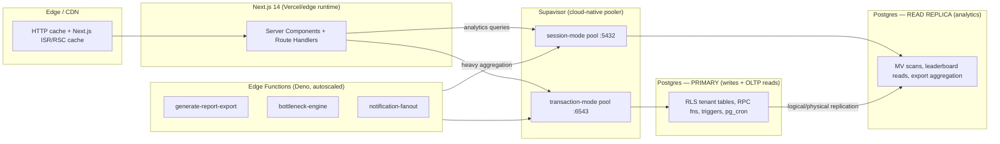
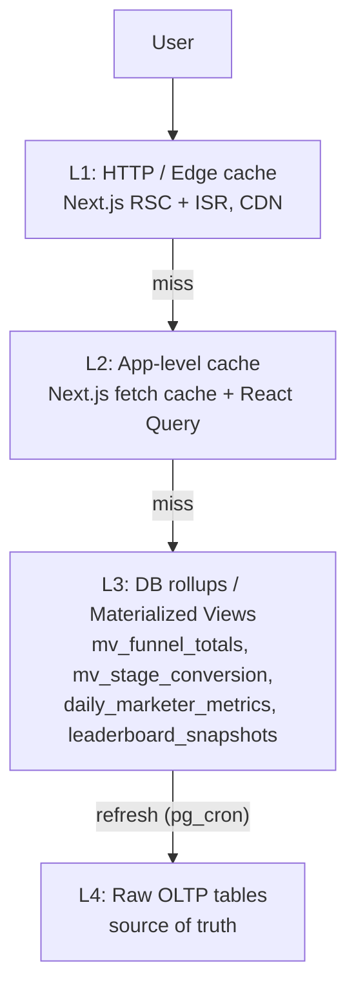
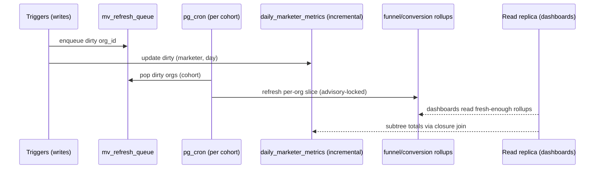

# 12 — Scalability Strategy

> **Status:** Architecture-validation phase. No application code. This document defines how the
> platform scales from a single pilot tenant to **thousands of organizations and tens of
> thousands of concurrent users** without re-architecting: connection pooling, read replicas for
> analytics, time/org partitioning of high-volume append tables, the caching hierarchy,
> Edge Function horizontal scaling, the bounded cost of binary-tree subtree queries, the
> materialized-view refresh strategy under load, rate limiting, and a concrete capacity/growth
> plan with explicit scaling tiers.
>
> **Consistency contract:** every table/column/enum/index identifier used here is defined verbatim
> in [`01-database-schema.md`](./01-database-schema.md). Runtime topology and layer placement come
> from [`07-backend-architecture.md`](./07-backend-architecture.md). Rate-limit numbers extend the
> table in [`09-api-architecture.md §11`](./09-api-architecture.md). `pg_cron` jobs are those in
> schema doc §9. Nothing here changes a locked decision; it only describes how the locked design
> behaves and is operated at scale.
>
> **Locked stack:** Supabase — Postgres 15, Supabase Auth (`auth.users`), Row-Level Security,
> Edge Functions (Deno), Realtime, `pg_cron`. Frontend: Next.js 14 App Router + TypeScript +
> Tailwind + shadcn/ui + Recharts.

---

## 1. Scaling philosophy and the dimensions that actually grow

The platform is **single-database multi-tenant**: one logical Postgres cluster holds all orgs,
isolated by `org_id` + RLS. This is the correct default — it keeps the closure-table visibility
primitive (`marketer_tree_closure`), the `pg_cron` rollups, and cross-org platform analytics in
one place, and it is far cheaper to operate than database-per-tenant at the tenant counts we
target. Scaling is therefore about keeping **one cluster** healthy under growing load, with a
clearly defined escape hatch (tenant sharding) only at the extreme tier.

The load on this system does **not** grow uniformly. Five distinct dimensions grow at different
rates and stress different subsystems:

| Dimension | What it drives | Bounded by | Primary mitigation |
|---|---|---|---|
| **Orgs (tenants)** | Row counts on every tenant table; number of `pg_cron`-driven report/leaderboard combinations; number of distinct genealogy trees | Storage, cron wall-clock, MV refresh time | Partitioning, MV concurrency, per-org cron batching |
| **Marketers per org** | Depth/width of the binary tree; size of `marketer_tree_closure` (≈ Σ depth); `daily_marketer_metrics` cardinality | Closure-table growth, subtree-query fan-out | Closure table + ltree (O(index), §6) |
| **Concurrent users** | Postgres connections, PostgREST/Edge concurrency, Realtime channels | Connection slots, CPU | **Supavisor pooling** (§2), Edge horizontal scale (§5) |
| **Append-event volume** | Rows/day into `audit_log`, `calls`, `prospect_journey_events`, `notifications` | Table bloat, index size, vacuum cost | **Time + org partitioning** (§4) |
| **Analytics read load** | Heavy aggregate scans over rollups & journey events for dashboards/exports/leaderboards | Shared CPU contention with OLTP | **Read replica** routing (§3) + caching (§7) |

The two write-heavy, fast-growing dimensions (append-event volume, analytics read load) are the
ones that would degrade a naive single-table design first; they get the most attention here.
Genealogy, despite being the most algorithmically interesting, is *already* bounded by the
schema's closure table + ltree and contributes the least incremental risk (§6).



---

## 2. Connection pooling (Supavisor / PgBouncer)

### 2.1 Why pooling is non-negotiable here

Postgres 15 allocates a backend process per connection; a managed instance tops out at roughly
`max_connections` in the low hundreds (compute-tier dependent). With **tens of thousands of
users** behind serverless Next.js route handlers and autoscaled Edge Functions — each of which can
open a connection per invocation — direct connections would exhaust `max_connections` almost
immediately. Every data path therefore goes through **Supavisor**, Supabase's cloud-native
connection pooler (the successor to the bundled PgBouncer), which multiplexes thousands of client
connections onto a small pool of real Postgres backends.

### 2.2 Pool modes and which path uses which

| Mode | Port | Multiplexing | Used by | Constraints |
|---|---|---|---|---|
| **Transaction** | `6543` | Connection returned to pool at **end of each transaction** — highest density | PostgREST CRUD/RPC, Next.js route handlers, Edge Function RPC calls, the vast majority of traffic | No session-scoped state across statements: **no** `SET` outside a txn, no server-side prepared-statement reuse across txns, no advisory **session** locks (use **transaction** advisory locks). |
| **Session** | `5432` (pooled) | Connection held for the **whole client session** | `pg_cron` internal jobs, migrations, long analytics queries on the replica, anything needing `SET LOCAL`+session features, `LISTEN/NOTIFY` | Lower density; reserve a small dedicated sub-pool. |

**Design implications already satisfied by our backend doc:** all transactional domain logic is
expressed as single `SECURITY DEFINER`/`INVOKER` RPC functions (`place_marketer`, `change_rank`,
`change_prospect_stage`, `accept_invitation`, `change_prospect_stage`) — each is **one
transaction**, so it is fully transaction-mode-pooler-safe. The RLS claims (`org_id`,
`marketer_id`, `role`) arrive in the **JWT** and are read via `auth.jwt()` inside policies, so we
never rely on `SET app.current_org = …` session GUCs that would break under transaction pooling.
This is a load-bearing reason the JWT-claim approach (schema §10 Q1) is recommended over
per-session GUCs.

### 2.3 Pool sizing model

Let `B` = real Postgres backends available for the app pool (after reserving slots for `pg_cron`
session pool, replication, and admin). A practical default split on a mid tier:

```
max_connections                 = 200
  ├─ supavisor transaction pool = 120   (PostgREST + Edge + Next.js)
  ├─ supavisor session pool     =  30   (pg_cron, migrations, long analytics on primary)
  ├─ replica analytics pool     = (on the replica, separate max_connections)
  ├─ realtime                   =  20
  └─ reserved (superuser, repl) =  30
```

Because transaction pooling returns a backend after each short OLTP transaction, **120 backends
comfortably serve thousands of concurrent users** as long as per-query latency stays low (the
whole point of the indexes and rollups in the schema). The governing inequality is:

```
required_backends ≈ peak_qps × avg_txn_seconds
```

So 1,200 req/s at an 8 ms average transaction needs ≈ 10 busy backends; headroom to 120 is large.
The failure mode is *slow* transactions (long aggregate scans) holding backends — which is exactly
why heavy analytics are pushed to the **read replica** (§3) and behind **caches** (§7), keeping the
primary's transaction pool fast and shallow.

### 2.4 Pooler guardrails

- **Statement timeout** per role: `member`/`authenticated` role gets `SET statement_timeout = '15s'`
  (transaction-scoped, applied by PostgREST role config), so a pathological query cannot pin a
  pooled backend indefinitely. Export/analytics roles on the replica get a longer `'120s'`.
- **`idle_in_transaction_session_timeout = '10s'`** prevents a leaked client transaction from
  holding a pooled backend.
- **Prepared statements:** with transaction pooling, `supabase-js`/PostgREST must use the protocol
  in a pooler-compatible way (named prepared statements are scoped per-transaction). No app code
  caches a prepared statement handle across requests.

---

## 3. Read replicas for analytics

### 3.1 The read/write split

OLTP (placement, stage transitions, contact edits, call logging) and **analytics** (dashboard
aggregates, leaderboards, exports, branch summaries) have opposite profiles: OLTP is many tiny
fast transactions; analytics is fewer, heavier, longer scans over rollups and
`prospect_journey_events`. Running both on the primary means a single large CEO-dashboard query or
an export aggregation can saturate CPU and starve OLTP latency.

The fix is a **physical read replica** (Supabase Read Replica, streaming replication). All
**read-only analytics traffic** is routed to the replica; all **writes and write-coupled reads**
stay on the primary.

| Workload | Target | Why |
|---|---|---|
| `place_marketer`, `change_rank`, `change_prospect_stage`, `accept_invitation`, contact/call/prospect CRUD writes | **Primary** | Writes; must hit the authoritative node and the trigger-maintained invariants |
| Tree expand/collapse, profile reads, follow-up queue, "my contacts" | **Primary** | Read-your-writes consistency matters; small and indexed |
| `mv_funnel_totals`, `mv_stage_conversion` reads; CEO dashboard rollups; `leaderboard_snapshots` reads; `monthly_reports` reads | **Replica** | Heavy aggregate scans; tolerate seconds of replication lag |
| `generate-report-export` aggregation, `branch-analytics` assembly | **Replica** | Long-running, read-only, must not contend with OLTP |
| Cross-org platform/admin BI | **Replica** | Largest scans of all |

### 3.2 Routing mechanism

- **Two Supabase data-API endpoints / connection strings**: the default (primary) and the replica's
  pooled endpoint. The Next.js data layer exposes two server-side clients,
  `supabaseRW` (primary) and `supabaseRO` (replica). Server Components and Route Handlers that
  serve dashboards/analytics use `supabaseRO`; anything that mutates or needs read-your-writes uses
  `supabaseRW`.
- **RLS is identical on the replica** (it is a byte-for-byte copy), so `org_id`/closure isolation is
  preserved on analytics reads with zero extra work.
- **Lag tolerance:** rollups are already eventually-consistent by design (MVs refresh every 15 min,
  `daily_marketer_metrics` on a rolling window). A few seconds of replica lag is invisible against a
  15-minute refresh cadence. The UI labels rollup-backed panels with a "dati aggiornati alle HH:MM"
  freshness stamp (sourced from `generated_at`/MV refresh time) so users understand the boundary.
- **Read-your-writes exception:** immediately after a mutation whose result the same user will read
  (e.g. logging a call then viewing today's count), the route handler reads back from the
  **primary**, not the replica, to avoid showing stale data. This is a per-endpoint decision, not a
  global one.

### 3.3 Scaling replicas out

At higher tiers we add **N replicas** behind the replica pool and load-balance read traffic. Heavy
export jobs can be pinned to a dedicated "analytics replica" so interactive dashboard reads on the
other replica(s) are never blocked by a 200k-row CSV aggregation.

---

## 4. Table partitioning for high-volume append tables

### 4.1 Which tables, and why

Four tables are **append-dominated and unbounded in time** — they grow forever and are the first
to bloat indexes, slow `VACUUM`, and degrade range scans:

| Table | Growth driver | Dominant query shape | Partition strategy |
|---|---|---|---|
| `audit_log` | Every sensitive action across all orgs | `(org_id, created_at DESC)` recent-first; admin review windows | **RANGE by `created_at` (monthly)** |
| `calls` | Every logged call | `(org_id, marketer_id, occurred_at)` time-window activity; leaderboard inputs | **RANGE by `occurred_at` (monthly)** |
| `prospect_journey_events` | Every stage transition | `(org_id, to_stage, entered_at)`, `(prospect_id, entered_at)` | **RANGE by `entered_at` (monthly)** |
| `notifications` | Every alert/follow-up/report-ready | `(org_id, recipient_marketer_id, created_at DESC)`; old rows purgeable | **RANGE by `created_at` (monthly)** |

All four share the same property: **the hot data is recent**, and the access pattern always carries
a time predicate (or can). Monthly **range partitioning on the timestamp** gives:

- **Partition pruning**: a query for "last 30 days of calls for my subtree" touches 1–2 partitions,
  not the whole history. Index sizes per-partition stay small, so index scans stay fast.
- **Cheap retention**: dropping a whole month is `DETACH`/`DROP TABLE` (instant, no per-row delete,
  no bloat) instead of a giant `DELETE`. Critical for `notifications` and `audit_log` retention.
- **Bounded autovacuum**: vacuum runs per-partition; old immutable partitions never need vacuuming
  again.

### 4.2 Time-only vs. composite (time + org) partitioning

We choose **RANGE-by-time as the top level**, optionally **sub-partitioned by HASH(org_id)** only at
the extreme tier. Rationale:

- **Every** hot query has a time bound; not every hot query is single-org from the client's view
  (cross-org platform BI exists). Time-first pruning helps the most queries.
- `org_id` is **already the leading column of every index** on these tables (e.g.
  `calls_marketer_time_idx (org_id, marketer_id, occurred_at)`,
  `audit_log (org_id, created_at DESC)`). Within a time partition, the existing composite indexes
  already give per-org locality. So **org isolation does not *need* to be a partition key** to be
  fast — RLS + the leading-`org_id` indexes handle it.
- A few **very large tenants** can skew a pure time partition. The escape hatch: at Tier 4 we
  **sub-partition the time partitions by `HASH(org_id)`** (e.g. 8 hash sub-partitions), so a single
  whale tenant's writes spread across sub-partitions and one tenant cannot dominate a single
  partition's heap/index. This is additive — no query rewrite, RLS unchanged.

### 4.3 Concrete DDL pattern (calls; identical shape for the others)

> The base columns/indexes are exactly those in schema §5.3. Partitioning is a physical-layout
> change: same column names, same `org_id` RLS, same logical table name `calls`. Note the PK must
> include the partition key, so it becomes `(id, occurred_at)`; the `id uuid` remains globally
> unique via `gen_random_uuid()`.

```sql
-- Parent (partitioned) table — same columns as schema §5.3
CREATE TABLE calls (
  id            uuid NOT NULL DEFAULT gen_random_uuid(),
  org_id        uuid NOT NULL REFERENCES organizations(id) ON DELETE CASCADE,
  marketer_id   uuid NOT NULL REFERENCES marketers(id) ON DELETE RESTRICT,
  prospect_id   uuid REFERENCES prospects(id) ON DELETE SET NULL,
  contact_id    uuid REFERENCES contacts(id) ON DELETE SET NULL,
  call_type     call_type    NOT NULL,
  outcome       call_outcome NOT NULL,
  duration_secs int          NOT NULL DEFAULT 0 CHECK (duration_secs >= 0),
  occurred_at   timestamptz  NOT NULL DEFAULT now(),
  notes         text,
  created_by    uuid REFERENCES marketers(id),
  created_at    timestamptz  NOT NULL DEFAULT now(),
  updated_at    timestamptz  NOT NULL DEFAULT now(),
  deleted_at    timestamptz,
  CONSTRAINT calls_has_target CHECK (prospect_id IS NOT NULL OR contact_id IS NOT NULL),
  PRIMARY KEY (id, occurred_at)              -- partition key must be in the PK
) PARTITION BY RANGE (occurred_at);

-- Per-month partition (created ahead of time by pg_cron, see §4.4)
CREATE TABLE calls_2026_06 PARTITION OF calls
  FOR VALUES FROM ('2026-06-01') TO ('2026-07-01');

-- Indexes are declared on the PARENT and propagate to every partition,
-- preserving the exact names/semantics from schema §5.3:
CREATE INDEX calls_marketer_time_idx ON calls (org_id, marketer_id, occurred_at);
CREATE INDEX calls_prospect_idx      ON calls (prospect_id);
CREATE INDEX calls_contact_idx       ON calls (contact_id);
CREATE INDEX calls_outcome_idx       ON calls (org_id, outcome, occurred_at);

-- EXTREME-TIER ONLY: sub-partition a month by HASH(org_id)
-- CREATE TABLE calls_2026_06 PARTITION OF calls
--   FOR VALUES FROM ('2026-06-01') TO ('2026-07-01') PARTITION BY HASH (org_id);
-- CREATE TABLE calls_2026_06_h0 PARTITION OF calls_2026_06 FOR VALUES WITH (MODULUS 8, REMAINDER 0);
-- ... h1..h7
```

The same RANGE-by-month layout is applied to `audit_log` (key `created_at`),
`prospect_journey_events` (key `entered_at`; note its generated `time_in_stage_secs` column and
indexes `pje_prospect_idx`, `pje_stage_window`, `pje_responsible_idx`, `pje_open_stage_idx` all
declare on the parent), and `notifications` (key `created_at`, with its
`(org_id, recipient_marketer_id, read_at, created_at DESC)` index on the parent).

### 4.4 Partition lifecycle automation (extends schema §9 `pg_cron`)

| Job | Cadence | Action |
|---|---|---|
| `manage_partitions` | daily 01:00 | Ensure the **next 3 months** of partitions exist for `calls`, `audit_log`, `prospect_journey_events`, `notifications` (create-if-missing). |
| `prune_notifications` | weekly | `DROP` `notifications` partitions older than **180 days** (notifications are transient). |
| `archive_audit_partitions` | monthly | `DETACH` `audit_log` partitions older than the legal retention window (e.g. 24 months) and move to cold storage before drop, if compliance requires retention beyond the hot window. |

`calls` and `prospect_journey_events` partitions are **retained indefinitely** by default (they are
analytics source-of-truth and feed historical trend reports) but become cheap because old months
are read-rarely, never re-vacuumed, and excluded by pruning from every hot query.

> **Partition-key caveat for `prospect_journey_events`:** the unique-ish access patterns and the
> `pje_open_stage_idx (prospect_id) WHERE exited_at IS NULL` partial index are preserved per
> partition. The `change_prospect_stage()` invariant "only one open event per prospect" is enforced
> by the partial index **within** each partition; since a prospect's open event is always in the
> current month's partition (it was just entered), this remains globally correct in practice. If
> strict cross-partition global uniqueness on the open event is required for sign-off, we keep that
> partial index global by **not** partitioning `prospect_journey_events` and instead rely on its
> already-tight time indexes — see Open Question 1.

---

## 5. Edge Function horizontal scaling

Edge Functions (Deno, Supabase Functions) are **stateless and autoscaled** by the platform: each
invocation is isolated, and the platform spins up more isolates under concurrency. They scale
horizontally by default; our job is to make sure they don't translate that horizontal scale into a
**thundering herd on Postgres**.

| Concern | Risk at scale | Mitigation |
|---|---|---|
| **DB connection amplification** | 500 concurrent Edge invocations each opening a Postgres connection | All Edge functions connect **through Supavisor transaction pool** (`:6543`), never directly. The pooler absorbs the fan-out; Edge concurrency is decoupled from backend count. |
| **Heavy report assembly** (`generate-report-export`) | A burst of exports saturates CPU and the export render path | **Per-org render queue** + rate limit (`09-api §11`: 20/user/h, per-org concurrency cap). Exports run on the **replica** for aggregation. Long renders return `202` + a `notifications` row (`type='monthly_report_ready'` pattern) when done, rather than holding a request. |
| **`bottleneck-engine`** | Concurrent triggers re-run rules over the same org | Guarded by a **transaction-level advisory lock** keyed on `org_id` (`pg_advisory_xact_lock(hashtext(org_id::text))`) so only one run per org proceeds; others `409 *_busy` (matches `09-api §11`). |
| **`notification-fanout`** | One rank change for a high-up node could notify thousands of downlines | Fan-out is **batched** (single multi-row `INSERT … SELECT` into `notifications` using the closure set), not one HTTP call per recipient. Realtime delivers from the DB change; the function does not loop over recipients with per-row round-trips. |
| **Cold starts** | Latency spikes for rarely-used functions | Hot paths (`activate-account`) kept warm; cold-tolerant paths (exports) are async anyway. |

Because the functions are stateless, scaling them is purely "allow more concurrency" — there is **no
shared in-process state** to coordinate. The only shared resource is Postgres, and the pooler +
per-org concurrency guards are what bound the pressure they put on it.

---

## 6. The cost of binary-tree subtree queries — and why it stays bounded

### 6.1 The naive cost

The core visibility and analytics question is *"everything in marketer N's subtree"* (their own
profile + all direct and indirect downlines — the locked visibility rule). In a pure
`parent_id` adjacency model, answering this requires a **recursive CTE** that walks the tree level
by level:

```
cost(recursive walk) = O(subtree_size)  with a recursive join per level
```

For a Vice President near the root of a 20,000-node org, `subtree_size` can be most of the org, and
this runs **on every page load** that shows team/branch analytics, and **inside every RLS check**.
At tens of thousands of users this is the single biggest scalability trap in a genealogy product.

### 6.2 How the schema removes the walk

The canonical schema eliminates the recursion with **two pre-materialized structures**, both already
defined in §2.1–§2.2:

**(a) Closure table `marketer_tree_closure`** — one row per `(ancestor_id, descendant_id, depth)`
pair, with `branch_leg` recording LEFT/RIGHT side. The subtree of N is then a **single indexed
lookup**, not a walk:

```sql
-- All of N's subtree (incl. self at depth 0): one index range scan on the PK / ancestor index
SELECT descendant_id
FROM   marketer_tree_closure
WHERE  ancestor_id = :N;                         -- uses PK (ancestor_id, descendant_id)

-- "Is X visible to caller N?" — the RLS visibility primitive (schema §8): O(1) index probe
SELECT EXISTS (
  SELECT 1 FROM marketer_tree_closure
  WHERE ancestor_id = :N AND descendant_id = :X  -- PK probe
);

-- N's LEFT branch only (Left-vs-Right analytics): single indexed predicate, no path compare
SELECT descendant_id
FROM   marketer_tree_closure
WHERE  ancestor_id = :N AND branch_leg = 'LEFT'; -- uses closure_branch_idx (ancestor_id, branch_leg)
```

**(b) ltree `path` on `marketers`** — the materialized root-to-node label path, GiST-indexed
(`marketers_path_gist`). It answers subtree/ancestor questions directly on `marketers` without a
join, which is ideal for tree-rendering and for combining with other `marketers` predicates:

```sql
-- Subtree of N straight off marketers, GiST-pruned:
SELECT * FROM marketers
WHERE  path <@ (SELECT path FROM marketers WHERE id = :N)   -- marketers_path_gist
  AND  deleted_at IS NULL;
```

### 6.3 Bounded-cost analysis

| Operation | Without closure/ltree | With schema's design | Index used |
|---|---|---|---|
| RLS "can N see X?" (runs constantly) | Recursive walk | **1 PK probe**, `O(log n)` | `marketer_tree_closure_pkey` |
| Full subtree id list | `O(subtree_size)` walk + recursive joins | `O(subtree_size)` **as a single index range scan** (no per-level join) | `(ancestor_id, descendant_id)` |
| Subtree analytics (team totals) | walk + aggregate | closure ⋈ `daily_marketer_metrics` on `descendant_id`, **index nested-loop / hash**, no recursion | `dmm` PK `(marketer_id, metric_date)` |
| Left vs Right branch split | walk + path filter per node | **1 predicate** `branch_leg = 'LEFT'/'RIGHT'` | `closure_branch_idx` |
| Subtree render off `marketers` | recursive CTE | `path <@ N.path` GiST range | `marketers_path_gist` |

The key property: **the recursion is paid once, at write time** (closure rows + ltree `path` are
maintained by the INSERT/MOVE triggers in schema §2.2), and **read amortized to index lookups**.
Read cost becomes proportional to *the size of the answer you actually need*, retrieved by an index
range scan, rather than to the cost of *discovering* the subtree by walking. Team/branch analytics
never run a recursive CTE in the hot path.

### 6.4 The one expensive operation: placement MOVE

The trade-off is that a **placement move** (`marketers.parent_id` change) is
`O(ancestors_of_new_parent × descendants_of_moved_node)` for the closure delete+reinsert, plus an
ltree subtree `path` rewrite (schema §2.2 op 2). This is acceptable **only because moves are rare,
admin-only corrections** (schema §10 Q2). Scalability rules for moves:

- Moves are **not** an end-user action; they go through an admin RPC and are **rate-limited** and
  **advisory-locked per org**.
- For a bulk re-org (rare), moves are processed by an **async maintenance worker** (Edge Function
  reading a job queue), not inline in a request, so a large subtree rewrite never blocks an
  interactive transaction or a pooled backend for long.
- An audit row (`audit_log action='marketer.move'`) records every move for traceability.

### 6.5 Closure-table size growth

`marketer_tree_closure` size ≈ **Σ depth over all nodes** ≈ `n × average_depth`. For a reasonably
balanced binary tree of `n` nodes, average depth is `O(log n)`, so closure size is `O(n log n)`.
Worked numbers per org:

| Org size (marketers) | Approx avg depth | Closure rows (≈ n·avg_depth) | Footprint (≈ 80 B/row) |
|---|---|---|---|
| 1,000 | ~10 | ~10,000 | < 1 MB |
| 10,000 | ~14 | ~140,000 | ~11 MB |
| 50,000 | ~16 | ~800,000 | ~64 MB |

Even a 50k-marketer org's closure table is tens of MB — trivially cacheable in shared buffers, and
the per-org rows are isolated by the leading `ancestor_id`/`org_id` in every index. A pathologically
**unbalanced** tree (one long chain) would push average depth toward `O(n)` and closure toward
`O(n²)`; binary placement with spillover keeps trees wide rather than deep, so this is a monitored
edge case, not the expected shape (see Open Question 2).

---

## 7. Caching layers

Caching is layered so that the **cheapest layer that can serve a request, does** — and pressure on
Postgres falls off sharply tier by tier.



| Layer | Mechanism | What it caches | Invalidation / freshness |
|---|---|---|---|
| **L1 — HTTP / Edge** | Next.js App Router RSC caching + ISR; CDN at the edge | Mostly-static org-scoped content: published `internal_documents`, leaderboard pages (per period), CEO dashboard shells | Time-based revalidate (e.g. `revalidate: 300`) for analytics pages; **tag-based revalidation** (`revalidateTag`) on writes for documents. Per-user/per-subtree pages are **not** edge-cached (RLS-sensitive); they use L2. |
| **L2 — App-level** | Next.js `fetch` cache + React Query on the client; short server-side memo of expensive reads | Per-request rollup reads, tree expansions already fetched in session, the caller's `marketer_id`→subtree id set | Short TTL (15–60 s) + explicit invalidation on mutation; React Query `staleTime` for tree/contacts. |
| **L3 — DB rollups & MVs** | `mv_funnel_totals`, `mv_stage_conversion`, `daily_marketer_metrics`, `leaderboard_snapshots`, `monthly_reports` | Pre-aggregated analytics so dashboards never scan raw `prospects`/`prospect_journey_events`/`calls` live | `pg_cron` refresh (schema §9): MVs every 15 min `CONCURRENTLY`; metrics rolling-48h; leaderboards nightly+on-demand. Read from the **replica**. |
| **L4 — Raw tables** | Postgres heap + indexes | Source of truth; only hit for OLTP and MV refresh | n/a |

**Why L3 (materialized rollups) is the workhorse.** The locked design already pushes every heavy
analytic onto pre-aggregated structures keyed for the exact access pattern: `mv_funnel_totals`
(unique index `(org_id, marketer_id, current_stage, outcome)`), `mv_stage_conversion`
(`(org_id, marketer_id, period_month, to_stage)`), and `daily_marketer_metrics` joined to
`marketer_tree_closure` for any subtree/branch roll-up. A CEO dashboard or a Left-vs-Right branch
panel reads **rollups**, never live-scans the funnel — so analytics read cost is decoupled from raw
event volume. This is the most important caching decision in the platform and it is baked into the
schema, not bolted on.

**Edge-cache + RLS safety.** Anything edge-cached is either org-public (published documents,
period-frozen leaderboard pages) or explicitly keyed so a cached response can never leak across
`org_id`/subtree boundaries. Per-user, subtree-filtered data is served from L2 with the user's JWT,
never from a shared edge cache.

---

## 8. Materialized-view refresh strategy under load

### 8.1 The baseline (from schema §9)

`refresh_funnel_mvs` runs **every 15 min** doing
`REFRESH MATERIALIZED VIEW CONCURRENTLY mv_funnel_totals, mv_stage_conversion`. `CONCURRENTLY` is
mandatory: it lets dashboards keep reading the MV during refresh (no exclusive lock) — but it
requires the **unique indexes** that the schema already defines (`mv_funnel_totals_uq`,
`mv_stage_conversion_uq`) and it does a **full recompute**, whose cost grows with org count and
event volume.

### 8.2 The problem at scale

A global `REFRESH … CONCURRENTLY` rescans **all orgs'** `prospects` / `prospect_journey_events`
every 15 minutes. At thousands of orgs this becomes a heavy, ever-growing periodic scan that can:
(a) overrun its 15-minute window, (b) compete with OLTP for CPU/IO on the primary, and (c) refresh
data for orgs that had **zero activity** in the interval (wasted work).

### 8.3 Scaled refresh strategy

**Run MV refresh on the read-replica-feeding primary, but make it incremental and demand-driven:**

1. **Dirty-org tracking.** A lightweight `mv_refresh_queue (org_id, mv_name, requested_at)` table is
   populated by the same triggers that already maintain `daily_marketer_metrics` dirty sets, plus by
   `change_prospect_stage()`. Only orgs with activity since the last refresh enqueue.

2. **Prefer the `daily_marketer_metrics` rollup over MV full-recompute.** `daily_marketer_metrics`
   is **incrementally maintained** (trigger-driven dirty days + hourly `rebuild_daily_metrics`
   backstop, schema §9) — it is effectively an *incrementally refreshed* aggregate already. Most
   "totals per stage / per marketer / per subtree" needs are served by joining this rollup to
   `marketer_tree_closure`, which **does not require a global MV refresh at all**. The two MVs become
   a convenience layer for the specific shapes they serve, not the only analytics path.

3. **Partition-the-refresh by org cohort.** Instead of one global `REFRESH`, a `pg_cron` job iterates
   the dirty-org queue and refreshes **per-org slices**. Because `mv_funnel_totals` is grouped by
   `org_id`, we materialize per-org partial aggregates via a function
   `refresh_funnel_totals_for_org(org_id)` that recomputes only that org's rows (delete-by-org +
   insert-by-org inside a transaction on a *table-backed* rollup), avoiding a full-MV rescan. The MV
   form is kept for small/simple deployments; the table-backed per-org form is the at-scale form.

4. **Staggered cadence by tenant tier.** Active/large orgs refresh every 15 min; dormant orgs every
   60 min or on-demand when a user opens a dashboard (lazy refresh with a freshness check). Cadence
   lives in `organizations.settings` (e.g. `{"analytics_refresh_minutes": 15}`).

5. **Concurrency guard.** `refresh_funnel_mvs` (and the per-org variant) takes a
   `pg_advisory_xact_lock` so overlapping cron ticks can never run two refreshes of the same target
   at once; a long refresh simply skips the next tick rather than stacking.

6. **Leaderboards & reports stay snapshot-based.** `leaderboard_snapshots` and `monthly_reports` are
   **precomputed tables**, not live MVs — they are recomputed nightly / on the 1st (schema §9) and
   are inherently incremental per period, so they scale by *adding rows*, not by rescanning history.
   Reading them is a point lookup on `leaderboard_lookup_idx` / `monthly_reports_marketer_idx`.



---

## 9. Rate limiting

Rate limiting is a **capacity-protection** mechanism, not only an abuse mechanism: it keeps any one
identity or tenant from monopolizing the pooler, the replica, or the export/render path. The base
numbers are the table in [`09-api-architecture.md §11`](./09-api-architecture.md); this section adds
the **scaling rationale and the per-org dimension**.

### 9.1 Limit tiers and where each is enforced

| Surface | Limit (per JWT subject) | Window | Enforcement point | Scaling purpose |
|---|---|---|---|---|
| `POST /auth/v1/token` (login) | 10 / IP+email | 5 min | GoTrue + edge | Brute-force + auth-CPU protection |
| REST CRUD (`/rest/v1/*`) | 600 / user | 1 min | edge gateway | Caps per-user pooler pressure |
| Search RPC (`search_contacts`/`search_marketers`) | 60 / user | 1 min | edge | `pg_trgm` GIN scans are costlier — tighter cap |
| `generate-report-export` | 20 / user / h **+ per-org concurrency cap** | 1 h | edge + per-org render queue | Bounds the heavy replica/export path |
| `recompute_branch_analytics`, `run_bottleneck_engine` | 6 / user / h + **advisory lock** | 1 h | DB advisory lock + edge | One heavy recompute per org at a time |
| `bulk_update_contacts` | 30 / user | 1 min | edge | Bounds bulk-write transaction size/rate |

### 9.2 Per-org (tenant) caps — the multi-tenant fairness layer

Per-user limits alone don't prevent one large tenant with thousands of users from collectively
overwhelming shared capacity. So we add **per-org aggregate caps** keyed on the JWT `org_id`:

- **Per-org concurrent heavy jobs** (exports + recomputes): a small integer cap (e.g. 5) enforced by
  a counting **advisory lock** / a `org_job_slots` row, so a whale tenant can't occupy the entire
  export queue. On exceed → `429` `code: "org_rate_limited"` + `Retry-After` (matches `09-api §11`).
- **Per-org request budget** at the edge gateway (sum across the org's users) for `/rest/v1/*`, sized
  to the org's plan tier. Prevents noisy-neighbor saturation of the transaction pool.
- **Realtime channel caps per org** so one tenant cannot open unbounded subscriptions (relevant to
  the throttled per-node tree KPI refresh noted in `08-frontend §8.3`).

### 9.3 Response contract

Every limited surface returns the headers already specified in `09-api §11`
(`RateLimit-Limit`/`-Remaining`/`-Reset`, `Retry-After` on 429). Clients back off on `429`; the UI
surfaces a non-blocking "riprova tra N secondi" toast for interactive limits and silently retries
background refreshes.

---

## 10. Capacity & growth plan

### 10.1 Volume model (assumptions for sizing)

Per **active CRM marketer** per working day (conservative mid estimate):

| Event | Rows/marketer/day | Lands in |
|---|---|---|
| Calls logged | 8 | `calls` |
| Stage transitions | 3 | `prospect_journey_events` |
| New prospects | 1 | `prospects` (+ entry event) |
| Notifications received | 4 | `notifications` |
| Audit-worthy actions | 2 | `audit_log` |
| Daily metric upserts | 1 | `daily_marketer_metrics` (one row/day) |

### 10.2 Aggregate growth at target scale

Assume **5,000 orgs**, average **2,000 marketers/org** of which **30% are active CRM users** →
**3,000,000 active marketers**, ~**22 working days/month**.

| Append table | Rows/month (≈ active·rate·22) | Rows/year | Mitigation |
|---|---|---|---|
| `calls` | 3M · 8 · 22 ≈ **528M** | ~6.3B | Monthly partitions; only hot months scanned |
| `prospect_journey_events` | 3M · 3 · 22 ≈ **198M** | ~2.4B | Monthly partitions; rollups served from MVs |
| `notifications` | 3M · 4 · 22 ≈ **264M** | ~3.2B | Monthly partitions; **180-day prune** keeps it bounded |
| `audit_log` | 3M · 2 · 22 ≈ **132M** | ~1.6B | Monthly partitions; archive/detach old months |
| `daily_marketer_metrics` | 3M · 22 ≈ **66M** | ~792M | Naturally bounded (1 row/marketer/active day); base of all rollups |

Per-month partitioning means **interactive queries touch ~one partition** (~tens of millions of
rows, indexed) rather than multi-billion-row tables. `notifications` is held flat by pruning;
`audit_log` by archival detach. `calls`/`prospect_journey_events` grow but stay query-fast because
hot queries are time-bounded and analytics reads go through L3 rollups, not raw scans.

### 10.3 Genealogy growth

`marketer_tree_closure` at 2,000 marketers/org, avg depth ~12 → ~24k rows/org × 5,000 orgs ≈
**120M closure rows** total, but **every query is `org_id`/`ancestor_id`-scoped** to one org's slice
(tens of KB), so global size is a storage concern, not a query-latency concern. ltree `path` GiST
indexes are per-org-local in practice for the same reason.

### 10.4 What breaks first, and the ordered response

| Symptom as load rises | First bottleneck | Response (in order) |
|---|---|---|
| OLTP latency climbs during dashboard peaks | Analytics scans on primary | Route analytics to **read replica** (§3) |
| `max_connections` pressure / pool saturation | Connection count | Confirm everything is on **Supavisor txn pool**; raise pool size; bump compute tier |
| Append tables slow on range scans / vacuum | Unpartitioned hot tables | Enable **monthly partitioning** (§4) |
| 15-min MV refresh overruns its window | Global MV recompute | Switch to **per-org incremental refresh** + dirty queue (§8) |
| Export/recompute bursts spike CPU | Heavy Edge jobs | Per-org **render queue** + concurrency caps (§5, §9.2) |
| One tenant degrades others | Noisy neighbor | **Per-org rate caps** (§9.2); pin whale to dedicated replica |
| Single replica can't serve analytics | Replica CPU | **Add replicas**, load-balance reads |
| Single Postgres cluster nears ceiling | Whole-cluster limits | **Tenant sharding**: route cohorts of orgs to separate clusters by `org_id` (last resort, §10.6) |

### 10.5 Scaling tiers

| Tier | Orgs | Active users | Postgres compute (indicative) | Pooling | Replicas | Partitioning | MV refresh | Notes |
|---|---|---|---|---|---|---|---|---|
| **T0 — Pilot** | 1–10 | < 500 | Small (2 vCPU / 8 GB) | Supavisor txn pool (default) | none | not yet (plain tables) | global MV `CONCURRENTLY` every 15 min | Single primary handles all; simplest ops. |
| **T1 — Early growth** | 10–100 | 0.5k–5k | Medium (4 vCPU / 16 GB) | Supavisor txn + small session pool | **1 read replica** | enable monthly partitioning on `calls`, `prospect_journey_events`, `notifications`, `audit_log` | global MV every 15 min, advisory-locked | Read/write split goes live; partitioning pre-emptive before tables get large. |
| **T2 — Scale** | 100–1,000 | 5k–25k | Large (8–16 vCPU / 32–64 GB) | Tuned txn pool (120+), dedicated session pool | **2 replicas** (1 interactive, 1 export/BI) | partitioning + `prune_notifications` + audit archival | **per-org incremental** refresh + dirty queue; staggered cadence | Per-org rate caps enforced; exports pinned to BI replica. |
| **T3 — Large multi-tenant** | 1,000–5,000 | 25k–100k | XL (32 vCPU / 128 GB+), read-optimized replicas | Multi-pool, per-role timeouts | **3+ replicas** load-balanced | sub-partition whale orgs by `HASH(org_id)` within month | per-org incremental, cohort-staggered; lazy refresh for dormant orgs | Whale isolation; per-org concurrency slots; aggressive caching at L1/L3. |
| **T4 — Extreme / sharded** | 5,000+ | 100k+ | Sharded clusters by org cohort | Pooler per shard | Replicas per shard | per-shard partitioning + hash sub-partitioning | per-shard, per-org incremental | **Tenant sharding** by `org_id` hash → N independent clusters; a thin routing layer maps `org_id`→shard. Cross-org platform BI moves to a separate warehouse/ELT. Last resort only. |

### 10.6 The sharding escape hatch (T4) — why it's last

Single-DB multi-tenant is kept as long as possible because it preserves the closure-table
visibility primitive, `pg_cron` simplicity, and trivial cross-org admin BI. Sharding by `org_id`
hash is a **clean** last step precisely because the design never relies on cross-org joins for
tenant features: every tenant query is already `org_id`-scoped and RLS-isolated, so an org's entire
footprint (its `marketers`, closure, contacts, prospects, events, rollups) lives in **one shard**
with no cross-shard joins. The only thing that must move off-shard is **platform-level cross-org
analytics**, which goes to a separate analytical store fed by ELT. No tenant-facing query changes.

---

## 11. Operational guardrails summary

| Guardrail | Setting / mechanism | Protects |
|---|---|---|
| `statement_timeout` per role | 15 s (OLTP roles) / 120 s (analytics on replica) | Pooled backends from runaway queries |
| `idle_in_transaction_session_timeout` | 10 s | Leaked transactions holding pool slots |
| Transaction-mode pooling everywhere | Supavisor `:6543` | `max_connections` exhaustion |
| Read/write client split | `supabaseRO` (replica) / `supabaseRW` (primary) | OLTP latency under analytics load |
| Monthly partitioning + lifecycle cron | `manage_partitions`, `prune_notifications`, `archive_audit_partitions` | Bloat, vacuum cost, retention |
| Per-org incremental MV refresh | `mv_refresh_queue` + advisory locks | Refresh window overrun, wasted recompute |
| Per-user **and** per-org rate caps | edge gateway + advisory locks | Pooler/replica/export saturation, noisy neighbors |
| Advisory locks on heavy recomputes | `pg_advisory_xact_lock(org_id)` | Duplicate concurrent recompute |
| Closure + ltree (write-time materialization) | schema §2.1–§2.2 triggers | Recursive-walk blowup on subtree reads |
| Freshness stamps on rollup panels | `generated_at` / MV refresh time | User trust under replica lag / cached data |

---

## 12. Open Questions / Decisions Needing Sign-off

1. **`prospect_journey_events` partitioning vs. global open-event uniqueness.** Monthly partitioning
   makes the `pje_open_stage_idx (prospect_id) WHERE exited_at IS NULL` partial uniqueness *per
   partition*, not globally. In practice a prospect's single open event is always in the current
   month, so correctness holds, but if a strict **global** guarantee is required for sign-off we
   either (a) keep this table unpartitioned and lean on its time indexes, or (b) move the
   "only-one-open-stage" invariant to a separate tiny `prospect_open_stage (prospect_id PK)` table
   that is not partitioned. **Recommended: (b) if strict guarantee needed, else partition.**

2. **Tree-balance monitoring.** Closure size is `O(n log n)` for balanced trees but degrades toward
   `O(n²)` for long chains. Confirm we add a monitor on `max(depth)` / average depth per org and an
   alert when a tree becomes pathologically deep (spillover should keep trees wide). No schema
   change; an analytics check over `marketer_tree_closure`.

3. **Replica lag tolerance for specific panels.** We assume all rollup/leaderboard/export panels
   tolerate seconds of replica lag (acceptable against a 15-min refresh). Confirm there is **no**
   panel that must be strictly read-your-writes off the replica; the follow-up queue and "today's
   calls count" are already routed to the primary. Sign off the read-your-writes exception list.

4. **Per-org refresh cadence as the at-scale default.** This document recommends moving from the
   global 15-min `REFRESH MATERIALIZED VIEW CONCURRENTLY` (schema §9) to a **per-org incremental**
   refresh driven by `mv_refresh_queue` at T2+. This introduces a new (small) queue table and a
   table-backed per-org rollup form alongside the MVs. Confirm we adopt the incremental form at T2
   rather than scaling compute to keep global refresh viable longer. **Recommended: incremental.**

5. **Retention windows.** `notifications` 180-day prune, `audit_log` 24-month hot + archive are
   placeholders. Confirm the legal/compliance retention windows per region (GDPR-relevant) before
   the lifecycle cron is finalized.

6. **Sharding trigger threshold.** The T4 sharding hatch is described but should never be needed for
   the stated target (5k orgs / 100k users) on a single tuned cluster + replicas. Confirm the
   concrete metric that would trip a sharding decision (e.g. sustained primary CPU > 70% at T3 after
   replica offload + caching) so it's a measured decision, not a guess.

7. **Whale-tenant identification.** HASH(org_id) sub-partitioning at T3/T4 and dedicated-replica
   pinning assume we can identify "whale" orgs (e.g. > 20k marketers or > top-1% event volume).
   Confirm the threshold and whether whales get a dedicated schema/cluster earlier than the generic
   tier progression.
