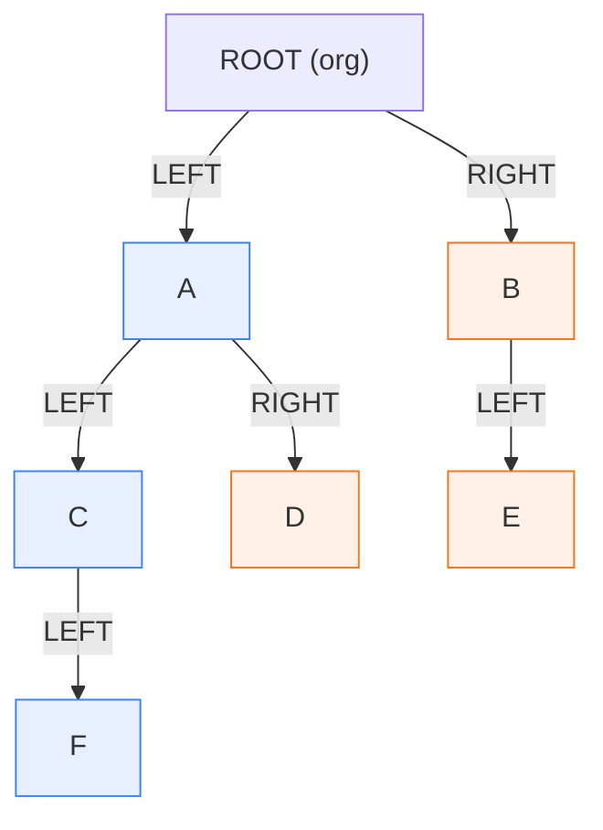
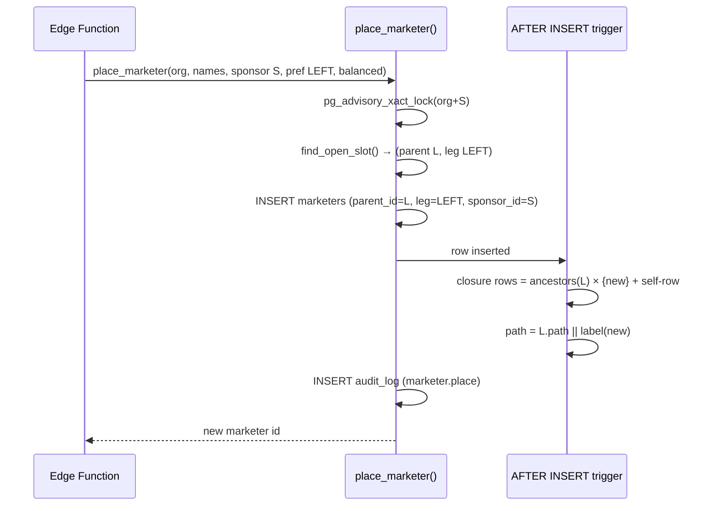
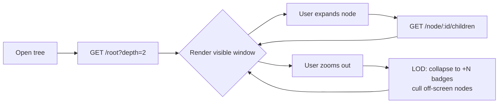

# 14 — Genealogy Tree Architecture (Binary)

> **Status:** Architecture-validation phase. No application code. This document specifies the
> binary genealogy in depth: the placement model, the spillover algorithm, transactional
> maintenance of the closure table + ltree path, branch resolution, navigation queries, and the
> frontend tree data contract (payload, lazy-loading API, zoom/drag/search, virtualization).
>
> **Canonical source:** every table/column/enum named here is defined in
> [`01-database-schema.md`](./01-database-schema.md). This document references those exact
> identifiers and adds the procedural logic (functions, triggers, queries, API contracts) that
> sits on top of the schema. Where this document introduces a new helper function it is named and
> specified, but it adds **no new tables or columns** — the canonical schema is complete.
>
> **Related docs:** RLS/visibility ([`10-security-architecture.md`](./10-security-architecture.md)),
> analytics over the closure table ([`11-analytics-architecture.md`](./11-analytics-architecture.md)),
> API surface ([`09-api-architecture.md`](./09-api-architecture.md)),
> frontend ([`08-frontend-architecture.md`](./08-frontend-architecture.md)).

---

## 0. Scope & Mental Model

The genealogy is a **true binary tree**: each `marketers` node has at most **one `LEFT`** and
**one `RIGHT`** placement child. The model distinguishes two independent relationships:

| Relationship | Column(s) | Meaning |
|---|---|---|
| **Placement** (the tree) | `marketers.parent_id` + `marketers.leg` | *Where the node hangs* in the binary structure. Drives genealogy, branch analytics, visibility. |
| **Sponsorship** (the recruit) | `marketers.sponsor_id` | *Who actually recruited* the node. May differ from `parent_id` due to **spillover**. Drives recruiting credit, `new_recruits`, leaderboards. |

Two derived structures keep subtree/branch queries O(index) instead of recursive:

- **Closure table** `marketer_tree_closure (ancestor_id, descendant_id, depth, branch_leg)` —
  one row per (ancestor, descendant) pair including the self-row at depth 0. `branch_leg` records,
  for any ancestor N and descendant X, whether X hangs off N's `LEFT` or `RIGHT` immediate child.
- **ltree materialized path** `marketers.path` — root-to-node label path; a node's whole subtree
  is `path <@ <node.path>`.

Both are maintained **transactionally** by triggers on `marketers` so they can never drift from
`parent_id`/`leg`. The closure table is the **single visibility primitive** for RLS (doc #10) and
the **single aggregation primitive** for team/branch analytics (doc #11).



> In the diagram, from **ROOT**: the **Left Branch** = subtree rooted at `A` = `{A, C, D, F}`; the
> **Right Branch** = subtree rooted at `B` = `{B, E}`. From **A**: Left Branch = `{C, F}`, Right
> Branch = `{D}`. Branch membership is *relative to the node you are viewing* — exactly what
> `marketer_tree_closure.branch_leg` encodes per (ancestor, descendant) pair.

---

## 1. The Binary Placement Model

### 1.1 Columns (from the canonical `marketers` DDL)

```sql
parent_id   uuid REFERENCES marketers(id) ON DELETE RESTRICT,  -- placement upline; NULL only for org root
leg         placement_leg,                                     -- 'LEFT'|'RIGHT'; NULL only for org root
sponsor_id  uuid REFERENCES marketers(id) ON DELETE SET NULL,  -- recruiter; may differ from parent_id
path        ltree NOT NULL,                                    -- materialized root-to-node label path
```

`placement_leg` is the enum `'LEFT' | 'RIGHT'` (English for code clarity; rendered Italian
*"Ramo Sinistro" / "Ramo Destro"* via `next-intl`).

### 1.2 Invariants enforced at the database layer

These are **already declared** in `01-database-schema.md` §2.1 and §7. Restated here as the
contract the placement/spillover logic must respect:

| # | Invariant | Mechanism (canonical name) |
|---|---|---|
| I1 | At most one `LEFT` **and** one `RIGHT` child per parent | partial unique index `marketers_one_child_per_leg (org_id, parent_id, leg) WHERE parent_id IS NOT NULL AND deleted_at IS NULL` |
| I2 | `leg` present **iff** `parent_id` present | `CHECK marketers_leg_requires_parent` |
| I3 | Exactly one root per org | partial unique index `marketers_single_root_per_org (org_id) WHERE parent_id IS NULL AND deleted_at IS NULL` |
| I4 | No self-placement / self-sponsorship | `CHECK marketers_no_self_parent`, `CHECK marketers_no_self_sponsor` |
| I5 | No cycles | `BEFORE INSERT/UPDATE` trigger: reject if `parent_id` is inside the node's own subtree (closure check) |
| I6 | Closure & `path` consistent with `parent_id`/`leg` | `AFTER INSERT`/`AFTER UPDATE OF parent_id, leg` triggers |
| I7 | Soft delete frees the leg | unique indexes are partial on `deleted_at IS NULL` |
| I8 | `org_id` of child == `org_id` of parent | guard trigger (multi-tenant safety; see §2.4) |

> **Why `ON DELETE RESTRICT` on `parent_id`:** the placement tree must never be silently
> orphaned by a hard delete of an upline. Structural removal is soft delete + an explicit move of
> children (see Open Questions #10 in doc #01 — recommended: block hard delete while active
> children exist).

### 1.3 `sponsor_id` vs placement `parent_id` — the distinction

| | `parent_id` (placement) | `sponsor_id` (sponsorship) |
|---|---|---|
| Question answered | "Under whom does this node sit in the tree?" | "Who recruited this person?" |
| Cardinality | exactly one parent, one of two legs | exactly one sponsor (org root excluded) |
| Changes the tree? | **Yes** — drives closure + `path` + branch analytics | **No** — pure attribution, no structural effect |
| Equal in the simple case | When there is no spillover, `sponsor_id == parent_id` | — |
| Differs when | **Spillover**: the recruiter's chosen leg is full, so the recruit is placed deeper under a *different* upline while credit stays with the recruiter | — |
| Indexed by | `marketers_parent_idx (org_id, parent_id)` | `marketers_sponsor_idx (org_id, sponsor_id)` |
| Feeds | genealogy tree, visibility (closure), Left/Right branch analytics | `new_recruits` in `daily_marketer_metrics`, `team_growth` leaderboard, "direct recruits" count |

**Concrete spillover example.** Sponsor `S` recruits `X` and wants `X` in S's `LEFT` leg, but
`S` already has a `LEFT` child `L`. Spillover walks down the `LEFT` subtree to the first node with
an open `LEFT` slot — say `L` itself is open on the left — and places `X` there:

- `X.parent_id = L`, `X.leg = 'LEFT'` (placement: X hangs under L)
- `X.sponsor_id = S` (attribution: S still gets the recruit credit)

So **"direct recruits of S"** (`COUNT WHERE sponsor_id = S`) includes `X`, while **"placement
children of S"** (`COUNT WHERE parent_id = S`) does **not** — `X` is a placement child of `L`. The
genealogy tree renders `X` under `L`; recruiting analytics credit `S`.

---

## 2. Transactional Maintenance: Closure Table + ltree Path

All structural mutations go through SQL functions that run **inside the same transaction** as the
`marketers` write, with triggers guaranteeing the closure table and `path` can never drift. We use
two `AFTER` triggers (INSERT, and UPDATE-of-structural-columns) plus one `BEFORE` cycle guard.

### 2.1 Label encoding helper (uuid → ltree label)

ltree labels must match `[A-Za-z0-9_]+`. UUIDs contain `-`, which is illegal in a label, so we
encode each node's id by stripping hyphens and prefixing `n` (labels may not start with a digit in
some toolchains; the `n` prefix is defensive and keeps labels valid everywhere).

```sql
CREATE OR REPLACE FUNCTION uuid_label(p_id uuid)
RETURNS text
LANGUAGE sql IMMUTABLE PARALLEL SAFE AS $$
  SELECT 'n' || replace(p_id::text, '-', '');
$$;
-- Example: 'a1b2c3d4-...' -> 'na1b2c3d4...'
-- A node's path is e.g.  nROOTID.nAID.nCID  (root-to-node, dot-separated labels).
```

### 2.2 Cycle guard — `BEFORE INSERT OR UPDATE`

Prevents I4/I5 at write time **before** any closure work happens.

```sql
CREATE OR REPLACE FUNCTION marketers_cycle_guard()
RETURNS trigger
LANGUAGE plpgsql AS $$
BEGIN
  -- I8: child must share the parent's org
  IF NEW.parent_id IS NOT NULL THEN
    PERFORM 1 FROM marketers p
      WHERE p.id = NEW.parent_id AND p.org_id = NEW.org_id;
    IF NOT FOUND THEN
      RAISE EXCEPTION 'parent_id % is not in org %', NEW.parent_id, NEW.org_id
        USING ERRCODE = 'check_violation';
    END IF;
  END IF;

  -- I4: no self placement / self sponsor (defensive; also CHECK-enforced)
  IF NEW.parent_id = NEW.id OR NEW.sponsor_id = NEW.id THEN
    RAISE EXCEPTION 'node % cannot be its own parent/sponsor', NEW.id
      USING ERRCODE = 'check_violation';
  END IF;

  -- I5: on UPDATE of parent_id, reject if the new parent is inside NEW's own subtree
  IF TG_OP = 'UPDATE' AND NEW.parent_id IS DISTINCT FROM OLD.parent_id
     AND NEW.parent_id IS NOT NULL THEN
    IF EXISTS (
      SELECT 1 FROM marketer_tree_closure
      WHERE ancestor_id = NEW.id AND descendant_id = NEW.parent_id
    ) THEN
      RAISE EXCEPTION 'move would create a cycle: % is inside subtree of %',
        NEW.parent_id, NEW.id USING ERRCODE = 'check_violation';
    END IF;
  END IF;

  RETURN NEW;
END;
$$;

CREATE TRIGGER trg_marketers_cycle_guard
  BEFORE INSERT OR UPDATE OF parent_id, leg, sponsor_id, org_id ON marketers
  FOR EACH ROW EXECUTE FUNCTION marketers_cycle_guard();
```

### 2.3 INSERT maintenance — closure cross-product + path

Runs `AFTER INSERT`. Builds the new node's closure rows (every ancestor of the parent gets a row to
the new node, plus the self-row) and sets `path`. Because the new node is a fresh leaf, it has no
descendants yet, so the cross-product reduces to "ancestors-of-parent × {new node}".

```sql
CREATE OR REPLACE FUNCTION marketers_after_insert_tree()
RETURNS trigger
LANGUAGE plpgsql AS $$
DECLARE
  v_parent_path ltree;
BEGIN
  -- 1) Closure: ancestor rows (depth d+1) for every ancestor of the parent.
  --    branch_leg of (A -> NEW):
  --       * if A is the parent itself (its self-row, depth 0) -> NEW.leg
  --       * otherwise inherit (A -> parent).branch_leg
  IF NEW.parent_id IS NOT NULL THEN
    INSERT INTO marketer_tree_closure (org_id, ancestor_id, descendant_id, depth, branch_leg)
    SELECT NEW.org_id, c.ancestor_id, NEW.id, c.depth + 1,
           CASE WHEN c.depth = 0 THEN NEW.leg ELSE c.branch_leg END
    FROM   marketer_tree_closure c
    WHERE  c.descendant_id = NEW.parent_id;
  END IF;

  -- 2) Self-row (depth 0, branch_leg NULL)
  INSERT INTO marketer_tree_closure (org_id, ancestor_id, descendant_id, depth, branch_leg)
  VALUES (NEW.org_id, NEW.id, NEW.id, 0, NULL);

  -- 3) ltree path = parent.path || own label  (root: just own label)
  IF NEW.parent_id IS NULL THEN
    NEW.path := text2ltree(uuid_label(NEW.id));
  ELSE
    SELECT path INTO v_parent_path FROM marketers WHERE id = NEW.parent_id;
    NEW.path := v_parent_path || text2ltree(uuid_label(NEW.id));
  END IF;

  -- path is set on NEW; since this is AFTER INSERT we persist it explicitly
  UPDATE marketers SET path = NEW.path WHERE id = NEW.id;

  RETURN NULL;
END;
$$;

CREATE TRIGGER trg_marketers_after_insert_tree
  AFTER INSERT ON marketers
  FOR EACH ROW EXECUTE FUNCTION marketers_after_insert_tree();
```

> **Path-on-insert note.** `path` is declared `NOT NULL`. The placement function
> `place_marketer()` (§3) inserts the row with a **provisional** `path` (the parent's path or a
> sentinel) so the `NOT NULL` is satisfied, then this `AFTER INSERT` trigger rewrites it to the
> correct value. Equivalent alternative: make the trigger `BEFORE INSERT` for path and `AFTER
> INSERT` for closure. We keep them split for clarity; `place_marketer()` always supplies a valid
> provisional path so no constraint is ever violated mid-transaction.

### 2.4 MOVE maintenance (admin-only re-placement)

Re-placement changes `parent_id` and/or `leg`. It is **rare and admin-gated** (see doc #01 Open
Question #2). The cost is `O(ancestors(P') × |subtree(C)|)` for the closure rewrite plus an ltree
prefix rewrite over the whole moved subtree.

```sql
CREATE OR REPLACE FUNCTION marketers_after_move_tree()
RETURNS trigger
LANGUAGE plpgsql AS $$
DECLARE
  v_new_parent_path ltree;
  v_old_self_path   ltree;
BEGIN
  IF NEW.parent_id IS NOT DISTINCT FROM OLD.parent_id
     AND NEW.leg IS NOT DISTINCT FROM OLD.leg THEN
    RETURN NULL;  -- nothing structural changed
  END IF;

  -- A) Tear down closure links from PROPER ancestors of C to all nodes in C's subtree.
  --    (Internal subtree rows and self-rows are preserved.)
  DELETE FROM marketer_tree_closure
  WHERE descendant_id IN (
          SELECT descendant_id FROM marketer_tree_closure WHERE ancestor_id = NEW.id
        )
    AND ancestor_id IN (
          SELECT ancestor_id FROM marketer_tree_closure
          WHERE descendant_id = NEW.id AND ancestor_id <> NEW.id
        );

  -- B) Rebuild: ancestors(P') × subtree(C), depth & branch_leg recomputed.
  IF NEW.parent_id IS NOT NULL THEN
    INSERT INTO marketer_tree_closure (org_id, ancestor_id, descendant_id, depth, branch_leg)
    SELECT NEW.org_id,
           up.ancestor_id,
           down.descendant_id,
           up.depth + 1 + down.depth,
           CASE WHEN up.depth = 0
                THEN COALESCE(down.branch_leg, NEW.leg)  -- side relative to C's NEW.leg
                ELSE up.branch_leg
           END
    FROM   marketer_tree_closure up    -- every ancestor of the NEW parent (incl. itself, depth 0)
    JOIN   marketer_tree_closure down  -- every node in C's subtree (incl. C itself, depth 0)
           ON down.ancestor_id = NEW.id
    WHERE  up.descendant_id = NEW.parent_id;
  END IF;

  -- C) ltree prefix rewrite for C and every descendant.
  SELECT path INTO v_old_self_path FROM marketers WHERE id = NEW.id;  -- pre-move path snapshot
  IF NEW.parent_id IS NULL THEN
    v_new_parent_path := NULL;
  ELSE
    SELECT path INTO v_new_parent_path FROM marketers WHERE id = NEW.parent_id;
  END IF;

  UPDATE marketers m
  SET path = CASE
               WHEN v_new_parent_path IS NULL
                 THEN text2ltree(uuid_label(NEW.id)) ||
                      subpath(m.path, nlevel(v_old_self_path))      -- new root
               ELSE v_new_parent_path ||
                      subpath(m.path, nlevel(v_old_self_path) - 1)  -- splice new prefix
             END
  WHERE m.path <@ v_old_self_path;  -- C and all descendants (old subtree)

  RETURN NULL;
END;
$$;

CREATE TRIGGER trg_marketers_after_move_tree
  AFTER UPDATE OF parent_id, leg ON marketers
  FOR EACH ROW EXECUTE FUNCTION marketers_after_move_tree();
```

**Move pre-conditions** (validated in `move_marketer()` and by triggers I1/I5):

1. Target slot `(org_id, P', L')` is **free** (the partial unique index I1 enforces this; the
   function checks first to return a friendly error).
2. `P'` is **not** inside `C`'s own subtree (cycle guard I5).
3. The move is wrapped in `audit_log` (`action = 'marketer.move'`, `before`/`after` snapshots).

### 2.5 SOFT DELETE

Soft delete (`UPDATE marketers SET deleted_at = now()`) does **not** touch `parent_id`/`leg`, so the
structural triggers do not fire. Closure rows are **retained** (historical analytics still resolve),
but because the unique indexes I1/I3 are partial on `deleted_at IS NULL`, the deleted node's leg is
immediately free for re-placement. If a node still has active (`deleted_at IS NULL`) children, the
recommended policy (doc #01 OQ #10) is to **block** the soft delete or require an explicit move of
children first.

### 2.6 Why both closure **and** ltree?

| Use case | Best structure | Why |
|---|---|---|
| RLS "can caller see X?" | **closure** | single PK lookup `(ancestor_id, descendant_id)`; index-friendly inside policy |
| "Is X in N's Left vs Right branch?" | **closure** (`branch_leg`) | O(1) indexed predicate; no string comparison |
| Team/branch **aggregation** (counts, sums) | **closure** | clean `JOIN` on `ancestor_id = N`, filter `branch_leg`; composes with `daily_marketer_metrics` |
| Whole-subtree **fetch / ordering / depth** | **ltree** | `path <@ N.path` with GiST index; `nlevel(path)` gives depth; lexical path = pre-order sort for tree rendering |
| "Ancestors of X" (breadcrumb upline) | **ltree** | `path @> X.path` returns the root-to-X chain in one scan |
| Subtree **rewrite on move** | **ltree** | prefix splice over `path <@ old_path` |

They are redundant *by design*: each is optimal for a different access pattern, both maintained in
the same transaction so they cannot disagree.

---

## 3. Spillover Placement Algorithm

### 3.1 Placement modes

When a sponsor `S` recruits a new marketer, the operator (or an automated engine — see doc #01 OQ
#4) chooses a **preferred leg** (`LEFT` or `RIGHT`). The new node lands in the **first open slot**
found by walking down that leg according to a strategy:

| Mode | Slot search | Use |
|---|---|---|
| `direct` | only S's own preferred-leg slot; error if occupied | strict manual placement |
| `spillover_outer` | walk the **extreme outer edge** of the preferred leg (always take the same-side child) until an open same-side slot is found | classic "leg stacking" |
| `spillover_balanced` | BFS the preferred-leg subtree, place in the **shallowest** open slot (fills level by level) | keep the leg bushy/balanced |
| `weak_leg_auto` | choose the preferred leg automatically as the side with the **smaller team_size** under S, then `spillover_balanced` | auto-balance both legs of S |

The canonical default for v1 is **operator-driven** (`direct` with explicit fallback to
`spillover_balanced`); the schema stores only the *result* (`parent_id`, `leg`, `sponsor_id`). The
function below implements the search server-side so the result is deterministic and race-free.

### 3.2 Find-open-slot function

Finds the deepest-available placement under a sponsor's preferred leg. Returns the `(parent_id,
leg)` pair for the new node. Uses the closure table for the subtree scan and the partial unique
index semantics for "is this slot open?".

```sql
CREATE OR REPLACE FUNCTION find_open_slot(
  p_org_id      uuid,
  p_sponsor_id  uuid,
  p_pref_leg    placement_leg,
  p_mode        text DEFAULT 'spillover_balanced'  -- 'direct'|'spillover_outer'|'spillover_balanced'|'weak_leg_auto'
) RETURNS TABLE (parent_id uuid, leg placement_leg)
LANGUAGE plpgsql STABLE AS $$
DECLARE
  v_pref_leg   placement_leg := p_pref_leg;
  v_cursor     uuid := p_sponsor_id;
  v_left_size  int;
  v_right_size int;
  v_child      uuid;
BEGIN
  -- weak_leg_auto: pick the lighter side of the sponsor by current team size
  IF p_mode = 'weak_leg_auto' THEN
    SELECT
      count(*) FILTER (WHERE branch_leg = 'LEFT'),
      count(*) FILTER (WHERE branch_leg = 'RIGHT')
    INTO v_left_size, v_right_size
    FROM marketer_tree_closure c
    JOIN marketers m ON m.id = c.descendant_id AND m.deleted_at IS NULL
    WHERE c.ancestor_id = p_sponsor_id AND c.depth > 0;
    v_pref_leg := CASE WHEN v_left_size <= v_right_size THEN 'LEFT' ELSE 'RIGHT' END;
  END IF;

  -- direct: only the sponsor's own preferred slot
  IF p_mode = 'direct' THEN
    IF EXISTS (SELECT 1 FROM marketers
               WHERE org_id = p_org_id AND parent_id = p_sponsor_id
                 AND leg = v_pref_leg AND deleted_at IS NULL) THEN
      RAISE EXCEPTION 'slot % under sponsor % is occupied (direct mode)', v_pref_leg, p_sponsor_id
        USING ERRCODE = 'unique_violation';
    END IF;
    RETURN QUERY SELECT p_sponsor_id, v_pref_leg;
    RETURN;
  END IF;

  -- spillover_outer: keep taking the same-side child until the same-side slot is open
  IF p_mode = 'spillover_outer' THEN
    LOOP
      SELECT id INTO v_child
      FROM marketers
      WHERE org_id = p_org_id AND parent_id = v_cursor
        AND leg = v_pref_leg AND deleted_at IS NULL;
      IF v_child IS NULL THEN
        RETURN QUERY SELECT v_cursor, v_pref_leg;  -- open slot found
        RETURN;
      END IF;
      v_cursor := v_child;  -- descend the outer edge
    END LOOP;
  END IF;

  -- spillover_balanced (default): BFS the preferred-leg subtree, shallowest open slot wins.
  -- Seed the BFS at the sponsor's preferred-leg child (or the sponsor itself if that slot is open).
  IF NOT EXISTS (SELECT 1 FROM marketers
                 WHERE org_id = p_org_id AND parent_id = p_sponsor_id
                   AND leg = v_pref_leg AND deleted_at IS NULL) THEN
    RETURN QUERY SELECT p_sponsor_id, v_pref_leg;   -- sponsor's own preferred slot is open
    RETURN;
  END IF;

  RETURN QUERY
  WITH RECURSIVE bfs AS (
    -- level 0: the sponsor's preferred-leg child
    SELECT m.id, 1 AS lvl
    FROM marketers m
    WHERE m.org_id = p_org_id AND m.parent_id = p_sponsor_id
      AND m.leg = v_pref_leg AND m.deleted_at IS NULL
    UNION ALL
    SELECT ch.id, b.lvl + 1
    FROM bfs b
    JOIN marketers ch
      ON ch.parent_id = b.id AND ch.org_id = p_org_id AND ch.deleted_at IS NULL
  ),
  -- each node in the preferred-leg subtree and which of its legs are free
  open_slots AS (
    SELECT b.id AS node_id, b.lvl,
           s.leg AS free_leg
    FROM bfs b
    CROSS JOIN (VALUES ('LEFT'::placement_leg), ('RIGHT'::placement_leg)) AS s(leg)
    WHERE NOT EXISTS (
      SELECT 1 FROM marketers c
      WHERE c.org_id = p_org_id AND c.parent_id = b.id
        AND c.leg = s.leg AND c.deleted_at IS NULL
    )
  )
  SELECT node_id, free_leg
  FROM open_slots
  ORDER BY lvl ASC, free_leg ASC  -- shallowest first; LEFT before RIGHT deterministically
  LIMIT 1;
END;
$$;
```

### 3.3 Place-a-marketer (transactional, race-safe)

`place_marketer()` is the **single entry point** for creating a placed node. It locks the relevant
subtree slot, computes placement, inserts the row (triggers maintain closure + path), and audits.

```sql
CREATE OR REPLACE FUNCTION place_marketer(
  p_org_id      uuid,
  p_first_name  text,
  p_last_name   text,
  p_sponsor_id  uuid,                 -- recruiter (gets the credit)
  p_pref_leg    placement_leg,        -- sponsor's intended side
  p_mode        text DEFAULT 'spillover_balanced',
  p_rank        marketer_rank DEFAULT 'executive',
  p_created_by  uuid DEFAULT NULL
) RETURNS uuid
LANGUAGE plpgsql AS $$
DECLARE
  v_parent_id uuid;
  v_leg       placement_leg;
  v_new_id    uuid := gen_random_uuid();
  v_prov_path ltree;
BEGIN
  -- Serialize concurrent placements under the same sponsor subtree to avoid two
  -- recruits racing for the same open slot. Advisory lock keyed on (org, sponsor).
  PERFORM pg_advisory_xact_lock(hashtextextended(p_org_id::text || p_sponsor_id::text, 0));

  -- Resolve the open slot (parent + leg) per the chosen mode.
  SELECT fs.parent_id, fs.leg
  INTO   v_parent_id, v_leg
  FROM   find_open_slot(p_org_id, p_sponsor_id, p_pref_leg, p_mode) fs;

  IF v_parent_id IS NULL THEN
    RAISE EXCEPTION 'no open placement slot found under sponsor %', p_sponsor_id;
  END IF;

  -- Provisional path satisfies NOT NULL; AFTER INSERT trigger rewrites to the real value.
  SELECT path INTO v_prov_path FROM marketers WHERE id = v_parent_id;

  INSERT INTO marketers (
    id, org_id, first_name, last_name,
    parent_id, leg, sponsor_id, path,
    rank, status, created_by, updated_by
  ) VALUES (
    v_new_id, p_org_id, p_first_name, p_last_name,
    v_parent_id, v_leg, p_sponsor_id,
    v_prov_path || text2ltree(uuid_label(v_new_id)),  -- provisional; trigger confirms
    p_rank, 'pending', p_created_by, p_created_by
  );

  -- Audit (closure/path already maintained by AFTER INSERT trigger inside this txn)
  INSERT INTO audit_log (org_id, actor_marketer_id, action, entity_type, entity_id, after)
  VALUES (p_org_id, p_created_by, 'marketer.place', 'marketers', v_new_id,
          jsonb_build_object('parent_id', v_parent_id, 'leg', v_leg,
                             'sponsor_id', p_sponsor_id, 'mode', p_mode));

  RETURN v_new_id;
END;
$$;
```

**Race safety.** Two API calls recruiting under the same sponsor at the same instant could both
read the same open slot before either inserts. The `pg_advisory_xact_lock` keyed on
`(org_id, sponsor_id)` serializes them; the loser re-runs `find_open_slot` after acquiring the lock
and lands in the next slot. As a backstop, the partial unique index `marketers_one_child_per_leg`
makes a double-fill a hard constraint error, never silent data corruption.



---

## 4. Resolving Left Branch / Right Branch of ANY Node

For any node **N**, "Left Branch" = subtree rooted at N's `LEFT` child; "Right Branch" = subtree
rooted at N's `RIGHT` child. Three equivalent resolution strategies exist; we use the **closure
`branch_leg`** path as the primary because it is O(index) and composes with analytics joins.

### 4.1 Primary: closure `branch_leg` (O(index))

`marketer_tree_closure.branch_leg` already records, for every `(N, X)` pair with `depth > 0`,
whether `X` descends from N's `LEFT` or `RIGHT` child. So branch membership is a single predicate:

```sql
-- All descendants of N in N's LEFT branch (excludes N itself):
SELECT descendant_id
FROM   marketer_tree_closure
WHERE  ancestor_id = :n_id
  AND  depth > 0
  AND  branch_leg = 'LEFT';

-- "Is X in N's RIGHT branch?"  -> one PK-ish lookup:
SELECT branch_leg = 'RIGHT'
FROM   marketer_tree_closure
WHERE  ancestor_id = :n_id AND descendant_id = :x_id;   -- NULL row → X == N (self), not in any branch
```

### 4.2 Alternative: ltree path-prefix

The same answer via the `path` of N's chosen child. Useful for ordered tree rendering (path is a
pre-order key):

```sql
-- LEFT branch of N as a path-prefix subtree:
WITH left_child AS (
  SELECT path
  FROM   marketers
  WHERE  org_id = :org_id AND parent_id = :n_id AND leg = 'LEFT' AND deleted_at IS NULL
)
SELECT m.*
FROM   marketers m, left_child lc
WHERE  m.org_id = :org_id
  AND  m.deleted_at IS NULL
  AND  m.path <@ lc.path             -- subtree of N's LEFT child (inclusive of the child)
ORDER  BY m.path;                    -- pre-order
```

### 4.3 `branch_side` for analytics/leaderboards

The enum `branch_side AS ENUM ('GLOBAL','LEFT','RIGHT')` (Group 6) parameterizes Global/Left/Right
views. A helper maps a request to a closure predicate:

```sql
CREATE OR REPLACE FUNCTION branch_predicate_descendants(
  p_node_id uuid, p_side branch_side
) RETURNS TABLE (marketer_id uuid)
LANGUAGE sql STABLE AS $$
  SELECT c.descendant_id
  FROM   marketer_tree_closure c
  WHERE  c.ancestor_id = p_node_id
    AND  c.depth > 0
    AND  (p_side = 'GLOBAL' OR c.branch_leg = p_side::text::placement_leg);
$$;
```

This is the join key for every "Global / Left Branch / Right Branch" analytics surface
(doc #11): join `branch_predicate_descendants(N, side)` to `daily_marketer_metrics`,
`mv_funnel_totals`, `mv_stage_conversion`, etc.

---

## 5. Navigation Queries (Recursive CTE + closure/ltree)

The closure table and ltree make most navigation **non-recursive**. Recursive CTEs are kept for
(a) on-the-fly tree shaping when we want explicit parent/leg edges in the result, and (b) the
spillover BFS (already shown in §3.2). All examples are RLS-safe: they run as the caller and the
`marketers` policies (doc #10) restrict rows to the caller's own subtree automatically.

### 5.1 Direct children of a node (the two legs)

```sql
SELECT id, leg, first_name, last_name, rank, status
FROM   marketers
WHERE  org_id = :org_id AND parent_id = :node_id AND deleted_at IS NULL
ORDER  BY leg;   -- LEFT then RIGHT
```

### 5.2 Upline chain (ancestors / breadcrumb) via ltree

```sql
-- Root-to-N path (N's uplines, ordered shallow → deep), excluding N:
SELECT a.id, a.first_name, a.last_name, a.rank, nlevel(a.path) AS depth_from_root
FROM   marketers n
JOIN   marketers a
       ON a.path @> n.path AND a.id <> n.id AND a.org_id = n.org_id
WHERE  n.id = :node_id
ORDER  BY nlevel(a.path);
```

### 5.3 N-level expand via recursive CTE (explicit edges, for tree UI)

Fetch N and its descendants down to a bounded `max_depth` (used by the lazy-loading expand API in
§6), preserving each node's leg so the frontend can lay out LEFT/RIGHT:

```sql
WITH RECURSIVE subtree AS (
  SELECT m.id, m.parent_id, m.leg, 0 AS rel_depth,
         m.first_name, m.last_name, m.rank, m.status, m.path
  FROM   marketers m
  WHERE  m.id = :node_id AND m.org_id = :org_id AND m.deleted_at IS NULL
  UNION ALL
  SELECT c.id, c.parent_id, c.leg, s.rel_depth + 1,
         c.first_name, c.last_name, c.rank, c.status, c.path
  FROM   subtree s
  JOIN   marketers c
         ON c.parent_id = s.id AND c.org_id = :org_id AND c.deleted_at IS NULL
  WHERE  s.rel_depth < :max_depth          -- e.g. 2 levels per expand
)
SELECT * FROM subtree ORDER BY path;       -- path order = pre-order for layout
```

### 5.4 Whole subtree (closure, non-recursive — preferred at scale)

Equivalent to §5.3 but flat and index-only via closure (no recursion), then enrich:

```sql
SELECT m.id, m.parent_id, m.leg, c.depth AS rel_depth, c.branch_leg,
       m.first_name, m.last_name, m.rank, m.status
FROM   marketer_tree_closure c
JOIN   marketers m ON m.id = c.descendant_id AND m.deleted_at IS NULL
WHERE  c.ancestor_id = :node_id
ORDER  BY c.depth, m.path;
```

### 5.5 Search within the caller's visible subtree (trigram)

Uses the `marketers_name_trgm` GIN index; RLS already constrains to the caller's subtree, so this
search can never leak uplines/parallel branches:

```sql
SELECT id, display_name, rank, status, path
FROM   marketers
WHERE  org_id = :org_id
  AND  deleted_at IS NULL
  AND  display_name ILIKE '%' || :q || '%'   -- trigram-accelerated
ORDER  BY similarity(display_name, :q) DESC
LIMIT  20;
```

---

## 6. Team-Size & Branch-Count Queries (analytics primitives)

These power the node-payload KPIs (`team_size`) and the Global/Left/Right summary cards.

### 6.1 Team size of N (whole subtree, excluding N)

```sql
-- Active downline count under N:
SELECT count(*) AS team_size
FROM   marketer_tree_closure c
JOIN   marketers m ON m.id = c.descendant_id
WHERE  c.ancestor_id = :node_id
  AND  c.depth > 0
  AND  m.deleted_at IS NULL;
```

### 6.2 Left vs Right team size in ONE pass

```sql
SELECT
  count(*) FILTER (WHERE c.branch_leg = 'LEFT')  AS left_team_size,
  count(*) FILTER (WHERE c.branch_leg = 'RIGHT') AS right_team_size,
  count(*)                                       AS total_team_size,
  count(*) FILTER (WHERE m.status = 'active')                          AS active_total,
  count(*) FILTER (WHERE c.branch_leg='LEFT'  AND m.status='active')   AS left_active,
  count(*) FILTER (WHERE c.branch_leg='RIGHT' AND m.status='active')   AS right_active
FROM   marketer_tree_closure c
JOIN   marketers m ON m.id = c.descendant_id AND m.deleted_at IS NULL
WHERE  c.ancestor_id = :node_id
  AND  c.depth > 0;
```

### 6.3 Direct recruits of N (sponsorship, not placement)

```sql
-- Distinguish placement children from sponsored recruits:
SELECT
  (SELECT count(*) FROM marketers
   WHERE org_id=:org_id AND parent_id=:node_id AND deleted_at IS NULL)  AS placement_children,
  (SELECT count(*) FROM marketers
   WHERE org_id=:org_id AND sponsor_id=:node_id AND deleted_at IS NULL) AS direct_recruits;
```

### 6.4 Branch-scoped funnel totals (closure × metrics)

How a Left-branch performance card is computed — closure provides membership + side, the metrics
table provides the facts (this is the canonical pattern reused across doc #11):

```sql
SELECT
  m.current_stage,
  count(*)                                           AS prospects_in_stage,
  count(*) FILTER (WHERE p.outcome = 'enrolled')     AS enrolled
FROM   marketer_tree_closure c
JOIN   prospects p          ON p.owner_marketer_id = c.descendant_id AND p.deleted_at IS NULL
JOIN   marketers m_owner    ON m_owner.id = c.descendant_id
CROSS  JOIN LATERAL (SELECT p.current_stage) m       -- alias for grouping clarity
WHERE  c.ancestor_id = :node_id
  AND  c.depth >= 0                                  -- include N's own prospects
  AND  c.branch_leg = 'LEFT'                         -- branch filter; omit for GLOBAL
GROUP  BY m.current_stage;
```

> For Global view, drop the `branch_leg` filter and set `depth >= 0` to include N's own prospects;
> for a strict branch view use `depth > 0` so N itself (which belongs to no branch *of itself*) is
> excluded.

---

## 7. Frontend Tree Data Contract

The binary tree UI (expand/collapse, search, zoom, drag, branch summaries, team stats, activity +
performance indicators) is driven by a stable JSON contract served by the API (doc #09). The
backend never ships the entire org tree; it ships **node payloads on demand** with lazy expansion.

### 7.1 Node payload (`GenealogyNode`)

The per-node object returned by every tree endpoint. Field names are camelCase at the API boundary
(serialized from the snake_case columns/derived metrics above).

```ts
// Served by /api/genealogy/* — one entry per visible node.
interface GenealogyNode {
  id: string;                       // marketers.id
  parentId: string | null;         // marketers.parent_id
  leg: 'LEFT' | 'RIGHT' | null;    // marketers.leg (null only for root)
  sponsorId: string | null;        // marketers.sponsor_id
  depthFromRoot: number;           // nlevel(path) - 1
  pathLabels: string[];            // path split into labels (for client-side prefix checks)

  // Identity / display
  name: string;                     // marketers.display_name (first + last)
  avatarUrl: string | null;        // marketers.avatar_url
  externalCode: string | null;     // marketers.external_code

  // Rank & status
  rank: MarketerRank;              // marketers.rank (enum value)
  rankLabelIt: string;             // ranks_meta.label_it (localized via next-intl too)
  status: 'active'|'inactive'|'pending'|'suspended';  // marketers.status
  crmEligible: boolean;            // ranks_meta.crm_eligible OR membership permission override

  // Team stats (closure-derived; §6)
  teamSize: number;                // total active descendants
  leftTeamSize: number;            // branch_leg='LEFT' active descendants
  rightTeamSize: number;           // branch_leg='RIGHT' active descendants
  directRecruits: number;          // sponsor_id = id count

  // Slot availability (for drag/placement UI)
  hasLeftChild: boolean;
  hasRightChild: boolean;
  childCount: number;              // 0..2

  // Activity & performance indicators (rolled up from daily_marketer_metrics / mv_*)
  activityIndicator: 'hot'|'warm'|'cold'|'dormant';   // see §7.2
  kpis: {
    callsLast30d: number;          // sum daily_marketer_metrics.calls_total (subtree-inclusive)
    newProspectsLast30d: number;   // sum new_prospects
    enrollmentsLast30d: number;    // sum stage_iscrizione
    conversionRate: number;        // enrolled / entered (0..1) from mv_stage_conversion
    lastActivityAt: string | null; // max(occurred_at / journey entered_at) ISO8601
  };

  // Lazy-loading hints
  hasChildren: boolean;            // childCount > 0
  isExpanded: boolean;             // server echoes requested expansion state
  childrenLoaded: boolean;         // false → client must call expand to fetch subtree
}

type MarketerRank =
  | 'executive' | 'consultant' | 'team_leader'
  | 'senior_team_leader' | 'executive_team_leader' | 'vice_president';
```

> **KPI scope toggle.** Every KPI block is computed for a `scope` query param
> (`GLOBAL|LEFT|RIGHT`) using the `branch_predicate_descendants(N, side)` join (§4.3). The default
> node payload uses `GLOBAL`; the Left/Right branch dashboards request the side-scoped variant.

### 7.2 `activityIndicator` derivation

A single rolled-up health badge for the node card, computed from the marketer's own + subtree
activity over a rolling window (org-local days):

| Indicator | Rule (over last 30 days, subtree-inclusive) |
|---|---|
| `hot` | ≥ 1 enrollment **or** ≥ 20 calls **or** ≥ 10 new prospects |
| `warm` | ≥ 5 calls **or** ≥ 3 new prospects, no enrollment |
| `cold` | some activity but below `warm` thresholds |
| `dormant` | zero calls and zero stage movement in the window |

Thresholds live in `organizations.settings` so they are tunable per tenant; the engine reads them
rather than hard-coding (consistent with the bottleneck engine, doc #11).

### 7.3 Lazy-loading / expand-collapse API

The tree is loaded **incrementally**: open the root with a shallow window, then expand on demand.
All endpoints are RLS-scoped to the caller's visible subtree.

| Endpoint | Returns | Notes |
|---|---|---|
| `GET /api/genealogy/root?depth=2` | the caller's **visible root** + descendants to `depth` | caller's root = caller's own `marketer_id` (members) or the org root (admins) |
| `GET /api/genealogy/node/:id` | a single `GenealogyNode` (no children) | refresh one card's KPIs |
| `GET /api/genealogy/node/:id/children` | the up-to-2 direct children (one expand step) | the primary lazy step; `childrenLoaded=true` after |
| `GET /api/genealogy/node/:id/subtree?depth=N&scope=GLOBAL` | a bounded subtree (flat list, closure-backed §5.4) | for "expand branch" / deep prefetch; `depth` capped (e.g. ≤ 4) |
| `GET /api/genealogy/node/:id/branch/:side` | a branch (`LEFT`/`RIGHT`) summary + first level | branch dashboards |
| `GET /api/genealogy/search?q=...` | matching nodes within visible subtree (§5.5) + their `path` | client jumps/auto-expands to the match |
| `GET /api/genealogy/path/:id` | the root-to-node ancestor chain (§5.2) | breadcrumb / "locate in tree" |

**Response envelope** (flat node list + adjacency derivable from `parentId`):

```jsonc
{
  "rootId": "n...",
  "scope": "GLOBAL",
  "nodes": [ /* GenealogyNode[] in pre-order (path-sorted) */ ],
  "page": { "loadedDepth": 2, "truncatedAt": ["n...","n..."] }  // nodes with unloaded children
}
```

**Collapse** is purely client-side (drop children from the view model). **Expand** of a
`truncatedAt` node calls `/children` (or `/subtree?depth=N`). The client caches loaded nodes by
`id`; re-expanding a previously loaded node is instant.

### 7.4 Drag-to-replace (placement move) contract

Dragging node `C` onto an open slot of node `P'` issues an **admin-only** move:

```
POST /api/genealogy/move
{ "marketerId": "C", "newParentId": "P'", "newLeg": "LEFT" }
```

Server calls `move_marketer()` (§2.4) which: validates the slot is free (I1) and acyclic (I5),
rewrites closure + ltree in-txn, writes `audit_log('marketer.move')`, and emits a Realtime event so
other open clients refresh the affected subtrees. The drag UI only offers drop targets where
`hasLeftChild=false` / `hasRightChild=false` for the chosen leg, so most invalid moves are
prevented client-side; the server is the authority.

### 7.5 Zoom, pan, and layout

- **Layout:** the client computes a tidy binary layout (e.g. Reingold–Tilford / `d3-hierarchy`
  `tree()`), using `leg` to force the LEFT child to the left and RIGHT child to the right of each
  parent. Pre-order (`path` sort) gives a stable node ordering across reloads.
- **Zoom/pan:** an SVG/Canvas viewport transform (`d3-zoom`) over the laid-out coordinates; node
  detail level is **LOD-driven** — at low zoom render only `name` + `rank` color + `activityIndicator`
  dot; at high zoom render the full KPI mini-card. This keeps the DOM/Canvas light when zoomed out
  over thousands of nodes.
- **Drag:** two modes — *pan* (drag empty canvas) vs *re-placement* (drag a node, §7.4). The mode
  is determined by the drag origin (node vs background).

### 7.6 Virtualization for tens of thousands of nodes

A binary org tree can reach 10k–100k+ nodes. The UI never renders them all:

| Technique | What it does |
|---|---|
| **Server-side lazy expand** | Only loaded-and-expanded subtrees are ever sent (§7.3). Depth-bounded fetches cap payload size. |
| **Viewport culling** | Only nodes whose laid-out bounding box intersects the current zoom/pan viewport are mounted; off-screen nodes are unmounted. The full layout geometry is kept in a lightweight in-memory model; only visible nodes become DOM/Canvas elements. |
| **Canvas rendering at scale** | Above a node-count threshold (e.g. > 2,000 visible candidates) switch from SVG to Canvas/WebGL drawing; below it, SVG for crisp interactivity. |
| **LOD by zoom** | Collapse deep subtrees into a single "+N" aggregate badge when zoomed far out; expand on zoom-in. |
| **Windowed lists for flat views** | The non-tree representations (table/list of a subtree) use row virtualization (`@tanstack/react-virtual`) over the closure-backed flat list (§5.4). |
| **Closure-backed counts** | `teamSize`/`leftTeamSize`/`rightTeamSize` come from O(index) closure counts (§6), so a collapsed node can still show accurate aggregate badges **without** loading its children. |

**Initial load budget:** root + 2 levels (≤ 7 nodes for a binary tree: 1 + 2 + 4) with full KPIs;
everything below is fetched on expand. This keeps first paint tiny regardless of org size.



---

## 8. Integrity & Concurrency Summary

| Concern | Guarantee | Where |
|---|---|---|
| One LEFT + one RIGHT per parent | hard | `marketers_one_child_per_leg` (I1) |
| Single org root | hard | `marketers_single_root_per_org` (I3) |
| No cycles | hard | cycle guard trigger (§2.2, I5) |
| Closure never drifts from `parent_id`/`leg` | hard | AFTER INSERT/MOVE triggers in same txn (§2.3–2.4, I6) |
| `path` mirrors closure | hard | same triggers (I6) |
| Concurrent spillover into same slot | serialized | `pg_advisory_xact_lock(org, sponsor)` in `place_marketer()` (§3.3) + unique-index backstop |
| Cross-org placement | blocked | org-match guard (I8, §2.2) |
| Soft delete frees leg | yes | partial unique indexes (I7) |
| Visibility leakage (uplines/parallel) | impossible | RLS uses closure `ancestor_id = caller` only (doc #10); search/navigation inherit it |

---

## 9. Performance Notes

- **Reads dominate.** Genealogy is read-heavy (rendering, analytics) and write-light (placements).
  The closure + ltree investment pays off: subtree fetch, team-size, and branch membership are all
  index lookups, never recursive scans.
- **Insert cost** is `O(depth)` (closure rows = number of ancestors). For a balanced binary tree
  depth ≈ `log2(N)`, so even at 100k nodes an insert writes ~17 closure rows — trivial.
- **Move cost** is `O(ancestors(P') × |subtree(C)|)`; bounded because moves are rare/admin-only. If
  moves ever become routine (doc #01 OQ #2), switch the closure/path rewrite to an async worker.
- **Indexes used:** `marketers_path_gist` (subtree/ancestor), `marketers_parent_idx`
  (direct children), `marketers_sponsor_idx` (recruits), `closure_ancestor_depth` &
  `closure_branch_idx` (team/branch aggregation), `marketers_name_trgm` (search).
- **Caching:** node KPI blocks are derived from `daily_marketer_metrics`/`mv_*` (doc #11), which are
  cron-refreshed; the tree API can cache node payloads for a short TTL keyed on
  `(node_id, scope, metrics_version)` since structure changes are infrequent.

---

## 10. Open Questions / Decisions Needing Sign-off

1. **Spillover strategy default.** This doc implements four modes (`direct`, `spillover_outer`,
   `spillover_balanced`, `weak_leg_auto`) and defaults to operator-driven `direct` →
   `spillover_balanced`. Confirm whether v1 ships an **automated placement engine** (`weak_leg_auto`)
   or stays purely operator-driven and stores only the result (aligns with doc #01 OQ #4).
   **Recommended: ship `find_open_slot()` with operator-selected mode; default `spillover_balanced`.**

2. **`branch_leg` semantics on move.** §2.4 recomputes `branch_leg` for the moved subtree relative
   to the new parent's side. Confirm that historical branch analytics should follow the node to its
   new branch (live truth) rather than preserving the pre-move branch attribution. **Recommended:
   follow the live tree; rank/structural history lives in `audit_log` + `rank_history`.**

3. **Advisory-lock granularity.** `place_marketer()` locks on `(org_id, sponsor_id)`. For very high
   recruit throughput under one sponsor this serializes placements. Confirm this is acceptable
   (recruits-per-sponsor-per-second is low in practice). Alternative: lock on the resolved
   `parent_id` slot only. **Recommended: keep `(org, sponsor)`; revisit only if contention shows.**

4. **Max expand depth & KPI scope cost.** `/subtree?depth=N` is capped (suggested ≤ 4) and node
   KPIs are subtree-inclusive. Confirm the cap and whether deep branch dashboards may request larger
   bounded depths with server-side pagination. **Recommended: cap depth 4 per call; paginate.**

5. **Soft-deleted nodes in the tree UI.** Soft delete frees the leg but retains closure rows.
   Confirm the tree UI **hides** soft-deleted nodes by default (with an admin "show archived"
   toggle) and that re-placing a new node into a freed leg does not visually collide with the
   archived node. **Recommended: hide by default; admin toggle; freed leg is reusable.**

6. **Activity indicator thresholds.** §7.2 thresholds are tenant-tunable via
   `organizations.settings`. Confirm the default `hot/warm/cold/dormant` cutoffs with the business
   before build (they also feed the `inactivity` bottleneck rule in doc #11 — keep them aligned).

7. **Canvas vs SVG switch point.** §7.6 proposes switching to Canvas/WebGL above ~2,000 visible
   nodes. Confirm the threshold after a perf spike on representative org sizes; it affects the
   chosen rendering library (`d3` + SVG vs a Canvas tree renderer).
