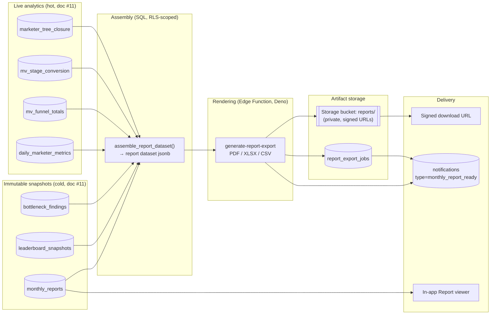
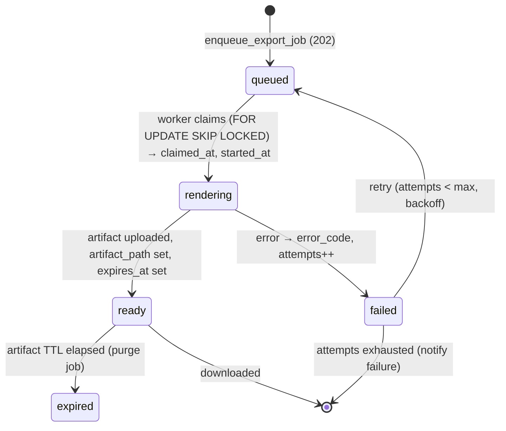

# 15 — Reporting Architecture (Report Types, Generation Pipeline, Export, Automatic Monthly Reports)

> **Status:** Architecture-validation phase. No application code. This document specifies the
> **reporting & export subsystem**: the catalogue of report types and their parameters, the
> generation pipeline (Edge Functions assembling data from the analytics layer), export to
> **PDF / Excel (xlsx) / CSV**, the **automatic monthly reports** scheduled by `pg_cron`
> (current vs previous period, diff, % growth, historical evolution), how reports are **stored**
> (`monthly_reports`) and **delivered** (in-app notification + downloadable), report templating,
> the **large-export async job pattern**, and **access control** (a user can only export within
> their visibility scope).
>
> **Consistency contract:** every table, column, enum value, index, RPC, and Edge Function
> referenced here is defined verbatim in the canonical documents:
> - **`01-database-schema.md`** — `monthly_reports`, `daily_marketer_metrics`, `mv_funnel_totals`,
>   `mv_stage_conversion`, `leaderboard_snapshots`, `bottleneck_findings`, `marketer_tree_closure`,
>   `notifications`, `audit_log`, enums `report_period`, `branch_side`, `leaderboard_metric`,
>   `leaderboard_scope`, `notification_type`.
> - **`11-analytics-architecture.md`** — helper functions `subtree_metrics_json()`,
>   `jsonb_delta()`, `jsonb_delta_pct()`, `node_branch_summary()`, `org_day_bounds()`,
>   `org_local_date()`, the metric `jsonb` payload contract (§9.2), and the
>   `generate_monthly_reports()` cron job.
> - **`07-backend-architecture.md`** — the `generate-report-export` Edge Function (§4.3), the
>   `pg_cron` → `net.http_post` invocation pattern, idempotency rules.
> - **`09-api-architecture.md`** — the `/rest/v1/rpc/generate_monthly_report` RPC (§3.6) and the
>   `/functions/v1/generate-report-export` endpoint (§4.0).
>
> **New structures introduced by this layer** (all additive, none conflict with #01): one table
> `report_export_jobs`, one private bucket `reports`, one enum `export_format`, one enum
> `export_status`, the helper functions `assemble_report_dataset()` and `period_bounds()`, and the
> Edge Function `generate-report-export`'s internal renderer modules. All are flagged in the
> Open Questions section for sign-off.

---

## Table of Contents

1. [Design Principles & Scope](#1-design-principles--scope)
2. [Report Type Catalogue](#2-report-type-catalogue)
3. [Report Parameters (period, scope, branch, format)](#3-report-parameters-period-scope-branch-format)
4. [The Generation Pipeline](#4-the-generation-pipeline)
5. [The Report Dataset Contract (assembly → render boundary)](#5-the-report-dataset-contract-assembly--render-boundary)
6. [Export Formats: PDF / Excel (xlsx) / CSV](#6-export-formats-pdf--excel-xlsx--csv)
7. [Report Templating](#7-report-templating)
8. [Automatic Monthly Reports (pg_cron)](#8-automatic-monthly-reports-pg_cron)
9. [Storage of Reports (`monthly_reports`) & Export Artifacts (`reports` bucket)](#9-storage-of-reports-monthly_reports--export-artifacts-reports-bucket)
10. [Delivery: notification + in-app + downloadable](#10-delivery-notification--in-app--downloadable)
11. [Large-Export Streaming / Async Job Pattern](#11-large-export-streaming--async-job-pattern)
12. [Access Control (visibility-scoped export)](#12-access-control-visibility-scoped-export)
13. [API Surface (RPC + Edge endpoints)](#13-api-surface-rpc--edge-endpoints)
14. [pg_cron Schedule additions](#14-pg_cron-schedule-additions)
15. [Failure Modes, Retries, Observability](#15-failure-modes-retries-observability)
16. [Open Questions / Decisions Needing Sign-off](#16-open-questions--decisions-needing-sign-off)

---

## 1. Design Principles & Scope

The reporting subsystem turns the **already-computed analytics** (doc #11) into **human-consumable
artifacts** — on-screen report views and downloadable PDF/Excel/CSV files — and runs the
**automatic monthly performance reports**. Seven non-negotiable principles:

1. **Compute once, render many.** Numbers are *never* re-derived in the export layer. Reports read
   immutable snapshots (`monthly_reports`, `leaderboard_snapshots`, `bottleneck_findings`) or the
   same closure-joined fact queries the dashboards use (`daily_marketer_metrics` ⋈
   `marketer_tree_closure`, `mv_funnel_totals`, `mv_stage_conversion`). The export Edge Function
   does **rendering only** — it owns no metric definitions. This guarantees a PDF and the on-screen
   dashboard for the same period/scope show identical figures.

2. **Assembly in SQL, rendering in Deno.** A report has two halves: (a) **assembly** — gather the
   typed rows into a single `jsonb` "report dataset" via a `STABLE` SQL function run under the
   caller's JWT (so RLS scopes it); (b) **rendering** — turn that dataset into PDF/XLSX/CSV bytes
   in the `generate-report-export` Edge Function (Deno). The boundary between them is the
   **Report Dataset Contract** (§5) — a versioned `jsonb` shape.

3. **RLS is the access-control primitive, here too.** Every assembly query runs under the caller's
   bearer token, so the closure-based `can_see_marketer()` predicate (schema §8) filters rows
   automatically. A user physically cannot assemble — and therefore cannot export — data outside
   their subtree. Admins/owners bypass the subtree filter exactly as everywhere else. There is **no
   service-role read path for user-initiated exports** (§12).

4. **Two latency tiers.** *Small/synchronous* exports (one marketer's monthly report, a single
   leaderboard page) render inline and return a signed download URL in one request. *Large/async*
   exports (org-wide CSV of all prospects, a multi-month executive PDF over a 5 000-node org) go
   through the `report_export_jobs` queue + background rendering + notification-on-ready (§11).

5. **Determinism & reproducibility.** Because monthly/quarterly reports are immutable snapshots
   keyed on `(org_id, marketer_id, period, period_start)`, re-exporting the same report yields a
   byte-stable artifact (modulo a generation timestamp in the footer). Ad-hoc exports embed the
   exact period/scope parameters in the artifact metadata so any export is traceable.

6. **Italian-first.** All report labels, headers, stage names, and rank names render in **Italian**
   (the canonical domain values + `ranks_meta.label_it` + the stage label map). The template layer
   is `next-intl`-keyed so a future locale only swaps the label bundle, never the numbers.

7. **Auditable.** Every export request writes an `audit_log` row (`action = 'report.export'`) with
   the report type, scope, period, and format — so "who exported what subtree's data when" is
   answerable, which matters for a multi-tenant CRM holding downline PII.

### 1.1 Where the reporting subsystem sits



### 1.2 What is in scope vs. out of scope

| In scope | Out of scope (and why) |
|---|---|
| Report **types** (team, funnel, conversion, monthly performance, rank) + their data sources/params | Metric **definitions** (owned by doc #11; we consume them) |
| Generation pipeline (assembly SQL → Edge render) | The analytics rollup engine itself (doc #11) |
| PDF/XLSX/CSV rendering, templating | Rich-text document export (`internal_documents`) — that is doc-#11-unrelated KB rendering, noted in OQ-7 |
| Automatic monthly reports scheduling/storage/delivery | The `monthly_reports` table DDL (defined in #01 §6.4; we use it verbatim) |
| Async/large-export job pattern, signed-URL delivery | Compensation/commission statements — no comp tables exist (schema OQ #5) |
| Access control on export (visibility scope) | Email delivery of attachments (v1 delivers in-app + signed URL; email attachment is OQ-6) |

---

## 2. Report Type Catalogue

The platform ships **five canonical report types**, each available on-screen (a React view, doc #08)
and as a downloadable artifact. Each is defined by its **data source**, its **grain**, and its
**parameter set** (§3). All five share the period/scope/branch parameter model so the UI and the
export endpoint are uniform.

| # | Report type (key) | Italian title | Primary data source | Grain | Default formats |
|---|---|---|---|---|---|
| R-T | `team_report` | "Report Team" | `marketer_tree_closure` ⋈ `marketers` ⋈ `daily_marketer_metrics` | per-subtree composition + activity | PDF, XLSX, CSV |
| R-F | `funnel_report` | "Report Funnel" | `mv_funnel_totals` (occupancy) + `daily_marketer_metrics` (throughput) | per-subtree, 6 stages | PDF, XLSX, CSV |
| R-C | `conversion_report` | "Report Conversioni" | `mv_stage_conversion` (+ closure) | per-subtree, stage-to-stage + monthly/quarterly trend | PDF, XLSX, CSV |
| R-M | `monthly_performance_report` | "Report Performance Mensile" | `monthly_reports` (immutable snapshot) | per-marketer (subtree-inclusive) or org, month/quarter | PDF, XLSX, CSV |
| R-R | `rank_report` | "Report Rank" | `marketers.rank` + `rank_history` + `ranks_meta` | per-subtree rank distribution + change history | PDF, XLSX, CSV |

> **Two supporting export types** reuse the same pipeline but are not "performance reports":
> `leaderboard_export` (renders `leaderboard_snapshots` for the selected metric/scope/period) and
> `data_export` (raw CSV/XLSX of a list view — contacts, prospects, calls — for the user's
> visible scope, used by the "Esporta" button on list screens). These are catalogued in §2.6.

### 2.1 R-T — Team Report (`team_report`)

**Purpose.** Team analytics for a node N's subtree: size, composition by status, direct recruits,
new members, growth, and team activity totals. Mirrors the "team analytics" feature surface and
doc #11 §6.

**Data source (exact).**
- Composition (size / active / inactive / pending / suspended / direct children / new in period):
  doc #11 §6.1 query over `marketer_tree_closure cl ⋈ marketers m` (`cl.ancestor_id = N`).
- `direct_recruits`: `count(*) FROM marketers WHERE sponsor_id = N AND deleted_at IS NULL` (doc #11 §6.1).
- `growth_pct`: doc #11 §6.2 (`new_in_period / size_start`).
- Team **activity** totals (calls, new_prospects, enrollments, new_recruits): subtree-inclusive
  query of doc #11 §4.2 over `daily_marketer_metrics`.
- Optional **per-member rows** (for the XLSX/CSV "members" sheet): one row per descendant from the
  closure join with each member's own `daily_marketer_metrics` sums over the period.

**Sections rendered:** (1) headline tiles (team_size, active%, growth%); (2) status composition
donut; (3) activity totals table; (4) — for XLSX/CSV — a per-member detail sheet.

### 2.2 R-F — Funnel Report (`funnel_report`)

**Purpose.** Performance analytics — totals per funnel stage — for a node's subtree, plus current
occupancy. Mirrors "performance analytics (totals per funnel stage)" and doc #11 §3.2/§4.3.

**Data source (exact).**
- **Throughput** (stage entries in the window): subtree-inclusive sums of
  `daily_marketer_metrics.stage_conoscitiva … stage_iscrizione` and `new_prospects` (doc #11 §4.2).
- **Current occupancy** (how many prospects sit in each stage right now): `mv_funnel_totals` summed
  over the subtree (doc #11 §4.3), labelled "Iscritti totali" (state) vs "Iscrizioni nel periodo"
  (throughput) to honour the two-enrollment-definition rule (doc #11 §3.2).
- **Branch split** (Global/Left/Right): `node_branch_summary(org_id, N, from, to)` (doc #11 §13.4)
  when `branch_side` is requested as `GLOBAL` with the split-out option, or a single side when
  `branch_side ∈ {LEFT,RIGHT}`.

**Sections rendered:** funnel bar/pyramid (6 stages), stage totals table, Global/Left/Right chips,
pipeline value (`sum(expected_value)` of open prospects, doc #11 §3.3).

### 2.3 R-C — Conversion Report (`conversion_report`)

**Purpose.** Conversion analytics — stage-to-stage %, average time-in-stage, and historical
(monthly/quarterly) trend with MoM. Mirrors "conversion analytics" and doc #11 §5.

**Data source (exact).**
- Single-window stage-to-stage %: doc #11 §5.4 pivot over `mv_stage_conversion ⋈ marketer_tree_closure`.
- Monthly trend + MoM diff/%: doc #11 §5.5 (`LAG()` over `period_month`).
- Quarterly trend: doc #11 §5.5 quarterly variant (`date_trunc('quarter', period_month)`).
- Average time-in-stage: `mv_stage_conversion.avg_time_in_stage_secs` (weighted by `exited_count`).
- Optional cohort-accurate mode: doc #11 §5.6 (on-demand, heavier; flagged in the UI as "modalità
  coorte").

**Sections rendered:** stage-to-stage conversion funnel with %; line chart of `conv_overall` over
months/quarters with MoM annotations; avg time-in-stage table.

### 2.4 R-M — Monthly Performance Report (`monthly_performance_report`)

**Purpose.** The flagship **automatic monthly report** rendered as a document: current period vs
previous period, absolute **diff**, **% growth**, and **historical evolution** (last N periods).
This is the export face of the `monthly_reports` snapshot table (§8, §9).

**Data source (exact).**
- The immutable snapshot row(s) in `monthly_reports`:
  `metrics`, `previous_metrics`, `deltas`, `delta_pct` (schema §6.4; jsonb payload contract doc #11 §9.2).
- For the **historical evolution** chart: the prior N `monthly_reports` rows for the same
  `(org_id, marketer_id, period)` ordered by `period_start DESC LIMIT N` (default N=12 monthly /
  4 quarterly), reading each row's `metrics->>'conv_overall'`, `enrollments`, `calls_total`, etc.
- `marketer_id IS NULL` → the **org-level** roll-up row (admin/CEO report).

**Sections rendered:** KPI grid (current | previous | Δ | Δ%) for the full metric set; up/down
arrows coloured by sign of `delta_pct`; a 12-period evolution sparkline grid; the funnel + conversion
snapshot for the period (re-using R-F/R-C section renderers).

> **Why R-M reads `monthly_reports` and not live facts:** the monthly report must be a *stable
> historical document* — re-exporting January's report in June must yield January's numbers as they
> were snapshotted, not as recomputed today (late-arriving data, placement moves, and soft-deletes
> would otherwise mutate "history"). The snapshot is the source of truth for R-M.

### 2.5 R-R — Rank Report (`rank_report`)

**Purpose.** Rank distribution across a subtree and the history of rank changes — mirrors the
"rank system + rank history" feature surface and the locked rank ladder.

**Data source (exact).**
- **Distribution:** `count(*)` of `marketers` in the subtree grouped by `rank`, joined to
  `ranks_meta` for `sort_order` + `label_it`, over `marketer_tree_closure (ancestor_id = N)`.
- **Changes in window:** `rank_history` rows for visible marketers where `changed_at ∈ [from,to]`,
  showing `previous_rank → new_rank`, `changed_at`, `changed_by` (resolved to `display_name`),
  `notes`. Ordered `changed_at DESC`.
- **CRM-eligibility breakdown:** counts split by `ranks_meta.crm_eligible` (how many of the team can
  access the CRM vs. Executive-only), which is operationally useful for leaders.

**Sections rendered:** rank-ladder bar chart (ordered by `ranks_meta.sort_order`), promotions/
demotions timeline, CRM-eligible vs not summary.

### 2.6 Supporting export types

| Key | Title (IT) | Source | Notes |
|---|---|---|---|
| `leaderboard_export` | "Esporta Classifica" | `leaderboard_snapshots` (doc #11 §11.5 read query) | Renders the exact ranked rows for the selected `metric/scope/scope_ref_id/branch_side/period_start`. PDF (ranked table) / XLSX / CSV. |
| `data_export` | "Esporta Dati" | Live list query (contacts / prospects / calls) | The "Esporta" button on list screens. CSV/XLSX of the *currently visible, filtered* rows. Always async if row estimate > the sync threshold (§11). Honours the same RLS as the list. |

> `data_export` deliberately exports **raw list rows** (not aggregates) so leaders can pull, e.g., a
> CSV of all prospects in their subtree currently in `closing`. It reuses the list view's filter
> params (status, tags, stage, date range) so "export === what I see on screen".

---

## 3. Report Parameters (period, scope, branch, format)

Every report type accepts the **same parameter envelope** (with type-specific extras), so the UI,
the assembly function, and the export endpoint are uniform. The envelope is validated server-side.

### 3.1 The parameter envelope

```jsonc
{
  "report_type": "monthly_performance_report", // one of the §2 keys (enum-checked server-side)
  "scope": {
    "kind": "team",            // 'org' | 'team' | 'branch' (maps to leaderboard_scope semantics)
    "marketer_id": "8f1c…",    // subtree root for 'team'/'branch'; null for 'org' (admin only)
    "branch_side": "GLOBAL"    // branch_side enum: 'GLOBAL' | 'LEFT' | 'RIGHT'
  },
  "period": {
    "granularity": "monthly",  // report_period enum: 'monthly' | 'quarterly'  (or 'custom' for ad-hoc)
    "period_start": "2026-04-01",  // first day of the month/quarter for snapshot reports
    "period_end":   "2026-04-30",  // derived for monthly/quarterly; explicit only for 'custom'
    "history_periods": 12      // for trend/evolution sections (R-C, R-M)
  },
  "format": "pdf",             // export_format enum: 'pdf' | 'xlsx' | 'csv'
  "options": {
    "include_member_detail": true,   // R-T: emit per-member sheet
    "cohort_mode": false,            // R-C: cohort-accurate conversion (doc #11 §5.6)
    "split_branches": true,          // R-F: emit Global+Left+Right side-by-side
    "locale": "it"
  }
}
```

### 3.2 Parameter semantics

| Parameter | Type / source | Rule |
|---|---|---|
| `report_type` | `text` validated against the §2 keys | Determines the assembly function branch and the template. |
| `scope.kind` | mirrors `leaderboard_scope` (`org`/`team`/`branch`) | `org` requires `role IN ('admin','owner')`. `team`/`branch` require `can_see_marketer(scope.marketer_id)`. |
| `scope.marketer_id` | `uuid` → `marketers(id)` | The subtree root. Defaults to the caller's own `jwt.marketer_id` when omitted for `team`. |
| `scope.branch_side` | `branch_side` enum | `GLOBAL` = whole subtree; `LEFT`/`RIGHT` = one leg of the root (closure `branch_leg` predicate, doc #11 §7.1). |
| `period.granularity` | `report_period` (+`custom`) | `monthly`/`quarterly` map to `monthly_reports.period`. `custom` allowed only for non-snapshot reports (R-T, R-F, R-C, `data_export`); R-M is snapshot-only. |
| `period.period_start` | `date` | For `monthly`/`quarterly` must be the first day of the month/quarter (else `422 invalid_period_start`, mirroring API #09 §3.6). |
| `period.period_end` | `date` | Derived for monthly/quarterly via `period_bounds()`; explicit for `custom`. |
| `period.history_periods` | `int` (default 12 monthly / 4 quarterly, max 36) | How many trailing periods to chart for trend/evolution sections. |
| `format` | `export_format` enum (`pdf`/`xlsx`/`csv`) | Determines the renderer module. |
| `options.*` | per-type flags | Validated per report type; unknown flags rejected. |

### 3.3 Period resolution helper (new)

`period_bounds()` resolves `(granularity, period_start)` to a concrete `[period_start, period_end]`
and validates the first-of-period rule. Additive helper (OQ-1).

```sql
CREATE OR REPLACE FUNCTION period_bounds(p_granularity text, p_period_start date)
RETURNS TABLE(period_start date, period_end date) LANGUAGE plpgsql IMMUTABLE AS $$
BEGIN
  IF p_granularity = 'monthly' THEN
    IF p_period_start <> date_trunc('month', p_period_start)::date THEN
      RAISE EXCEPTION 'invalid_period_start' USING ERRCODE = '22023';
    END IF;
    RETURN QUERY SELECT p_period_start,
                        (p_period_start + interval '1 month' - interval '1 day')::date;
  ELSIF p_granularity = 'quarterly' THEN
    IF p_period_start <> date_trunc('quarter', p_period_start)::date THEN
      RAISE EXCEPTION 'invalid_period_start' USING ERRCODE = '22023';
    END IF;
    RETURN QUERY SELECT p_period_start,
                        (p_period_start + interval '3 months' - interval '1 day')::date;
  ELSE  -- 'custom' : caller supplies both bounds; validated by the RPC
    RAISE EXCEPTION 'custom_requires_explicit_end' USING ERRCODE = '22023';
  END IF;
END;
$$;
```

### 3.4 New enums introduced by this layer

```sql
-- Export artifact format. (Additive; OQ-1.)
CREATE TYPE export_format AS ENUM ('pdf', 'xlsx', 'csv');

-- Lifecycle of an async export job.
CREATE TYPE export_status AS ENUM (
  'queued',      -- accepted, awaiting render
  'rendering',   -- Edge Function actively building the artifact
  'ready',       -- artifact in the reports bucket, signed URL issuable
  'failed',      -- render error (see error_code); retriable
  'expired'      -- artifact TTL elapsed and object purged
);
```

---

## 4. The Generation Pipeline

The pipeline has the same three logical stages for **every** report type and format; only the
assembly branch and renderer module differ. The split between **synchronous** (small) and
**asynchronous** (large) execution is decided up front by an estimated-rows heuristic (§11.1).

```mermaid
sequenceDiagram
    autonumber
    participant UI as Next.js (Report view)
    participant EF as Edge: generate-report-export
    participant DB as Postgres (assembly, RLS)
    participant ST as Storage: reports/ bucket
    participant N as notifications / Realtime

    UI->>EF: POST /functions/v1/generate-report-export (envelope + caller JWT)
    EF->>EF: validate envelope; classify sync vs async (row estimate)
    alt synchronous (small)
        EF->>DB: rpc assemble_report_dataset(envelope)   // caller JWT → RLS scoped
        DB-->>EF: report dataset jsonb (RLS-filtered)
        EF->>EF: render PDF | XLSX | CSV (Deno module)
        EF->>ST: upload artifact (private)
        EF->>DB: rpc audit_report_export(...)  // audit_log
        EF-->>UI: 200 { download_url (signed, short TTL), filename, bytes }
    else asynchronous (large)
        EF->>DB: rpc enqueue_export_job(envelope)  // report_export_jobs: status='queued'
        EF-->>UI: 202 { job_id, status:'queued' }
        Note over EF,DB: pg_cron drain (or net.http_post) picks the job
        EF->>DB: claim job → status='rendering'
        EF->>DB: rpc assemble_report_dataset (with job's stored claims/scope)
        DB-->>EF: dataset (streamed in chunks for CSV)
        EF->>ST: stream artifact to bucket
        EF->>DB: status='ready', artifact_path set
        EF->>N: insert notification (type='monthly_report_ready' / generic) + Realtime push
        UI->>EF: GET /functions/v1/generate-report-export?job_id=… (poll or via Realtime)
        EF-->>UI: 200 { status:'ready', download_url (signed) }
    end
```

### 4.1 Stage 1 — Assembly (`assemble_report_dataset`, SQL, RLS-scoped)

A single `STABLE SECURITY INVOKER` SQL function (so it runs as the caller and inherits RLS)
dispatches on `report_type` and returns the **Report Dataset** jsonb (§5). It is `SECURITY INVOKER`
on purpose: the closure RLS on `daily_marketer_metrics`, `marketers`, `monthly_reports`,
`mv_*`-wrapper views, and `leaderboard_snapshots` must apply. For MVs (which don't enforce RLS), it
reads the **secured wrapper views** (`v_funnel_totals_secured`, doc #11 §15) — never the raw MV.

```sql
CREATE OR REPLACE FUNCTION assemble_report_dataset(p_envelope jsonb)
RETURNS jsonb
LANGUAGE plpgsql
STABLE
SECURITY INVOKER            -- runs as caller → RLS scopes every read
SET search_path = public
AS $$
DECLARE
  v_type        text  := p_envelope->'report_type'->>0;  -- or ->>'report_type'
  v_type2       text  := p_envelope->>'report_type';
  v_org         uuid  := (auth.jwt()->>'org_id')::uuid;
  v_scope_kind  text  := p_envelope#>>'{scope,kind}';
  v_marketer    uuid  := nullif(p_envelope#>>'{scope,marketer_id}','')::uuid;
  v_branch      branch_side := coalesce((p_envelope#>>'{scope,branch_side}')::branch_side,'GLOBAL');
  v_gran        text  := p_envelope#>>'{period,granularity}';
  v_pstart      date  := (p_envelope#>>'{period,period_start}')::date;
  v_pend        date  := (p_envelope#>>'{period,period_end}')::date;
  v_data        jsonb;
BEGIN
  -- Org-scope guard: only admins/owners may request marketer_id IS NULL (org root).
  IF v_scope_kind = 'org' AND (auth.jwt()->>'role') NOT IN ('admin','owner') THEN
    RAISE EXCEPTION 'org_report_requires_admin' USING ERRCODE = '42501';
  END IF;
  -- Subtree-visibility guard (defence in depth; RLS is the hard boundary).
  IF v_marketer IS NOT NULL AND NOT can_see_marketer(v_marketer) THEN
    RAISE EXCEPTION 'forbidden' USING ERRCODE = '42501';
  END IF;

  CASE v_type2
    WHEN 'team_report'                 THEN v_data := build_team_report(v_org, v_marketer, v_branch, v_pstart, v_pend);
    WHEN 'funnel_report'               THEN v_data := build_funnel_report(v_org, v_marketer, v_branch, v_pstart, v_pend);
    WHEN 'conversion_report'           THEN v_data := build_conversion_report(v_org, v_marketer, v_branch, v_pstart, v_pend,
                                                        coalesce((p_envelope#>>'{period,history_periods}')::int,12),
                                                        coalesce((p_envelope#>>'{options,cohort_mode}')::boolean,false));
    WHEN 'monthly_performance_report'  THEN v_data := build_monthly_performance_report(v_org, v_marketer, v_gran, v_pstart,
                                                        coalesce((p_envelope#>>'{period,history_periods}')::int,12));
    WHEN 'rank_report'                 THEN v_data := build_rank_report(v_org, v_marketer, v_pstart, v_pend);
    WHEN 'leaderboard_export'          THEN v_data := build_leaderboard_export(v_org, p_envelope);
    ELSE RAISE EXCEPTION 'unknown_report_type' USING ERRCODE = '22023';
  END CASE;

  RETURN jsonb_build_object(
    'dataset_version', 1,
    'report_type',     v_type2,
    'org',             jsonb_build_object('id', v_org,
                          'name', (SELECT name FROM organizations WHERE id = v_org),
                          'locale', coalesce(p_envelope#>>'{options,locale}','it')),
    'scope',           p_envelope->'scope',
    'period',          jsonb_build_object('granularity', v_gran, 'start', v_pstart, 'end', v_pend),
    'generated_at',    now(),
    'data',            v_data
  );
END;
$$;
```

> `build_team_report`, `build_funnel_report`, `build_conversion_report`,
> `build_monthly_performance_report`, `build_rank_report`, `build_leaderboard_export` are thin
> `STABLE` functions wrapping the **exact** doc-#11 queries cited in §2. They are additive helpers
> (OQ-1). Each returns the typed `data` block of the dataset contract (§5). For example
> `build_monthly_performance_report` is essentially: read the `monthly_reports` row for the period
> (the snapshot), plus `SELECT … FROM monthly_reports WHERE … ORDER BY period_start DESC LIMIT N`
> for the evolution series — *no* live recomputation.

### 4.2 Stage 2 — Rendering (Edge Function `generate-report-export`, Deno)

The Edge Function (catalogued in backend #07 §4.3 and API #09 §4.0) receives the envelope, calls
`assemble_report_dataset` over PostgREST **with the caller's bearer token** (so RLS applies), then
dispatches to a renderer module by `format`:

```ts
// functions/generate-report-export/index.ts  (Deno) — illustrative structure, not built yet
import { renderPdf }  from "./render/pdf.ts";
import { renderXlsx } from "./render/xlsx.ts";
import { renderCsv }  from "./render/csv.ts";

Deno.serve(async (req) => {
  const jwt = req.headers.get("Authorization");            // caller JWT (never service role for reads)
  const envelope = await req.json();

  // 1. Validate + classify sync/async (row-estimate heuristic, §11.1)
  const plan = await classify(envelope, jwt);
  if (plan.async) return enqueueAndAccept(envelope, jwt);  // 202 + job_id (§11)

  // 2. Assembly under caller RLS
  const supa = createClient(SUPABASE_URL, ANON_KEY, { global: { headers: { Authorization: jwt } } });
  const { data: dataset, error } = await supa.rpc("assemble_report_dataset", { p_envelope: envelope });
  if (error) return jsonError(error);

  // 3. Render bytes
  const bytes = envelope.format === "pdf"  ? await renderPdf(dataset)
              : envelope.format === "xlsx" ? await renderXlsx(dataset)
              :                              await renderCsv(dataset);

  // 4. Store artifact (private bucket) + audit + return signed URL
  const path = artifactPath(dataset, envelope);            // §9.2 naming
  await supa.storage.from("reports").upload(path, bytes, { contentType: contentTypeFor(envelope.format) });
  await supa.rpc("audit_report_export", { p_type: envelope.report_type, p_scope: envelope.scope,
                                          p_period: envelope.period, p_format: envelope.format, p_path: path });
  const { data: signed } = await supa.storage.from("reports").createSignedUrl(path, 300); // 5-min TTL
  return Response.json({ download_url: signed.signedUrl, filename: basename(path), bytes: bytes.length });
});
```

Key rendering rules:
- **No metric math in the renderer.** The renderer only formats numbers already present in
  `dataset.data` (locale-format, percentage, thousands separator, arrow/colour by `delta_pct` sign).
- **Caller JWT for reads, never service role.** The only exception is the *cron-initiated*
  monthly-report export pre-render (§8.5), which runs with a service token but **explicitly scopes
  every read by `org_id` + the report's `marketer_id`** and writes the artifact for later
  authenticated download — it never returns data to a client.
- **Idempotent artifact path** so re-rendering the same report overwrites rather than duplicates.

### 4.3 Stage 3 — Storage + delivery

Covered in §9 (storage) and §10 (delivery). In short: upload to the private `reports` bucket → issue
a short-TTL signed URL (sync) or set `report_export_jobs.status='ready'` + emit a notification (async).

---

## 5. The Report Dataset Contract (assembly → render boundary)

The single typed `jsonb` object `assemble_report_dataset` returns and the renderer consumes. Versioned
via `dataset_version` so the Edge renderer can evolve independently of the SQL assembly.

### 5.1 Envelope (common to all report types)

```jsonc
{
  "dataset_version": 1,
  "report_type": "monthly_performance_report",
  "org":   { "id": "11aa…", "name": "Acme Network", "locale": "it" },
  "scope": { "kind": "team", "marketer_id": "8f1c…", "branch_side": "GLOBAL",
             "display_name": "Giulia Bianchi", "rank": "team_leader" },
  "period": { "granularity": "monthly", "start": "2026-04-01", "end": "2026-04-30" },
  "generated_at": "2026-05-30T09:25:00Z",
  "data": { /* type-specific block, §5.2 */ }
}
```

### 5.2 Type-specific `data` blocks

**`monthly_performance_report` (R-M)** — straight off the `monthly_reports` snapshot:

```jsonc
"data": {
  "metrics":          { /* §9.2 jsonb payload: calls_total, calls_connected, new_prospects,
                           conoscitiva … iscrizione, enrollments, new_recruits, team_size,
                           active_members, conv_overall, conv_check_soldi_iscrizione */ },
  "previous_metrics": { /* same keys, prior period */ },
  "deltas":           { /* per-key absolute diff = metrics[k] - previous_metrics[k] */ },
  "delta_pct":        { /* per-key % change */ },
  "evolution": [       /* trailing history_periods rows, oldest→newest */
    { "period_start": "2025-05-01", "conv_overall": 0.17, "enrollments": 31, "calls_total": 980 },
    { "period_start": "2025-06-01", "conv_overall": 0.18, "enrollments": 34, "calls_total": 1010 }
    /* … */
  ]
}
```

**`team_report` (R-T):**

```jsonc
"data": {
  "composition": { "team_size": 142, "active_members": 118, "inactive_members": 16,
                   "pending_members": 6, "suspended_members": 2, "direct_children": 2,
                   "direct_recruits": 9, "new_members_period": 11, "growth_pct": 8.4 },
  "activity":    { "calls_total": 1240, "calls_connected": 780, "new_prospects": 210,
                   "iscrizione": 40, "new_recruits": 11 },
  "members": [   /* present only when options.include_member_detail = true */
    { "marketer_id":"…","display_name":"…","rank":"consultant","status":"active",
      "calls_total":42,"new_prospects":7,"iscrizione":2,"team_size":0 }
  ]
}
```

**`funnel_report` (R-F):**

```jsonc
"data": {
  "throughput": { "new_prospects":210,"conoscitiva":210,"business_info":150,"follow_up":110,
                  "closing":70,"check_soldi":55,"iscrizione":40 },
  "occupancy":  { "open_conoscitiva":34,"open_business_info":21, /* … */ "enrolled_total":188,"lost_total":52 },
  "pipeline_value": 184500.00,
  "branches":   [ { "branch_side":"GLOBAL", /* stage totals + conv ratios */ },
                  { "branch_side":"LEFT",   /* … */ },
                  { "branch_side":"RIGHT",  /* … */ } ]   /* present when options.split_branches */
}
```

**`conversion_report` (R-C):**

```jsonc
"data": {
  "stage_to_stage": { "conv_conoscitiva_business_info":0.71,"conv_business_info_follow_up":0.73,
                      "conv_follow_up_closing":0.64,"conv_closing_check_soldi":0.79,
                      "conv_check_soldi_iscrizione":0.73,"conv_overall":0.19 },
  "avg_time_in_stage_days": { "conoscitiva":3.1,"business_info":4.8,"follow_up":9.2,
                              "closing":4.0,"check_soldi":2.5 },
  "trend": [ { "period_month":"2026-03-01","conv_overall":0.18,"mom_diff":0.01,"mom_pct":5.9 },
             { "period_month":"2026-04-01","conv_overall":0.19,"mom_diff":0.01,"mom_pct":5.6 } ],
  "cohort": null   /* populated when options.cohort_mode = true (doc #11 §5.6) */
}
```

**`rank_report` (R-R):**

```jsonc
"data": {
  "distribution": [ { "rank":"executive","label_it":"Executive","sort_order":1,"count":12,"crm_eligible":false },
                    { "rank":"consultant","label_it":"Consultant","sort_order":2,"count":64,"crm_eligible":true } /* … */ ],
  "crm_eligible_summary": { "eligible": 130, "not_eligible": 12 },
  "changes": [ { "marketer_id":"…","display_name":"…","previous_rank":"consultant",
                 "new_rank":"team_leader","changed_at":"2026-04-12T10:00:00Z",
                 "changed_by":"Mario Rossi","notes":"Promozione Q1" } ]
}
```

**`leaderboard_export`:**

```jsonc
"data": {
  "metric":"enrollments","scope":"team","branch_side":"GLOBAL",
  "rows": [ { "rank_position":1,"marketer_id":"…","display_name":"…","rank":"team_leader","value":40 } ]
}
```

> **Contract stability rule.** Renderer modules read these keys defensively (missing optional
> section ⇒ skip that page/sheet). Adding a key bumps `dataset_version` only if it changes an
> existing key's meaning; pure additions are backward-compatible.

---

## 6. Export Formats: PDF / Excel (xlsx) / CSV

All three formats are produced **inside the Deno Edge Function** from the same dataset. Library
choices are Deno-compatible (no Node-only native addons).

### 6.1 PDF

**Approach:** server-side HTML→PDF is the cleanest path for Italian-localized, chart-rich reports.
Two Deno-compatible options, ranked:

| Option | How | Pros | Cons |
|---|---|---|---|
| **A. `@react-pdf/renderer`** (recommended) | Build the report as React-PDF primitives (`<Document>/<Page>/<View>/<Text>/<Image>`) from the dataset; `renderToBuffer()` → bytes. Charts pre-rendered to SVG/PNG (see §6.4). | Pure-JS, runs in Deno, deterministic layout, no headless browser, low cold-start, templating in JSX. | Manual layout; complex charts need pre-rasterization. |
| **B. Headless Chromium (`puppeteer`/`astral`) → `page.pdf()`** | Render an HTML template, screenshot to PDF. | Pixel-perfect HTML/CSS + native chart libs. | Heavy cold-start, Chromium not ideal in the standard Supabase Edge runtime; better on a dedicated render worker (see §11.4 / OQ-5). |

**Decision:** **Option A (`@react-pdf/renderer`)** for v1 — it runs in the Supabase Edge (Deno)
runtime without a browser, keeps cold-starts low, and gives JSX templating that maps 1:1 to the
report sections. If pixel-perfect HTML/CSS becomes a requirement, promote to Option B on a dedicated
render worker (OQ-5). Charts are pre-rendered to PNG by a lightweight SVG charting step (§6.4) and
embedded via `<Image>`.

**PDF structure (per report type):** cover block (org name, report title IT, scope `display_name` +
`rank`, period, `generated_at`) → KPI grid → charts → detail tables → footer (page n/N, generation
timestamp, "Riservato — dati del tuo team" confidentiality line).

### 6.2 Excel (xlsx)

**Library:** **SheetJS (`xlsx`)** — pure JS, Deno-compatible, writes `.xlsx` to an `ArrayBuffer`.

**Workbook structure:** one **summary sheet** ("Riepilogo") mirroring the PDF KPI grid, plus
**type-specific detail sheets**:

| Report | Sheets |
|---|---|
| R-M monthly performance | `Riepilogo` (current/prev/Δ/Δ%), `Evoluzione` (per-period series) |
| R-T team | `Riepilogo`, `Membri` (per-member rows when `include_member_detail`) |
| R-F funnel | `Riepilogo`, `Funnel` (stage totals), `Rami` (Global/Left/Right) |
| R-C conversion | `Riepilogo`, `Trend` (monthly/quarterly), `TempiFase` (avg time-in-stage) |
| R-R rank | `Distribuzione`, `Cambi` (rank_history rows) |
| `leaderboard_export` | `Classifica` (ranked rows) |

Cells are typed (numbers as numbers, percentages with a `0.0%` format, dates as Excel dates) so
recipients can pivot/sum natively. Header rows are Italian.

### 6.3 CSV

**Approach:** plain UTF-8 CSV (BOM-prefixed for Excel-Italy decimal compatibility), RFC-4180 quoting,
**one logical table per request** (CSV cannot carry multiple sheets). The `format=csv` export of a
multi-section report renders the *primary table* of that report (e.g. R-T → members or composition
table; R-C → trend table) and the response header documents which table. For multi-table needs,
clients request `xlsx`. `data_export` is the canonical CSV use case (a flat list).

**Streaming:** CSV is generated as a **Web `ReadableStream`** so large `data_export`s never buffer
the whole file in memory (§11.3) — rows are fetched in keyset-paginated batches and written as they
arrive.

### 6.4 Charts inside artifacts

The on-screen reports use **Recharts** (doc #08). For embedded PDF/XLSX charts, the Edge Function
renders the same series to **static SVG** via a headless-free SVG charting helper (e.g. a tiny
`vega-lite`→SVG or a hand-rolled SVG bar/line generator) and rasterizes to PNG with a Deno-compatible
encoder, then embeds. XLSX may alternatively use native SheetJS chart objects (OQ-4). No browser is
required.

### 6.5 Format → content-type / extension

| `export_format` | Content-Type | Extension |
|---|---|---|
| `pdf` | `application/pdf` | `.pdf` |
| `xlsx` | `application/vnd.openxmlformats-officedocument.spreadsheetml.sheet` | `.xlsx` |
| `csv` | `text/csv; charset=utf-8` | `.csv` |

---

## 7. Report Templating

Templating decouples **what numbers** (dataset) from **how it looks** (template), and keeps the
five report types maintainable.

### 7.1 Template model

A **template** = an ordered list of **section descriptors**, each binding a dataset path to a
renderer primitive. The same template definition drives all three formats: PDF section renderers,
XLSX sheet builders, and the CSV primary-table selector read the same descriptor list.

```jsonc
// templates/monthly_performance_report.json  (illustrative)
{
  "template_id": "monthly_performance_report",
  "title_it": "Report Performance Mensile",
  "sections": [
    { "id": "cover",     "type": "cover" },
    { "id": "kpi_grid",  "type": "kpi_compare", "bind": "data",
      "keys": ["calls_total","new_prospects","enrollments","conv_overall","team_size","active_members"] },
    { "id": "evolution", "type": "line_chart",  "bind": "data.evolution",
      "x": "period_start", "series": ["conv_overall","enrollments"] },
    { "id": "funnel",    "type": "funnel_bars", "bind": "data.metrics",
      "stages": ["conoscitiva","business_info","follow_up","closing","check_soldi","iscrizione"] }
  ],
  "footer_it": "Riservato — dati del tuo team. Generato il {generated_at}."
}
```

### 7.2 Section primitive library

| Primitive | Renders (PDF) | Renders (XLSX) | CSV |
|---|---|---|---|
| `cover` | Title page block | — (sheet header rows) | comment header lines |
| `kpi_compare` | current / prev / Δ / Δ% grid with up/down arrows | `Riepilogo` rows | columns |
| `kpi_tiles` | tile grid | summary rows | columns |
| `funnel_bars` | horizontal funnel | `Funnel` sheet | rows |
| `line_chart` | embedded PNG (SVG-rendered) | native/embedded chart | series rows |
| `bar_chart` | embedded PNG | chart | rows |
| `data_table` | paginated table | detail sheet | the CSV primary table |
| `branch_split` | Global/Left/Right columns | `Rami` sheet | columns |

### 7.3 Localization

- Stage labels: a fixed Italian map (`conoscitiva` → "Conoscitiva", `business_info` →
  "Business Info", `follow_up` → "Follow Up", `closing` → "Closing", `check_soldi` → "Check Soldi",
  `iscrizione` → "Iscrizione").
- Rank labels: `ranks_meta.label_it`.
- Metric labels & section titles: `next-intl` message bundle (`it`), shared with the on-screen
  report views so on-screen and exported labels match exactly.
- Numbers/dates: `Intl.NumberFormat('it-IT')` / `Intl.DateTimeFormat('it-IT')` in the renderer.

### 7.4 Branding

`organizations.settings -> 'branding'` (logo URL, primary colour, company display name) feeds the
cover/footer so each tenant's reports are branded. Defaults applied when absent.

---

## 8. Automatic Monthly Reports (pg_cron)

This is the headline feature: **on the 1st of each month**, the platform automatically generates a
performance report **per CRM-eligible marketer** (subtree-inclusive) **and an org-level roll-up**,
comparing the just-closed month to the prior month with **diff** and **% growth**, plus the
**historical evolution** available from prior snapshots.

### 8.1 What "automatic monthly report" means concretely

For period P (the month that just ended) and each subject S (a marketer, or the org root):
1. **Current metrics** = `subtree_metrics_json(org, S, P_start, P_end)` (doc #11 §13.2) — the
   subtree-inclusive §9.2 payload.
2. **Previous metrics** = the same for the prior month (P−1).
3. **`deltas`** = `jsonb_delta(current, previous)` (absolute MoM diff per metric, doc #11 §13.3).
4. **`delta_pct`** = `jsonb_delta_pct(current, previous)` (% growth per metric, doc #11 §13.3).
5. A row is upserted into **`monthly_reports`** keyed `(org_id, marketer_id, period, period_start)`.
6. A **`notifications`** row (`type='monthly_report_ready'`) is emitted to the subject marketer.

This is **exactly** the `generate_monthly_reports(p_org_id, p_period_start)` function already
specified in doc #11 §9.3 — reproduced conceptually below for the reporting view; the canonical
implementation lives in the analytics migration.

```sql
-- Canonical generator (doc #11 §9.3). Reporting layer consumes its output; does not redefine it.
SELECT generate_monthly_reports(:org_id, date_trunc('month', (now() - interval '1 day'))::date);
-- Upserts monthly_reports for every marketer + the org row; emits monthly_report_ready notifications.
```

### 8.2 Scheduling (org-local first-of-period)

`pg_cron` runs in UTC. To honour each tenant's `organizations.timezone`, an **hourly dispatcher**
job fires the generator only for orgs whose **local** time is currently the 1st of the month at
~02:00 and that haven't yet been generated for that period (doc #11 §9.4 / §16). The same dispatcher
handles quarterly on quarter-firsts at ~02:30.

```sql
-- Hourly dispatcher: generate monthly reports for any org whose local time is the 1st @ 02:00
-- and not yet generated for the just-closed month. Idempotent (upsert keyed unique).
CREATE OR REPLACE FUNCTION dispatch_due_monthly_reports() RETURNS int
LANGUAGE plpgsql AS $$
DECLARE r record; n int := 0; v_local timestamptz; v_pstart date;
BEGIN
  FOR r IN SELECT id, timezone FROM organizations WHERE deleted_at IS NULL LOOP
    v_local := now() AT TIME ZONE r.timezone;
    IF extract(day FROM v_local) = 1 AND extract(hour FROM v_local) = 2 THEN
      v_pstart := date_trunc('month', (v_local::date - 1))::date;   -- the month that just closed
      IF NOT EXISTS (SELECT 1 FROM monthly_reports
                     WHERE org_id = r.id AND period = 'monthly' AND period_start = v_pstart) THEN
        PERFORM generate_monthly_reports(r.id, v_pstart);
        n := n + 1;
      END IF;
    END IF;
  END LOOP;
  RETURN n;
END;
$$;
-- cron: SELECT cron.schedule('dispatch_monthly_reports','0 * * * *',$$SELECT dispatch_due_monthly_reports();$$);
```

### 8.3 Subjects of the automatic report (who gets one)

Per doc #11 OQ A-4 (bounded subject set): a monthly report is generated for **every CRM-eligible
marketer** (`ranks_meta.crm_eligible = true` OR `permissions.crm_access = true`) **plus the org-level
row** (`marketer_id IS NULL`, admin/CEO). Executives without CRM access get no report (consistent
with the locked rank/eligibility rule). This bounds the O(N × subtree) cost (§15) while ensuring
everyone who can use the CRM receives their report.

### 8.4 Historical evolution

The "historical evolution" the brief asks for is **free** from the snapshot design: prior months are
already stored as immutable `monthly_reports` rows. The R-M export's `evolution` series (§5.2) is:

```sql
SELECT period_start,
       (metrics->>'conv_overall')::numeric  AS conv_overall,
       (metrics->>'enrollments')::int       AS enrollments,
       (metrics->>'calls_total')::int       AS calls_total
FROM monthly_reports
WHERE org_id = $org AND period = 'monthly'
  AND marketer_id IS NOT DISTINCT FROM $marketer_id   -- handles NULL = org row
ORDER BY period_start DESC
LIMIT $history_periods;     -- default 12; charted oldest→newest
-- RLS: a member only sees their own subtree's rows; admins see the org row.
```

### 8.5 Optional pre-rendered PDF on generation (push-vs-pull)

Two delivery models, both supported:

- **Pull (default):** generation produces only the `monthly_reports` **data** rows + a
  `monthly_report_ready` notification. The user opens the in-app report viewer (renders from data
  live) and clicks "Esporta PDF/Excel" to render on demand (§4 sync path).
- **Push (opt-in per org, `settings.reports.auto_render_pdf = true`):** after generation, the cron
  job fires `net.http_post` to `generate-report-export` (service token, **explicitly scoped** to
  each subject's `org_id`+`marketer_id`) to **pre-render the PDF** into the `reports` bucket, so the
  notification's deep-link offers an instant download with no render wait. The pre-render uses the
  immutable snapshot, so it is deterministic.

> Default is **pull** to avoid rendering thousands of PDFs nobody opens. Push is an org setting for
> tenants who want monthly PDFs waiting (OQ-6).

### 8.6 Quarterly reports

Identical mechanics with `period = 'quarterly'`, `period_start` = quarter start, previous = prior
quarter, `delta_pct` = QoQ growth. Same `monthly_reports` table (the `period` enum discriminates).
Fired by the same dispatcher on quarter-firsts (doc #11 §16).

---

## 9. Storage of Reports (`monthly_reports`) & Export Artifacts (`reports` bucket)

There are **two** distinct storage concerns: the **report data** (numbers) and the **export
artifacts** (rendered files). They are stored separately and for different reasons.

### 9.1 Report data — `monthly_reports` (schema §6.4, used verbatim)

The immutable numeric snapshot. **No DDL changes** — we use the canonical table:

```sql
-- schema §6.4 (reference; not redefined here)
monthly_reports (
  id, org_id, marketer_id /* NULL = org-level */, period /* report_period */,
  period_start, period_end,
  metrics jsonb, previous_metrics jsonb, deltas jsonb, delta_pct jsonb,
  generated_at, created_at,
  UNIQUE (org_id, marketer_id, period, period_start)
)
-- index monthly_reports_marketer_idx (org_id, marketer_id, period_start DESC)
```

- **Immutability:** rows are upserts keyed on the unique constraint; re-running a period re-stamps
  (never duplicates). Treated as append-only history — the UI never deletes a period.
- **RLS:** `org_id = jwt.org_id` + subtree visibility of `marketer_id` (org row → admins only),
  exactly per schema §8. R-M reads are auto-scoped.
- **Retention:** monthly rows retained indefinitely (they are small jsonb; the historical evolution
  depends on them). No purge job.

### 9.2 Export artifacts — the private `reports` Storage bucket (new)

Rendered PDF/XLSX/CSV files are binary and potentially large; they belong in **Supabase Storage**,
**not** in Postgres. A single **private** bucket `reports` (OQ-2):

- **Path convention** (encodes tenant + subject + period + format for traceability and idempotency):
  ```
  reports/{org_id}/{report_type}/{period_start}/{scope_kind}-{marketer_id|org}-{branch_side}.{ext}
  e.g. reports/11aa…/monthly_performance_report/2026-04-01/team-8f1c…-GLOBAL.pdf
  ```
  Ad-hoc `data_export`s (which are not period-keyed) use:
  ```
  reports/{org_id}/ad_hoc/{job_id}.{ext}
  ```
- **Privacy:** bucket is **private**; objects are never publicly readable. Access is exclusively via
  **short-TTL signed URLs** (§10.2) issued only after the access-control check (§12).
- **RLS on Storage:** a Storage policy restricts `SELECT`/`createSignedUrl` to objects whose path's
  first segment (`{org_id}`) equals `jwt.org_id` **and** (for subject-scoped reports) whose
  `{marketer_id}` segment is visible to the caller via `can_see_marketer()`. This is defence-in-depth
  on top of the Edge Function check (OQ-2). Service-role writes (cron pre-render) bypass, but those
  paths are still org-scoped by construction.
- **TTL / lifecycle:** artifacts are **caches of deterministic renders**, not the source of truth, so
  they expire. A nightly job purges objects older than `settings.reports.artifact_ttl_days`
  (default 30) and sets the matching `report_export_jobs.status='expired'`. Re-export regenerates
  identically.

> **Why artifacts are a cache, not authoritative:** the dataset (numbers) is reproducible from
> `monthly_reports`/analytics at any time, and renders are deterministic. Keeping files ephemeral
> avoids unbounded storage growth and means a template bugfix can simply re-render — no stale PDFs.

---

## 10. Delivery: notification + in-app + downloadable

The brief requires monthly reports to be delivered as **notification + in-app + downloadable**. All
three are covered; ad-hoc exports use the same download mechanism.

### 10.1 In-app notification

On automatic monthly generation, `generate_monthly_reports` inserts a `notifications` row
(`type = 'monthly_report_ready'`, doc #11 §9.3 / schema §6.7) per subject marketer:

```jsonc
{
  "type": "monthly_report_ready",
  "title_it": "Report mensile pronto",
  "body_it": "Il tuo report di 04/2026 è disponibile.",
  "payload": { "report_id": "rep_…", "period_start": "2026-04-01",
               "report_type": "monthly_performance_report", "scope_kind": "team" }
}
```

**Realtime** pushes the row to the subscribed client (backend #07 §1.1) → a toast + a badge on the
notifications bell + an entry in the notifications panel. For **async ad-hoc** exports, the same
mechanism fires when `report_export_jobs.status` flips to `ready` (a notification with a
deep-link to download).

### 10.2 In-app report viewer + downloadable artifact

- **In-app (no download):** clicking the notification deep-links to `/it/reports/{report_id}` (route
  per sitemap #06), which fetches the `monthly_reports` row (RLS-scoped) and renders the report
  **live** with Recharts/shadcn — instant, no file. This is the primary "read my report" path.
- **Downloadable:** an "Esporta" control on the viewer (and on every report screen) calls
  `/functions/v1/generate-report-export` with `{report_type, scope, period, format}` →
  - **sync:** returns `{ download_url }` (a signed URL, default 300 s TTL) → the browser downloads.
  - **async:** returns `{ job_id, status:'queued' }`; the client polls or waits for the
    `report_export_jobs` Realtime/notification, then GETs the signed URL.

### 10.3 Signed-URL issuance rules

- Signed URLs are issued **only after** the access-control check passes (§12) — never pre-emptively.
- Default TTL **300 seconds** (`settings.reports.signed_url_ttl_secs`); long enough for the browser
  to start the download, short enough that a leaked URL is near-useless.
- Each issuance is `audit_log`ged (`action='report.download'`) with the path + caller.

### 10.4 Delivery matrix

| Trigger | Notification | In-app view | Downloadable |
|---|---|---|---|
| Automatic monthly (default/pull) | yes (`monthly_report_ready`) | yes (live from `monthly_reports`) | on-demand render (sync) |
| Automatic monthly (push render) | yes (deep-link to pre-rendered PDF) | yes | instant (pre-rendered in bucket) |
| Ad-hoc small export | no (immediate response) | n/a | sync signed URL |
| Ad-hoc large/async export | yes (on `ready`) | n/a | signed URL after job ready |

---

## 11. Large-Export Streaming / Async Job Pattern

Most exports are small and render synchronously. **Large** exports — org-wide CSV of all prospects,
a multi-month executive PDF over a 5 000-node subtree, an XLSX with a per-member sheet for a big
team — must not block a request or exceed the Edge Function's CPU/wall-time/memory budget. They go
through an **async job** with **streaming** assembly.

### 11.1 Sync vs. async classification

The Edge Function classifies up front using a cheap **row-count estimate**:

```sql
-- Cheap pre-flight estimate for the export (RLS-scoped). Returns an estimated row count
-- for the artifact's primary table; the Edge Function compares it to the sync threshold.
CREATE OR REPLACE FUNCTION estimate_export_rows(p_envelope jsonb)
RETURNS bigint LANGUAGE plpgsql STABLE SECURITY INVOKER AS $$
DECLARE v_marketer uuid := nullif(p_envelope#>>'{scope,marketer_id}','')::uuid; v_org uuid := (auth.jwt()->>'org_id')::uuid; v_n bigint;
BEGIN
  -- e.g. data_export of prospects: count visible prospects in scope
  SELECT count(*) INTO v_n
  FROM prospects p
  JOIN marketer_tree_closure cl ON cl.descendant_id = p.owner_marketer_id
  WHERE p.org_id = v_org AND cl.ancestor_id = coalesce(v_marketer,(auth.jwt()->>'marketer_id')::uuid)
    AND p.deleted_at IS NULL;
  RETURN v_n;
END;
$$;
```

| Heuristic | Threshold (default) | Path |
|---|---|---|
| Estimated primary-table rows | `≤ 5 000` | **synchronous** (render + return signed URL in one request) |
| Estimated primary-table rows | `> 5 000` | **asynchronous** (enqueue `report_export_jobs`, return `202`) |
| Report types R-M/R-F/R-C/R-R/leaderboard | always small (aggregates) | synchronous (unless `include_member_detail` over a huge team) |
| `data_export` (raw lists) | row-count driven | sync or async per threshold |

Thresholds live in `organizations.settings -> 'reports'` (overridable).

### 11.2 The `report_export_jobs` table (new)

```sql
CREATE TABLE report_export_jobs (
  id                uuid PRIMARY KEY DEFAULT gen_random_uuid(),
  org_id            uuid NOT NULL REFERENCES organizations(id) ON DELETE CASCADE,
  requested_by      uuid NOT NULL REFERENCES marketers(id) ON DELETE CASCADE,  -- caller's marketer profile
  report_type       text NOT NULL,                  -- §2 key
  format            export_format NOT NULL,
  scope             jsonb NOT NULL,                  -- frozen scope (kind, marketer_id, branch_side)
  params            jsonb NOT NULL,                  -- frozen period + options envelope
  status            export_status NOT NULL DEFAULT 'queued',
  artifact_path     text,                            -- reports/ bucket key once 'ready'
  bytes             bigint,
  row_count         bigint,
  error_code        text,                            -- set when status='failed'
  attempts          smallint NOT NULL DEFAULT 0,
  claimed_at        timestamptz,                     -- worker lease (for SKIP LOCKED claim)
  started_at        timestamptz,
  finished_at       timestamptz,
  expires_at        timestamptz,                     -- artifact TTL (status -> 'expired' after)
  created_at        timestamptz NOT NULL DEFAULT now(),
  updated_at        timestamptz NOT NULL DEFAULT now()
);

CREATE INDEX report_export_jobs_owner_idx  ON report_export_jobs (org_id, requested_by, created_at DESC);
CREATE INDEX report_export_jobs_status_idx ON report_export_jobs (status, created_at) WHERE status IN ('queued','rendering');
```

- **RLS:** `org_id = jwt.org_id` + `requested_by = jwt.marketer_id` (you see only your own jobs);
  admins see all in their org. A job's **scope is frozen at enqueue** (the visibility check ran then),
  so the worker re-verifies and renders only what the requester could see.
- **Idempotency / dedupe:** an optional partial unique on `(org_id, requested_by, report_type,
  format, md5(scope::text||params::text)) WHERE status IN ('queued','rendering')` collapses duplicate
  clicks into one job (OQ-3).

### 11.3 Streaming assembly (don't buffer the whole export)

For large `data_export` CSV/XLSX, the worker **streams** rows rather than materializing them:

- **Keyset pagination** over the primary table (e.g. `WHERE (created_at, id) > ($last_ts,$last_id)
  ORDER BY created_at, id LIMIT 5000`), each page rendered to CSV lines and written to the Storage
  upload stream. Memory stays O(page), not O(total).
- The artifact is uploaded with a **resumable/streamed** Storage upload so the Edge Function never
  holds the full file. CSV uses a Web `ReadableStream`; XLSX uses SheetJS's streaming write where
  available, otherwise a chunked row writer.
- The worker re-runs assembly **under a re-validated scope** (the frozen `scope`/`params`), with the
  RLS guarantee re-asserted by an explicit `can_see_marketer(scope.marketer_id)` check before the
  first page.

### 11.4 Worker execution model



- A `pg_cron` micro-batch (`drain_export_jobs`, every 1 min) claims `queued` jobs with
  `FOR UPDATE SKIP LOCKED` and fires `generate-report-export` via `net.http_post` (service token,
  job_id in body). The Edge Function renders and updates the job row.
- **Where heavy renders run:** the standard Supabase Edge runtime suits `@react-pdf` + SheetJS for
  moderate sizes. For very large org-wide PDFs or Chromium-based rendering, a **dedicated render
  worker** (a long-running container invoked by the same `net.http_post`) is the escalation path
  (OQ-5); the job/queue contract is identical.
- **On `ready`:** set `status='ready'`, `artifact_path`, `bytes`, `expires_at`; insert a
  `notifications` row to `requested_by` with the deep-link; Realtime pushes it.
- **Retries:** transient failures (timeout, storage 5xx) retry with backoff up to `max_attempts`
  (default 3); terminal failures notify the requester with a localized error.

### 11.5 Why this pattern

- Keeps the **request path fast** (large exports return `202` immediately).
- **Bounded memory** via streaming + keyset pagination (no OOM on big CSVs).
- **At-least-once with idempotent writes** (the artifact path is deterministic; re-render overwrites).
- **Observable** (`report_export_jobs` is the audit/status trail; `status_idx` makes the worker claim
  cheap).

---

## 12. Access Control (visibility-scoped export)

**The hard rule: a user can only export what they can see.** Exporting is *reading*, so it inherits
the exact same closure-based RLS as every other read. There are four enforcement layers (defence in
depth):

### 12.1 Layer 1 — Assembly runs under the caller's JWT (primary boundary)

`assemble_report_dataset` is `SECURITY INVOKER` and is called over PostgREST with the **caller's
bearer token**. Therefore every underlying read (`daily_marketer_metrics`, `marketers`,
`monthly_reports`, `leaderboard_snapshots`, `rank_history`, and the secured MV wrapper views) is
filtered by `can_see_marketer()` / `org_id = jwt.org_id` (schema §8, doc #11 §15). **A marketer
physically cannot assemble rows outside their subtree** — the database returns zero rows for
invisible descendants. There is no code path where a user-initiated export reads via the service
role.

### 12.2 Layer 2 — Explicit scope guards in assembly

Before dispatch, `assemble_report_dataset` (§4.1) explicitly:
- rejects `scope.kind='org'` unless `role IN ('admin','owner')` (`org_report_requires_admin`),
- rejects `scope.marketer_id` the caller can't see (`forbidden`),
matching the API #09 §3.6 error contract. This catches the request before any data is read and
returns a clean 403.

### 12.3 Layer 3 — Storage object policy

The `reports` bucket's RLS policy (§9.2) restricts signed-URL issuance to objects under the caller's
`{org_id}` and, for subject-scoped reports, a `{marketer_id}` segment the caller can see. So even if
an artifact path were guessed, the caller can't sign a URL for another subtree's file.

### 12.4 Layer 4 — Audit

Every export request (`report.export`) and every download URL issuance (`report.download`) writes an
`audit_log` row (schema §6.8) with `actor_marketer_id`, `action`, `entity_type='report'`, and the
scope/period/format in `after`. This makes "who exported whose downline data" fully traceable —
important because reports can contain downline PII (contact names, phone numbers in `data_export`).

```sql
-- Audit helper called by the Edge Function (SECURITY DEFINER; writes one immutable audit row).
CREATE OR REPLACE FUNCTION audit_report_export(
  p_type text, p_scope jsonb, p_period jsonb, p_format text, p_path text)
RETURNS void LANGUAGE plpgsql SECURITY DEFINER SET search_path = public AS $$
BEGIN
  INSERT INTO audit_log (org_id, actor_marketer_id, actor_user_id, action, entity_type, entity_id, after)
  VALUES ((auth.jwt()->>'org_id')::uuid, (auth.jwt()->>'marketer_id')::uuid, auth.uid(),
          'report.export', 'report', NULL,
          jsonb_build_object('report_type',p_type,'scope',p_scope,'period',p_period,
                             'format',p_format,'path',p_path));
END;
$$;
```

### 12.5 Access-control summary by report type

| Report type | Who may export | Scope enforcement |
|---|---|---|
| `team_report`, `funnel_report`, `conversion_report`, `rank_report` | any CRM-eligible user, for **their own subtree or any visible descendant's subtree** | `can_see_marketer(scope.marketer_id)` + RLS on every read |
| `monthly_performance_report` | same; `marketer_id IS NULL` (org row) → admin/owner only | RLS on `monthly_reports` (subtree) + `org_report_requires_admin` |
| `leaderboard_export` | any user; rows auto-filtered to the caller's subtree (members) / all (admins) | RLS on `leaderboard_snapshots` (doc #11 §15.4) |
| `data_export` | any CRM-eligible user; exports only **visible** contacts/prospects/calls | RLS on the underlying list tables (closure subtree) |

> **Executive (no CRM) case:** an Executive without `crm_access` has no CRM access at all
> (locked rule) — the report screens and the export endpoint are gated by the same eligibility
> check (`ranks_meta.crm_eligible` OR `permissions.crm_access`) used everywhere; they cannot reach
> the export pipeline.

---

## 13. API Surface (RPC + Edge endpoints)

Consistent with API doc #09 (§3.6, §4.0). No new conventions — reuse the existing RPC/Edge split.

### 13.1 RPC (PostgREST, transactional / assembly)

| Method / Path | Purpose | Auth |
|---|---|---|
| `POST /rest/v1/rpc/generate_monthly_report` | On-demand (re)generate a `monthly_reports` snapshot (mid-month preview / backfill). Defined API #09 §3.6. | subtree for `marketer_id`; org row → admin |
| `POST /rest/v1/rpc/assemble_report_dataset` | Return the typed Report Dataset jsonb for a report envelope (used by the in-app viewer and by the Edge renderer). | caller JWT (RLS-scoped) |
| `POST /rest/v1/rpc/enqueue_export_job` | Create a `report_export_jobs` row (async path). | caller JWT |
| `GET  /rest/v1/rpc/estimate_export_rows` | Cheap pre-flight row estimate (sync/async classification). | caller JWT |
| `GET  /rest/v1/report_export_jobs?id=eq.…` | Poll an async job's status (also via Realtime). | RLS: own jobs / admin |

### 13.2 Edge Function (rendering / download)

| Method / Path | Purpose | Invoked by |
|---|---|---|
| `POST /functions/v1/generate-report-export` | Render PDF/XLSX/CSV. Returns `{download_url}` (sync) or `{job_id,status}` (async). Defined backend #07 §4.3 / API #09 §4.0. | client / cron |
| `GET  /functions/v1/generate-report-export?job_id=…` | Fetch a ready async artifact's signed URL. | client |

**Sync response (200):**
```json
{ "download_url": "https://…/reports/…?token=…", "filename": "report-performance-04-2026.pdf",
  "format": "pdf", "bytes": 184213, "expires_in": 300 }
```
**Async response (202):**
```json
{ "job_id": "exp_…", "status": "queued", "estimated_rows": 23110 }
```

**Error contract** (aligned with API #09):

| Condition | HTTP | `code` |
|---|---|---|
| `scope.marketer_id` not visible | 403 | `forbidden` |
| org-level export by non-admin | 403 | `org_report_requires_admin` |
| caller not CRM-eligible | 403 | `not_crm_eligible` |
| `period_start` not first-of-period (snapshot reports) | 422 | `invalid_period_start` |
| future period (no data) | 422 | `period_in_future` |
| unknown `report_type`/`format` | 422 | `invalid_report_request` |
| render error (async marked `failed`) | 500 | `render_failed` (retriable) |

---

## 14. pg_cron Schedule additions

Extends backend #07 §5.1 and analytics #11 §16 with the reporting-specific jobs.

| Job (cron name) | Cadence | Type | Action |
|---|---|---|---|
| `dispatch_monthly_reports` | hourly `0 * * * *` | SQL | Fire `generate_monthly_reports` for any org at org-local 1st 02:00 not yet generated (§8.2). |
| `dispatch_quarterly_reports` | hourly `0 * * * *` | SQL | Same for quarter-firsts at 02:30 (`period='quarterly'`). |
| `drain_export_jobs` | every 1 min `* * * * *` | EF via `net.http_post` | Claim `queued` `report_export_jobs` (`SKIP LOCKED`) → invoke `generate-report-export` (async render). |
| `prerender_monthly_pdfs` | hourly (gated by org setting) | EF via `net.http_post` | For orgs with `settings.reports.auto_render_pdf=true`, pre-render just-generated monthly PDFs into the `reports` bucket (§8.5). |
| `purge_export_artifacts` | nightly `0 4 * * *` | SQL + Storage | Delete `reports/` objects past TTL; set matching `report_export_jobs.status='expired'`. |

All jobs are **idempotent** (upserts / status-guarded claims), so a missed or double run never
corrupts state — consistent with the platform-wide cron idempotency rule (backend #07 §5.3).

---

## 15. Failure Modes, Retries, Observability

| Failure | Detection | Handling |
|---|---|---|
| Assembly returns zero rows (subtree invisible / empty) | `data` block empty | Render a valid "Nessun dato per il periodo selezionato" report (not an error). |
| Render exceeds Edge wall-time/memory (large sync export) | classifier mis-estimate | Worker catches, re-enqueues as async; client gets `202` on retry. Tune threshold (§11.1). |
| Storage upload 5xx | upload throws | Async: `status='failed'`, `attempts++`, backoff retry (≤ max). Sync: 502 retriable. |
| Stale MV during export | up to 15 min lag (doc #11 §8.3) | R-M reads immutable snapshots (no lag). R-F/R-C carry a "dati aggiornati al {mv_refreshed_at}" footnote. |
| Duplicate export click | dedupe key (§11.2) | Collapses to one job; second click returns the existing `job_id`. |
| Signed URL leaked | short TTL (300 s) + private bucket + Storage RLS | URL near-useless after TTL; cannot be re-signed without passing access control. |
| Cron monthly dispatcher missed an hour | `monthly_reports` row absence check | Next hourly run regenerates (idempotent upsert); never duplicates or double-notifies (`payload` dedupe). |

**Observability:** `report_export_jobs` is the operational record (status, attempts, bytes,
error_code, timings). `audit_log` records every export/download. Edge Function logs (Supabase
`get_logs`) capture render errors. Job throughput and failure rate are monitorable from
`report_export_jobs` aggregates.

---

## 16. Open Questions / Decisions Needing Sign-off

These introduce structures/behaviours beyond what docs #01/#11 physically declare, or pick one of
several valid options. None conflict with the canonical schema; all are additive.

**OQ-1. New SQL objects.** This layer adds the helper functions `assemble_report_dataset`,
`build_*_report` (5), `period_bounds`, `estimate_export_rows`, `enqueue_export_job`,
`audit_report_export`, the dispatcher `dispatch_due_monthly_reports`, the drain `drain_export_jobs`,
the enums `export_format`/`export_status`, and the table `report_export_jobs`. **Confirm they belong
in a `15-reporting` migration set** (recommended; all additive, all consume #11 functions verbatim).

**OQ-2. Private `reports` Storage bucket + Storage RLS.** Export artifacts live in a private
Supabase Storage bucket with a path-segment RLS policy (`{org_id}` + `can_see_marketer({marketer_id})`)
and signed-URL-only access. **Confirm Storage is the artifact store (vs. a `bytea` column — rejected
as bloating Postgres) and the path/RLS scheme** (recommended: Storage + signed URLs).

**OQ-3. Async threshold & dedupe.** Sync/async cutover at **5 000 estimated rows**; duplicate-click
dedupe via a partial unique on the frozen scope/params hash. **Confirm the threshold default and that
it lives in `organizations.settings -> 'reports'`.**

**OQ-4. PDF library & charts.** Recommend **`@react-pdf/renderer`** (pure-JS, Deno, no browser) with
charts pre-rendered to PNG via an SVG step; XLSX via **SheetJS**. **Confirm these libraries** (vs.
headless Chromium for pixel-perfect HTML, deferred to OQ-5). All are Deno-compatible.

**OQ-5. Heavy-render escalation path.** Very large org-wide PDFs (or a future Chromium HTML path) may
exceed the standard Edge runtime; we propose a **dedicated render worker** invoked by the same
`net.http_post`/job contract. **Confirm whether v1 needs it or the Edge runtime suffices** (recommended:
Edge for v1, worker as documented escalation).

**OQ-6. Auto-render vs pull, and email delivery.** Default is **pull** (notification + in-app + on-
demand render). Per-org `settings.reports.auto_render_pdf` enables **push** pre-rendering. **Email
attachment delivery** of monthly PDFs is **not** in v1 (in-app + signed URL only). **Confirm pull
default, opt-in push, and email-out-of-scope-for-v1.**

**OQ-7. Internal-document export.** Exporting `internal_documents` (rich-text KB, schema §4.4) to PDF
is a different rendering concern (ProseMirror/Tiptap JSON → PDF) and depends on the chosen editor
(schema OQ #7). **Confirm whether KB→PDF export is in scope for this reporting subsystem or a separate
documents feature** (recommended: separate; this doc covers analytics/performance reports + list data
exports).

**OQ-8. Artifact retention TTL.** Rendered artifacts are treated as a regenerable cache with a default
**30-day TTL** (`settings.reports.artifact_ttl_days`), since the authoritative numbers live in
`monthly_reports`/analytics and renders are deterministic. **Confirm 30 days** (recommended; raise per
tenant if needed).

**OQ-9. Signed-URL TTL.** Download URLs default to **300 s**. **Confirm** (recommended; long enough to
start a download, short enough to limit leak risk).

**OQ-10. Subject set for automatic reports.** Per doc #11 A-4: monthly reports for **every CRM-eligible
marketer + the org row** (Executives without `crm_access` excluded). **Confirm this subject set** so
the O(N×subtree) generation cost is bounded and aligned with eligibility.
